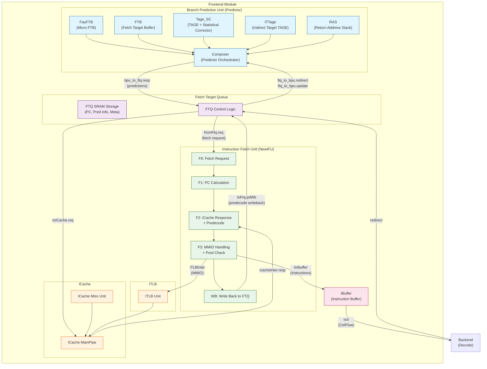
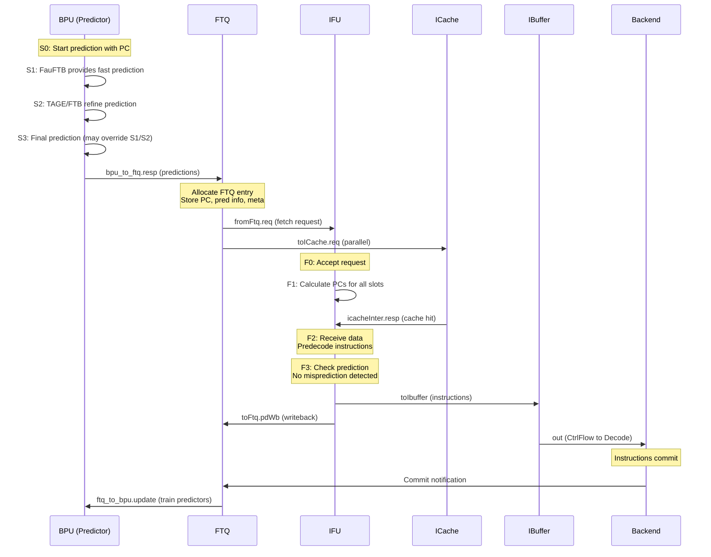
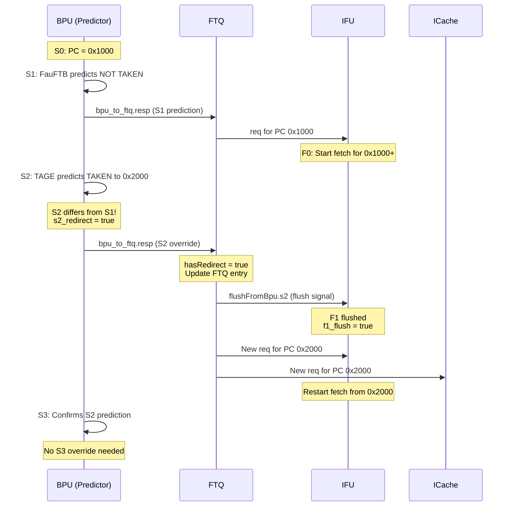
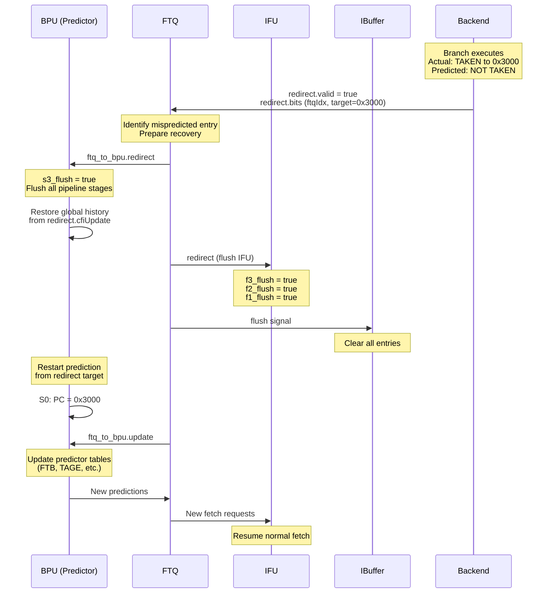

# XiangShan Frontend (FE) Module Analysis - Phase 1

## 1. FE Top-Level Connectivity Diagram



## 2. Module Connection Summary

### 2.1 Key Interface Definitions with Data Types

#### BpuToFtqIO (Predictor → FTQ)
```scala
class BpuToFtqIO {
  val resp: DecoupledIO[BranchPredictionBundle]
  // BranchPredictionBundle contains:
  //   pc: Vec[4, UInt(VAddrBits.W)]           // ~39 bits each
  //   targets: Vec[4, UInt(VAddrBits.W)]      // ~39 bits each
  //   takens: Vec[4, Bool()]
  //   is_jal: Vec[4, Bool()]
  //   is_jalr: Vec[4, Bool()]
  //   is_call: Vec[4, Bool()]
  //   is_ret: Vec[4, Bool()]
  //   last_may_be_rvi_call: Vec[4, Bool()]
  //   ... (metadata for each stage S1/S2/S3)
}
```

#### FtqToBpuIO (FTQ → Predictor)
```scala
class FtqToBpuIO {
  val redirect: Valid[BranchPredictionRedirect]  // Misprediction recovery
  val update: Valid[BranchPredictionUpdate]      // Training data
  val enq_ptr: FtqPtr                            // log2(FtqSize) bits, typically 6 bits
}
```

#### FtqToIfuIO (FTQ → IFU)
```scala
class FtqToIfuIO {
  val req: Decoupled[FetchRequestBundle]
  // FetchRequestBundle:
  //   startAddr: UInt(VAddrBits.W)           // ~39 bits
  //   nextlineStart: UInt(VAddrBits.W)       // ~39 bits
  //   nextStartAddr: UInt(VAddrBits.W)       // ~39 bits
  //   ftqIdx: FtqPtr                         // 6 bits
  //   ftqOffset: Valid[UInt(log2Ceil(PredictWidth).W)]  // 4 bits

  val redirect: Valid[BranchPredictionRedirect]
  val flushFromBpu: Bundle {
    val s2: Valid[FtqPtr]
    val s3: Valid[FtqPtr]
  }
}
```

#### FetchToIBuffer (IFU → IBuffer)
```scala
class FetchToIBuffer {
  val instrs: Vec[PredictWidth, UInt(32.W)]      // 16 x 32-bit instructions
  val valid: UInt(PredictWidth.W)                // 16 bits
  val enqEnable: UInt(PredictWidth.W)            // 16 bits
  val pd: Vec[PredictWidth, PreDecodeInfo]       // 16 predecode structs
  val pc: Vec[PredictWidth, UInt(VAddrBits.W)]   // 16 x ~39 bits
  val foldpc: Vec[PredictWidth, UInt(MemPredPCWidth.W)]
  val ftqPtr: FtqPtr                             // 6 bits
  val ftqOffset: Vec[PredictWidth, Valid[UInt(log2Ceil(PredictWidth).W)]]
  val ipf: Vec[PredictWidth, Bool()]             // Page fault flags
  val acf: Vec[PredictWidth, Bool()]             // Access fault flags
  val crossPageIPFFix: Vec[PredictWidth, Bool()]
  val triggered: Vec[PredictWidth, TriggerCf]
  val topdown_info: FrontendTopDownBundle
}
```

#### ICacheMainPipeResp (ICache → IFU)
```scala
class ICacheMainPipeResp {
  val vaddr: UInt(VAddrBits.W)           // ~39 bits
  val registerData: UInt(blockBits.W)    // 512 bits (64 bytes)
  val sramData: UInt(blockBits.W)        // 512 bits (64 bytes)
  val select: Bool()                     // Which data source to use
  val paddr: UInt(PAddrBits.W)           // ~36 bits
  val tlbExcp: Bundle {
    val pageFault: Bool()
    val accessFault: Bool()
    val mmio: Bool()
  }
}
```

### 2.2 Data Flow

1. **BPU → FTQ**: Predictions (target PC, branch taken, CFI info) flow to FTQ for storage
2. **FTQ → IFU**: Fetch requests with PC and prediction metadata
3. **IFU ↔ ICache**: Cacheline fetch requests and responses
4. **IFU → IBuffer**: Decoded instructions with metadata (PC, predecode info, exceptions)
5. **Backend → FTQ → BPU**: Redirect/Update signals for misprediction recovery

### 2.3 IFU Pipeline Detailed Diagram

```mermaid
flowchart LR
    %% Input
    FTQ["FTQ"] -->|"req: FetchRequestBundle<br/>(startAddr, ftqIdx)"| F0

    %% F0 Stage (Input)
    F0["F0: Input Stage<br/>Accept FTQ Request"]
    F0 -->|"toICache.req<br/>(vaddr, vsetIdx)"| ICache["ICache"]
    F0 -->|"toITLB.req<br/>(vaddr, cmd=exec)"| ITLB["ITLB"]

    %% F0 → F1 Pipeline Register
    F0 --> R01[["Pipeline Reg F0→F1<br/>startAddr, ftqIdx,<br/>ftqOffset"]]

    %% F1 Stage
    R01 --> F1["F1: PC Calculation<br/>Compute PCs for<br/>all PredictWidth slots"]

    %% F1 Logic Pseudo Code
    F1 -.->|"Logic"| F1Logic["for i in 0..PredictWidth:<br/>  f1_pc[i] = startAddr + i*2<br/>  if crossLine[i]:<br/>    f1_pc[i] += lineSize"]

    %% F1 → F2 Pipeline Register
    F1 --> R12[["Pipeline Reg F1→F2<br/>pc[16], ftqIdx,<br/>cut_ptr"]]

    %% F2 Stage
    ICache -->|"resp: ICacheMainPipeResp<br/>(cacheline 512b, paddr,<br/>tlbExcp)"| F2
    ITLB -->|"resp: TlbResp<br/>(paddr, excp)"| F2
    R12 --> F2["F2: Predecode<br/>+ Exception Check"]

    %% F2 Logic
    F2 -.->|"Logic"| F2Logic["Predecode 16 instrs<br/>Check: RVC, BR, JAL, JALR<br/>Verify: TLB exceptions<br/>Cut at predicted taken"]

    %% F2 → F3 Pipeline Register
    F2 --> R23[["Pipeline Reg F2→F3<br/>instrs[16], pd[16],<br/>pc[16], exceptions"]]

    %% F3 Stage
    R23 --> F3["F3: MMIO Check<br/>+ Prediction Verify<br/>+ Last-half RVI"]

    %% F3 Logic
    F3 -.->|"Logic"| F3Logic["if tlbExcp.mmio:<br/>  handle MMIO<br/>if predecode != BPU:<br/>  wb_redirect = true<br/>Handle half RVI"]

    %% F3 → WB
    F3 --> WB["WB: Writeback"]

    %% Outputs
    WB -->|"toFtq.pdWb<br/>(pd, cfiOffset, target)"| FTQ2["FTQ"]
    WB -->|"toIbuffer<br/>(instrs, valid, pd,<br/>pc, ftqPtr)"| IBuffer["IBuffer"]

    %% Flush paths
    Backend["Backend"] -.->|"redirect<br/>(flush all)"| F0
    WB -.->|"wb_redirect<br/>(flush F0-F3)"| F0
    BPU["BPU"] -.->|"s2/s3_redirect<br/>(flush F0-F1)"| F0

    %% Styling
    classDef memory fill:#e8f5e9,stroke:#1b5e20,stroke-width:1px;
    classDef reg fill:#fff3e0,stroke:#e65100,stroke-width:1px;
    classDef logic fill:#e1f5fe,stroke:#01579b,stroke-width:1px;
    classDef io fill:#fce4ec,stroke:#880e4f,stroke-width:1px;

    class ICache,ITLB memory;
    class R01,R12,R23 reg;
    class F0,F1,F2,F3,WB,F1Logic,F2Logic,F3Logic logic;
    class FTQ,FTQ2,IBuffer,Backend,BPU io;
```



---

## 3. Representative End-to-End Behavior Sequence Diagrams

### 3.1 Sequence Diagram 1: Normal Fetch Flow (Cache Hit, Prediction Correct)



### 3.2 Sequence Diagram 2: BPU Override (S2/S3 Redirect)



### 3.3 Sequence Diagram 3: Backend Misprediction Recovery



---

## 4. Stage-by-Stage Pipeline Analysis

### 4.1 BPU Pipeline Stages (S0 input + S1/S2/S3 registered)

| Stage | Activities | Key Components Active |
|-------|-----------|----------------------|
| **S0** | PC input, history lookup begins | All predictors start |
| **S1** | Fast prediction available | FauFTB (is_fast_pred=true), uBTB-style prediction |
| **S2** | Main prediction ready | FTB, TAGE base tables |
| **S3** | Final prediction, SC correction | TAGE longer histories, SC, ITTage |

**Note:** S0 is an input stage (not a full registered pipeline stage). The registered stage boundaries are S0→S1, S1→S2, and S2→S3.

**Override Logic:**
- S2 can override S1 if: target differs, taken/not-taken differs, CFI index differs
- S3 can override S2 similarly
- Override triggers `s2_redirect` or `s3_redirect` signals

### 4.2 IFU Pipeline Stages (F0 input + F1/F2/F3 registered + WB)

| Stage | Activities | Key Operations |
|-------|-----------|----------------|
| **F0** | Accept FTQ request | Validate request, send to ICache |
| **F1** | PC calculation | Compute PC for each slot, prepare cut pointers |
| **F2** | ICache response | Receive cacheline, predecode, check TLB exceptions |
| **F3** | Final processing | MMIO handling, prediction check, last-half RVI handling |
| **WB** | Writeback | Send predecode info to FTQ, trigger wb_redirect if needed |

**Note:** F0 is an input stage (not a registered pipeline stage). The registered stage boundaries are F0→F1, F1→F2, and F2→F3; WB is a separate writeback pipeline.

**Flush Hierarchy:**
```
f0_flush = f1_flush | from_bpu_f0_flush
f1_flush = f2_flush | from_bpu_f1_flush
f2_flush = backend_redirect | mmio_redirect | wb_redirect
f3_flush = backend_redirect | (wb_redirect & !f3_wb_not_flush)
```

### 4.3 FTQ Operation

The FTQ acts as a decoupling buffer between BPU and IFU:
- **Enqueue**: BPU predictions written to FTQ entries (PC, targets, metadata)
- **IFU Read**: FTQ provides fetch requests to IFU with full context
- **Writeback**: IFU returns predecode results, enables prediction checking
- **Commit**: Backend commits update FTQ state, trigger predictor training
- **Redirect**: Misprediction causes FTQ pointer reset and entry invalidation

---

## 5. Key Signal Groups

### 5.1 Flush/Redirect Signals

| Signal | Source | Effect |
|--------|--------|--------|
| `fromFtq.redirect` | Backend | Full pipeline flush |
| `fromFtq.flushFromBpu.s2/s3` | BPU | Flush younger IFU stages |
| `wb_redirect` | IFU WB stage | Predecode mismatch redirect |
| `mmio_redirect` | IFU MMIO FSM | MMIO instruction redirect |

### 5.2 Prediction Metadata Flow

```
BPU Output → FTQ Storage → IFU Consumption → Backend Execution → FTQ Update → BPU Training
    ↓              ↓              ↓                 ↓                ↓
 (target,      (Ftq_RF_      (used for       (actual           (meta used
  taken,       Components,   checking)        outcome)          for update)
  meta)        Ftq_pd_Entry)
```

---

## 6. Configuration Parameters (from Parameters.scala)

| Parameter | Description | Typical Value |
|-----------|-------------|---------------|
| `FtqSize` | FTQ entry count | 64 |
| `IBufSize` | IBuffer size | 48 |
| `IBufNBank` | IBuffer banks | 6 |
| `PredictWidth` | Instructions per prediction | 16 |
| `numBr` | Branches per FTB entry | 2 |
| `HistoryLength` | Global history length | 256 |

---

## 7. Critical Timing Paths (Inferred)

1. **BPU S1 → FTQ → IFU F0**: Fast path for back-to-back predictions
2. **ICache response → F2 predecode**: Parallel predecode for timing
3. **Backend redirect → BPU history restore**: Must complete before new predictions
4. **FTQ read → IFU request formation**: Reading PC and prediction info

---

## 8. Summary of Phase 1 Findings

### Architecture Highlights:
1. **Decoupled BPU-IFU**: FTQ provides ~64 entries of buffering between prediction and fetch
2. **BPU Stages**: S0 input with registered S1/S2/S3 refinement (FauFTB → TAGE/SC)
3. **IFU Stages**: F0 input with registered F1/F2/F3 plus WB for prediction verification
4. **Multiple Redirect Sources**: BPU override (S2/S3), IFU predecode check (WB), Backend misprediction

### Key Design Decisions:
1. **FauFTB as Fast Predictor**: Provides S1 predictions to minimize bubble on correct predictions
2. **Prediction Override**: S2/S3 can correct S1 predictions without full pipeline flush
3. **Predecode Verification**: IFU checks BPU predictions and can trigger redirects
4. **Banked IBuffer**: Optimized for area with 2-stage read (bank select + intra-bank select)

### Files Analyzed:
- `Frontend.scala`: Top-level module instantiation and connections
- `BPU.scala`: Predictor wrapper with S0 input + S1/S2/S3 registered stages
- `Composer.scala`: BPU component orchestration
- `NewFtq.scala`: Fetch Target Queue implementation
- `IFU.scala`: Instruction Fetch Unit with 4-stage pipeline
- `IBuffer.scala`: Instruction buffer with banked organization
- `FrontendBundle.scala`: Interface definitions
- `Parameters.scala`: BPU component instantiation (FauFTB, FTB, TAGE_SC, ITTage, RAS)
