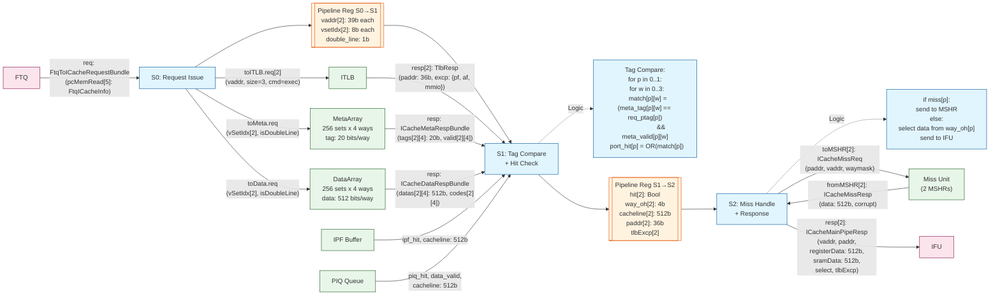
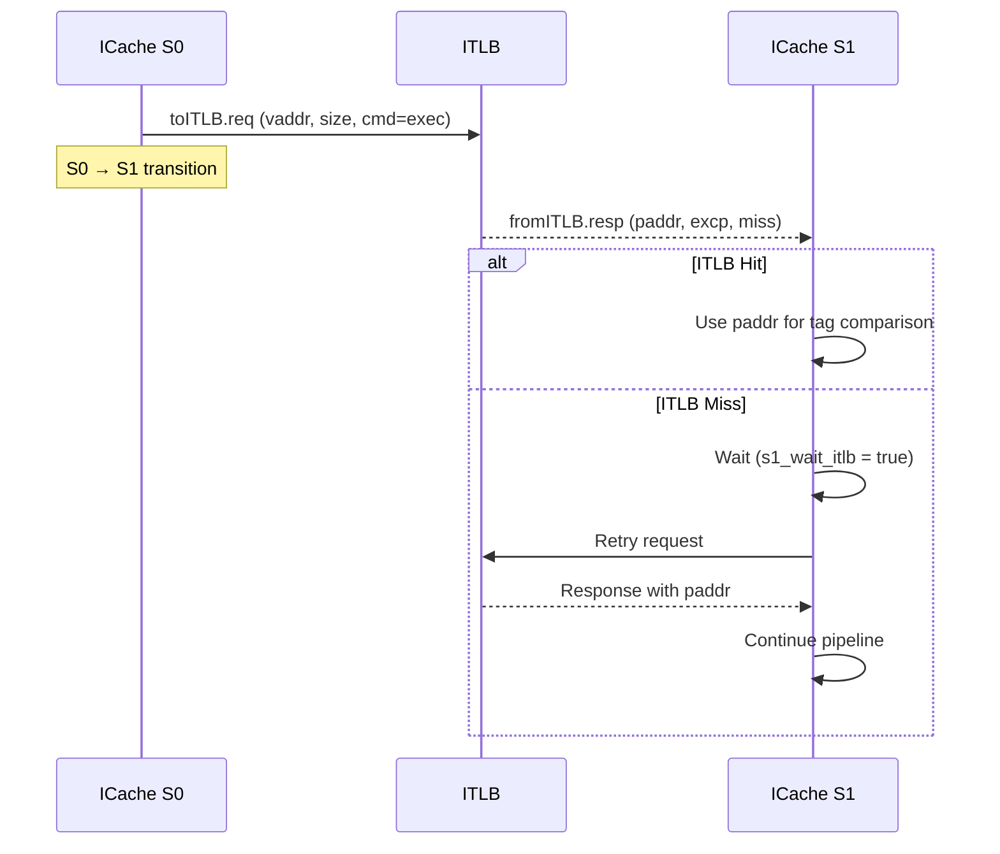

# XiangShan Frontend - Phase 2: ICache and ITLB Analysis

## 1. ICache Architecture Overview

The ICache in XiangShan is a banked, set-associative cache with integrated prefetch support.

### 1.1 ICache Parameters (from `ICache.scala`)

| Parameter | Default | Description |
|-----------|---------|-------------|
| `nSets` | 256 | Number of cache sets |
| `nWays` | 4 | Associativity |
| `rowBits` | 64 | Row width in bits |
| `blockBytes` | 64 | Cache line size |
| `nMissEntries` | 2 | MSHR entries |
| `nPrefetchEntries` | 12 | Prefetch queue entries |
| `PortNumber` | 2 | Number of read ports (for crossing cache lines) |

### 1.2 Cache Organization
```
                    ICache (256 sets x 4 ways)
    +--------------------------------------------------+
    |  Bank 0 (even sets)  |  Bank 1 (odd sets)        |
    +--------------------------------------------------+
    | MetaArray: tag + valid bits                       |
    | DataArray: 64-byte cache lines                    |
    +--------------------------------------------------+
    | 2 Read Ports (for cross-cacheline accesses)       |
    +--------------------------------------------------+
```

---

## 2. ICache MainPipe Pipeline

### 2.1 ICache MainPipe Detailed Pipeline Diagram



### 2.2 Stage 0 (S0) - Request Issue

**Operations:**
1. Accept request from FTQ via `fromFtq`
2. Send ITLB request: `toITLB(i).valid := toITLB_s0_valid(i)`
3. Send MetaArray request: `toMeta.valid := s0_valid`
4. Send DataArray request: `toData.valid := ftq_req_to_data_valid(i)`

**Control Signals:**
```scala
val s0_can_go = itlb_can_go && icache_can_go && pipe_can_go
s0_fire := s0_valid && s0_can_go
```

**Key Data:**
- `s0_req_vaddr`: Virtual addresses for port 0 and port 1
- `s0_req_vsetIdx`: Calculated set indices
- `s0_double_line`: Whether request crosses cache line boundary

### 2.3 Stage 1 (S1) - Tag Compare and Hit Check

**Operations:**
1. Receive ITLB response (physical address, exceptions)
2. Perform tag comparison against all ways
3. Check for hits in prefetch buffer (IPF) and prefetch queue (PIQ)
4. Handle ITLB miss by retrying

**ITLB Handling:**
```scala
val s1_wait_itlb = RegInit(VecInit(Seq.fill(PortNumber)(false.B)))
when(RegNext(s0_fire) && fromITLB(i).bits.miss) {
  s1_wait_itlb(i) := true.B
}.elsewhen(s1_wait_itlb(i) && !fromITLB(i).bits.miss) {
  s1_wait_itlb(i) := false.B
}
```

**Tag Comparison:**
```scala
val s1_tag_eq_vec = VecInit((0 until PortNumber).map(p =>
  VecInit((0 until nWays).map(w =>
    s1_meta_ptags(p)(w) === s1_req_ptags(p)
  ))
))
val s1_tag_match_vec = VecInit((0 until PortNumber).map(k =>
  VecInit(s1_tag_eq_vec(k).zipWithIndex.map{
    case(way_tag_eq, w) => way_tag_eq && s1_meta_valids(k)(w)
  })
))
val s1_port_hit = VecInit(Seq(
  s1_tag_match(0) && s1_valid && !tlbExcp(0),
  s1_tag_match(1) && s1_valid && s1_double_line && !tlbExcp(1)
))
```

**Prefetch Hit Check:**
```scala
val s1_ipf_hit = VecInit((0 until PortNumber).map(i =>
  toIPF(i).valid && fromIPF(i).ipf_hit))
val s1_piq_hit = VecInit((0 until PortNumber).map(i =>
  toIPF(i).valid && fromPIQ(i).piq_hit))
```

### 2.4 Stage 2 (S2) - Miss Handling and Response

**Operations:**
1. Handle cache misses by sending requests to MSHR
2. Prepare response data from cache or prefetch buffer
3. Send response to IFU

**Hit Path:**
```
MetaArray/DataArray Hit → Data selected by way → Response to IFU
```

**Miss Path:**
```
Miss → MSHR Request → TileLink Acquire → Memory → Grant → Refill + Response
```

---

## 3. ITLB Integration

### 3.1 ITLB Interface

```scala
class TlbRequestIO extends Bundle {
  val req = DecoupledIO(new TlbReq)
  val req_kill = Output(Bool())
  val resp = Flipped(DecoupledIO(new TlbResp))
}
```

### 3.2 ITLB Request Flow



### 3.3 ITLB Response Handling

```scala
// TLB response latching for pipeline stop
val tlb_valid_tmp = VecInit(Seq(
  (RegNext(s0_fire) || s1_wait_itlb(0)) && !fromITLB(0).bits.miss,
  (RegNext(s0_fire) || s1_wait_itlb(1)) && !fromITLB(1).bits.miss && s1_double_line
))

val tlbRespPAddr = VecInit((0 until PortNumber).map(i =>
  ResultHoldBypass(valid = tlb_valid_tmp(i), data = fromITLB(i).bits.paddr(0))))

val tlbExcpPF = VecInit((0 until PortNumber).map(i =>
  ResultHoldBypass(valid = tlb_valid_tmp(i), data = fromITLB(i).bits.excp(0).pf.instr)))

val tlbExcpAF = VecInit((0 until PortNumber).map(i =>
  ResultHoldBypass(valid = tlb_valid_tmp(i), data = fromITLB(i).bits.excp(0).af.instr)))
```

### 3.4 Exception Types

| Exception | Description |
|-----------|-------------|
| `pf.instr` | Instruction Page Fault |
| `af.instr` | Instruction Access Fault |
| `mmio` | Memory-Mapped I/O access |

---

## 4. ICache Miss Unit

### 4.1 Miss Entry State Machine

```
s_idle → s_send_mem_acquire → s_wait_mem_grant → s_write_back_wait_resp → s_write_back → s_wait_resp → s_idle
```

### 4.2 State Descriptions

| State | Description |
|-------|-------------|
| `s_idle` | Ready for new miss request |
| `s_send_mem_acquire` | Send TileLink Acquire message |
| `s_wait_mem_grant` | Wait for TileLink Grant response |
| `s_write_back_wait_resp` | Wait for refill data assembly |
| `s_write_back` | Write refill data to cache arrays |
| `s_wait_resp` | Wait for response acknowledgment |

### 4.3 TileLink Transaction

```scala
// Acquire message
io.mem_acquire.valid := (state === s_send_mem_aquire)

// Grant handling
is(s_wait_mem_grant) {
  when(edge.hasData(io.mem_grant.bits)) {
    when(io.mem_grant.fire) {
      readBeatCnt := readBeatCnt + 1.U
      respDataReg(readBeatCnt) := io.mem_grant.bits.data
      when(readBeatCnt === (refillCycles - 1).U) {
        state := s_write_back_wait_resp
      }
    }
  }
}
```

---

## 5. Prefetch Integration

### 5.1 Prefetch Buffer (IPF)

The prefetch buffer stores prefetched cache lines that haven't been written to the cache yet.

```scala
toIPF(i).valid := tlb_valid_tmp(i)
toIPF(i).bits.paddr := s1_req_paddr(i)

val s1_ipf_hit = VecInit((0 until PortNumber).map(i =>
  toIPF(i).valid && fromIPF(i).ipf_hit))
val s1_ipf_data = VecInit((0 until PortNumber).map(i =>
  ResultHoldBypass(data = fromIPF(i).cacheline, valid = s1_ipf_hit(i))))
```

### 5.2 Prefetch In-flight Queue (PIQ)

PIQ tracks in-flight prefetch requests:

```scala
toPIQ(i).valid := tlb_valid_tmp(i)
toPIQ(i).bits.paddr := s1_req_paddr(i)

val s1_piq_hit = VecInit((0 until PortNumber).map(i =>
  toIPF(i).valid && fromPIQ(i).piq_hit))

// Wait for prefetch to complete if data not ready
val wait_piq = VecInit((0 until PortNumber).map(i =>
  toIPF(i).valid && fromPIQ(i).piq_hit && !fromPIQ(i).data_valid))
```

### 5.3 Hit Priority

```
1. Cache Hit (s1_port_hit)
2. Prefetch Buffer Hit (s1_ipf_hit)
3. Prefetch Queue Hit (s1_piq_hit) - may need to wait
4. Miss → MSHR
```

---

## 6. Cross-Cacheline Access

### 6.1 Double-Line Detection

```scala
def crossCacheline = startAddr(blockOffBits - 1) === 1.U

val s0_only_first = fromFtq.bits.readValid(i) && !fromFtqReq(i).crossCacheline
val s0_double_line = fromFtq.bits.readValid(i) && fromFtqReq(i).crossCacheline
```

### 6.2 Two-Port Access

When a fetch request crosses a cache line boundary:
- Port 0: First cache line (startAddr)
- Port 1: Second cache line (nextlineStart)

Both ports operate in parallel through the pipeline.

---

## 7. Data Path Summary

```
FTQ Request
    ↓
┌───────────────────────────────────────────────────────────┐
│                    ICache MainPipe                         │
├───────────────────────────────────────────────────────────┤
│  S0: ITLB Req ──────────────────────────────> ITLB        │
│      MetaArray Req ───────────────────────────> MetaArray │
│      DataArray Req ───────────────────────────> DataArray │
├───────────────────────────────────────────────────────────┤
│  S1: <───────────────────────────────────────── ITLB Resp │
│      <───────────────────────────────────────── Meta Resp │
│      <───────────────────────────────────────── Data Resp │
│      Tag Compare: ptag vs meta_ptags                       │
│      Hit/Miss determination                                │
│      Prefetch buffer/queue check                           │
├───────────────────────────────────────────────────────────┤
│  S2: On Hit: Select data from way                          │
│      On Miss: Request to MSHR                              │
│      Send response to IFU                                  │
└───────────────────────────────────────────────────────────┘
    ↓
IFU (ICacheMainPipeResp)
```

---

## 8. Key Files Analyzed

| File | Description |
|------|-------------|
| `ICache.scala` | ICache parameters, metadata array |
| `ICacheMainPipe.scala` | Main pipeline (S0/S1/S2) |
| `ICacheMissUnit.scala` | MSHR and miss handling |
| `ICacheBundle.scala` | Bundle definitions |
| `IPrefetch.scala` | Prefetch infrastructure |

---

## 9. Performance Counters

```scala
XSPerfHistogram("ftq2icache_fire_", cntFtqFireInterval, fromFtq.fire, ...)

// ICachePerfInfo tracked:
val only_0_hit, only_0_miss
val hit_0_hit_1, hit_0_miss_1
val miss_0_hit_1, miss_0_miss_1
val hit_0_except_1, miss_0_except_1
val except_0
val bank_hit, hit
```
