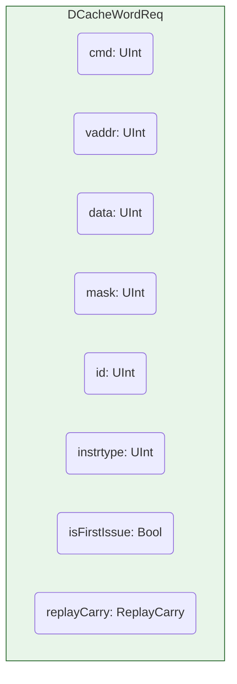
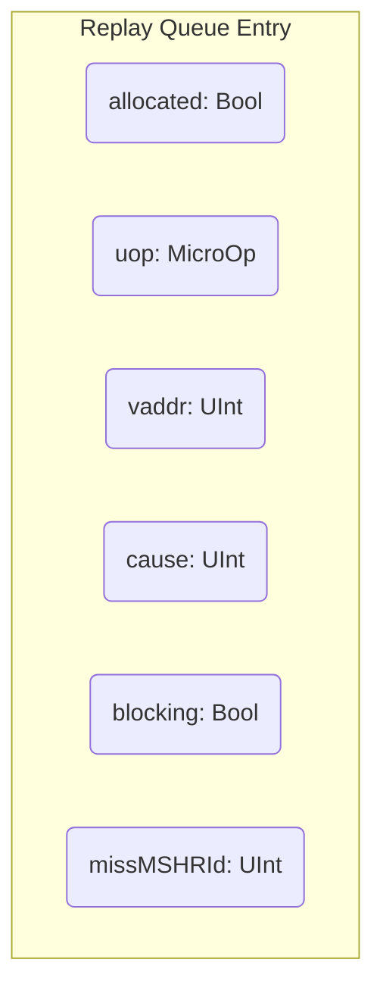
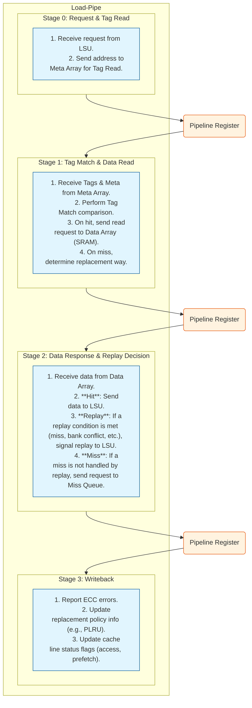
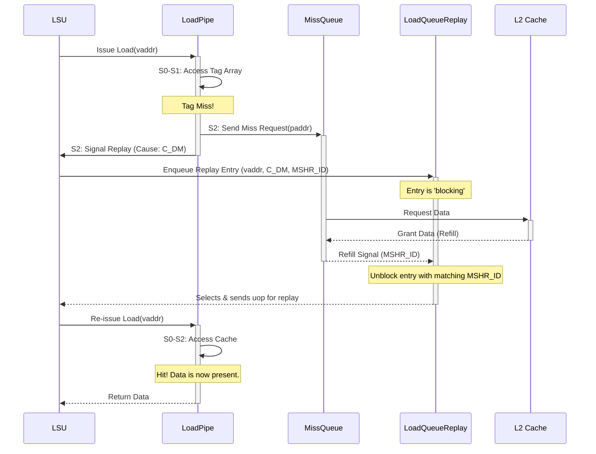
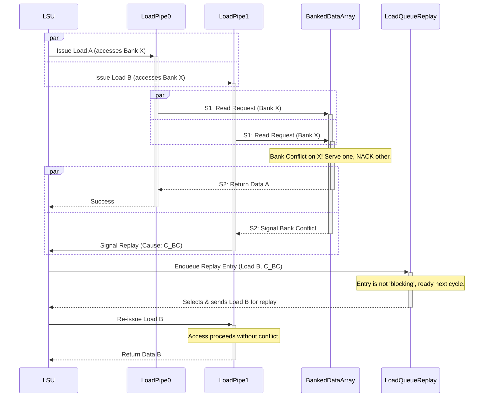

# Analysis of the XiangShan Load-Pipe

## 1. Introduction

The Load-Pipe is a critical component of the XiangShan processor's memory subsystem, responsible for handling load requests from the Load-Store Unit (LSU). It is a highly optimized, multi-stage pipeline designed to achieve high throughput for memory reads while correctly handling various hazards and cache events. This document provides a detailed analysis of the Load-Pipe's pipeline structure and its sophisticated fast and slow replay mechanisms.

As confirmed in `DCacheWrapper.scala`, the XiangShan core instantiates two `LoadPipe` modules (`LoadPipelineWidth` = 2), allowing for two loads to be processed in parallel. These pipes share access to the D-cache's internal resources, such as the tag and data arrays, and the miss queue.

## 2. Key Data Structures

### Load-Pipe Request (`DCacheWordReq`)

This structure represents a load request as it travels through the pipeline.

-   **`cmd`**: The memory operation command (e.g., Load, Prefetch).
-   **`vaddr`**: The virtual address of the memory access.
-   **`data`/`mask`**: Data and mask for store operations (not used for loads).
-   **`id`**: A unique identifier for the request.
-   **`instrtype`**: The source of the instruction (e.g., Load, Prefetch).
-   **`isFirstIssue`**: Flag indicating if this is the first time the instruction is issued.
-   **`replayCarry`**: Carries information for replays, such as the predicted way.

### Replay Queue Entry

When a load needs to be replayed, it is enqueued in the `LoadQueueReplay` module. Each entry contains the necessary information to re-issue the load at a later time.

-   **`allocated`**: Indicates if the entry is valid.
-   **`uop`**: The micro-operation associated with the load.
-   **`vaddr`**: The virtual address of the load.
-   **`cause`**: A bitmask indicating the reason(s) for the replay (from `LoadReplayCauses`).
-   **`blocking`**: A flag that is true if the replay is blocked waiting for a resource (e.g., cache refill, store data).
-   **`missMSHRId`**: If the replay is due to a cache miss, this stores the ID of the MSHR entry handling the miss.

## 3. Load-Pipe Pipeline

The `LoadPipe` is a 4-stage pipeline (S0-S3).

### Pipeline Stage Details

-   **S0: Request & Tag Read**: The pipeline begins when a `DCacheWordReq` is received from the LSU. The virtual address from the request is used to read the cache's tag and metadata from the `MetaArray` and `TagArray`.

-   **S1: Tag Match & Data Read**: The tags read in S0 are compared with the tag derived from the physical address (after TLB translation).
    -   If a tag matches and the cache line is valid (a **hit**), the address is sent to the `BankedDataArray` to read the actual data. Way prediction (`WPU`) logic also operates in this stage to speculatively read the data array before the tag match is confirmed.
    -   If no tag matches (a **miss**), the replacement logic (e.g., PLRU) is consulted to select a victim way for the eventual cache refill.

-   **S2: Data Response & Replay Decision**: This is the critical decision stage.
    -   On a successful data read from a hit in S1, the data is forwarded to the LSU.
    -   Crucially, this stage determines if a **replay** is necessary. The `resp.bits.replay` signal is asserted if any of a number of conditions are met. This is the central topic of the next section.
    -   If a miss occurs and it cannot be handled by other mechanisms, a request is formatted and sent to the `MissQueue`.

-   **S3: Writeback**: This final stage is for housekeeping. It reports any ECC errors detected during the tag or data read, updates the cache line replacement policy information, and sets status flags like the "accessed" bit.

## 4. Replay Mechanisms

A "replay" is a mechanism where a load instruction that cannot be successfully completed is re-issued into the pipeline at a later time. This is fundamental to handling the dynamic events of a memory system without stalling the entire processor. XiangShan employs both "fast" and "slow" replays, distinguished by the latency of resolving the condition that caused them.

When a replay is triggered in the `LoadPipe`, the instruction is sent to the `LoadQueueReplay` module, which queues it until the blocking condition is resolved.

### Replay Causes

The `LoadReplayCauses` object in `LoadQueueReplay.scala` defines the explicit reasons for a replay, which can be categorized as fast or slow.

**Fast Replay Causes:**
-   `C_BC` (Bank Conflict): Two parallel loads attempt to access the same data bank in the SRAM simultaneously. One is served, and the other is replayed.
-   `C_WF` (WPU Fail): The way predictor guessed the wrong way, and the correct data was not speculatively read. The load is replayed to read from the correct way.
-   `C_DR` (DCache Replay): A general d-cache replay, often for resource hazards like no MSHR being available.
-   `C_MA` / `C_NK` (Memory Ambiguity / Nuke): A potential or actual Read-After-Write (RAW) hazard. A load is issued before a preceding store's address is known. The replay ensures correct store-to-load forwarding.
-   `C_FF` (Forward Fail): A store-to-load forwarding attempt failed and must be retried.

**Slow Replay Causes:**
-   `C_DM` (DCache Miss): The requested data is not in the L1 cache. The load must wait for the data to be refilled from the L2 cache or main memory.
-   `C_TM` (TLB Miss): The virtual-to-physical address translation is not in the TLB. The load must wait for the page table walk to complete.

### Scenario 1: Slow Replay (D-Cache Miss)

This is the most common slow replay scenario. The load misses the L1 cache and must wait for data to be fetched from lower levels of the memory hierarchy.

### Scenario 2: Fast Replay (Bank Conflict)

This occurs when the two `LoadPipe`s attempt to read from the same physical SRAM bank in the same cycle.

## 5. Conclusion

The XiangShan Load-Pipe is a well-designed and robust component that balances the need for high-throughput load execution with the complexities of a modern, out-of-order memory system. Its multi-stage pipeline allows for speculative execution, while its sophisticated, prioritized replay mechanism, managed by the `LoadQueueReplay` module, ensures correctness and forward progress in the face of cache misses, resource hazards, and memory ordering violations. The clear distinction and efficient handling of fast and slow replays are key to its performance, allowing the processor to quickly recover from common, low-latency hazards while gracefully handling long-latency memory events.
