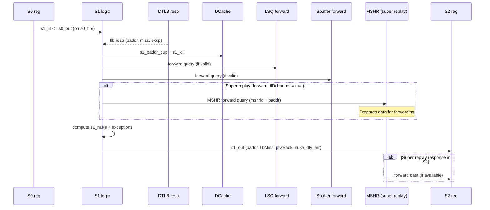
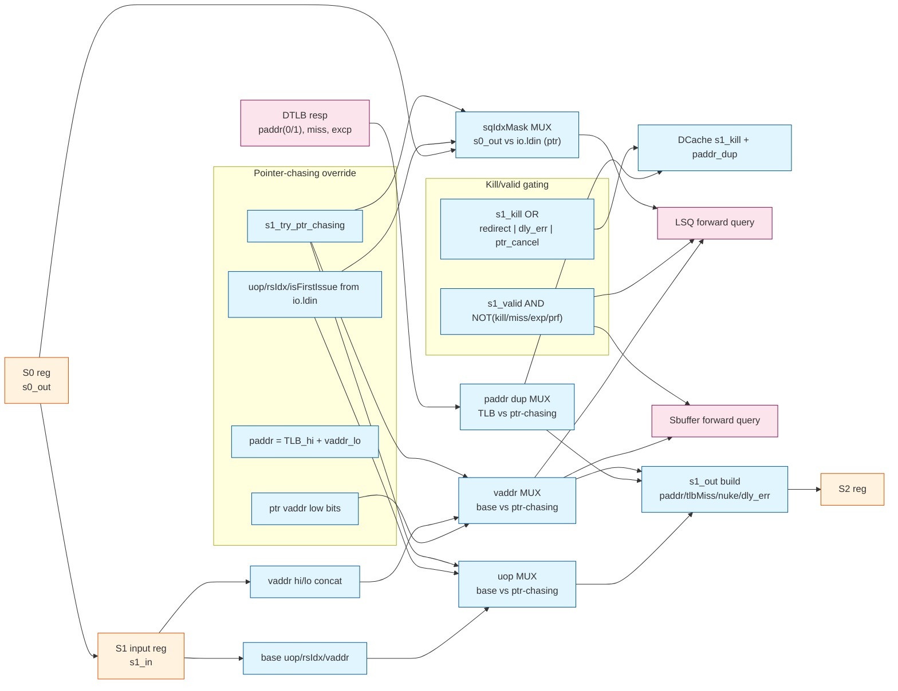
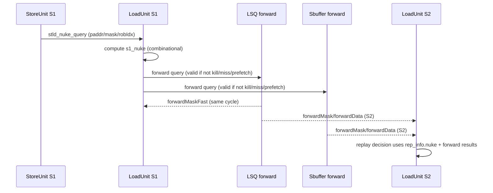

// See README.md for license details.

# LoadUnit S1 Stage (DTLB Resp + Forward Query + Kill)

This report focuses on LoadUnit S1 in `src/main/scala/xiangshan/mem/pipeline/LoadUnit.scala`.
It follows the same style as `loadpipe_S0.md`, with tables for bundles/signals
and code snippets to explain the logic.

## Scope and References
- LoadUnit: `src/main/scala/xiangshan/mem/pipeline/LoadUnit.scala`
- Shared bundles: `src/main/scala/xiangshan/mem/MemCommon.scala`

---

## S1 Stage Summary (What it does)
S1 consumes the S0 pipeline register (`s1_in`), latches the DTLB response, computes
kill conditions, and issues store-to-load forward queries into LSQ and sbuffer.
It also builds `s1_out` for S2, including exception bits and replay metadata.

---

## Key Inputs and Outputs (Tables)

### A) S1 input sources
| Source | Signal(s) | Type | Meaning in S1 |
|---|---|---|---|
| S0 pipeline reg | `s1_in` | `LqWriteBundle` | Registered S0 payload (vaddr/mask/uop/etc.). |
| DTLB response | `io.tlb.resp` | `TlbResp` | paddr, miss, ptwBack, exception info. |
| Redirect | `io.redirect` | `Valid[Redirect]` | Flush conditions for in-flight loads. |
| Fast replay meta | `io.fast_rep_in.bits` | `LqWriteBundle` | Supplies lateKill/delayedLoadError for fast replay. |
| L2L forward meta | `io.l2l_fwd_in` | `LoadToLoadIO` | Supplies `dly_ld_err` for pointer-chasing path. |
| Store nuke query | `io.stld_nuke_query` | `Vec[Valid[StoreNukeQueryIO]]` | Used for store-load violation check. |
| RS issue (ptr-chasing) | `io.ldin` | `Decoupled[ExuInput]` | Used only when pointer-chasing path is active. |

### B) S1 internal control signals
| Signal | Type | Meaning |
|---|---|---|
| `s1_valid` | Reg Bool | S1 pipeline valid bit. |
| `s1_can_go` | Bool | S1 can advance when S2 is ready. |
| `s1_fire` | Bool | `s1_valid && !s1_kill && s1_can_go`. |
| `s1_kill` | Bool | Kill S1 due to redirect, ptr-chasing cancel, or delayed error. |
| `s1_tlb_miss` | Bool | `io.tlb.resp.bits.miss` in S1. |
| `s1_exception` | Bool | Exception detected from uop exceptionVec. |
| `s1_dly_err` | Bool | Delayed error from fast replay or l2l forward. |
| `s1_prf` | Bool | Prefetch flag from S0. |
| `s1_hw_prf` | Bool | Hardware prefetch. |
| `s1_sw_prf` | Bool | Software prefetch (prefetch and not HW). |
| `s1_nuke` | Bool | Store-load violation detected (paddr+mask match). |

### C) DTLB response fields used in S1
| Field | Type/Width | Meaning in S1 |
|---|---|---|
| `paddr(0)` | UInt(PAddrBits.W) | LSU paddr copy (`s1_paddr_dup_lsu`). |
| `paddr(1)` | UInt(PAddrBits.W) | DCache paddr copy (`s1_paddr_dup_dcache`). |
| `miss` | Bool | TLB miss indicator. |
| `ptwBack` | Bool | PTW backwalk indicator for replay/feedback. |
| `excp(0).pf.ld` | Bool | Load page fault. |
| `excp(0).af.ld` | Bool | Load access fault. |
| `memidx` | Bundle | Used to stamp debug timing when matching LQ idx. |

### D) S1 outputs and side effects
| Output | Signal(s) | Type | Meaning |
|---|---|---|---|
| DTLB kill | `io.tlb.req_kill` | Bool | Cancels DTLB req on S1 kill or delayed error. |
| DCache paddr dup | `io.dcache.s1_paddr_dup_*` | UInt(PAddrBits.W) | Paddr dup for LSU/DCache. |
| DCache kill | `io.dcache.s1_kill` | Bool | Kills DCache on S1 kill, miss, exception, or delayed error. |
| Sbuffer forward query | `io.sbuffer.*` | `LoadForwardQueryIO` | Store-to-load forward query into sbuffer. |
| LSQ forward query | `io.lsq.forward.*` | `PipeLoadForwardQueryIO` | Store-to-load forward query into LSQ. |
| Replay metadata | `s1_out.*` | `LqWriteBundle` | Carries tlbMiss, ptwBack, nuke, delayedError, etc. |
| **MSHR forward query** | `io.forward_mshr.*` | `LduToMissqueueForwardIO` | **Super replay path**: Queries MSHR for data when `s1_out.forward_tlDchannel` is true. Enables direct MSHR/D-channel data forwarding to avoid cache read. Response arrives in S2. |

---

## S1 Bundle Details (Tables)

### 1) `LqWriteBundle` fields used/updated in S1
| Field | Type/Width | How S1 sets it |
|---|---|---|
| `vaddr` | UInt(VAddrBits.W) | Re-packed from `s1_in.vaddr` (hi/lo split). |
| `paddr` | UInt(PAddrBits.W) | From DTLB resp `paddr(0)`. |
| `tlbMiss` | Bool | From `io.tlb.resp.bits.miss`. |
| `ptwBack` | Bool | From `io.tlb.resp.bits.ptwBack`. |
| `delayedLoadError` | Bool | From `s1_dly_err`. |
| `rep_info.nuke` | Bool | From `s1_nuke && !s1_sw_prf`. |
| `rep_info.debug` | `PerfDebugInfo` | Copied from `uop.debugInfo`. |
| `uop.cf.exceptionVec` | Vec | Updated based on TLB exception or delayed error. |

### 2) `LoadForwardQueryIO` (sbuffer path)
| Signal | Type/Width | Meaning in S1 |
|---|---|---|
| `valid` | Bool | High only if no exception/miss/kill/dly_err/prefetch. |
| `vaddr` | UInt(VAddrBits.W) | S1 vaddr. |
| `paddr` | UInt(PAddrBits.W) | DTLB paddr (LSU copy). |
| `uop` | `MicroOp` | S1 uop for replay context. |
| `sqIdx` | `SqPtr` | Store queue index of this load. |
| `mask` | UInt((VLEN/8).W) | Load mask for forward match. |
| `pc` | UInt(VAddrBits.W) | Debug only. |

### 3) `PipeLoadForwardQueryIO` (LSQ path)
Same as `LoadForwardQueryIO`, plus:

| Signal | Type/Width | Meaning in S1 |
|---|---|---|
| `sqIdxMask` | UInt(StoreQueueSize.W) | Pre-computed SQ index mask for faster forwarding. |
| `dataInvalidFast` | Bool | Early invalid data indication (used later). |

### 4) `LduToMissqueueForwardIO` (MSHR forward path - super replay)

**Request fields (S1 → MSHR)**:
| Signal | Type/Width | Meaning in S1 |
|---|---|---|
| `valid` | Input Bool | Asserted when `s1_valid && s1_out.forward_tlDchannel`. Indicates super replay load is querying MSHR. |
| `mshrid` | Input UInt(log2Up(nMissEntries).W) | MSHR index that holds the miss data. From `s1_out.mshrid`. |
| `paddr` | Input UInt(PAddrBits.W) | Physical address for data matching. From `s1_out.paddr` (via DTLB). |

**Response fields (MSHR → S2)**:
| Signal | Type/Width | Meaning in S2 |
|---|---|---|
| `forward_result_valid` | Output Bool | MSHR has valid data available for forwarding. |
| `forward_mshr` | Output Bool | Data matched successfully and came from MSHR. |
| `forwardData` | Output Vec(VLEN/8, UInt(8.W)) | Forwarded data bytes from MSHR. |

**Usage**: Only active when `s1_out.forward_tlDchannel = true` (super replay path). Allows load to obtain data directly from MSHR without waiting for DCache refill write + replay read, saving 3-5 cycles per cache miss.

---

## S1 Logic (Code Snippets)

### 1) S1 valid/ready and register capture
```scala
s1_ready := !s1_valid || s1_kill || s2_ready
when (s0_fire) { s1_valid := true.B }
.elsewhen (s1_fire) { s1_valid := false.B }
.elsewhen (s1_kill) { s1_valid := false.B }
s1_in := RegEnable(s0_out, s0_fire)
```

### 2) DTLB resp usage and DCache kill
```scala
val s1_tlb_miss = io.tlb.resp.bits.miss
io.dcache.s1_paddr_dup_lsu    := io.tlb.resp.bits.paddr(0)
io.dcache.s1_paddr_dup_dcache := io.tlb.resp.bits.paddr(1)
io.dcache.s1_kill := s1_kill || s1_dly_err || s1_tlb_miss || s1_exception
```

### 3) Forward query gating (LSQ + sbuffer)
```scala
io.sbuffer.valid := s1_valid && !(s1_exception || s1_tlb_miss || s1_kill || s1_dly_err || s1_prf)
io.lsq.forward.valid := s1_valid && !(s1_exception || s1_tlb_miss || s1_kill || s1_dly_err || s1_prf)
```

### 4) Kill logic (major terms)
```scala
s1_kill := s1_fast_rep_dly_kill ||
           s1_cancel_ptr_chasing ||
           s1_in.uop.robIdx.needFlush(io.redirect) ||
           (s1_in.uop.robIdx.needFlush(RegNext(io.redirect)) && !RegNext(s0_try_ptr_chasing)) ||
           RegEnable(s0_kill, false.B, io.ldin.valid || io.replay.valid || io.l2l_fwd_in.valid || io.fast_rep_in.valid)
```

---

## Super Replay Handling in S1

S1 plays a critical role in the **super replay** mechanism (see `doc/memblock/super_replay.md` for full details). Super replay loads are cache-missed loads that were woken up early by an L2 hint, indicating that D-channel data is arriving in 2-3 cycles.

### What S1 Does for Super Replay

When a super replay load enters S1 (indicated by `s1_out.forward_tlDchannel = true`), S1 **issues a forwarding query to the MSHR** to prepare for direct data forwarding:

**LoadUnit.scala:733-735**:
```scala
io.forward_mshr.valid  := s1_valid && s1_out.forward_tlDchannel
io.forward_mshr.mshrid := s1_out.mshrid
io.forward_mshr.paddr  := s1_out.paddr
```

### MSHR Forward Query Interface

**`LduToMissqueueForwardIO`** (defined in DCacheWrapper.scala:701-710):

**Request (S1 → MSHR)**:
| Field | Type | Meaning |
|-------|------|---------|
| `valid` | Input Bool | True when super replay load is in S1 |
| `mshrid` | Input UInt | MSHR index that holds the miss data |
| `paddr` | Input UInt | Physical address for matching |

**Response (MSHR → S2)**:
| Field | Type | Meaning |
|-------|------|---------|
| `forward_result_valid` | Output Bool | MSHR can provide data |
| `forward_mshr` | Output Bool | Data matched and available from MSHR |
| `forwardData` | Output Vec[UInt(8.W)] | Forwarded data bytes |

### Timing: S1 Query → S2 Response

```
Cycle N:   Super replay in S0
           forward_tlDchannel = true (set by LoadQueueReplay)

Cycle N+1: Super replay in S1
           io.forward_mshr.valid = true
           MSHR receives query (mshrid + paddr)

Cycle N+2: Super replay in S2
           MSHR response arrives:
             - io.forward_mshr.forward() returns (valid, forward_mshr, data)
           D-channel also checked:
             - io.tl_d_channel.forward() returns (forward_D, data_D)
           S2 uses whichever source has data ready
```

### Two Forwarding Paths (Both Checked in S2)

S1 sets up the query, but **S2 is where the actual forwarding happens**. S2 checks **two sources** in parallel:

**LoadUnit.scala:781-783** (executed in S2):
```scala
// Check D-channel forwarding (data arriving on TileLink D-channel)
val (s2_fwd_frm_d_chan, s2_fwd_data_frm_d_chan) =
  io.tl_d_channel.forward(s1_valid && s1_out.forward_tlDchannel, s1_out.mshrid, s1_out.paddr)

// Check MSHR forwarding (data already buffered in MSHR)
val (s2_fwd_data_valid, s2_fwd_frm_mshr, s2_fwd_data_frm_mshr) =
  io.forward_mshr.forward()

// Use data if either source has it
val s2_fwd_frm_d_chan_or_mshr = s2_fwd_data_valid && (s2_fwd_frm_d_chan || s2_fwd_frm_mshr)
```

### Why Two Sources?

The L2 hint arrives **2-3 cycles before** D-channel data. By the time the load reaches S2:

- **If data arrived early**: MSHR already has it → `s2_fwd_frm_mshr = true`
- **If data arrives now**: D-channel has it → `s2_fwd_frm_d_chan = true`
- **Either way**: Load gets data without reading from DCache

This flexibility handles timing variations in the L2-to-L1 path while still achieving direct forwarding.

### Benefits of MSHR/D-Channel Forwarding

**Traditional cache miss path**:
```
Cycle 20: D-channel data arrives
Cycle 21: Write data to DCache (refill)
Cycle 22: Load replays, tag check (S1)
Cycle 23: Data array read (S2)
Cycle 24: Data available (S3)
Total: 24 cycles from miss to data
```

**Super replay path** (with S1 MSHR query):
```
Cycle 18: L2 hint → blocking cleared
Cycle 19: Super replay scheduled
Cycle 20: Super replay in S0
Cycle 21: Super replay in S1 → MSHR query sent
Cycle 22: Super replay in S2 → MSHR/D-channel forwards data
Cycle 23: Data available (S3)
Total: 23 cycles from miss to data (1 cycle saved)
          + No DCache refill/read overhead (3-4 more cycles saved)
```

**Key insight**: S1's MSHR query is the bridge between the super replay mechanism (S0 priority) and the actual data forwarding (S2 data path). Without this S1 query, the MSHR wouldn't know to prepare the data for forwarding.

### Super Replay Flow Summary

1. **S0**: Super replay wins highest priority, `forward_tlDchannel = true`
2. **S1**: Issues MSHR forward query (this stage!)
3. **S2**: Receives data from MSHR or D-channel, forwards directly
4. **S3**: Data selection and writeback

S1 is the critical setup stage that enables the zero-overhead forwarding in S2.

---

## Notes and Edge Cases
- `s1_nuke` is an *early store-load violation indicator* computed in S1. It is asserted when all of the following are true:
  - `io.stld_nuke_query(w).valid` is high (store unit issued a query)
  - The store is older than the load: `isAfter(s1_in.uop.robIdx, io.stld_nuke_query(w).bits.robIdx)`
  - Physical address matches on cache-line granularity: `s1_paddr_dup_lsu(PAddrBits-1,3) == stld_nuke_query.paddr(PAddrBits-1,3)`
  - Byte mask overlaps: `(s1_in.mask & stld_nuke_query.mask).orR`
  - There is no TLB miss (`!s1_tlb_miss`)

  **Meaning:** S1 has detected a potential store-load ordering violation. It does **not** immediately kill the load in S1. Instead, it sets `s1_out.rep_info.nuke` (unless it is a SW prefetch). This marker is carried into S2/S3 for replay control.

  **What happens next (important):**
  - In S2, `s2_nuke` is recomputed and OR'ed with `s1_in.rep_info.nuke`. If the violation persists, it contributes to replay/fast-replay decisions.
  - In S3, `rep_info.need_rep` gates writeback. If a replay is required, `s3_out.valid` is deasserted, so **no architectural writeback occurs**. The load is effectively replayed rather than committed.

  **So the correct mental model is:** the load is *not killed in S1*. It flows through, but is marked so later stages suppress writeback and trigger replay. There is no architectural effect when `rep_info.need_rep` is asserted.

- Prefetches (`s1_prf`) do not issue forward queries to LSQ/sbuffer (they skip forwarding and violation checks).
- Pointer-chasing can override `s1_in` fields and re-derive paddr based on vaddr low bits.
- DTLB response is always `ready` in S1 (`io.tlb.resp.ready := true.B`).
- `s1_kill` is independent of `s1_nuke` and is used for redirect flush, delayed error, or pointer-chasing cancel. Killing stops progress to S2 even if no nuke is present.

---
## S1 Sequence (Cycle-Level Order)
This table shows the typical order of actions within the S1 cycle.

| Step | Phase | Action | Notes |
|---|---|---|---|
| 1 | Register | `s1_in` captures `s0_out` when `s0_fire` | S1 becomes valid for the new request. |
| 2 | Decode | Compute `s1_tlb_miss`, `s1_exception`, `s1_prf` | Uses current `io.tlb.resp`. |
| 3 | Addr pack | Build `s1_vaddr` (hi/lo concat) | Keeps low bits for later alignment checks. |
| 4 | DCache/DTLB | Drive `s1_paddr_dup_*` and `io.dcache.s1_kill` | Duplicate paddr is sent to LSU/DCache. |
| 5 | Forward query | Assert `io.sbuffer.valid` and `io.lsq.forward.valid` | Only when not miss/exception/kill/prefetch. |
| 6 | **Super replay** | **Issue MSHR forward query if `forward_tlDchannel = true`** | **Enables MSHR/D-channel data forwarding in S2.** |
| 7 | Violation | Compute `s1_nuke` from `stld_nuke_query` | Uses paddr+mask match against older stores. |
| 8 | S1 output | Fill `s1_out` fields (paddr, tlbMiss, ptwBack, nuke, delayed error) | Prepares data for S2. |
| 9 | Kill/advance | Update `s1_kill`, `s1_fire`, `s1_valid` | Pipeline control for S2 handoff. |

### S1 Sequence Diagram (Mermaid)


### S1 Block Diagram (Mux-Level)


---

## S1 Nuke vs Forward Queries (Detailed Timing)
This section clarifies the timing relationship between `s1_nuke` and LSQ/sbuffer forward queries.

### Key points
- `s1_nuke` is a **pure combinational check in S1** against `io.stld_nuke_query(w)` from StoreUnit S1.
- The **forward queries** to LSQ/sbuffer are **issued in S1**, but their **full data response is S2**.
- Therefore, `s1_nuke` does **not** wait for any forward-query response; it is independent of those responses.

### Timing breakdown
| Event | Stage | Timing | Notes |
|---|---|---|---|
| Store issues `stld_nuke_query` | Store S1 | Same cycle as Load S1 | Provides paddr/mask/robIdx for violation check. |
| Load computes `s1_nuke` | Load S1 | Same cycle | Pure combinational compare against store queries. |
| Load issues forward queries | Load S1 | Same cycle | `io.lsq.forward.valid` and `io.sbuffer.valid` asserted if not killed/prefetch. |
| Forward fast mask | Load S1 | Same cycle | `forwardMaskFast` is defined as “resp to load_s1”. |
| Forward full data | Load S2 | Next cycle | `forwardMask`/`forwardData` are “resp to load_s2”. |
| Replay decision | Load S2/S3 | Next cycles | `s1_nuke` is carried as `rep_info.nuke` and contributes to `need_rep`. |

### Sequence diagram: S1 nuke vs forward queries


### `stld_nuke_query` contents (from `MemCommon.scala`)
The `stld_nuke_query` signal is a vector of `Valid[StoreNukeQueryIO]`, one per store pipeline.

`StoreNukeQueryIO` fields:
| Field | Type/Width | Meaning |
|---|---|---|
| `robIdx` | `RobPtr` | Store instruction ROB index (used to check load is younger). |
| `paddr` | UInt(PAddrBits.W) | Store physical address (used for line match). |
| `mask` | UInt((VLEN/8).W) | Store byte mask (used for overlap test). |

In S1, `s1_nuke` asserts when a **valid** store query is older than the load, matches on cache-line address, and overlaps in byte mask.

### Can `s1_nuke` be canceled in S2?
**Short answer:** once `s1_nuke` is set in S1, it is **not canceled by S2 re-checks**. It is OR'ed into `s2_nuke`, so the violation stays visible in S2. However, it can be **masked** from replay if the load is not in a normal “trouble” path.

Key details:
- S2 computes `s2_nuke` as: `(fresh compare && !s2_tlb_miss) || s2_in.rep_info.nuke`.\n  This means an S1 nuke **always propagates** into S2 regardless of the fresh compare.
- S2 then sets `s2_out.rep_info.nuke := s2_nuke && s2_troublem`.\n  So if the load is **not** in `s2_troublem` (e.g., exception, mmio, prefetch, delayed error), the nuke is effectively **masked** and does not request replay.
- If `s2_troublem` is true, `rep_info.need_rep` will be asserted and **writeback is suppressed in S3**, causing a replay.

So the rule of thumb is: **S1 nuke persists into S2**, but **replay only happens if the load is still a normal, replay-eligible load (`s2_troublem`).**
