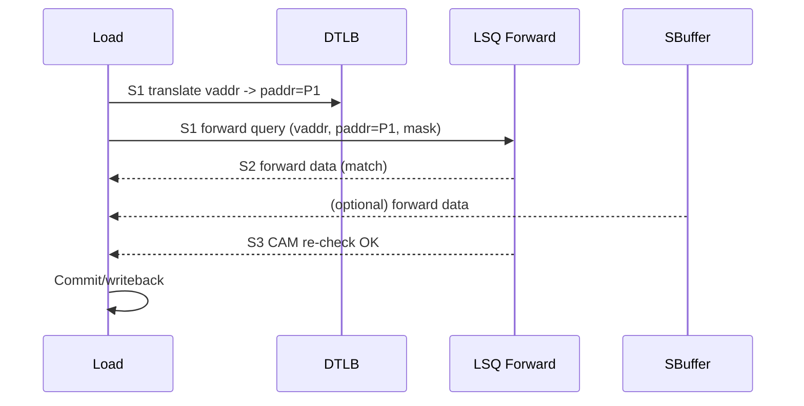
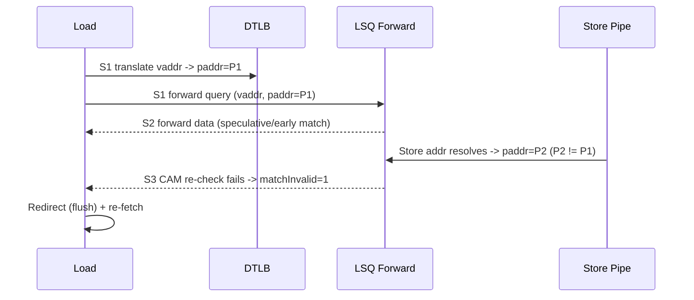
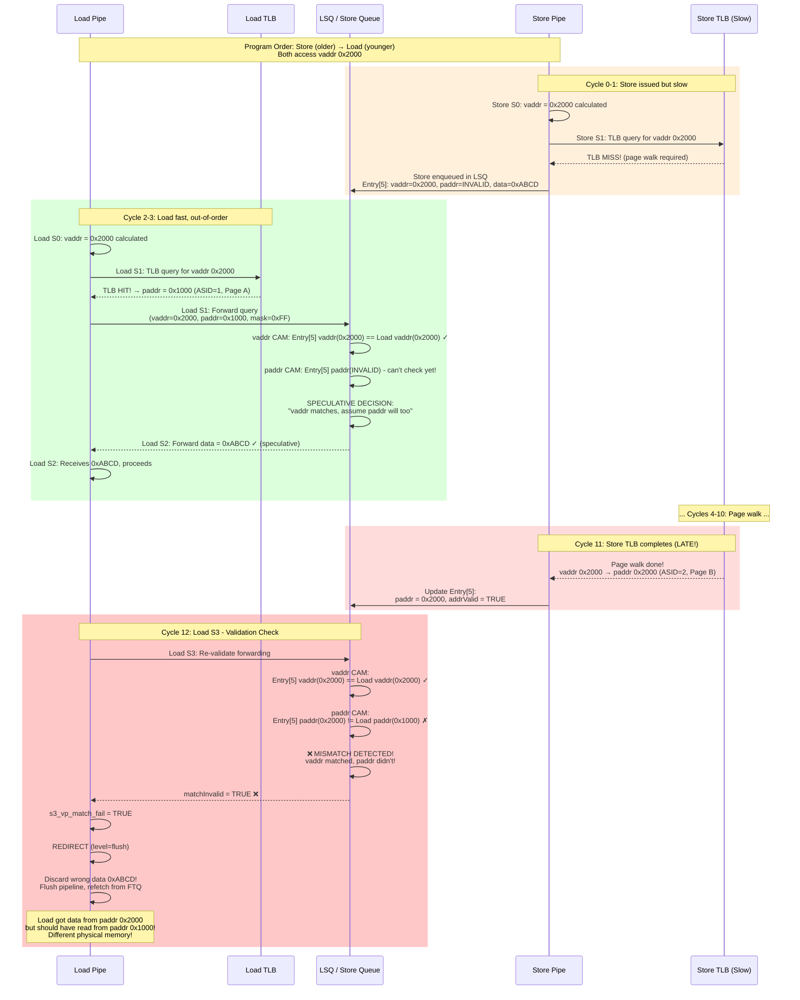
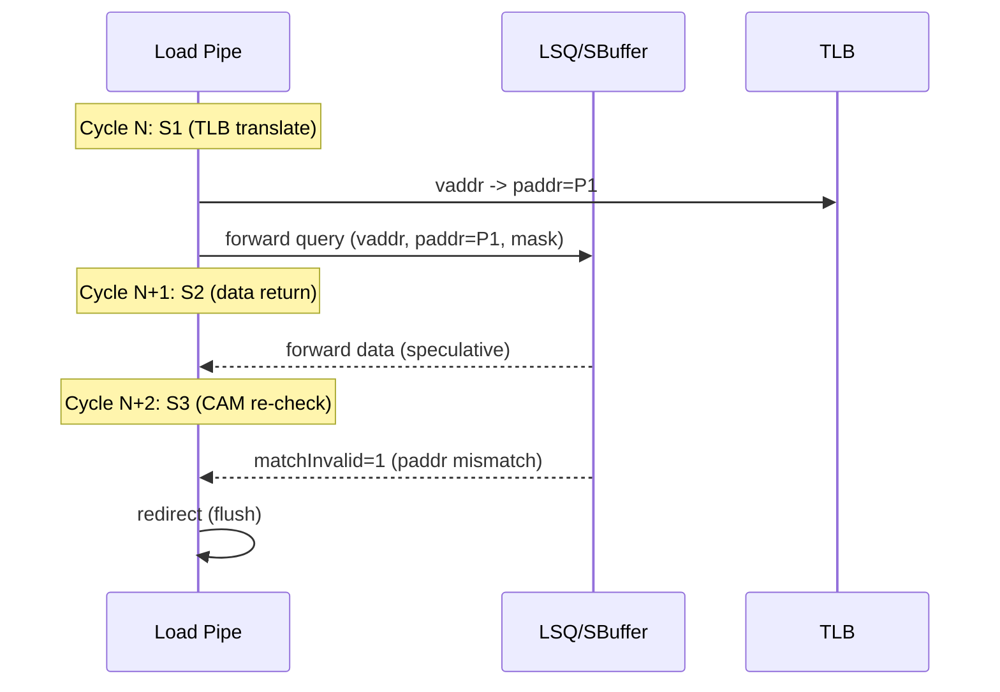
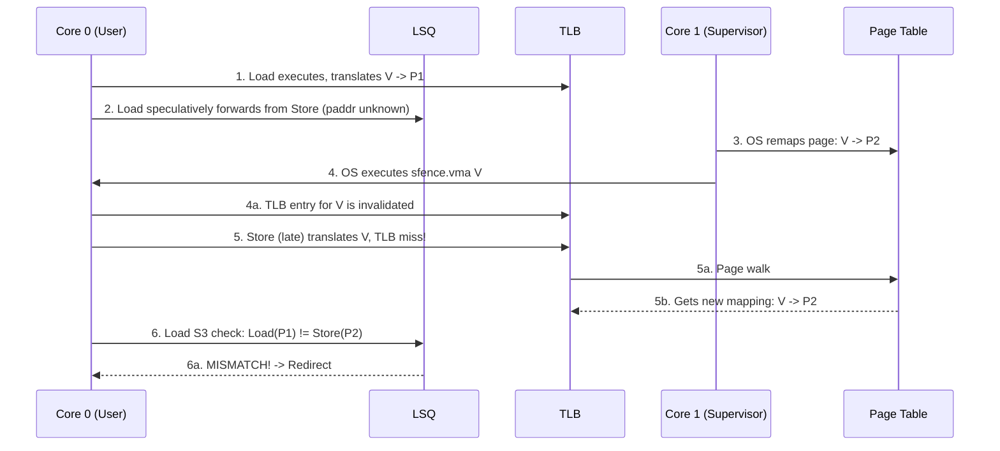
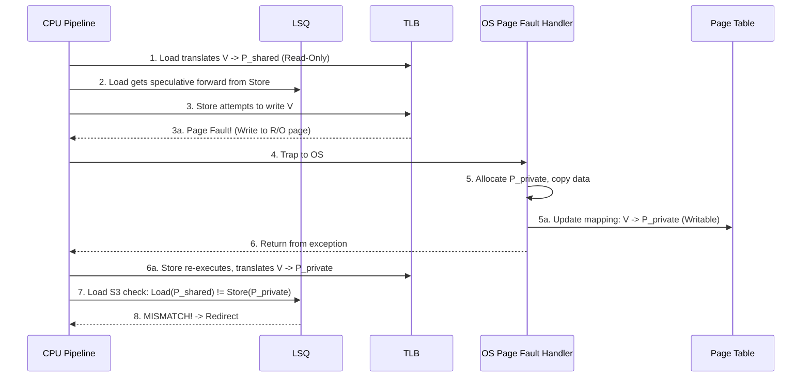

# CAM Mismatch (Vaddr/Paddr Inconsistency) - Detailed Explanation

## Overview

**CAM mismatch** is a correctness guard in the load pipeline. It detects cases where
the load **received forwarded data** based on a **speculative or early address match**,
but the **final address translation** (vaddr -> paddr) proves the match was incorrect.

When a CAM mismatch is detected, the load **must be re-fetched** (full flush) because:
- The forwarded data might be from the wrong physical address.
- The load might have written incorrect data into the architectural state.

This detection occurs in **S3** using:
```
s3_vp_match_fail = RegNext(io.lsq.forward.matchInvalid || io.sbuffer.matchInvalid) && s3_troublem
s3_rep_frm_fetch = s3_vp_match_fail
```
and triggers **RedirectLevel.flush** (full flush).

---

## What is Being Checked?

The load pipeline performs a **vaddr+paddr CAM check** after forwarding:

- The **forwarding decision** in S1/S2 may use:
  - vaddr match (virtual address)
  - paddr match (physical address)
  - mask overlap (byte enables)
- In S3, LSQ/SBuffer **re-check** that the forwarding source still matches the
  load's **final paddr**.

If the re-check fails, **matchInvalid** is asserted:
- `io.lsq.forward.matchInvalid`
- `io.sbuffer.matchInvalid`

This is **not** a replay; it is a **redirect/flush** because the load might have
already consumed incorrect data.

---

## Where Do LSQ/SBuffer vaddr/paddr Come From?

The **load’s** vaddr/paddr are known in S1/S2, but the **LSQ/SBuffer** compare
against **store entries**, each of which carries its own address state:

### Store Queue (LSQ forward)
- **vaddr**: captured when the store’s effective address is computed.
- **paddr**: captured when the store’s DTLB translation completes.
- **addrValidVec**: indicates which store entries have a valid paddr.
- The forward logic runs **two CAMs** (vaddr CAM and paddr CAM) on the store queue:
  - `vaddrModule.io.forwardMmask` vs `paddrModule.io.forwardMmask`
  - **matchInvalid** when these masks disagree for valid addresses:
    ```
    vpmaskNotEqual = (paddrMask ^ vaddrMask) & needForward & addrValidVec
    vaddrMatchFailed = vpmaskNotEqual && forward.valid
    io.forward.matchInvalid := vaddrMatchFailed
    ```

### Store Buffer (SBuffer forward)
- **vtag**: derived from store vaddr when entering the buffer.
- **ptag**: derived from store paddr when translation is available.
- Forwarding compares **load vaddr** and **load paddr** tags against stored vtag/ptag.
- **matchInvalid** when vtag match disagrees with ptag match for active entries:
  ```
  tag_mismatch = vtag_match != ptag_match  (for active/inflight entries)
  forward.matchInvalid := tag_mismatch
  ```

**Key point**: CAM mismatch is about **store-side address state** (vaddr vs paddr)
being inconsistent, not about the load’s own paddr being invalid.

---

## How Forwarding Actually Selects an Entry (and Where Mismatch Fits)

In XiangShan, **forward selection is driven by the vaddr CAM**, while the **paddr CAM is
used only as a consistency check**. This is a timing choice: vaddr CAM is closer and
faster, paddr CAM is used to validate that the vaddr match was correct.

### 1) Selection uses vaddr CAM (not both)
From `StoreQueue.scala`:
```
dataModule.io.needForward(i)(0) := canForward1 & vaddrModule.io.forwardMmask(i)
dataModule.io.needForward(i)(1) := canForward2 & vaddrModule.io.forwardMmask(i)
io.forward(i).forwardMask := dataModule.io.forwardMask(i)
io.forward(i).forwardData := dataModule.io.forwardData(i)
```
This means the **forwarded store entry is chosen by vaddr match**.

### 2) paddr CAM only checks sanity
```
vpmaskNotEqual = (paddrMask ^ vaddrMask) & needForward & addrValidVec
io.forward(i).matchInvalid := vpmaskNotEqual && forward.valid
```
If the **vaddr CAM mask ≠ paddr CAM mask**, the load might have forwarded from
the wrong physical line. In that case the pipeline **flushes**, rather than trying to
pick a different entry.

### 3) Same idea in SBuffer
SBuffer forwarding uses **vtag match** to select data, and **ptag match** only to
check consistency:
- vtag match = selection
- ptag match = validation
- mismatch → `forward.matchInvalid` → flush

**Conclusion:** both vaddr and paddr are compared, but **only vaddr decides the
forwarding entry**. paddr is used to **validate** that decision; disagreement triggers
a **full flush**.

---

## Where It Is Detected (Pipeline View)

- **S1**: Load gets TLB translation (paddr) and issues forwarding query.
- **S2**: Data comes back (cache or forward).
- **S3**: LSQ/SBuffer re-checks vaddr/paddr consistency.
  - If mismatch, `matchInvalid` is raised and `s3_rep_frm_fetch` triggers full flush.

---

## Typical Forwarding vs CAM Mismatch

### Normal Forward (No Mismatch)


### CAM Mismatch (Forward Was Wrong)


---

## Why CAM Mismatch Happens (Expanded)

### 1) Store Address Arrives After the Load Has Already Queried Forwarding

This is a race condition common in out-of-order processors. A "fast" `LOAD` gets ahead of a "slow" older `STORE`.

#### The Problem: Speculative Forwarding with Incomplete Address Information

**Core Issue**: Forwarding uses **virtual address CAM** for performance, but this can be wrong if the store's **physical address isn't known yet**.

#### Step-by-Step Breakdown

Let's trace through what happens with concrete addresses:

**Initial State:**
- **Store** (older): `sw x1, 0x2000`  // Virtual address 0x2000, data = 0xABCD
  - Store is in LSQ, waiting for TLB translation
  - LSQ entry has: `vaddr = 0x2000`, `paddr = INVALID` (not ready yet)

- **Load** (younger): `lw x2, 0x2000`  // Same virtual address 0x2000
  - Load executes out-of-order (fast path)

**Timeline:**

**Cycle 1-2: Load in S0-S1 (Fast)**
```
Load S0: Calculate vaddr = 0x2000
Load S1: TLB translates quickly
  → vaddr 0x2000 → paddr 0x1000 (assume TLB hit, ASID=1, Page A)
```

**Cycle 2: Load Queries Forwarding in S1**
```
Load → LSQ: "Do you have data for vaddr=0x2000, paddr=0x1000?"

LSQ checks its entries:
  Entry[5]: Store instruction
    - vaddr = 0x2000 ✓ MATCH!
    - paddr = INVALID (TLB translation not done yet)
    - addrValid = FALSE
    - data = 0xABCD (data is ready)

LSQ Decision (SPECULATIVE):
  "vaddr matches (0x2000 == 0x2000), assume paddr will also match"
  → Forward data 0xABCD to load!
```

**Why does LSQ forward despite invalid paddr?**
- **Performance optimization**: Waiting for store's paddr would add latency
- **Common case**: Usually vaddr match → paddr match (same mapping)
- **Safety net**: Will verify later in S3

**Cycle 3: Load in S2 (Receives Forwarded Data)**
```
Load S2: Receives data = 0xABCD from LSQ
  → Load thinks it got correct data from store
  → Continues to S3
```

**Cycle 5-10: Store TLB Finally Completes (Slow)**
```
Store: TLB translation finally completes
  → vaddr 0x2000 → paddr 0x2000 (different! ASID=2, Page B)

LSQ updates entry:
  Entry[5]: Store
    - vaddr = 0x2000
    - paddr = 0x2000  ← NOW VALID!
    - addrValid = TRUE
    - data = 0xABCD
```

**Key Revelation**: Load's paddr (0x1000) ≠ Store's paddr (0x2000)!
- **Same virtual address** (0x2000) in different address spaces
- **Different physical addresses** (0x1000 vs 0x2000)
- **Different physical memory locations!**

**Cycle 11: Load in S3 (Validation Check)**
```
Load S3: LSQ re-validates forwarding decision

LSQ checks:
  vaddr CAM: Load(0x2000) vs Entry[5](0x2000) → MATCH
  paddr CAM: Load(0x1000) vs Entry[5](0x2000) → MISMATCH!

LSQ: "vaddr matched but paddr didn't → WRONG FORWARD!"
  → matchInvalid = TRUE
  → s3_vp_match_fail = TRUE

Load S3: Detects matchInvalid
  → Discard forwarded data 0xABCD (it was from wrong physical address!)
  → Trigger REDIRECT (flush pipeline)
  → Re-fetch load from scratch
```

#### Why This Happens: Address Space Disambiguation

**The root cause**: Same **virtual address** can map to different **physical addresses**:

1. **Different ASID (Address Space ID)**:
   ```
   Process A: vaddr 0x2000 → paddr 0x1000 (ASID=1)
   Process B: vaddr 0x2000 → paddr 0x2000 (ASID=2)
   ```
   Store and Load might be from different processes!

2. **TLB Synonym** (Multiple virtual addresses → same physical):
   ```
   vaddr 0x2000 → paddr 0x3000
   vaddr 0x4000 → paddr 0x3000  (alias)
   ```

3. **TLB Homonym** (Same virtual → different physical):
   ```
   Context 1: vaddr 0x2000 → paddr 0x1000
   Context 2: vaddr 0x2000 → paddr 0x5000
   ```

4. **Page Remapping** (TLB update between load and store):
   ```
   Time T1: vaddr 0x2000 → paddr 0x1000
   [TLB invalidation + update]
   Time T2: vaddr 0x2000 → paddr 0x2000  (remapped!)
   ```

#### Why Forwarding Used vaddr (Not paddr)

**Design choice**: Use **vaddr CAM** for forwarding selection because:
- **Timing**: vaddr available earlier than paddr
- **Performance**: Can't wait for all stores' TLB translations
- **Speculative**: Assume vaddr match → paddr match (usually true)
- **Safety**: Verify with paddr CAM in S3, flush if wrong

#### The Mismatch Detection

```
vaddr CAM result:  [Entry 5 matches]  ← Used for forwarding
paddr CAM result:  [Entry 5 no match] ← Used for validation

XOR these results: MISMATCH!
  → Load got data based on vaddr match
  → But paddr proves this was wrong
  → Must flush and retry
```

**Effect**: The load proceeded with **speculative data** (0xABCD from paddr 0x2000) that is now proven to be from the **wrong physical source** (should have been from paddr 0x1000, not 0x2000), requiring a full redirect.



#### Concrete Example: Two Processes, Same Virtual Address

**Scenario**: Process A and Process B both use virtual address 0x2000 for their stack:

```
Memory Layout:
┌─────────────────────────────────────┐
│ Physical Memory                      │
├─────────────────────────────────────┤
│ 0x1000: Process A's stack page      │
│         Contains: 0x1111             │  ← Load should read from here
├─────────────────────────────────────┤
│ 0x2000: Process B's stack page      │
│         Contains: 0xABCD             │  ← Store writes here
└─────────────────────────────────────┘

TLB Mappings:
Process A (ASID=1): vaddr 0x2000 → paddr 0x1000
Process B (ASID=2): vaddr 0x2000 → paddr 0x2000
```

**What Happens**:
1. **Store** (Process B, older):
   - `sw x1, 0(sp)` where sp = 0x2000
   - Wants to write 0xABCD to vaddr 0x2000
   - **Slow path**: TLB miss, page walk in progress
   - LSQ entry: vaddr=0x2000, paddr=INVALID, data=0xABCD

2. **Context Switch** happens (Process B → Process A)

3. **Load** (Process A, younger, out-of-order):
   - `lw x2, 0(sp)` where sp = 0x2000
   - Wants to read from vaddr 0x2000
   - **Fast path**: TLB hit! (Process A's mapping cached)
   - TLB: vaddr 0x2000 → paddr 0x1000 (Process A's stack)

4. **Forwarding Query** (Load S1):
   - Load asks LSQ: "Do you have data for vaddr=0x2000?"
   - LSQ: "Yes! Entry[5] has vaddr=0x2000, data=0xABCD"
   - LSQ forwards 0xABCD (from Process B's store!)

5. **Store TLB Completes** (later):
   - Store's TLB: vaddr 0x2000 → paddr 0x2000 (Process B's stack)
   - LSQ updates: Entry[5] paddr = 0x2000

6. **Load S3 Validation**:
   - vaddr CAM: Load(0x2000) vs Entry[5](0x2000) → MATCH ✓
   - paddr CAM: Load(0x1000) vs Entry[5](0x2000) → **MISMATCH!** ✗
   - **Violation**: Load got data from wrong process!

**The Bug Without CAM Check**:
- Load would have gotten 0xABCD (Process B's data)
- But Load wanted data from paddr 0x1000 (Process A's data, which is 0x1111)
- **Security violation**: Process A reading Process B's memory!
- **Correctness violation**: Wrong data!

**CAM Mismatch Saves The Day**:
- Detects paddr mismatch in S3
- Flushes load, forces retry
- On retry, store's paddr is known, forwarding check properly fails
- Load reads from DCache at paddr 0x1000 → Gets correct 0x1111 ✓

#### Visual Summary: What Went Wrong

```
Step 1: Store enqueued (paddr unknown)
┌─────────────────────────────────────┐
│ LSQ Entry[5] (Store)                │
│  vaddr:  0x2000  ✓                  │
│  paddr:  INVALID ✗                  │
│  data:   0xABCD                     │
└─────────────────────────────────────┘

Step 2: Load queries (vaddr match!)
┌─────────────────────────────────────┐
│ Load S1                             │
│  vaddr:  0x2000  ← matches Entry[5] │
│  paddr:  0x1000                     │
└─────────────────────────────────────┘
          ↓
    vaddr CAM: MATCH!
          ↓
    Forward 0xABCD to load (WRONG!)

Step 3: Store paddr arrives (too late!)
┌─────────────────────────────────────┐
│ LSQ Entry[5] (Store)                │
│  vaddr:  0x2000                     │
│  paddr:  0x2000  ← NOW KNOWN!       │
│  data:   0xABCD                     │
└─────────────────────────────────────┘

Step 4: Load S3 validation (catch error!)
┌─────────────────────────────────────┐
│ vaddr CAM: 0x2000 == 0x2000  ✓     │
│ paddr CAM: 0x1000 != 0x2000  ✗     │
│                                     │
│ → MISMATCH! matchInvalid = TRUE    │
│ → FLUSH pipeline                    │
└─────────────────────────────────────┘

Physical Memory (what should have happened):
┌──────────────────────────────────┐
│ paddr 0x1000:  0x1111           │ ← Load should read this
│ paddr 0x2000:  0xABCD           │ ← Store wrote this
└──────────────────────────────────┘
       ↑                  ↑
   Different physical addresses!
   Load got wrong data (0xABCD instead of 0x1111)
```

**Key Insight**: The forwarding was based on **vaddr match** (0x2000 == 0x2000), but the **paddr mismatch** (0x1000 != 0x2000) proves they are accessing **different physical memory locations**. Without the CAM mismatch check, the load would have incorrectly used the store's data from a different physical address!

### 2) TLB mapping changes between load and store translations
**When**: Load sees P1, store later sees P2 due to mapping change (TLB invalidation,
context switch, alias/homonym).
**Effect**: Forward match based on P1 is invalid -> mismatch.

### 3) Alias / homonym (same vaddr, different paddr)
**When**: Two different physical pages share the same virtual address in different
contexts (or due to synonym/homonym behavior).
**Effect**: vaddr-based forward match is invalid -> mismatch.

---

## Detailed Timing (Cycle-Level View)



---

## Signals and Control Flow

**Detection**
```
val s3_vp_match_fail = RegNext(io.lsq.forward.matchInvalid || io.sbuffer.matchInvalid) && s3_troublem
val s3_rep_frm_fetch = s3_vp_match_fail
```

**Redirect**
```
io.rollback.valid := s3_valid && (s3_rep_frm_fetch || s3_flushPipe) && !s3_exception
io.rollback.bits.level := Mux(s3_rep_frm_fetch, RedirectLevel.flush, RedirectLevel.flushAfter)
```

**Result**
- Load itself is flushed.
- All younger instructions are flushed.
- Frontend re-fetches from the load’s PC.

---

## Debug/Bring-up Checklist

If CAM mismatch is frequent:
- Check `io.lsq.forward.matchInvalid` / `io.sbuffer.matchInvalid` rate.
- Check TLB invalidation timing vs in-flight loads.
- Check store address readiness and forwarding timing.
- Monitor `s3_rep_frm_fetch` and `io.rollback` frequency.

---

## Related Docs

- `doc/memblock/loadpipe_redirect.md` (CAM mismatch redirect)
- `doc/memblock/loadpipe_S2.md` (forwarding + hazards)
- `doc/memblock/z_detail_s1_nuke.md` (store-load violation handling)
---

## Real-World Scenarios for TLB Mapping Changes

These scenarios illustrate how interactions with the OS or supervisor-level fences can cause a vaddr-to-paddr mapping to change between a load's translation and a store's translation, leading to a CAM mismatch.

### Scenario 1: `sfence.vma` after Page Table Modification

The `sfence.vma` (fence virtual memory address) instruction invalidates TLB entries. It is used by the OS after it modifies page tables to ensure subsequent memory accesses see the new mappings.

**Timeline:**
1.  **Load Executes**: A younger `LOAD` executes out-of-order. It gets a translation for virtual address `V` from the TLB: `V -> P1`.
2.  **Speculative Forward**: It queries the LSQ with `(V, P1)` and is speculatively forwarded data from an older `STORE` to the same vaddr `V` whose own paddr is not yet known.
3.  **OS Modifies Pages**: In supervisor mode (e.g., on another core, or after an interrupt), the OS changes the page table entry for `V` to point to a new physical page, `P2`.
4.  **TLB Flush**: The OS executes `sfence.vma V` to invalidate the old `V -> P1` translation from all hardware TLBs.
5.  **Store Translates (Late)**: The older `STORE` instruction finally executes its address translation for `V`. It misses the TLB (which was flushed) and the hardware page walker reads the newly modified page tables, returning the new translation: `V -> P2`.
6.  **Mismatch**: The `LOAD` reaches its S3 validation stage. Its original translation (`P1`) is compared against the `STORE`'s final translation (`P2`). The mismatch (`P1 != P2`) is detected, and a pipeline flush is correctly triggered.



### Scenario 2: Copy-on-Write (CoW) Page Fault

Copy-on-Write is an OS optimization where a parent and child process initially share the same physical memory pages, marked as read-only. A write attempt by either process triggers a page fault, causing the OS to create a private, writable copy of the page.

**Timeline:**
1.  **Initial State**: A `LOAD` and an older `STORE` from the same process are in the pipeline. They both target virtual address `V`, which currently maps to a shared, read-only physical page `P_shared`.
2.  **Load Executes**: The younger `LOAD` executes first. It translates `V -> P_shared` and is speculatively forwarded data from the `STORE`.
3.  **Store Causes Page Fault**: The older `STORE` attempts to execute. Since it's a write to a read-only page (`P_shared`), it triggers a page fault exception.
4.  **OS Handler**: The CPU traps into the OS page fault handler.
5.  **Create Private Page**: The OS allocates a new physical page, `P_private`, copies the data from `P_shared` to it, and updates the process's page table to map `V -> P_private` with write permissions.
6.  **Store Re-Executes**: The OS returns from the exception, and the `STORE` instruction is re-executed. This time, its translation succeeds: `V -> P_private`.
7.  **Mismatch**: The `LOAD` instruction, which has been waiting, reaches S3. Its validation check compares its original translation (`P_shared`) with the `STORE`'s final translation (`P_private`). The addresses do not match, a CAM mismatch is signaled, and the pipeline is flushed.



### Scenario 3: Context Switch

If a context switch occurs between a load's translation and its store-dependency's translation, the active address space (defined by the `satp` register in RISC-V) can change entirely.

**Timeline:**
1.  **Load in Process A**: A `LOAD` in Process A (ASID 10) executes, translating `V -> P_A` using Process A's page table. It is speculatively forwarded data from a pending `STORE`.
2.  **Interrupt**: A timer interrupt occurs.
3.  **Context Switch**: The OS saves Process A's context and switches to Process B (ASID 20), updating the `satp` register to point to Process B's page tables.
4.  **Store in Process A Translates (Very Late)**: The `STORE` from Process A, which was stalled, finally attempts its translation. Because the hardware context now belongs to Process B, its translation for `V` would either be invalid or map to a completely different physical address `P_B` (if `V` is also valid in Process B).
5.  **Mismatch**: When the `LOAD` (from Process A) is eventually validated, its paddr `P_A` will not match the store's resolved paddr `P_B`.

*Note: In a realistic implementation, an interrupt would likely cause a pipeline flush anyway, but the CAM mismatch provides a crucial correctness backstop if any instructions survive the flush or if the address-space-change event happens through other means.*
