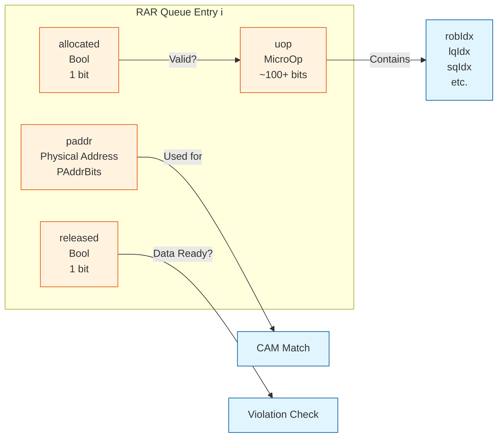
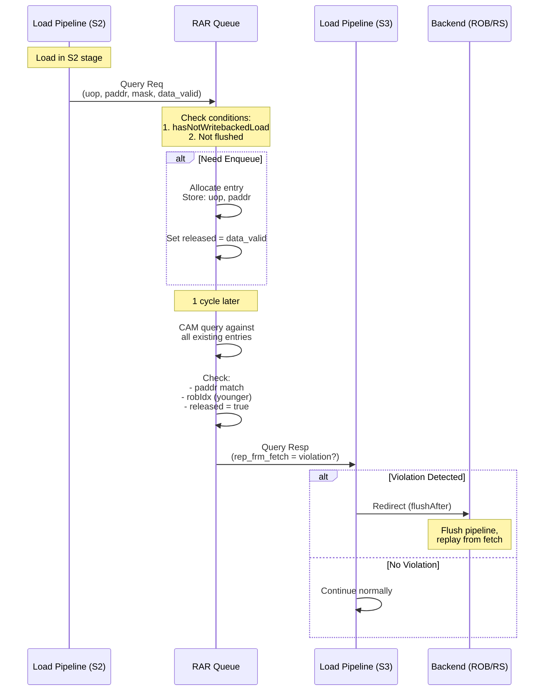
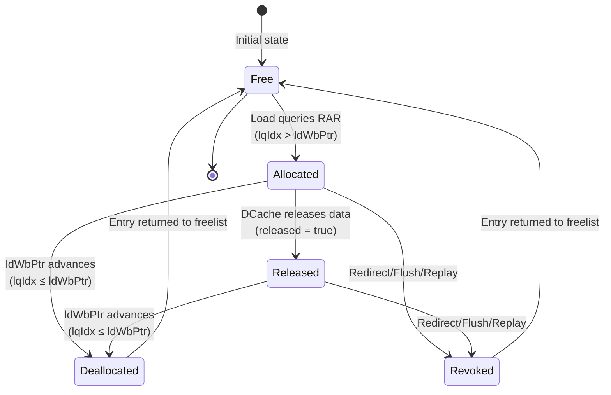
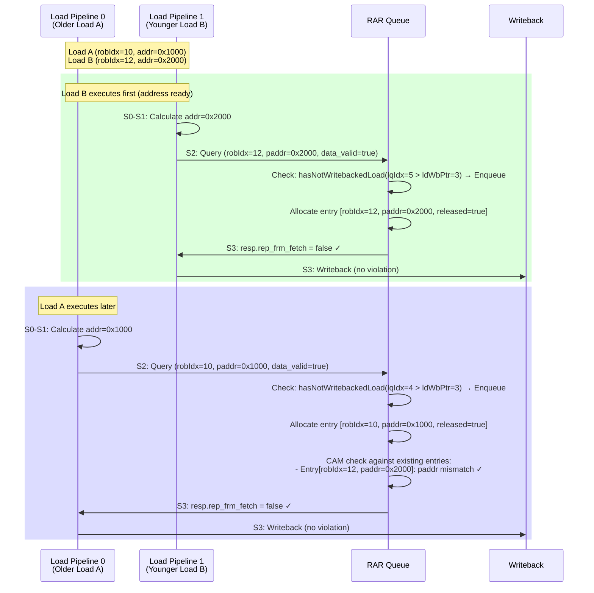
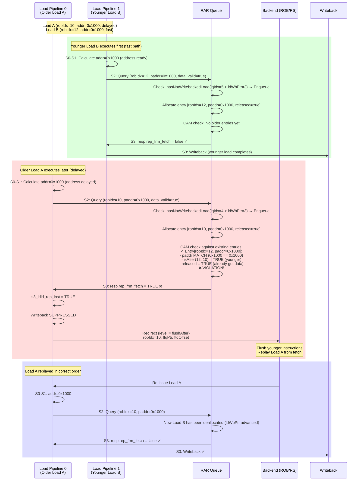
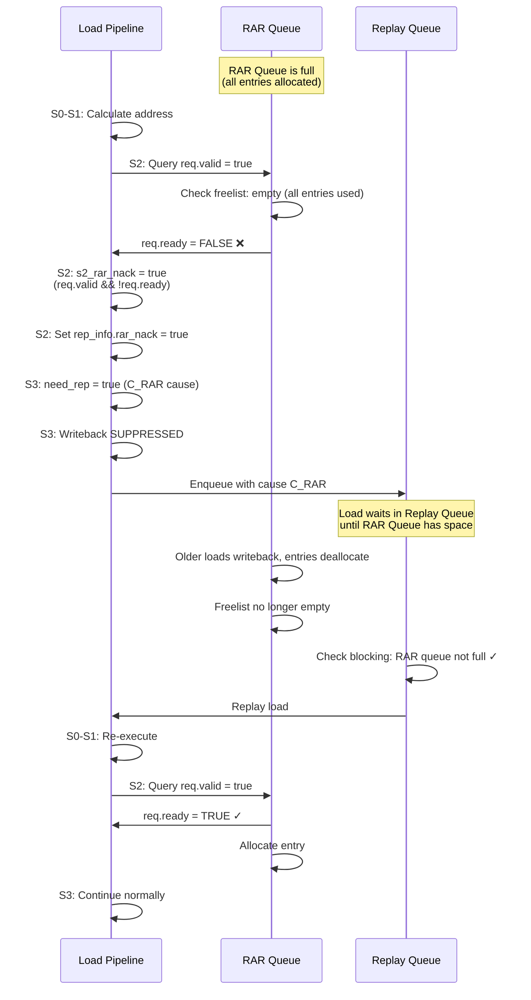
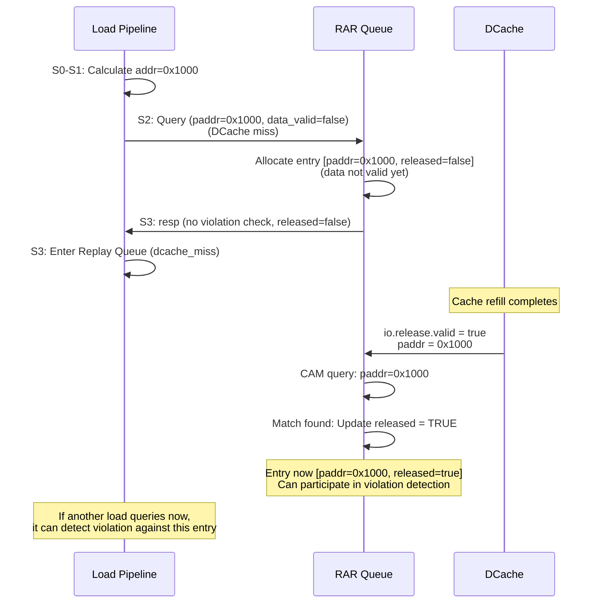

# Load-Load Violation Detection in XiangShan

## Table of Contents
- [Overview](#overview)
- [Architecture](#architecture)
- [RAR Queue Structure](#rar-queue-structure)
- [Detection Mechanism](#detection-mechanism)
- [Violation Scenarios](#violation-scenarios)
- [Code Analysis](#code-analysis)
- [Sequence Diagrams](#sequence-diagrams)
- [Performance Impact](#performance-impact)
- [CSR Control](#csr-control)
- [Related Mechanisms](#related-mechanisms)

---

## Overview

**Load-load violation** (also called **ld-ld violation**) occurs when **two loads to the same address execute out of program order** across different load pipelines, potentially causing incorrect data to be forwarded or memory ordering violations.

### Key Characteristics

| Property | Value |
|----------|-------|
| **Detection Queue** | RAR Queue (Read-After-Read) |
| **Detection Stage** | S2 (query), S3 (response) |
| **Violation Action** | Redirect with `flushAfter` level |
| **Queue Size** | LoadQueueRARSize (configurable) |
| **Number of Load Pipelines** | LoadPipelineWidth = 2 (default) |
| **CSR Control** | `ldld_vio_check_enable` (bit 4 of `smblockctl`) |

### What is Load-Load Violation?

In an out-of-order processor with **multiple load pipelines**, loads can execute in parallel. A load-load violation occurs when:

1. **Program order**: Load A (older) → Load B (younger)
2. **Execution order**: Load B executes **before** Load A completes
3. **Same address**: Both loads access the **same physical address**
4. **Data released**: Load B has already obtained its data (released)

**Problem**: If Load A then completes and finds that a younger load to the same address has already finished, this violates program order semantics and may cause issues with:
- Load-to-load forwarding optimization
- Memory consistency model
- Speculative execution correctness

**Solution**: **Redirect** (rollback) Load A to replay from fetch, ensuring proper ordering.

---

## Architecture

### System Overview

```mermaid
graph TB
    subgraph "Backend"
        RS[Reservation Station]
    end

    subgraph "Load Pipeline 0"
        LP0_S0[S0]
        LP0_S1[S1]
        LP0_S2[S2]
        LP0_S3[S3]
    end

    subgraph "Load Pipeline 1"
        LP1_S0[S0]
        LP1_S1[S1]
        LP1_S2[S2]
        LP1_S3[S3]
    end

    subgraph "RAR Queue<br/>(LoadQueueRAR)"
        RAR[(RAR Queue<br/>Entries)]
        RAR_CAM[CAM Logic<br/>Address Match]
    end

    subgraph "Load Queue"
        LQ[Virtual Load Queue]
        LQ_WB[ldWbPtr]
    end

    RS -->|Load 0| LP0_S0
    RS -->|Load 1| LP1_S0

    LP0_S0 --> LP0_S1 --> LP0_S2 --> LP0_S3
    LP1_S0 --> LP1_S1 --> LP1_S2 --> LP1_S3

    LP0_S2 -->|Query Req| RAR
    LP1_S2 -->|Query Req| RAR

    RAR -->|Query Resp| LP0_S3
    RAR -->|Query Resp| LP1_S3

    LP0_S3 -->|ldin| LQ
    LP1_S3 -->|ldin| LQ

    LQ -->|ldWbPtr| RAR

    LP0_S3 -.->|Redirect<br/>(if violation)| RS
    LP1_S3 -.->|Redirect<br/>(if violation)| RS

    %% styling
    classDef memory fill:#e8f5e9,stroke:#1b5e20,stroke-width:1px;
    classDef reg fill:#fff3e0,stroke:#e65100,stroke-width:1px;
    classDef logic fill:#e1f5fe,stroke:#01579b,stroke-width:1px;
    classDef io fill:#fce4ec,stroke:#880e4f,stroke-width:1px;

    class RAR memory;
    class LP0_S0,LP0_S1,LP0_S2,LP0_S3,LP1_S0,LP1_S1,LP1_S2,LP1_S3 reg;
    class RAR_CAM logic;
```

### Key Points

1. **Multiple Load Pipelines**: XiangShan has **2 load pipelines** (LoadPipelineWidth = 2) that execute loads in parallel
2. **RAR Queue**: Centralized queue that tracks in-flight loads and detects violations
3. **Query Protocol**: Each load pipeline queries RAR Queue in **S2 stage**
4. **Response in S3**: Violation response arrives in **S3 stage**, triggers redirect if needed
5. **Retirement Tracking**: `ldWbPtr` from Virtual Load Queue indicates which loads have written back

---

## RAR Queue Structure

### RAR Queue Entry Fields

From LoadQueueRAR.scala:50-74:

```scala
//  LoadQueueRAR field
//  +-------+-------+-------+----------+
//  | Valid |  Uop  | PAddr | Released |
//  +-------+-------+-------+----------+
//
//  Field descriptions:
//  Allocated   : entry is valid.
//  MicroOp     : Micro-op
//  PAddr       : physical address.
//  Released    : DCache released.

val allocated = RegInit(VecInit(List.fill(LoadQueueRARSize)(false.B)))
val uop = Reg(Vec(LoadQueueRARSize, new MicroOp))
val paddrModule = Module(new LqPAddrModule(...))  // Physical address storage
val released = RegInit(VecInit(List.fill(LoadQueueRARSize)(false.B)))
```

### Entry Structure Diagram



### Field Descriptions

| Field | Type | Size | Description |
|-------|------|------|-------------|
| **allocated** | Bool | 1 bit | Entry is valid and in use |
| **uop** | MicroOp | ~100+ bits | Micro-operation containing robIdx, lqIdx, sqIdx, instruction info |
| **paddr** | UInt | PAddrBits (typically 36-48 bits) | Physical address of the load |
| **released** | Bool | 1 bit | Load has obtained its data (from DCache or forwarding) |

### FreeList Management

```scala
val freeList = Module(new FreeList(
  size = LoadQueueRARSize,
  allocWidth = LoadPipelineWidth,      // 2 entries can allocate per cycle
  freeWidth = 4,                        // 4 entries can deallocate per cycle
  enablePreAlloc = true,
  moduleName = "LoadQueueRAR freelist"
))
```

**Allocation**: Up to **2 entries per cycle** (one per load pipeline)
**Deallocation**: Up to **4 entries per cycle** (faster than allocation to prevent overflow)

---

## Detection Mechanism

### Overall Flow



### Enqueue Conditions (LoadQueueRAR.scala:96-102)

A load is enqueued into RAR Queue if **ALL** conditions are met:

```scala
val canEnqueue = io.query.map(_.req.valid)
val cancelEnqueue = io.query.map(_.req.bits.uop.robIdx.needFlush(io.redirect))
val hasNotWritebackedLoad = io.query.map(_.req.bits.uop.lqIdx).map(lqIdx => isAfter(lqIdx, io.ldWbPtr))
val needEnqueue = canEnqueue.zip(hasNotWritebackedLoad).zip(cancelEnqueue).map {
  case ((v, r), c) => v && r && !c
}
```

**Conditions**:
1. **Query valid** (`canEnqueue`): Load pipeline sending query
2. **Has older in-flight loads** (`hasNotWritebackedLoad`): There exist loads that haven't written back yet (lqIdx > ldWbPtr)
3. **Not flushed** (`!cancelEnqueue`): Load hasn't been redirected/flushed

**Key Insight**: RAR Queue only tracks loads that have **older in-flight loads**. If a load has no older loads pending, it cannot cause a load-load violation, so it's not enqueued.

---

## Entry Allocation and Deallocation Lifecycle

### Understanding lqIdx and ldWbPtr

The RAR Queue's allocation and deallocation is tightly coupled with the **Virtual Load Queue** (VLQ) through two key concepts:

| Concept | Type | Description |
|---------|------|-------------|
| **lqIdx** | Load Queue Index | A unique identifier assigned to each load instruction when it's dispatched. Acts as a "birth certificate" tracking the load's position in program order within the load stream. |
| **ldWbPtr** | Load Writeback Pointer | A pointer maintained by the Virtual Load Queue that tracks the **oldest load that has NOT yet written back**. All loads with `lqIdx ≤ ldWbPtr` have completed and written back their results. |

**Key Relationship**:
```
isAfter(lqIdx, ldWbPtr) = true   →  Load is still in-flight (hasn't written back)
isAfter(lqIdx, ldWbPtr) = false  →  Load has written back (completed)
```

The `isAfter` function compares circular queue pointers, handling wraparound correctly.

### RAR Queue Entry Lifecycle



### Allocation Logic

An entry is allocated when a load queries the RAR Queue **if and only if**:

1. **Freelist has space**: `freeList.io.canAlloc = true`
2. **Query is valid**: `io.query.req.valid = true`
3. **Has older in-flight loads**: `isAfter(lqIdx, ldWbPtr) = true`
4. **Not being flushed**: `!uop.robIdx.needFlush(io.redirect)`

**Critical Point**: The condition `isAfter(lqIdx, ldWbPtr) = true` means "this load has older loads that haven't written back yet."

### Deallocation Logic

An entry is deallocated (freed) when **any** of these occurs:

1. **Normal completion**: `ldWbPtr` advances past the entry's `lqIdx`
   - When older loads complete and writeback, `ldWbPtr` moves forward
   - Entries whose `lqIdx ≤ ldWbPtr` are no longer needed (no younger loads can violate against them)

2. **Revocation**: Load needs replay, exception, or redirect
   - Set via `io.query.revoke` signal from load pipeline
   - Immediately deallocates the entry

3. **Flush**: Pipeline flush due to redirect
   - All entries with `robIdx.needFlush(io.redirect)` are deallocated

### Why RAR Queue Becomes Full

**RAR "full"** means the freelist cannot allocate an entry for a new load. This happens when:

**Root Cause**: `ldWbPtr` is **stuck** (not advancing) while younger loads keep executing.

**Why ldWbPtr gets stuck**:
- Oldest loads are **blocked** on long-latency operations:
  - L2/L3 cache misses
  - TLB misses
  - Replay queue stalls
  - Store-load forwarding stalls
  - Previous RAR violations causing cascading replays

**Consequence**:
1. `ldWbPtr` doesn't advance (stuck on oldest incomplete load)
2. Younger loads continue issuing and querying RAR Queue
3. Each younger load has `lqIdx > ldWbPtr` → all need RAR entries
4. RAR entries aren't freed (because `ldWbPtr` hasn't moved past them)
5. Freelist exhausts → `req.ready = false`
6. New loads get **nacked** → replay with cause `C_RAR`

### Example 1: Normal Operation (No Fullness)

**Initial State**:
- `ldWbPtr = 5` (loads 0-4 have written back)
- RAR Queue: 2/16 entries used

**Timeline**:

| Cycle | Event | lqIdx | ldWbPtr | RAR Entries | Action |
|-------|-------|-------|---------|-------------|--------|
| 0 | Load A queries | 6 | 5 | 2 used | `isAfter(6,5)=true` → Allocate entry 0 |
| 1 | Load B queries | 7 | 5 | 3 used | `isAfter(7,5)=true` → Allocate entry 1 |
| 2 | Load C queries | 8 | 5 | 4 used | `isAfter(8,5)=true` → Allocate entry 2 |
| 3 | Load A (lqIdx=6) completes | - | **6** | 3 used | `ldWbPtr` advances → Free entry 0 |
| 4 | Load B (lqIdx=7) completes | - | **7** | 2 used | `ldWbPtr` advances → Free entry 1 |
| 5 | Load D queries | 9 | 7 | 3 used | `isAfter(9,7)=true` → Allocate entry 0 (reused) |

**Result**: Queue operates smoothly. As loads complete, `ldWbPtr` advances and frees entries.

### Example 2: RAR Queue Becomes Full

**Initial State**:
- `ldWbPtr = 10` (loads 0-9 written back)
- RAR Queue: 0/8 entries used (smaller queue for example)
- LoadQueueRARSize = 8

**Timeline**:

| Cycle | Event | lqIdx | ldWbPtr | RAR Entries | Action |
|-------|-------|-------|---------|-------------|--------|
| 0 | Load A queries (L2 miss!) | 11 | 10 | 1 used | Allocate entry 0, **BLOCKED on L2 miss** |
| 1 | Load B queries | 12 | 10 | 2 used | Allocate entry 1 |
| 2 | Load C queries | 13 | 10 | 3 used | Allocate entry 2 |
| 3 | Load D queries | 14 | 10 | 4 used | Allocate entry 3 |
| 4 | Load E queries | 15 | 10 | 5 used | Allocate entry 4 |
| 5 | Load F queries | 16 | 10 | 6 used | Allocate entry 5 |
| 6 | Load G queries | 17 | 10 | 7 used | Allocate entry 6 |
| 7 | Load H queries | 18 | 10 | 8 used | Allocate entry 7 (FULL!) |
| 8 | Load I queries | 19 | **10** | **8 used** | ❌ `req.ready = false` → **NACK** (C_RAR) |

**Problem**:
- Load A (lqIdx=11) is **oldest in-flight load**, stuck on L2 miss
- `ldWbPtr` is **stuck at 10** (waiting for Load A to complete)
- Loads B-H all have `lqIdx > ldWbPtr` → all allocated entries
- Load I needs entry, but freelist is **empty**
- Load I is **nacked**, must replay later

**Resolution**:

| Cycle | Event | ldWbPtr | RAR Entries | Action |
|-------|-------|---------|-------------|--------|
| 20 | Load A's L2 miss resolves | 10 | 8 used | Load A gets data |
| 21 | Load A writes back | **11** | 7 used | `ldWbPtr` advances → Free entry 0 |
| 22 | Load B writes back | **12** | 6 used | `ldWbPtr` advances → Free entry 1 |
| 23 | Load I replays | 10 | 6 used | Now `isAfter(19,12)=true` but freelist has space → Allocate ✓ |

### Example 3: Cascading Effect with Violations

**Scenario**: Load-load violations cause replays, which delay writeback, which stalls `ldWbPtr`, which fills RAR Queue.

**Timeline**:

| Cycle | Event | lqIdx | ldWbPtr | Notes |
|-------|-------|-------|---------|-------|
| 0 | Load A queries (addr 0x1000) | 10 | 9 | Allocate RAR entry |
| 1 | Load B queries (addr 0x2000) | 11 | 9 | Allocate RAR entry |
| 2 | Load C queries (addr 0x1000) | 12 | 9 | Allocate RAR entry |
| 3 | Load C completes first (fast path) | - | 9 | Entry 2 released=true |
| 4 | Load A queries (delayed) | - | 9 | **VIOLATION** detected (Load C at 0x1000 already done) |
| 5 | Load A redirects | - | **9** | Replay Load A, flush Load B, Load C |
| 6 | Entries revoked | - | 9 | RAR entries for B, C deallocated |
| 7 | Load A re-issues | 10 | 9 | Allocate RAR entry (again) |
| 8 | Load B re-issues | 11 | 9 | Allocate RAR entry (again) |
| 9 | Load C re-issues | 12 | 9 | Allocate RAR entry (again) |
| 10 | Load A completes | - | **10** | `ldWbPtr` finally advances |

**Impact**: Violations cause replays → delays completion → stalls `ldWbPtr` → increases RAR Queue pressure.

### Monitoring RAR Queue Fullness

From LoadQueueRAR.scala:228-235:

```scala
val validCount = freeList.io.validCount
val allowEnqueue = validCount <= (LoadQueueRARSize - LoadPipelineWidth).U
XSPerfAccumulate("enq", canEnqCount)
QueuePerf(LoadQueueRARSize, validCount, !allowEnqueue)
```

**Metrics**:
- `validCount`: Number of allocated entries
- `allowEnqueue`: Whether new allocations are allowed (leaves space for in-flight queries)
- Queue is considered "full" when `validCount > (LoadQueueRARSize - LoadPipelineWidth)`

### Impact on Performance

| Scenario | RAR Queue Pressure | Performance Impact |
|----------|-------------------|-------------------|
| **Fast loads** (L1 hits) | Low (entries freed quickly) | Minimal |
| **Occasional L2 miss** | Medium (temporary pressure) | Slight (1-2 nacks) |
| **Frequent L2/L3 misses** | **High** (ldWbPtr stalls) | **Severe** (many C_RAR replays) |
| **Load-load violations** | **High** (cascading replays) | **Severe** (redirect storms) |
| **Memory-intensive workload** | **Very High** (sustained pressure) | **Critical** (throughput collapse) |

**Typical Configuration**:
- `LoadQueueRARSize = 16-32` entries (configurable)
- `LoadPipelineWidth = 2` (2 queries/cycle)
- Deallocation rate: up to 4 entries/cycle

**Design Intent**: RAR Queue size is tuned to handle typical L1/L2 miss latencies without frequent fullness, while remaining small enough to minimize area and CAM power.

---

### Violation Check Logic (LoadQueueRAR.scala:196-206)

```scala
// Generate real violation mask
val robIdxMask = VecInit(uop.map(_.robIdx).map(isAfter(_, query.req.bits.uop.robIdx)))
val matchMask = (0 until LoadQueueRARSize).map(i => {
                  RegNext(allocated(i) &
                  paddrModule.io.releaseViolationMmask(w)(i) &  // paddr match (CAM)
                  robIdxMask(i) &&                              // younger than query load
                  released(i))                                   // already got data
                })
//  Load-to-Load violation check result
val ldLdViolationMask = VecInit(matchMask)
query.resp.bits.rep_frm_fetch := ParallelORR(ldLdViolationMask)
```

**Violation occurs when**:
1. **Entry allocated**: RAR entry is valid
2. **Address match**: Physical addresses match (via CAM port)
3. **Age check**: RAR entry's load is **younger** than the querying load (`isAfter(rar_entry.robIdx, query_load.robIdx)`)
4. **Released**: Younger load has already obtained its data (`released = true`)

**Result**: If any entry matches all conditions → `rep_frm_fetch = true` → Redirect

---

## Violation Scenarios

### Scenario 1: Cross-Pipeline Violation (Most Common)

Two loads to the same address execute in **different load pipelines**:

**Program Order**:
```assembly
0x1000: lw x1, 0(x2)    # Load A (older, robIdx = 10)
0x1004: lw x3, 0(x4)    # Load B (younger, robIdx = 12)
```

**Execution Timeline**:
- Cycle 0: Both loads issued to different pipelines (Load A → LP0, Load B → LP1)
- Cycle 1: Load B's address ready first (x4 known), Load A's address not ready (x2 unknown)
- Cycle 2: Load B completes fast (DCache hit), Load A still calculating address
- Cycle 3: Load A finally gets address, queries RAR Queue, detects Load B already finished
- **Result**: **VIOLATION** - Younger load completed before older load!

### Scenario 2: Same-Pipeline Violation (Rare)

Even in a single pipeline, violations can occur due to replays:

**Program Order**:
```assembly
lw x1, 0(x2)    # Load A (older)
lw x3, 0(x4)    # Load B (younger)
```

**Execution Timeline**:
- Load A issued, misses in DCache → enters Replay Queue
- Load B issued later, **hits** in DCache → completes quickly
- Load A replays from Replay Queue, discovers Load B (same address) already finished
- **Result**: **VIOLATION**

### Scenario 3: Speculative Address Calculation

**Program Order**:
```assembly
add x2, x5, x6          # Calculate address for Load A
lw  x1, 0(x2)           # Load A (older, depends on add)
lw  x3, 0(x10)          # Load B (younger, independent)
```

**Execution Timeline**:
- Load B's address (x10) ready immediately
- Load A waits for `add` to complete
- Load B executes and completes
- Load A finally gets address (from `add`), discovers it's same as Load B
- **Result**: **VIOLATION** if addresses match

---

## Code Analysis

### S2: Query Submission (LoadUnit.scala:873-877)

```scala
// ld-ld violation require
io.lsq.ldld_nuke_query.req.valid           := s2_valid && s2_can_query
io.lsq.ldld_nuke_query.req.bits.uop        := s2_in.uop
io.lsq.ldld_nuke_query.req.bits.mask       := s2_in.mask
io.lsq.ldld_nuke_query.req.bits.paddr      := s2_in.paddr
io.lsq.ldld_nuke_query.req.bits.data_valid := Mux(s2_full_fwd || s2_fwd_data_valid, true.B, !s2_dcache_miss)
```

**Fields sent in query**:
- **uop**: Contains robIdx, lqIdx for age comparison
- **mask**: Byte enable mask (which bytes are accessed)
- **paddr**: Physical address for CAM matching
- **data_valid**: Whether load has obtained valid data
  - `true` if forwarded (`s2_full_fwd || s2_fwd_data_valid`)
  - `true` if DCache hit (`!s2_dcache_miss`)

**Query Blocking** (LoadUnit.scala:816-817):

```scala
val s2_rar_nack = io.lsq.ldld_nuke_query.req.valid &&
                  !io.lsq.ldld_nuke_query.req.ready
```

If RAR Queue is full or busy (not ready), the query is **nacked**:
- Load must replay from Replay Queue (slow replay)
- Replay cause: `C_RAR` (LoadReplayCauses.C_RAR = 7)

### S3: Response Handling (LoadUnit.scala:1042-1046)

```scala
val s3_ldld_rep_inst =
    io.lsq.ldld_nuke_query.resp.valid &&
    io.lsq.ldld_nuke_query.resp.bits.rep_frm_fetch &&
    RegNext(io.csrCtrl.ldld_vio_check_enable)
val s3_flushPipe = s3_ldld_rep_inst
```

**Violation conditions**:
1. **Response valid**: RAR Queue returned a response
2. **Violation detected**: `rep_frm_fetch = true`
3. **CSR enabled**: Load-load violation check enabled via CSR

**Action** (LoadUnit.scala:1074-1080):

```scala
io.rollback.valid := s3_valid && (s3_rep_frm_fetch || s3_flushPipe) && !s3_exception
io.rollback.bits.level := Mux(s3_rep_frm_fetch, RedirectLevel.flush, RedirectLevel.flushAfter)
```

**Note**: `s3_rep_frm_fetch` (used in the Mux) is a **different signal** from the RAR queue's `resp.bits.rep_frm_fetch` (shown in line 372). When a load-load violation occurs:
- RAR queue sets `resp.bits.rep_frm_fetch = true`, which sets `s3_flushPipe = true`
- But `s3_rep_frm_fetch` remains `false` (it's set by other replay sources like RAW violations)
- Result: Mux selects the **false branch** → `RedirectLevel.flushAfter`

**Redirect level**: `RedirectLevel.flushAfter`
- Flush instructions **after** (younger than) the violating load
- The violating load itself is **refetched and re-executed**
- Older instructions continue normally

### Revocation on Replay (LoadUnit.scala:1087-1089)

```scala
val s3_revoke = s3_exception || io.lsq.ldin.bits.rep_info.need_rep
io.lsq.ldld_nuke_query.revoke := s3_revoke
io.lsq.stld_nuke_query.revoke := s3_revoke
```

If the load needs replay (any `rep_info.need_rep` cause), it **revokes** its RAR/RAW query:
- The load's RAR Queue entry is deallocated
- Prevents false violations from replayed loads
- On replay, load will send fresh query with updated state

---

## Sequence Diagrams

### Scenario 1: No Violation (Normal Case)

Two loads to **different addresses**, no violation.



### Scenario 2: Violation Detected (Cross-Pipeline)

Two loads to **same address**, younger finishes first → **VIOLATION**.



### Scenario 3: Query Blocked (RAR Queue Full)

RAR Queue is full, query is **nacked**, load must replay.



### Scenario 4: DCache Release Updates RAR Queue

DCache releases a cache line, updating `released` flags in RAR Queue.



---

## Performance Impact

### Latency Cost

| Scenario | Total Latency | Breakdown |
|----------|---------------|-----------|
| **No violation** | 3-4 cycles | Normal L1 hit path (S0→S1→S2→S3) |
| **RAR queue nack** | ~10-20 cycles | 3 cycles (fail) + 3-10 cycles (wait for RAR space) + 3-4 cycles (retry) |
| **Violation detected** | ~20-30 cycles | 3 cycles (detect) + ~20-30 cycles (redirect, flush, refetch, replay) |

### Redirect Cost Breakdown

When a load-load violation is detected:

1. **Detection**: 3 cycles (load reaches S3)
2. **Redirect**: 1-2 cycles (redirect signal to frontend)
3. **Flush**: 5-10 cycles (flush backend pipeline, cancel younger instructions)
4. **Refetch**: 5-10 cycles (frontend fetches from FTQ, decode, rename)
5. **Re-execute**: 3-4 cycles (load replays, normal L1 hit)

**Total**: ~20-30 cycles (significantly higher than normal 3-4 cycle load)

### False Positives

**Can false positives occur?**

**Potentially, yes** - at cache line granularity:
- Address match via CAM at **cache line granularity** (typically 64-byte aligned)
- Age comparison via robIdx (exact program order)
- Released flag (only if data actually obtained)

**Implication**: Two loads to **different bytes within the same cache line** (e.g., addresses 0x1000 and 0x1008) will match in the CAM, potentially triggering a violation even though they access different memory locations.

**Trade-off**: Cache line granularity matching is a deliberate design choice:
- **Simpler hardware**: Reduces CAM complexity (fewer address bits to compare)
- **Conservative correctness**: Ensures no actual violations are missed
- **Acceptable false positive rate**: Load-load violations to the same cache line are relatively rare in practice

Unlike store-load violation detection (e.g., s1_nuke with 8-byte granularity for higher precision), RAR Queue prioritizes simplicity and conservative detection over fine-grained matching.

### Performance Monitoring

From LoadQueueRAR.scala:228-235:

```scala
val canEnqCount = PopCount(io.query.map(_.req.fire))
val validCount = freeList.io.validCount
val allowEnqueue = validCount <= (LoadQueueRARSize - LoadPipelineWidth).U
val ldLdViolationCount = PopCount(io.query.map(_.resp).map(resp => resp.valid && resp.bits.rep_frm_fetch))

QueuePerf(LoadQueueRARSize, validCount, !allowEnqueue)
XSPerfAccumulate("enq", canEnqCount)
XSPerfAccumulate("ld_ld_violation", ldLdViolationCount)
```

**Performance counters**:
- `enq`: Number of RAR Queue allocations
- `ld_ld_violation`: Number of violations detected
- Queue occupancy tracking

---

## CSR Control

### Enable/Disable Mechanism

Load-load violation detection can be **dynamically enabled/disabled** via CSR:

**CSR Register**: `smblockctl` (CSR.scala:550-553)

```scala
val smblockctl = RegInit(UInt(XLEN.W), smblockctl_init_val.U)
// bits 4: enable load load violation check
csrio.customCtrl.ldld_vio_check_enable := smblockctl(4)
```

**Control bit**: `smblockctl[4]`
- **1**: Load-load violation check **enabled** (default)
- **0**: Load-load violation check **disabled**

### When to Disable?

Disabling load-load violation detection may be useful for:

1. **Performance tuning**: If violations are rare, disabling reduces redirect overhead
2. **Debugging**: Isolate whether performance issues are due to load-load violations
3. **Relaxed memory model**: Some workloads may tolerate out-of-order loads

**Warning**: Disabling may cause **incorrect execution** for programs that rely on strict load ordering!

---

## Related Mechanisms

### 1. Store-Load Violation (s1_nuke)

**Comparison**:

| Property | Load-Load Violation | Store-Load Violation (s1_nuke) |
|----------|---------------------|--------------------------------|
| **Detection** | RAR Queue (S2/S3) | Store pipeline broadcast (S1) |
| **Violation** | Younger load before older load | Younger load before older store |
| **Action** | Redirect (flushAfter) | Replay (Replay Queue, C_NK cause) |
| **Timing** | Response in S3 (1 cycle delay) | Detected in S1 (immediate) |
| **Pipelines** | Across load pipelines | Load pipeline vs. store pipeline |

**Key difference**: Load-load uses **centralized queue**, store-load uses **broadcast query**.

### 2. RAW Queue (Read-After-Write Violation)

**RAW Queue** (LoadQueueRAW.scala):
- Detects violations from **store side** (when store address becomes known)
- Stores query RAW queue after their addresses are calculated

**RAR vs. RAW**:
- **RAR**: Load queries, checks against **other loads** (load-load)
- **RAW**: Store queries, checks against **younger loads** (store-load)
- Both use similar CAM-based detection, different violation types

### 3. Virtual Load Queue

**Relationship**:
- **ldWbPtr**: Pointer from Virtual Load Queue indicating which loads have written back
- **RAR Queue enqueue**: Only if `lqIdx > ldWbPtr` (has older in-flight loads)
- **RAR Queue dequeue**: When load's lqIdx ≤ ldWbPtr (all older loads written back)

**Flow**:
```
Load completes → Writeback → ldWbPtr advances → RAR entries dequeue
```

### 4. Memory Ordering Summary

XiangShan enforces **RISC-V TSO** memory model using:

| Ordering | Mechanism | Detection Point |
|----------|-----------|-----------------|
| **Load → Load** | RAR Queue | Load S2/S3 |
| **Store → Load** | s1_nuke, RAW Queue | Load S1, Store address calc |
| **Store → Store** | Store Queue in-order retirement | Store commit |
| **Load → Store** | ROB commit order | Backend commit |

---

## Summary

### Key Takeaways

1. **Load-load violation** occurs when a younger load to the same address executes before an older load across multiple load pipelines.

2. **RAR Queue** (Read-After-Read) tracks in-flight loads and detects violations via CAM-based address matching.

3. **Detection flow**:
   - **S2**: Load queries RAR Queue with paddr, robIdx, data_valid
   - **S3**: RAR Queue responds with violation status
   - **S3**: If violation → Redirect with `flushAfter` level

4. **Enqueue condition**: Only loads with older in-flight loads are enqueued (lqIdx > ldWbPtr).

5. **Violation condition**: Younger load (in RAR Queue) has same address, already released (got data).

6. **Performance cost**: ~20-30 cycles for redirect (vs. 3-4 cycles for normal load).

7. **CSR control**: Can be enabled/disabled via `smblockctl[4]` for tuning.

8. **Cross-pipeline**: Critical for **multi-pipeline** (LoadPipelineWidth = 2) out-of-order execution.

### Why It's Necessary

Without load-load violation detection:
- Younger loads could complete before older loads
- Load-to-load forwarding would break
- Memory consistency model violations
- Incorrect speculative execution results

With RAR Queue:
- **Program order** is enforced for loads to the same address
- **Speculation** is corrected via redirect
- **TSO memory model** compliance

---

## Code References

| File | Lines | Description |
|------|-------|-------------|
| **LoadQueueRAR.scala** | 27-242 | RAR Queue implementation |
| **LoadQueueRAR.scala** | 96-102 | Enqueue conditions |
| **LoadQueueRAR.scala** | 196-206 | Violation check logic |
| **LoadUnit.scala** | 873-877 | S2 query submission |
| **LoadUnit.scala** | 1042-1046 | S3 violation detection |
| **LoadUnit.scala** | 1074-1080 | Redirect generation (flushAfter) |
| **LoadUnit.scala** | 1087-1089 | Query revocation |
| **MemCommon.scala** | 280-299 | LoadNukeQueryIO interface |
| **CSR.scala** | 553 | CSR control (ldld_vio_check_enable) |
| **Parameters.scala** | 174 | LoadPipelineWidth = 2 |

---

## Related Documentation

- **[loadpipe_top.md](./loadpipe_top.md)**: Comprehensive LoadPipe analysis
- **[z_detail_s1_nuke.md](./z_detail_s1_nuke.md)**: Store-load violation (s1_nuke) detailed analysis
- **[loadpipe_redirect.md](./loadpipe_redirect.md)**: Redirect mechanisms (CAM mismatch, load-load violations)
- **[loadpipe_top_highlevel.md](./loadpipe_top_highlevel.md)**: High-level LoadPipe overview
