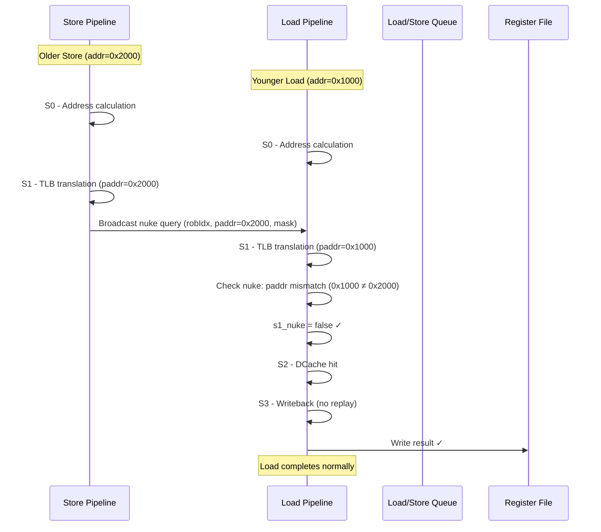
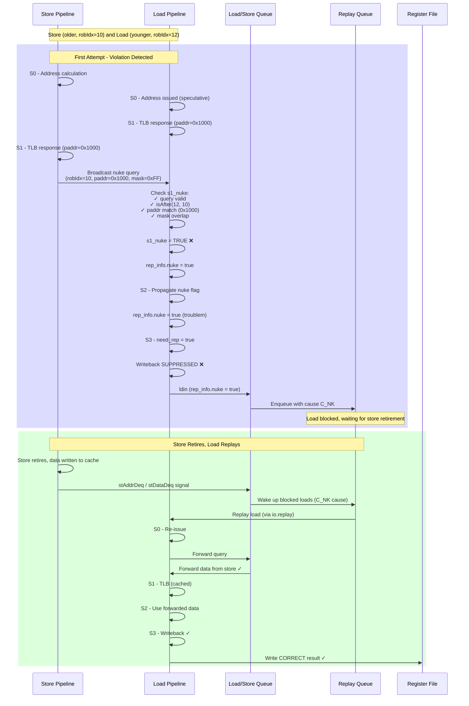
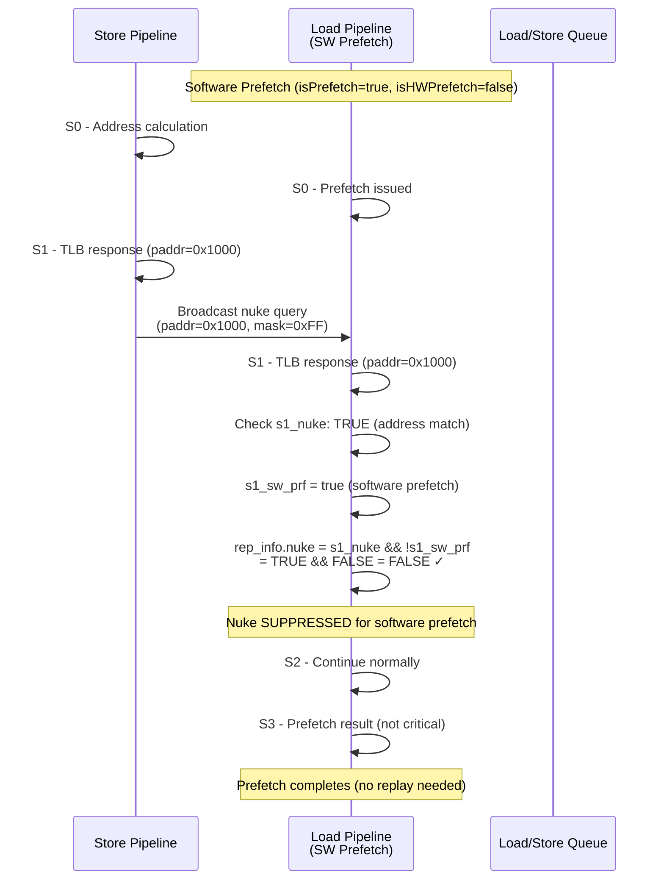
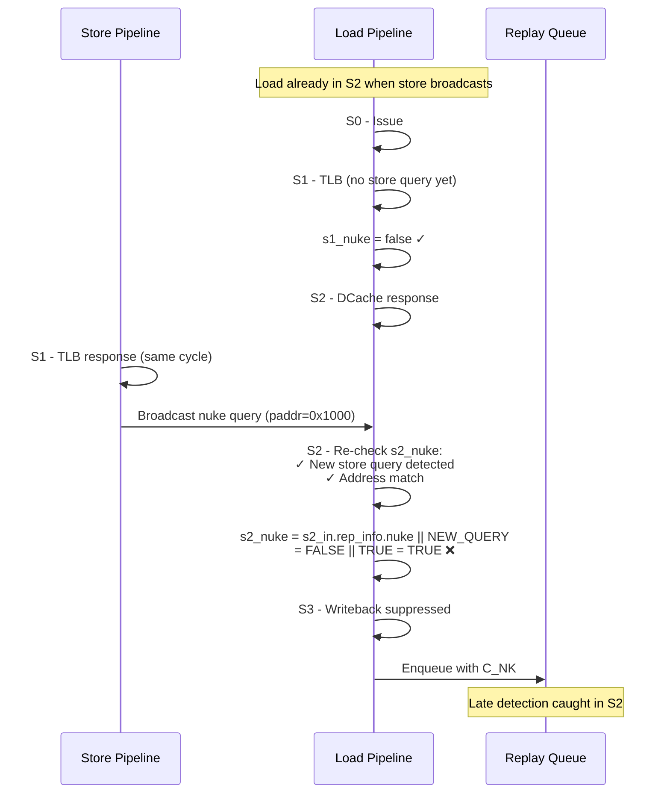

# S1 Nuke: Store-Load Violation Detection

## Table of Contents
- [Overview](#overview)
- [What is S1 Nuke?](#what-is-s1-nuke)
- [Why is it Needed?](#why-is-it-needed)
- [What Problem Does it Solve?](#what-problem-does-it-solve)
- [Detection Mechanism](#detection-mechanism)
- [Code Analysis](#code-analysis)
- [Sequence Diagrams](#sequence-diagrams)
- [Special Cases](#special-cases)
- [Performance Impact](#performance-impact)
- [Related Mechanisms](#related-mechanisms)

---

## Overview

**`s1_nuke`** is a critical memory ordering violation detection mechanism in the XiangShan load pipeline. It detects **store-load (st-ld) violations** where a younger load has speculatively executed before an older store, potentially reading stale data.

### Key Facts

| Property | Value |
|----------|-------|
| **Detection Stage** | S1 (TLB response stage) |
| **Detection Method** | CAM query against Store Pipeline broadcasts |
| **Violation Type** | Store-Load (st-ld) memory ordering violation |
| **Action** | Mark load for replay via Replay Queue (slow replay) |
| **Replay Cause** | `LoadReplayCauses.C_NK` (index 9, lowest priority) |
| **Recovery** | Replay from Replay Queue when store retires |

---

## What is S1 Nuke?

`s1_nuke` is a **boolean signal** generated in the **S1 stage** of the load pipeline that indicates a store-load violation has been detected.

### Definition

From LoadUnit.scala:635-641:

```scala
// st-ld violation query
val s1_nuke = VecInit((0 until StorePipelineWidth).map(w => {
                     io.stld_nuke_query(w).valid && // query valid
                     isAfter(s1_in.uop.robIdx, io.stld_nuke_query(w).bits.robIdx) && // older store
                     // TODO: Fix me when vector instruction
                     (s1_paddr_dup_lsu(PAddrBits-1, 3) === io.stld_nuke_query(w).bits.paddr(PAddrBits-1, 3)) && // paddr match
                     (s1_in.mask & io.stld_nuke_query(w).bits.mask).orR // data mask contain
                    })).asUInt.orR && !s1_tlb_miss
```

### Detection Conditions

A load is "nuked" when **ALL** of the following conditions are true:

1. **Store query is valid**: At least one store pipeline (0 to StorePipelineWidth-1) is broadcasting a nuke query
2. **Age check**: The store is **OLDER** than the load (load's robIdx is after store's robIdx)
3. **Address match**: Physical addresses point to the same cache line (bits [PAddrBits-1:3] match)
4. **Mask overlap**: The load and store access overlapping bytes (`(load_mask & store_mask).orR`)
5. **No TLB miss**: The load's TLB translation succeeded (`!s1_tlb_miss`)

---

## Why is it Needed?

### Out-of-Order Execution Challenge

In an **out-of-order (OoO) processor**, instructions execute as soon as their operands are ready, not necessarily in program order. This creates a critical challenge for memory ordering:

1. **Loads can execute speculatively** before older stores when:
   - The store's address is not yet calculated
   - The load's address is ready first
   - The reservation station schedules the load earlier

2. **Problem**: If the load and store access the same address, the load will read **stale data** (from cache/memory) instead of the store's new data.

3. **Solution**: When the store calculates its address, it must **detect** any younger loads that have already executed to the same address and **replay** them.

### Memory Consistency Model

RISC-V implements a **Total Store Ordering (TSO)** memory model that guarantees:
- **Load-Load ordering**: Loads must not reorder with respect to each other (enforced by RAR Queue)
- **Store-Store ordering**: Stores must not reorder (enforced by Store Queue)
- **Store-Load ordering**: Loads must see the latest store data (enforced by forwarding + s1_nuke)

`s1_nuke` is part of the mechanism that enforces **store-load ordering** by detecting violations and triggering replays.

---

## What Problem Does it Solve?

### Scenario: Store-Load Violation

Consider the following program sequence:

```assembly
# Program Order (older → younger)
0x1000: sw  x1, 0(x2)    # Store to address [x2+0]
0x1004: lw  x3, 0(x4)    # Load from address [x4+0]
```

**Case 1: Different addresses** (x2+0 ≠ x4+0)
- No violation, load can execute independently
- Load reads from cache/memory

**Case 2: Same address** (x2+0 == x4+0)
- **MUST** forward data from store to load
- Load should see the store's data, not old cache data

### Out-of-Order Execution Timeline (Violation Scenario)

#### Without s1_nuke (INCORRECT):

```
Cycle 0: Store S0 - Address calculation not ready (x2 not available)
Cycle 1: Load S0 - Address ready (x4 = 0x1000), issued to DCache
Cycle 2: Load S1 - TLB response, paddr = 0x1000
         Store S1 - Address ready (paddr = 0x1000), broadcasts nuke query
         Load S1 - (No s1_nuke feature) does NOT latch the violation
Cycle 3: Load S2 - No store data available via LSQ/SBuffer forwarding
         DCache returns OLD data from 0x1000
Cycle 4: Load S3 - Writeback OLD data ❌ WRONG!
Cycle 5: Store proceeds/retire -> violation discovered too late
```

**Result**: Load got stale data, violation of memory ordering!

#### With s1_nuke (CORRECT):

```
Cycle 0: Store S0 - Address calculation not ready
Cycle 1: Load S0 - Address ready, issued
Cycle 2: Load S1 - TLB response, paddr = 0x1000
         Store S1 - Address ready (paddr = 0x1000), broadcasts nuke query
         Load S1 - Detects s1_nuke (paddr match, age match, mask overlap)
         Load S1 - Sets rep_info.nuke = true (latched)
Cycle 3: Load S2 - Propagates nuke flag (s2_nuke OR s1_nuke)
Cycle 4: Load S3 - Writeback SUPPRESSED (need_rep = true)
                  - Enters Replay Queue with C_NK cause
Cycle 5: Store retires, Replay Queue wakes up load
Cycle 6+: Load replays, gets correct forwarded data ✓ CORRECT!
```

**Result**: Load is nuked and replayed, gets correct data after store retires.

### Clarification: Why S1 Nuke is Required (Not Just S2 Forwarding)

It’s true that S2 does forwarding checks against **LSQ/SBuffer**, but that only works when:
1. The older store is already **visible in LSQ/SBuffer**, and
2. Its address/data state is stable enough for forwarding.

The problematic case for ordering is **an older store whose address becomes ready in the store pipeline** (Store S1) while a younger load is **already in Load S1**. The store’s **nuke query is a one‑cycle pulse** in that same cycle. If the load doesn’t latch it in S1, then:
- In the next cycle the store has moved on, so the broadcast is **gone**.
- The load is now in S2, but **S2 cannot see that transient store‑pipeline hazard** unless it was captured in `rep_info.nuke`.
- LSQ/SBuffer forwarding may still miss the store because the store hasn’t been enqueued or its data isn’t ready yet.

So **s1_nuke is the latch** that bridges a one‑cycle store‑pipeline event into later stages. S2 still participates (it ORs `s1_nuke` into `s2_nuke`), but it **can’t recover** a missed S1 nuke because the store’s broadcast is no longer valid.

---

## Detection Mechanism

### Store Pipeline Broadcast (StoreUnit.scala:178-181)

When a store reaches **S1 stage** and its TLB translation succeeds, it broadcasts a "nuke query":

```scala
// st-ld violation dectect request.
io.stld_nuke_query.valid       := s1_valid && !s1_tlb_miss && !s1_in.isHWPrefetch
io.stld_nuke_query.bits.robIdx := s1_in.uop.robIdx
io.stld_nuke_query.bits.paddr  := s1_paddr
io.stld_nuke_query.bits.mask   := s1_in.mask
```

**Fields**:
- `robIdx`: Store's ROB index (for age comparison)
- `paddr`: Store's physical address (for address matching)
- `mask`: Store's byte enable mask (for overlap detection)

### Load Pipeline Detection (LoadUnit.scala:635-641)

In **S1 stage**, each load checks against **all store pipeline broadcasts** (typically 2 store pipelines):

```scala
val s1_nuke = VecInit((0 until StorePipelineWidth).map(w => {
  io.stld_nuke_query(w).valid &&                                    // Store query active
  isAfter(s1_in.uop.robIdx, io.stld_nuke_query(w).bits.robIdx) &&  // Load is younger
  (s1_paddr_dup_lsu(PAddrBits-1, 3) ===
   io.stld_nuke_query(w).bits.paddr(PAddrBits-1, 3)) &&            // Cache line match
  (s1_in.mask & io.stld_nuke_query(w).bits.mask).orR               // Byte overlap
})).asUInt.orR && !s1_tlb_miss
```

**Logic**:
1. Check each store pipeline (w = 0 to StorePipelineWidth-1)
2. For each store query:
   - Verify store is older (program order)
   - Verify address match (same cache line, ignoring lower 3 bits)
   - Verify mask overlap (at least one byte in common)
3. OR all results together (any store match triggers nuke)
4. Suppress if load had TLB miss (can't compare addresses yet)

### Why Cache Line Granularity (Bits [PAddrBits-1:3])?

The comparison uses bits `[PAddrBits-1:3]`, which means **8-byte cache line granularity**:
- Bits [2:0] are byte offset within 8-byte word
- Comparing [PAddrBits-1:3] checks if addresses are in the same 8-byte aligned region

**Reason**: This is **conservative** but efficient:
- Matches DCache bank granularity
- Avoids false negatives (missing actual violations)
- May cause false positives (nuking loads that don't truly conflict), but this is safe (just performance cost)

---

## Code Analysis

### S1: Nuke Detection and Propagation

#### Detection (LoadUnit.scala:635-641)

```scala
// st-ld violation query
val s1_nuke = VecInit((0 until StorePipelineWidth).map(w => {
                     io.stld_nuke_query(w).valid &&
                     isAfter(s1_in.uop.robIdx, io.stld_nuke_query(w).bits.robIdx) &&
                     (s1_paddr_dup_lsu(PAddrBits-1, 3) === io.stld_nuke_query(w).bits.paddr(PAddrBits-1, 3)) &&
                     (s1_in.mask & io.stld_nuke_query(w).bits.mask).orR
                    })).asUInt.orR && !s1_tlb_miss
```

**Key Operations**:
- `VecInit(...).map(w => ...)`: Check all StorePipelineWidth store broadcasts
- `isAfter(load_robIdx, store_robIdx)`: ROB age comparison (true if load is younger)
- `paddr[PAddrBits-1:3]`: Cache line comparison (8-byte granularity)
- `(mask_A & mask_B).orR`: Byte-level overlap detection
- `.asUInt.orR`: Reduce vector to single bool (true if ANY store matches)

#### Assignment to rep_info (LoadUnit.scala:650)

```scala
s1_out.rep_info.nuke := s1_nuke && !s1_sw_prf
```

**Important**: Nuke is suppressed for **software prefetch** (`s1_sw_prf`):
- Software prefetch doesn't affect architectural state
- If prefetch is nuked, it's simply dropped (no replay needed)
- Saves Replay Queue resources

### S2: Propagation and Fast Replay Decision

#### Propagation from S1 (LoadUnit.scala:833)

```scala
val s2_nuke = VecInit((0 until StorePipelineWidth).map(w => {
                io.stld_nuke_query(w).valid &&
                isAfter(s2_in.uop.robIdx, io.stld_nuke_query(w).bits.robIdx) &&
                (s2_in.paddr(PAddrBits-1, 3) === io.stld_nuke_query(w).bits.paddr(PAddrBits-1, 3)) &&
                (s2_in.mask & io.stld_nuke_query(w).bits.mask).orR
              })).asUInt.orR && !s2_tlb_miss || s2_in.rep_info.nuke
                                                   ^^^^^^^^^^^^^^^^^^^
                                                   Propagate from S1
```

**Note**: S2 re-checks against store broadcasts (in case new stores entered S1) **AND** propagates the S1 nuke flag.

#### Fast Replay Consideration (LoadUnit.scala:850-856)

```scala
val s2_nuke_fast_rep = !s2_mq_nack &&
                       !s2_dcache_miss &&
                       !s2_bank_conflict &&
                       !s2_wpu_pred_fail &&
                       !s2_rar_nack &&
                       !s2_raw_nack &&
                       s2_nuke
```

**Fast replay eligibility**:
- Nuke can trigger **fast replay** IF no other replay causes are present
- Fast replay path: S3 → S0 directly (1-2 cycles)
- However, nuke typically goes to **slow replay** (Replay Queue) because:
  - Need to wait for store to retire
  - Blocking condition: store not yet committed

#### Assignment to rep_info (LoadUnit.scala:931)

```scala
s2_out.rep_info.nuke := s2_nuke && s2_troublem
```

**`s2_troublem`** (LoadUnit.scala:839-842):
```scala
val s2_troublem = !s2_exception &&
                  !s2_mmio &&
                  !s2_prf &&
                  !s2_in.delayedLoadError
```

Nuke is only recorded if:
- No exception occurred
- Not MMIO access
- Not a prefetch
- No delayed load error

### S3: Writeback Suppression and Replay Queue Entry

#### Writeback Suppression (LoadUnit.scala:1060)

```scala
s3_out.valid := s3_valid && !io.lsq.ldin.bits.rep_info.need_rep && !s3_in.mmio
                             ^^^^^^^^^^^^^^^^^^^^^^^^^^^^^^^^^^^^
                             Writeback suppressed if need_rep
```

**`need_rep`** (LoadUnit.scala:68):
```scala
def need_rep = cause.asUInt.orR  // Any replay cause set?
```

**Critical**: If `rep_info.nuke` is set, writeback is **SUPPRESSED**:
- Load result is **NOT** written to register file
- Backend does not see this load completion
- Load enters Replay Queue instead

#### Replay Queue Entry (Replay Queue)

When `need_rep = true`, the load enters the **Replay Queue** with cause `C_NK`:

From LoadQueueReplay.scala:67:
```scala
val C_NK = 9  // st-ld violation (lowest priority)
```

**Blocking condition** for C_NK:
- Load waits in Replay Queue until the conflicting store **retires**
- Store retirement signals via `stAddrDeqVec` or `stDataDeqVec`
- Replay Queue wakes up the load when blocking clears

#### Query Revocation (LoadUnit.scala:1087-1089)

```scala
val s3_revoke = s3_exception || io.lsq.ldin.bits.rep_info.need_rep
io.lsq.ldld_nuke_query.revoke := s3_revoke
io.lsq.stld_nuke_query.revoke := s3_revoke
```

**Important**: If the load is nuked (or has any replay cause), it **revokes** its own nuke queries:
- The load sent queries to RAR/RAW queues in S2
- Since it's being replayed, those queries are invalid
- Revocation prevents false violations

---

## Sequence Diagrams

### Scenario 1: Normal Case (No Violation)

Load and store access **different addresses**, no nuke.



### Scenario 2: Store-Load Violation Detected (S1 Nuke)

Load and store access **same address**, violation detected in S1.



### Scenario 3: Software Prefetch Nuke (Suppressed)

Software prefetch detected as nuked, but **suppressed** (no replay).



### Scenario 4: S2 Nuke Detection (Late Detection)

Store enters S1 while load is in S2, late detection.



---

## Special Cases

### 1. Software Prefetch Suppression

**Code** (LoadUnit.scala:650):
```scala
s1_out.rep_info.nuke := s1_nuke && !s1_sw_prf
```

**Reason**:
- Software prefetch loads (`s1_sw_prf = s1_prf && !s1_hw_prf`) are **hints**, not architectural requirements
- If prefetch data is stale due to store conflict, it's acceptable to ignore
- Suppressing nuke saves Replay Queue entries and replay bandwidth
- Prefetch can still bring data into cache even if stale (will be overwritten by store later)

**Detection** (LoadUnit.scala:595-596):
```scala
val s1_prf    = s1_in.isPrefetch
val s1_hw_prf = s1_in.isHWPrefetch
val s1_sw_prf = s1_prf && !s1_hw_prf
```

### 2. TLB Miss Suppression

**Code** (LoadUnit.scala:641):
```scala
val s1_nuke = (...conditions...).asUInt.orR && !s1_tlb_miss
                                                ^^^^^^^^^^^^
```

**Reason**:
- If load has TLB miss, physical address (`s1_paddr`) is **INVALID**
- Cannot reliably compare addresses for violation detection
- TLB miss will cause replay anyway (via `rep_info.tlb_miss`)
- Nuke check will happen on replay attempt when TLB is valid

### 3. MMIO/Exception Suppression

**Code** (LoadUnit.scala:839-842, 931):
```scala
val s2_troublem = !s2_exception && !s2_mmio && !s2_prf && !s2_in.delayedLoadError
s2_out.rep_info.nuke := s2_nuke && s2_troublem
```

**Reason**:
- MMIO loads: Device access, not cacheable, no store forwarding needed
- Exception loads: Will be squashed, don't need replay
- Prefetch loads: Already handled (suppressed in S1)
- Delayed load error: ECC error, will trigger exception

### 4. Dual Detection (S1 and S2)

**Why check in both S1 and S2?**

**S1 detection** (LoadUnit.scala:635-641):
- Catches stores that entered store pipeline **before or simultaneously** with load in S1

**S2 detection** (LoadUnit.scala:827-833):
- Catches stores that entered store pipeline **while load was in S1→S2 transition**
- Ensures no timing window where violation is missed

**Code** (LoadUnit.scala:833):
```scala
val s2_nuke = (new_s2_nuke_check) || s2_in.rep_info.nuke
                                      ^^^^^^^^^^^^^^^^^^^
                                      Propagate S1 result
```

**Result**: Conservative detection covering all timing scenarios.

### 5. Query Revocation on Replay

**Code** (LoadUnit.scala:1087-1089):
```scala
val s3_revoke = s3_exception || io.lsq.ldin.bits.rep_info.need_rep
io.lsq.ldld_nuke_query.revoke := s3_revoke
io.lsq.stld_nuke_query.revoke := s3_revoke
```

**Reason**:
- Load sent queries to **RAR Queue** (load-load violations) and **RAW Queue** (store-load violations) in S2
- If load is nuked and replayed, those queries are based on **potentially wrong data/state**
- Revocation prevents false positives in RAR/RAW queues
- On replay, load will send fresh queries with correct state

---

## Performance Impact

### Latency Cost

| Scenario | Total Latency | Breakdown |
|----------|---------------|-----------|
| **No violation** | 3-4 cycles | Normal L1 hit path (S0→S1→S2→S3) |
| **S1 nuke detected** | ~30-50 cycles | 3 cycles (fail) + 3-30 cycles (Replay Queue blocking) + 3-4 cycles (replay) + 3-4 cycles (forwarding) |
| **Best case (store ready)** | ~15-20 cycles | Store already in LSQ, fast forwarding on replay |
| **Worst case (store pending)** | ~50-100 cycles | Wait for store to retire, then replay |

### Replay Queue Blocking

**Blocking condition for C_NK** (LoadQueueReplay.scala, inferred):
- Load waits until **store retires** (commits to LSQ/Sbuffer)
- Wakeup signals:
  - `stAddrDeqVec`: Store address retirement
  - `stDataDeqVec`: Store data retirement
- Blocking duration: 5-50 cycles depending on store's distance from commit point

### Performance Optimization: Super Replay

**Not applicable** for C_NK (nuke):
- L2 cache hint (`super replay`) wakes up loads waiting for cache miss (C_DM)
- Nuke loads wait for **store retirement**, not cache refill
- No early wakeup mechanism for store-load violations

### False Positives

**Why false positives occur**:
- Address comparison at **cache line granularity** (8-byte, bits [PAddrBits-1:3])
- Two accesses to different bytes in the same 8-byte region trigger nuke
- Example:
  ```
  Store: sw x1, 0(x2)  # Store to byte 0-3 of 0x1000
  Load:  lw x3, 4(x4)  # Load from byte 4-7 of 0x1000
  ```
  - Different bytes, but same cache line → `s1_nuke = true`
  - **Mask check** reduces false positives (checks byte overlap)

**Trade-off**:
- Conservative (safe): Never miss real violations
- May nuke loads that don't truly conflict (performance cost)
- Simpler hardware (8-byte CAM vs. byte-level CAM)

---

## Related Mechanisms

### 1. Store-to-Load Forwarding

**Relationship**:
- **Forwarding** handles the **normal case**: Load correctly receives data from older store
- **s1_nuke** handles the **failure case**: Load missed forwarding (executed too early)

**Forwarding sources** (priority order):
1. LSQ (Load/Store Queue)
2. Sbuffer (Store Buffer)
3. D-channel (Store writing to DCache)
4. MSHR (Miss Status Holding Register)

**When nuke occurs instead of forwarding**:
- Load executed **before store address was known**
- Forwarding query returned "no match" (store address not yet calculated)
- Load got cache/memory data instead of store data
- Later, store calculates address → detects violation → nuke

### 2. RAW Queue (Read-After-Write Violation)

**RAW Queue** (LoadQueueRAW.scala):
- Detects violations from the **load side** (when store address becomes known later)
- Stores query RAW queue when their addresses are calculated

**Difference from s1_nuke**:
- **s1_nuke**: Store queries load pipeline (**immediate detection** in S1/S2)
- **RAW Queue**: Store queries Load Queue (**delayed detection** after load enters LSQ)

**Overlap**:
- Both detect store-load violations
- s1_nuke is **early** (pipeline stage)
- RAW Queue is **late** (after load in LSQ)
- Redundant but complementary (catch all timing scenarios)

### 3. S2 Nuke Query to LSQ

**Code** (LoadUnit.scala:880-885):
```scala
// st-ld violation require
io.lsq.stld_nuke_query.req.valid           := s2_valid && s2_can_query
io.lsq.stld_nuke_query.req.bits.uop        := s2_in.uop
io.lsq.stld_nuke_query.req.bits.mask       := s2_in.mask
io.lsq.stld_nuke_query.req.bits.paddr      := s2_in.paddr
io.lsq.stld_nuke_query.req.bits.data_valid := Mux(s2_full_fwd || s2_fwd_data_valid, true.B, !s2_dcache_miss)
```

**Purpose**:
- Load in S2 **also queries LSQ** for violations
- Checks against stores that are in LSQ but not yet in store pipeline
- Ensures comprehensive violation detection across all store states

### 4. Memory Ordering Summary

XiangShan enforces **RISC-V TSO** memory model using:

| Ordering | Mechanism | Detection Point |
|----------|-----------|-----------------|
| **Store → Load** | s1_nuke, RAW Queue, Forwarding | Load S1/S2, LSQ query |
| **Load → Load** | RAR Queue | Load S3 (ldld_nuke_query) |
| **Store → Store** | Store Queue, Sbuffer in-order retirement | Store commit |
| **Load → Store** | ROB commit order | Backend commit |

---

## Summary

### Key Takeaways

1. **`s1_nuke` detects store-load violations** where a younger load executed before an older store to the same address.

2. **Detection occurs in S1 stage** by checking against store pipeline broadcasts (CAM query).

3. **Violation conditions**: Store older + address match + mask overlap + no TLB miss.

4. **Action**: Load marked for replay (cause C_NK), writeback suppressed, enters Replay Queue.

5. **Blocking**: Load waits in Replay Queue until store retires, then replays and gets forwarded data.

6. **Special cases**: Suppressed for software prefetch, TLB miss, MMIO, exceptions.

7. **Performance cost**: 30-50 cycles typical, depends on store retirement distance.

8. **Design trade-off**: Conservative detection (cache line granularity) ensures correctness but may cause false positives.

### Code References

| File | Lines | Description |
|------|-------|-------------|
| **LoadUnit.scala** | 635-641 | S1 nuke detection logic |
| **LoadUnit.scala** | 650 | Assignment to rep_info.nuke (with sw_prf suppression) |
| **LoadUnit.scala** | 827-833 | S2 nuke propagation and re-check |
| **LoadUnit.scala** | 931 | S2 nuke assignment (with troublem check) |
| **LoadUnit.scala** | 1060 | S3 writeback suppression (need_rep) |
| **LoadUnit.scala** | 1087-1089 | S3 query revocation |
| **StoreUnit.scala** | 178-181 | Store pipeline nuke query broadcast |
| **MemCommon.scala** | 301-310 | StoreNukeQueryIO definition |
| **LoadQueueReplay.scala** | 67 | C_NK replay cause definition |

---

## Related Documentation

- **[loadpipe_top.md](./loadpipe_top.md)**: Comprehensive LoadPipe analysis
- **[loadpipe_redirect.md](./loadpipe_redirect.md)**: Redirect mechanisms (CAM mismatch, load-load violations)
- **[loadpipe_top_highlevel.md](./loadpipe_top_highlevel.md)**: High-level LoadPipe overview
