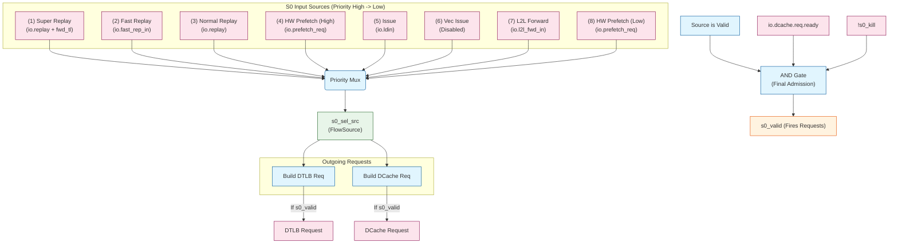

// See README.md for license details.

# LoadUnit S0 Stage (Source Selection + Request Issue)

This document focuses on LoadUnit S0 in `src/main/scala/xiangshan/mem/pipeline/LoadUnit.scala`.
It follows `commands/analysis_common.md` by showing data structures (with sizes), pipeline registers,
logic flow, and a detailed diagram of S0 source selection.

## Scope and References
- LoadUnit: `src/main/scala/xiangshan/mem/pipeline/LoadUnit.scala`
- Shared bundles: `src/main/scala/xiangshan/mem/MemCommon.scala`
- L1 prefetch req: `src/main/scala/xiangshan/mem/prefetch/L1PrefetchInterface.scala`

---

## Key Data Structures and Sizes Used in S0

### 1) `FlowSource` (local bundle inside `LoadUnit`)
A normalized source format used by the S0 priority mux.

| Signal | Type/Width | Meaning in S0 |
|---|---|---|
| `vaddr` | UInt(VAddrBits.W) | Selected virtual address for DTLB/DCache request. |
| `mask` | UInt((VLEN/8).W) | Byte mask based on load size (`genVWmask`). |
| `uop` | `MicroOp` | Full micro-op metadata (fuOpType, ROB idx, etc.) used for size/exception/debug. |
| `try_l2l` | Bool | S0 is attempting pointer-chasing (load-to-load). |
| `has_rob_entry` | Bool | Whether this request has a ROB entry (replays/prefetch may not). |
| `rsIdx` | UInt(log2Up(IssQueSize).W) | Issue queue index for feedback paths. |
| `rep_carry` | `ReplayCarry(nWays)` | Way-prediction carry for replayed access (see `ReplayCarry`). |
| `mshrid` | UInt(log2Up(cfg.nMissEntries).W) | Miss queue index for replayed loads. |
| `isFirstIssue` | Bool | True for first-issue load from RS (not replay). |
| `fast_rep` | Bool | This S0 request is a fast replay. |
| `ld_rep` | Bool | This S0 request is a normal replay from LSQ. |
| `l2l_fwd` | Bool | This request came from load-to-load forward path. |
| `prf` | Bool | This request is a prefetch. |
| `prf_rd` | Bool | Prefetch read (prefetch_r). |
| `prf_wr` | Bool | Prefetch write (prefetch_w). |
| `sched_idx` | UInt(log2Up(LoadQueueReplaySize+1).W) | Replay queue scheduler index. |

### 2) `ReplayCarry` (from `WPUWrapper.scala`)
Used to carry way prediction across replays.

| Signal | Type/Width | Meaning |
|---|---|---|
| `real_way_en` | UInt(nWays.W) | One-hot way enable captured from earlier access. |
| `valid` | Bool | Whether the carry is valid and should override prediction. |

### 3) `LqWriteBundle` (fast replay input)
Relevant S0 fields only (bundle is larger).

| Signal | Type/Width | Meaning in S0 |
|---|---|---|
| `vaddr` | UInt(VAddrBits.W) | Replay virtual address. |
| `mask` | UInt((VLEN/8).W) | Replay mask (already computed). |
| `uop` | `MicroOp` | Replay uop context. |
| `rsIdx` | UInt(log2Up(IssQueSize).W) | RS index for feedback. |
| `isLoadReplay` | Bool | Marks this as replayed load. |
| `rep_info.rep_carry` | `ReplayCarry(nWays)` | Way prediction carry for DCache. |
| `rep_info.mshr_id` | UInt(log2Up(cfg.nMissEntries).W) | MSHR index for miss replay. |
| `schedIndex` | UInt(log2Up(LoadQueueReplaySize).W) | Replay queue index. |

### 4) `LsPipelineBundle` (normal replay input)
Relevant S0 fields only.

| Signal | Type/Width | Meaning in S0 |
|---|---|---|
| `vaddr` | UInt(VAddrBits.W) | Replay virtual address. |
| `uop` | `MicroOp` | Replay uop context. |
| `rsIdx` | UInt(log2Up(IssQueSize).W) | RS index for feedback. |
| `replayCarry` | `ReplayCarry(nWays)` | Way prediction carry for DCache. |
| `mshrid` | UInt(log2Up(cfg.nMissEntries).W) | MSHR index for miss replay. |
| `schedIndex` | UInt(log2Up(LoadQueueReplaySize).W) | Replay queue index. |
| `forward_tlDchannel` | Bool | When true, marks "super replay" (highest priority). |

### 5) `ExuInput` (issue input from RS)
Relevant S0 fields only.

| Signal | Type/Width | Meaning in S0 |
|---|---|---|
| `src(0)` | UInt(XLEN.W) | Base address register. |
| `uop.ctrl.imm(11,0)` | UInt(12.W) | Address immediate offset. |
| `uop.ctrl.fuOpType` | UInt | Load opcode/type (size, prefetch). |
| `uop.robIdx` | `RobPtr` | Used for debug + exception tracking. |
| `uop.cf.pc` | UInt(VAddrBits.W) | PC for debug/trace. |

### 6) `L1PrefetchReq`
Used as an S0 source when `io.prefetch_req.valid`.

| Signal | Type/Width | Meaning in S0 |
|---|---|---|
| `paddr` | UInt(PAddrBits.W) | Physical address generated by prefetcher. |
| `alias` | UInt(2.W) | Index alias bits for `getVaddr()`. |
| `confidence` | UInt(1.W) | High/low confidence; controls priority. |
| `is_store` | Bool | Prefetch is write (`true`) or read (`false`). |
| `pf_source` | `L1PrefetchSource` | Tags L1 prefetch source type. |
| `getVaddr()` | UInt(VAddrBits.W) | `Cat(alias, paddr(DCacheSameVPAddrLength-1,0))`. |

### 7) `LoadToLoadIO` (pointer-chasing source)

| Signal | Type/Width | Meaning in S0 |
|---|---|---|
| `valid` | Bool | Enables pointer-chasing source. |
| `data` | UInt(XLEN.W) | Used as base for synthesized vaddr. |
| `dly_ld_err` | Bool | Delayed load error indicator. |

### 8) S0 pipeline register

| Register | Type | Role |
|---|---|---|
| `s0_out` | `LqWriteBundle` | Captures selected `FlowSource` fields and forwards to S1. |

---

## S0 Source Selection (Priority + Gating)
S0 arbitrates among multiple sources and builds one `FlowSource` via a priority mux.
There is no separate "unaligned buffer" input; alignment is checked on `s0_sel_src.vaddr`.

### Priority Order (high -> low)
1) Super replay (`io.replay` with `forward_tlDchannel`)
2) Fast replay (`io.fast_rep_in`)
3) Normal replay (`io.replay` without `forward_tlDchannel`)
4) HW prefetch (high confidence)
5) Int issue / software prefetch (`io.ldin`)
6) Vec issue (currently TODO, disabled)
7) Load-to-load forward (pointer chasing)
8) HW prefetch (low confidence)

### Gating (acceptance)
S0 only accepts a request when:
- Any source is valid
- `io.dcache.req.ready` is true
- `!s0_kill` (e.g., canceled ptr-chasing)

---

## S0 Stage as Tables (Sources, Logic, Registers, Requests)

### A) Source inputs (priority ordered)
| Source | Signal | What it carries | When request issued | Detailed comment |
|---|---|---|---|---|
| Super replay | `io.replay` with `forward_tlDchannel` | Replay from LSQ that is forwarding TL D-channel | Issued for cache-missed loads when L2 hint signals that D-channel data is arriving, enabling direct MSHR-to-pipeline forwarding to avoid double cache access (refill write + replay read). | Highest priority ensures load enters S0 at precisely the right time to catch D-channel data in S1/S2, eliminating cache read latency. Blocking cleared predictively by L2 hint 2-3 cycles before data arrival. |
| Fast replay | `io.fast_rep_in` | Replayed `LqWriteBundle` from fast path | Issued for loads requiring quick retry due to transient resource conflicts or scheduling issues. | Supplies already-formed replay info; sets `fast_rep = true` in `FlowSource`. Second-highest priority for rapid turnaround. |
| Normal replay | `io.replay` | Standard replay from LSQ | Issued when replay queue unblocks a load (dependency satisfied: TLB refilled, store data ready, forward path clear, RAR/RAW queue space available, etc.). | Produces `FlowSource` with `ld_rep = true` and `replayCarry` for DCache way prediction. Reactive blocking clearance when resource becomes available. |
| HW prefetch (high conf) | `io.prefetch_req` with `confidence > 0` | Prefetch paddr/alias, source tag | Issued when hardware prefetcher generates high-confidence prediction and no replays are pending. | Injects prefetch as a load-like request; drives DTLB using physical address (no translation needed). Prioritized over normal issue to warm cache proactively. |
| Int issue / SW prefetch | `io.ldin` | Load issue from RS | Issued when reservation station dispatches a new load or software prefetch instruction (first-time execution, not replay). | First-issue load; builds vaddr from `src(0)` + `imm`. This is the normal path for new loads entering the pipeline. |
| Vec issue (TODO) | (disabled) | Placeholder | Not currently issued (feature disabled). | Currently `s0_vec_iss_valid := false`. Reserved for future vector load support. |
| Load-to-load forward | `io.l2l_fwd_in` | Pointer-chasing address (from prior load data) | Issued when pointer-chasing optimization detects a dependent load chain and forwards the previous load's data as the next load's base address. | Synthesizes vaddr from load data for fast dependent access; may be canceled by `s0_kill` if speculation fails. |
| HW prefetch (low conf) | `io.prefetch_req` with `confidence == 0` | Prefetch paddr/alias, source tag | Issued when hardware prefetcher generates low-confidence prediction and all other sources are idle. | Lowest priority; only injected when no other source is valid. Opportunistic prefetching to fill idle pipeline slots. |

### B) S0 selection and gating logic
| Logic block | Signal(s) | Purpose | Detailed comment |
|---|---|---|---|
| Ready chain | `s0_*_ready` | Enforces strict priority | Lower-priority sources are only “ready” if all higher-priority sources are idle. |
| Priority mux | `ParallelPriorityMux` | Builds `FlowSource` | Uses one-hot select vector from `s0_*_select` to map to `from*Source(...)`. |
| Valid gate | `s0_valid` | S0 admission | True only if any source valid, `io.dcache.req.ready`, and not killed. |
| Kill | `s0_kill` | Cancel S0 | Used for ptr-chasing cancel path; blocks `s0_valid`. |

### C) S0 pipeline register
| Register | Type | Captured fields | Detailed comment |
|---|---|---|---|
| `s0_out` | `LqWriteBundle` | `vaddr`, `mask`, `uop`, replay flags, etc. | Carries the selected request into S1; it is built from `s0_sel_src` and includes align check info. |

### D) S0 outgoing requests
| Request | Driven by | Fields | Detailed comment |
|---|---|---|---|
| DTLB req | `s0_valid` + `s0_sel_src` | `cmd`, `vaddr`, `size`, `memidx`, `pc` | Uses prefetch paddr when HW prefetch is selected; otherwise uses `s0_sel_src.vaddr`. |
| DCache req | `s0_valid` + `s0_sel_src` | `cmd`, `vaddr`, `mask`, `replayCarry` | Opcode depends on prefetch read/write vs normal load; `replayCarry` is used for way prediction. |
| Prefetch tag | `s0_sel_src` | `pf_source` | Tags the DCache request when a HW prefetch is selected. |

### E) Key interactions (edges)
| From | To | Meaning | Detailed comment |
|---|---|---|---|
| Any source | Ready chain | Priority gating | Ensures strict ordering among sources before select. |
| Ready chain | Priority mux | Select enable | Generates `s0_*_select` one-hots for mux. |
| Priority mux | `s0_out` | Register capture | Selected `FlowSource` becomes the S0 pipeline payload. |
| `s0_valid` | DTLB/DCache | Issue request | If S0 admitted, requests fire in the same cycle. |

### Interaction notes (S0 -> DTLB/DCache)
- DTLB request uses `s0_sel_src.vaddr`, except HW prefetch uses `io.prefetch_req.bits.paddr` (no-translate).
- DCache request uses `s0_sel_src.vaddr`, `s0_sel_src.mask`, and chooses opcode:
  - prefetch read: `M_PFR`
  - prefetch write: `M_PFW`
  - normal load: `M_XRD`
- `io.dcache.pf_source` tags the request when a HW prefetch is selected.

---

## Pseudocode (S0 selection + request issue)

```text
valid_sources = [super_replay, fast_replay, replay, prf_hi, issue, vec, l2l, prf_lo]
if any(valid_sources) and dcache_ready and not kill:
  s0_sel = priority_mux(valid_sources)
  s0_reg = build_flow_source(s0_sel)
  send_dtlb_req(s0_reg)
  send_dcache_req(s0_reg)
```

### Mapping to signal names (for code trace)
- Valid signals: `s0_super_ld_rep_valid`, `s0_ld_fast_rep_valid`, `s0_ld_rep_valid`,
  `s0_high_conf_prf_valid`, `s0_int_iss_valid`, `s0_vec_iss_valid`, `s0_l2l_fwd_valid`, `s0_low_conf_prf_valid`
- Select signals: `s0_super_ld_rep_select`, `s0_ld_fast_rep_select`, `s0_ld_rep_select`,
  `s0_hw_prf_select`, `s0_int_iss_select`, `s0_vec_iss_select`, `s0_l2l_fwd_select`
- Resulting mux output: `s0_sel_src` (type `FlowSource`)

---

## Notes and Edge Cases
- **Vec issue** is currently disabled (`s0_vec_iss_valid := false`).
- **Pointer chasing** uses `LoadToLoadIO` to synthesize `vaddr`, and can be canceled (`s0_kill`).
- **Replay stall** (`s0_rep_stall`) can block normal replay when younger than in-flight issue.
- **DCache readiness** is a hard gate; when `io.dcache.req.ready` is low, S0 does not accept any source.

---
## Mux-Level Diagram

