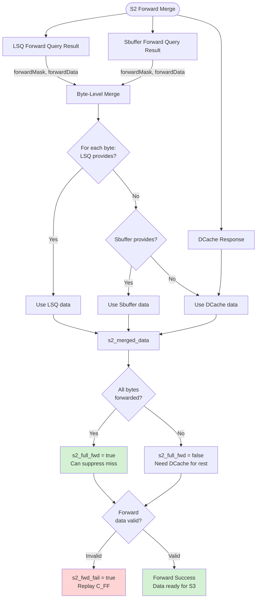
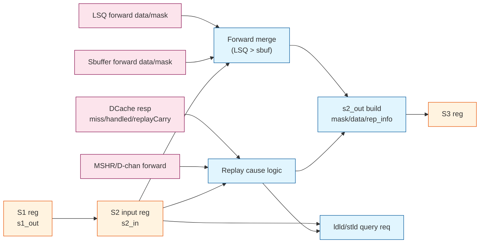

// See README.md for license details.

# LoadUnit S2 Stage (DCache Resp + Forward Merge + Replay Decision)

This report focuses on LoadUnit S2 in `src/main/scala/xiangshan/mem/pipeline/LoadUnit.scala`.
It follows the same style as `loadpipe_S0.md` and `loadpipe_S1.md`.

## Scope and References
- LoadUnit: `src/main/scala/xiangshan/mem/pipeline/LoadUnit.scala`
- Replay causes: `src/main/scala/xiangshan/mem/lsqueue/LoadQueueReplay.scala`
- Shared bundles: `src/main/scala/xiangshan/mem/MemCommon.scala`

---

## S2 Stage Summary
S2 consumes the S1 pipeline register (`s2_in`), takes DCache responses and
LSQ/sbuffer forward data, determines exceptions/mmio/forwarding success,
and generates replay cause bits. It also issues ld-ld and st-ld violation
queries (for fast recovery) and prepares `s2_out` for S3.

---

## Key Inputs and Outputs (Tables)

### A) S2 input sources
| Source | Signal(s) | Type | Meaning in S2 |
|---|---|---|---|
| S1 pipeline reg | `s2_in` | `LqWriteBundle` | Registered S1 payload (paddr, mask, uop, etc.). |
| DCache resp | `io.dcache.resp` | DCache load resp | Miss/handled/replayCarry/mshr_id/tag_error, etc. |
| LSQ forward | `io.lsq.forward` | `PipeLoadForwardQueryIO` | Forward mask/data + invalid flags. |
| Sbuffer forward | `io.sbuffer` | `LoadForwardQueryIO` | Forward mask/data for committed stores. |
| D-channel forward | `io.tl_d_channel` | DCache forward | Forward data from TL D channel (refill). |
| MSHR forward | `io.forward_mshr` | Missqueue fwd | Forward data from miss queue. |
| PMP | `io.pmp` | PMP resp | Access permissions and MMIO classification. |
| Redirect | `io.redirect` | Valid redirect | Flush for in-flight uop. |
| CSR | `io.csrCtrl` | CustomCSR | Cache error enable gating. |

### B) S2 internal control signals
| Signal | Type | Meaning |
|---|---|---|
| `s2_valid` | Reg Bool | S2 pipeline valid bit. |
| `s2_kill` | Bool | Kill S2 on redirect. |
| `s2_fire` | Bool | `s2_valid && !s2_kill && s2_can_go`. |
| `s2_exception_vec` | Vec | Updated exception vector for S2. |
| `s2_exception` | Bool | Exception after masking (pf/af/pmp/tag_error). |
| `s2_mmio` | Bool | MMIO (from PMP) when not prefetch/exception/tlbMiss. |
| `s2_troublem` | Bool | True if normal replay-eligible load. |
| `s2_full_fwd` | Bool | All requested bytes forwarded (LSQ or sbuffer). |
| `s2_dcache_miss` | Bool | DCache miss after fwd/mshr checks. |
| `s2_fwd_fail` | Bool | Forward data invalid (replay). |
| `s2_fast_rep` | Bool | Conditions for fast replay in S2. |

### C) S2 outputs and side effects
| Output | Signal(s) | Type | Meaning |
|---|---|---|---|
| LSQ ld-ld query | `io.lsq.ldld_nuke_query.req` | Decoupled | Check for load-load violation. |
| LSQ st-ld query | `io.lsq.stld_nuke_query.req` | Decoupled | Check for store-load violation. |
| Replay metadata | `s2_out.rep_info.*` | Bundle | Replay cause bits + indices. |
| Forward merge | `s2_out.forwardMask/Data` | Vec | Final forward mask/data into S3. |
| Miss tracking | `s2_out.miss` | Bool | DCache miss (trouble path). |
| MSHR handled | `s2_out.handledByMSHR` | Bool | DCache handled response. |

---

## S2 Bundle Details (Tables)

### 1) Replay causes (from `LoadReplayCauses`)
This table explains each replay cause, how it is detected in S2, and whether it can lead to *fast replay*.

| Cause bit | Signal in S2 | Meaning | Typical trigger | Fast replay? |
|---|---|---|---|---|
| `C_MA` | `mem_amb` | Memory ambiguity (store-set hit but store addr not ready). | `storeSetHit && io.lsq.forward.addrInvalid` | No (blocks `s2_fast_rep`). |
| `C_TM` | `tlb_miss` | TLB miss. | `s2_in.tlbMiss` | No. |
| `C_FF` | `fwd_fail` | Forward data invalid. | `io.lsq.forward.dataInvalid` | No. |
| `C_DR` | `dcache_rep` | DCache replay/NACK (resource retry). | `io.dcache.s2_mq_nack` | Yes (part of `s2_dcache_fast_rep`). |
| `C_DM` | `dcache_miss` | Real DCache miss (needs MSHR/refill). | `io.dcache.resp.bits.miss` and not fully forwarded | No (slow replay via miss handling). |
| `C_WF` | `wpu_fail` | Way prediction failure. | `io.dcache.s2_wpu_pred_fail` | Yes (part of `s2_dcache_fast_rep`). |
| `C_BC` | `bank_conflict` | DCache bank conflict. | `io.dcache.s2_bank_conflict` | Yes (part of `s2_dcache_fast_rep`). |
| `C_RAR` | `rar_nack` | Ld-ld query not accepted. | `ldld_nuke_query.req.valid && !ready` | No. |
| `C_RAW` | `raw_nack` | St-ld query not accepted. | `stld_nuke_query.req.valid && !ready` | No. |
| `C_NK` | `nuke` | Store-load violation detected. | `stld_nuke_query` compare or `s1_in.rep_info.nuke` | Sometimes (only in `s2_nuke_fast_rep`). |

#### C_DR vs C_DM (why they are different)
- `C_DR` (dcache_rep) means **the cache asked for a replay** due to resource/port pressure (mq_nack). It does **not** necessarily mean a miss. This is why it can be eligible for fast replay.
- `C_DM` (dcache_miss) means **a real cache miss** that requires miss handling/refill. This is **not** fast replay.

#### Fast replay vs slow replay in S2
S2 computes a **fast replay** candidate:
```text
s2_fast_rep = !mem_amb && !tlb_miss && !fwd_fail &&
              (dcache_fast_rep || nuke_fast_rep) && s2_troublem
```
Where:
- `dcache_fast_rep` covers `mq_nack` and (bank_conflict or wpu_fail) without miss.
- `nuke_fast_rep` covers store-load violation only when there is **no** miss, nq/nack, or bank conflict.

If `s2_fast_rep` is not true but any replay cause is set, the load takes the **slow replay** path via LSQ replay queue (`rep_info.need_rep` gates S3 writeback).

### 2) `s2_out.rep_info` fields populated in S2
| Field | Source | Meaning |
|---|---|---|
| `mem_amb` | `s2_mem_amb` | Ambiguous store-set hazard. |
| `tlb_miss` | `s2_tlb_miss` | TLB miss in S2. |
| `fwd_fail` | `s2_fwd_fail` | Forwarding failure. |
| `dcache_rep` | `s2_mq_nack` | DCache replay/NACK. |
| `dcache_miss` | `s2_dcache_miss` | DCache miss. |
| `bank_conflict` | `s2_bank_conflict` | Bank conflict. |
| `wpu_fail` | `s2_wpu_pred_fail` | Way predictor fail. |
| `rar_nack` | `s2_rar_nack` | Ld-ld query not ready. |
| `raw_nack` | `s2_raw_nack` | St-ld query not ready. |
| `nuke` | `s2_nuke` | Store-load violation. |
| `full_fwd` | `s2_data_fwded` | Forward data satisfied missing line. |
| `data_inv_sq_idx` | `io.lsq.forward.dataInvalidSqIdx` | SQ index for missing data. |
| `addr_inv_sq_idx` | `io.lsq.forward.addrInvalidSqIdx` | SQ index for missing address. |
| `rep_carry` | `io.dcache.resp.bits.replayCarry` | Way carry for replay. |
| `mshr_id` | `io.dcache.resp.bits.mshr_id` | Miss queue ID. |
| `last_beat` | `s2_in.paddr(log2Up(refillBytes))` | Last beat indicator. |
| `tlb_id` | `io.tlb_hint.id` | TLB filter ID. |
| `tlb_full` | `io.tlb_hint.full` | TLB filter full. |

---

## S2 Core Logic (Code Snippets)

### 1) S2 valid/ready and register capture
```scala
s2_ready := !s2_valid || s2_kill || s3_ready
when (s1_fire) { s2_valid := true.B }
.elsewhen (s2_fire) { s2_valid := false.B }
.elsewhen (s2_kill) { s2_valid := false.B }
s2_in := RegEnable(s1_out, s1_fire)
```

### 2) Exception / MMIO handling
```scala
val s2_exception_vec = WireInit(s2_in.uop.cf.exceptionVec)
when (!s2_in.delayedLoadError) {
  s2_exception_vec(loadAccessFault) := s2_in.uop.cf.exceptionVec(loadAccessFault) ||
                                       s2_pmp.ld ||
                                       (io.dcache.resp.bits.tag_error && RegNext(io.csrCtrl.cache_error_enable))
}
when (!s2_in.delayedLoadError && (s2_prf || s2_in.tlbMiss)) {
  s2_exception_vec := 0.U.asTypeOf(s2_exception_vec.cloneType)
}
val s2_exception = ExceptionNO.selectByFu(s2_exception_vec, lduCfg).asUInt.orR
val s2_mmio = !s2_prf && s2_pmp.mmio && !s2_exception && !s2_in.tlbMiss
```

### 3) Forward merge (LSQ has priority over sbuffer)
```scala
s2_fwd_mask(i) := io.lsq.forward.forwardMask(i) || io.sbuffer.forwardMask(i)
s2_fwd_data(i) := Mux(io.lsq.forward.forwardMask(i),
                      io.lsq.forward.forwardData(i),
                      io.sbuffer.forwardData(i))
```

### 3.1) Forward response detail (LSQ vs Sbuffer)

**Why two sources?**
- **LSQ forward** contains *younger, in-flight stores* (store queue) that may not be committed yet.
- **Sbuffer forward** contains *committed stores* already in the store buffer (on the way to DCache).

The load must see the **most recent store** in program order. Therefore LSQ has priority over sbuffer when both match.

#### LSQ forward response (from `PipeLoadForwardQueryIO`)
| Signal | Meaning in S2 | Hazard resolved |
|---|---|---|
| `forwardMask` | Per-byte match mask for SQ data | RAW hazard to in-flight stores |
| `forwardData` | Per-byte data from SQ | Data forwarding for matching store |
| `dataInvalid` | Address matched, but store data not ready | **Replay** until data arrives |
| `addrInvalid` | Address not ready for store-set hit | **Memory ambiguity** replay (`mem_amb`) |
| `matchInvalid` | vaddr/paddr CAM mismatch | Micro-arch exception (flush later) |
| `dataInvalidSqIdx` | SQ index with missing data | Precise replay targeting |
| `addrInvalidSqIdx` | SQ index with missing addr | Precise replay targeting |

#### Sbuffer forward response (from `LoadForwardQueryIO`)
| Signal | Meaning in S2 | Hazard resolved |
|---|---|---|
| `forwardMask` | Per-byte match mask from sbuffer | RAW hazard to committed stores |
| `forwardData` | Per-byte data from sbuffer | Data forwarding when DCache misses |
| `matchInvalid` | vaddr/paddr CAM mismatch | Triggers flush path in S3 |

#### Forward merge mechanism (byte-level)
- A per-byte mask is formed by **OR** of LSQ and sbuffer masks.
- For each byte, **LSQ wins** if it provides data (`forwardMask(i)` high), else sbuffer data is used.
- `s2_full_fwd` checks if *all bytes required by load mask* are satisfied.

### 3.2) Hazards and conflicts resolved in S2
S2 forwarding logic addresses these hazards:
- **RAW with in-flight store** (store data not yet in DCache): LSQ forwarding provides latest data.
- **RAW with committed store (sbuffer)**: sbuffer forwarding provides data without waiting for DCache writeback.
- **Store address/data not ready**: `addrInvalid`/`dataInvalid` signals trigger replay.
- **Memory ambiguity** (store-set hit): `s2_mem_amb` set when store-set indicates hazard and addr is not ready.
- **Mis-match between vaddr/paddr CAMs**: `matchInvalid` flags cause flush/replay in later stage.

### 3.3) Replay triggers tied to forward path
| Condition | Signal(s) | Effect |
|---|---|---|
| Store data missing | `io.lsq.forward.dataInvalid` | `s2_fwd_fail` -> replay cause `C_FF` |
| Store addr missing | `io.lsq.forward.addrInvalid` | `s2_mem_amb` -> replay cause `C_MA` |
| CAM mismatch | `io.lsq.forward.matchInvalid` or `io.sbuffer.matchInvalid` | Flush/replay in S3 (`rep_frm_fetch`) |
| Forward covers miss | `s2_full_fwd` | May suppress DCache miss handling |

### 3.4) Forward Merge: Detailed Algorithm

This section provides an in-depth explanation of how S2 merges forwarded data from multiple sources (LSQ, sbuffer, DCache) to satisfy a load's data requirements.

#### Problem Statement

A load in S2 may receive data from three sources:
1. **LSQ (Store Queue)**: In-flight stores (not yet committed)
2. **Sbuffer (Store Buffer)**: Committed stores (waiting to write to DCache)
3. **DCache**: Cached data from previous memory operations

The challenge is to determine which source provides the **most recent data** for each byte of the load, respecting program order and memory consistency.

#### Source Priority (Per-Byte)

For each byte requested by the load, the priority order is:

```
1. LSQ forward     (highest - youngest in-flight store)
2. Sbuffer forward (middle - committed store not yet in cache)
3. DCache data     (lowest - data already in cache)
```

**Rationale**: Memory consistency requires seeing the most recent store in program order. In-flight stores are younger than committed stores, which are younger than cached data.

#### Data Structures

**Load mask** (`s2_in.mask`): Per-byte mask indicating which bytes the load needs
- Type: `UInt((VLEN/8).W)` (e.g., 16 bits for 128-bit VLEN)
- Example: `0x000F` for a 4-byte load at offset 0

**LSQ forward response**:
- `forwardMask`: `Vec(VLEN/8, Bool())` - Which bytes LSQ can provide
- `forwardData`: `Vec(VLEN/8, UInt(8.W))` - Data for each byte

**Sbuffer forward response**:
- `forwardMask`: `Vec(VLEN/8, Bool())` - Which bytes sbuffer can provide
- `forwardData`: `Vec(VLEN/8, UInt(8.W))` - Data for each byte

**DCache response**:
- `data`: `UInt(VLEN.W)` - Full cache line data (or relevant portion)

#### Algorithm: Byte-Level Merge

**Step 1: Merge LSQ and Sbuffer Masks**

For each byte `i` in `0 until VLEN/8`:

```scala
s2_fwd_mask(i) = io.lsq.forward.forwardMask(i) || io.sbuffer.forwardMask(i)
```

**Meaning**: A byte is "forwarded" if either LSQ or sbuffer can provide it.

**Step 2: Prioritize LSQ over Sbuffer Data**

For each byte `i`:

```scala
s2_fwd_data(i) = Mux(io.lsq.forward.forwardMask(i),
                     io.lsq.forward.forwardData(i),  // LSQ has priority
                     io.sbuffer.forwardData(i))      // Use sbuffer if LSQ doesn't provide
```

**Key insight**: Even if both LSQ and sbuffer provide data for byte `i`, **LSQ wins** because it contains younger (more recent) stores.

**Step 3: Determine Full vs Partial Forward**

```scala
val s2_fwd_mask_vec = VecInit(s2_fwd_mask.asBools)
val s2_load_mask_vec = VecInit(s2_in.mask.asBools)

// Check if all requested bytes are forwarded
val s2_full_fwd = (0 until VLEN/8).map { i =>
  !s2_load_mask_vec(i) || s2_fwd_mask_vec(i)  // Either not needed, or forwarded
}.reduce(_ && _)
```

**Meaning**:
- If load needs byte `i` (`load_mask(i) = 1`), it must be forwarded (`fwd_mask(i) = 1`)
- If all needed bytes are forwarded, `s2_full_fwd = true`

**Step 4: Merge Forward Data with DCache Data**

For each byte `i`:

```scala
s2_merged_data(i) = Mux(s2_fwd_mask(i),
                        s2_fwd_data(i),           // Use forwarded data if available
                        io.dcache.resp.bits.data(8*i+7, 8*i))  // Else use DCache
```

**Final result**: `s2_merged_data` contains the most recent data for each byte, respecting program order.

#### Full Forward vs Partial Forward

**Full forward** (`s2_full_fwd = true`):
- **All** bytes requested by the load are satisfied by LSQ or sbuffer
- DCache data is **ignored** (may even be stale or missing)
- **Implication**: Even if DCache misses, the load can complete successfully

**Partial forward** (`s2_full_fwd = false`):
- **Some** bytes are forwarded, but others need DCache data
- **Implication**: DCache must provide valid data for non-forwarded bytes
- If DCache misses on non-forwarded bytes → replay with cause `C_DM`

#### Example: 4-Byte Load with Partial Forward

**Scenario**:
- Load address: `0x1000`, size: 4 bytes
- Load mask: `0x000F` (bytes 0-3)
- LSQ has a 2-byte store to `0x1000` (bytes 0-1)
- DCache has stale data for bytes 2-3

**Forward masks**:
```
Byte:          0    1    2    3    4    5    ...
Load mask:     1    1    1    1    0    0    ...
LSQ mask:      1    1    0    0    0    0    ...
Sbuffer mask:  0    0    0    0    0    0    ...
Merged fwd:    1    1    0    0    0    0    ...
```

**Forward check**:
```
s2_full_fwd = false  (bytes 2-3 not forwarded, but needed)
```

**Data merge**:
```
Byte 0: LSQ.forwardData(0)         (from in-flight store)
Byte 1: LSQ.forwardData(1)         (from in-flight store)
Byte 2: DCache.data(23:16)         (from cache - must be valid!)
Byte 3: DCache.data(31:24)         (from cache - must be valid!)
```

**Outcome**:
- If DCache has valid data for bytes 2-3 → Load succeeds
- If DCache misses → Must replay (cannot complete with partial forward)

#### Example: 8-Byte Load with Full Forward

**Scenario**:
- Load address: `0x2000`, size: 8 bytes
- Load mask: `0x00FF` (bytes 0-7)
- LSQ has a 4-byte store to `0x2000` (bytes 0-3)
- Sbuffer has a 4-byte store to `0x2004` (bytes 4-7)
- DCache misses (no valid data)

**Forward masks**:
```
Byte:          0    1    2    3    4    5    6    7    ...
Load mask:     1    1    1    1    1    1    1    1    ...
LSQ mask:      1    1    1    1    0    0    0    0    ...
Sbuffer mask:  0    0    0    0    1    1    1    1    ...
Merged fwd:    1    1    1    1    1    1    1    1    ...
```

**Forward check**:
```
s2_full_fwd = true  (all bytes forwarded)
```

**Data merge**:
```
Byte 0-3: LSQ.forwardData(0-3)      (from in-flight store)
Byte 4-7: Sbuffer.forwardData(4-7)  (from committed store)
DCache data: IGNORED (full forward satisfied load)
```

**Outcome**:
- Load completes successfully even though DCache missed
- `s2_dcache_miss` may still be true, but it's suppressed by `s2_full_fwd`
- No replay needed

#### Handling Invalid Forward Data

**Problem**: LSQ may match the load's address but store data isn't ready yet.

**Detection** (in S2):
```scala
val s2_fwd_fail = io.lsq.forward.dataInvalid
```

**Effect**:
- Even if `forwardMask` shows bytes are available, data isn't valid
- Load cannot use forwarded data
- **Replay required** with cause `C_FF` (forward fail)

**Why this happens**:
- Store address is known (computed in store pipeline S1)
- Store data isn't computed yet (waiting for ALU/memory)
- Load query hits the address match, but data isn't ready

**Blocking**:
```scala
val s2_troublem = !s2_exception && !s2_mmio && !s2_prf && !s2_in.delayedLoadError
s2_out.rep_info.fwd_fail := s2_fwd_fail && s2_troublem
```

**Replay path**: Slow replay, waits for store data to become ready (see `doc/memblock/replay.md`).

#### Interaction with DCache Miss Handling

**Case 1: Full forward + DCache miss**
```scala
val s2_dcache_miss_actual = io.dcache.resp.bits.miss
val s2_full_fwd = (all bytes forwarded)

// Suppress miss if fully forwarded
val s2_dcache_miss = s2_dcache_miss_actual && !s2_full_fwd
```

**Result**: Load completes without waiting for cache refill.

**Case 2: Partial forward + DCache miss**
```scala
val s2_full_fwd = false  (some bytes need DCache)
val s2_dcache_miss = true
```

**Result**: Must replay and wait for cache refill (forward doesn't help).

**Case 3: No forward + DCache hit**
```scala
val s2_full_fwd = false
val s2_dcache_miss = false
```

**Result**: Use DCache data exclusively, load completes.

#### Store-Load Forwarding Conflicts

**Conflict 1: Multiple stores match**
- LSQ searches all younger stores in program order
- **Youngest match wins** (closest to load in program order)
- CAM (Content-Addressable Memory) logic handles this internally

**Conflict 2: Partial overlap**
```
Store 1: 0x1000, size 2 (bytes 0-1)
Store 2: 0x1002, size 2 (bytes 2-3)
Load:    0x1000, size 4 (bytes 0-3)
```

**Resolution**:
- Byte 0-1: Forward from Store 1
- Byte 2-3: Forward from Store 2
- Perfect merge, no conflict

**Conflict 3: Store-set ambiguity**
```scala
val s2_mem_amb = io.lsq.forward.addrInvalid
```

**Meaning**: Store-set predictor says there's a hazard, but store address isn't ready.

**Effect**: Cannot forward (don't know which store to forward from), must replay with cause `C_MA`.

#### Forwarding Performance Impact

**Without forwarding**:
- Load must wait for store to commit and write to DCache
- Latency: ~20-30 cycles (store commit + DCache write + load retry)

**With forwarding**:
- Load gets data directly from store queue/buffer
- Latency: ~0 extra cycles (forwarding happens in parallel with DCache access)

**Full forward on miss**:
- Avoids cache miss penalty entirely
- Saves: L2 access latency (~20 cycles)

**Example savings**:
```
Workload: 10% of loads can fully forward on DCache miss
L2 latency: 20 cycles
Speedup: 0.10 * 20 = 2 cycles per instruction reduction
For CPI=1.0 baseline → CPI=0.98 (2% improvement)
```

#### Edge Cases

**Edge case 1: Forwarding from flushed store**
- Store gets flushed (redirect) after providing forward data
- **Mitigation**: Load also gets flushed (younger than store's flush point)
- **Result**: Both load and store re-execute, no consistency violation

**Edge case 2: Vaddr/paddr CAM mismatch**
```scala
val s2_vp_match_fail = io.lsq.forward.matchInvalid || io.sbuffer.matchInvalid
```

**Cause**: Virtual address matched, but physical address didn't (or vice versa)

**Effect**:
- Forward data is **invalid** (wrong address match)
- Must flush and replay (`s3_rep_frm_fetch`)
- Treated as microarchitectural exception

**Edge case 3: ECC error in forwarded data**
- Sbuffer data can have ECC errors (rare)
- Detected in S3 when data is checked
- **Effect**: Trigger delayed load error, suppress writeback

#### Visualization: Forward Merge Flow



#### Summary: Forward Merge Algorithm

1. **Query** (S1): Send load address/mask to LSQ and sbuffer
2. **Response** (S2): Receive per-byte masks and data from both sources
3. **Prioritize** (S2): For each byte, LSQ > Sbuffer > DCache
4. **Merge** (S2): Combine forwarded bytes with DCache bytes
5. **Validate** (S2): Check if forward data is actually valid
6. **Decide** (S2):
   - Full forward + valid → Complete load (even on DCache miss)
   - Partial forward + valid → Need DCache for remaining bytes
   - Invalid forward → Replay with C_FF

**Key insight**: Forward merge enables **zero-latency forwarding** from stores to loads, eliminating the need to wait for stores to commit and write to DCache. This is critical for performance in code with frequent store-load sequences (e.g., stack operations, data structure updates).

### 4) Replay cause gating
```scala
val s2_troublem = !s2_exception && !s2_mmio && !s2_prf && !s2_in.delayedLoadError
s2_out.rep_info.dcache_miss := s2_dcache_miss && s2_troublem
s2_out.rep_info.nuke        := s2_nuke && s2_troublem
```

---

## S2 Block Diagram (Mux-Level)


---

## S2 Sequence (Cycle-Level Order)
| Step | Phase | Action | Detailed explanation |
|---|---|---|---|
| 1 | Register | `s2_in` captures `s1_out` | S2 latches paddr, mask, uop, and replay metadata from S1. `s2_valid` is set when `s1_fire` is true, and cleared on `s2_fire` or `s2_kill` (redirect). |
| 2 | DCache resp | Observe `io.dcache.resp` + tag_error | DCache response is always `ready`. Miss/NACK/bank_conflict/WPU flags are sampled and later gated by forward success. Tag error is only counted when `cache_error_enable` is set. |
| 3 | Forward merge | Merge LSQ + sbuffer forward masks/data into `s2_fwd_mask/data` | LSQ forward results (younger in-flight stores) have per-byte priority over sbuffer (committed stores). `s2_full_fwd` checks that **all bytes required by the load mask** are forwarded. |
| 4 | Exception/MMIO | Compute `s2_exception_vec` and `s2_mmio` | PMP and tag_error can add `loadAccessFault`. Prefetch or TLB miss clears exceptions. `s2_mmio` is asserted only when not prefetch, not exception, and not tlbMiss. |
| 5 | Replay cause eval | Compute `s2_*` causes and `s2_troublem` | `s2_troublem` gates replay (must be normal, non-mmio, non-prefetch, no delayed error). `s2_dcache_miss`/`s2_mq_nack`/`s2_bank_conflict`/`s2_wpu_pred_fail` are ignored if full forward exists. |
| 6 | Violation queries | Issue ld-ld and st-ld query reqs | Requests are fired only when `s2_can_query` is true (no mem_amb, tlb_miss, fwd_fail, and in trouble path). Backpressure on these reqs becomes `C_RAR` or `C_RAW`. |
| 7 | Output build | Fill `s2_out` and `rep_info` | `s2_out` carries final forward mask/data, miss flag, `handledByMSHR`, and replay causes. `rep_info.need_rep` is derived in S3 to gate writeback. |

---

## Notes and Edge Cases
- `s2_nuke` is OR'ed with `s1_in.rep_info.nuke`, so an S1 nuke persists into S2.
- Replay causes are masked by `s2_troublem` (exception/mmio/prefetch/delayed error blocks replay).
- `s2_dcache_should_resp` asserts that DCache does not lose responses; a missing resp is a hard assert.
- `s2_full_fwd` allows some miss cases to be satisfied entirely by forward data.
- `s2_mmio` loads skip normal replay and will take the uncache path later.
