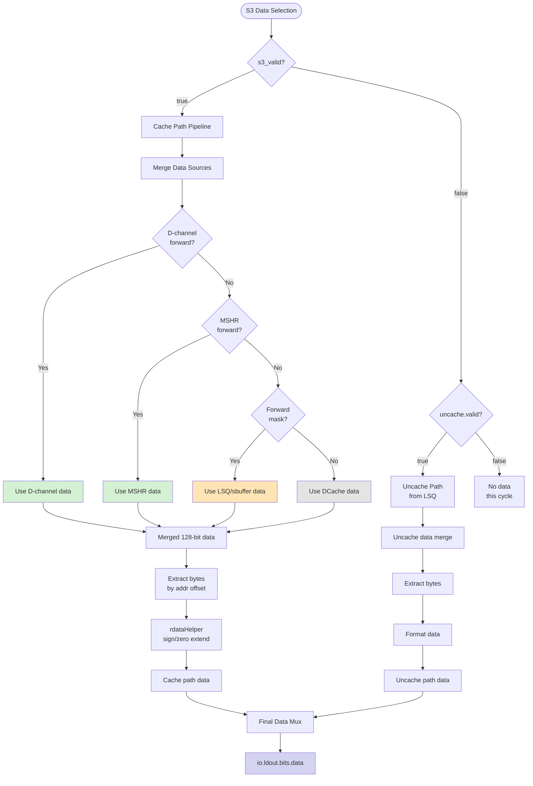
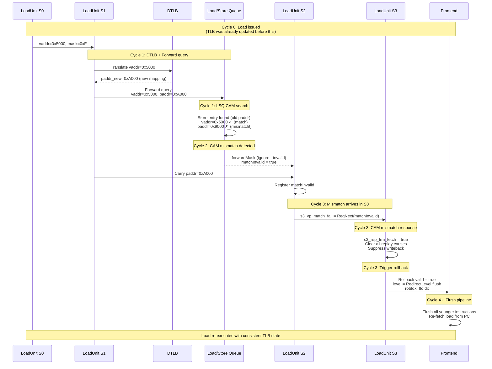
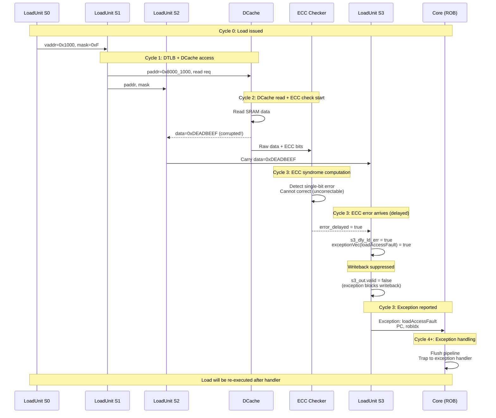
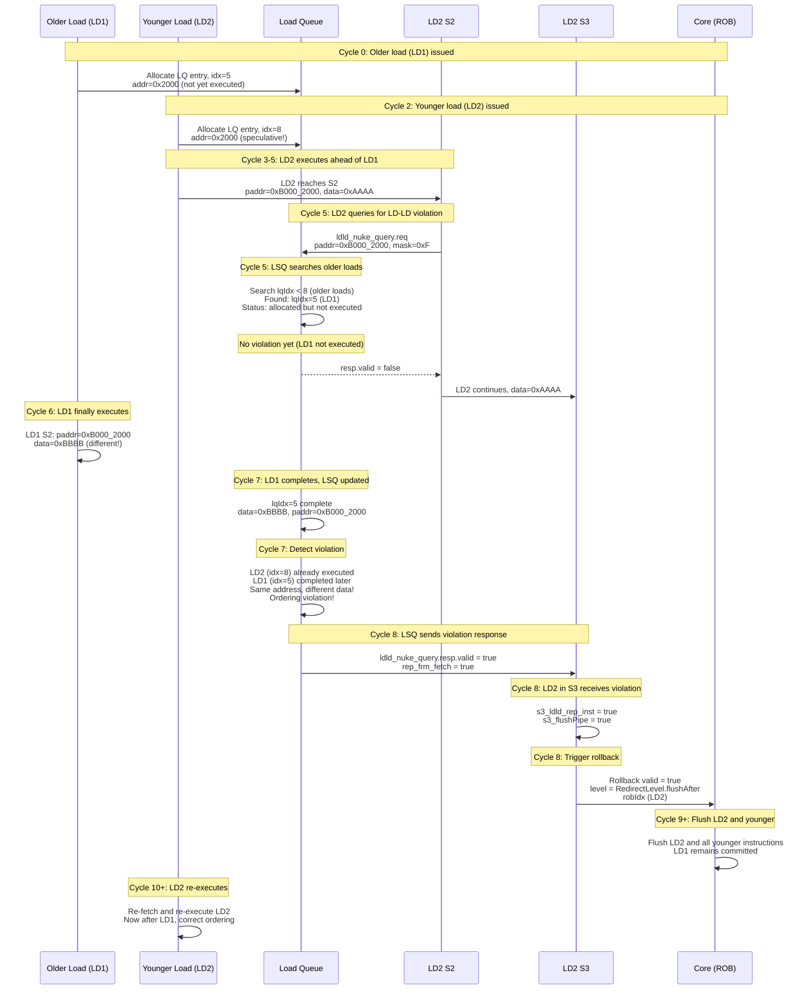
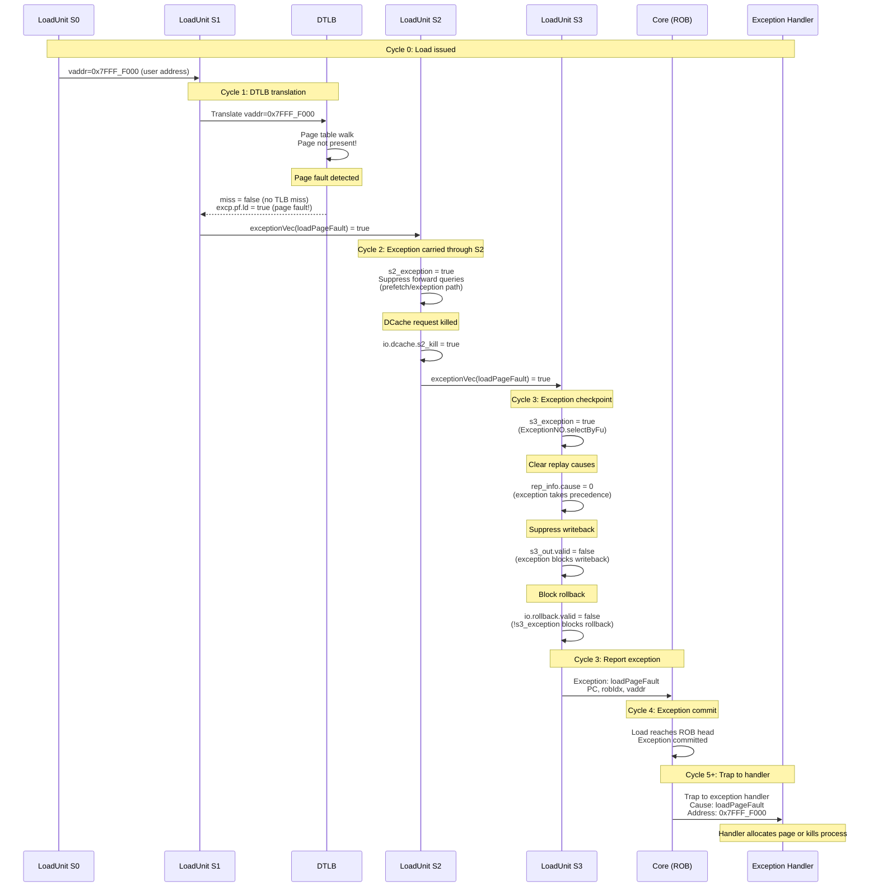
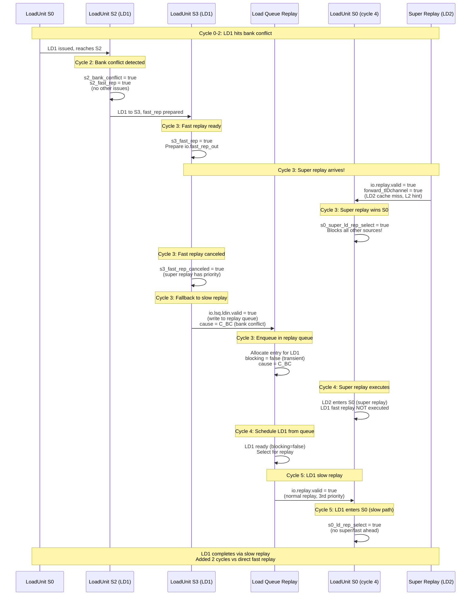
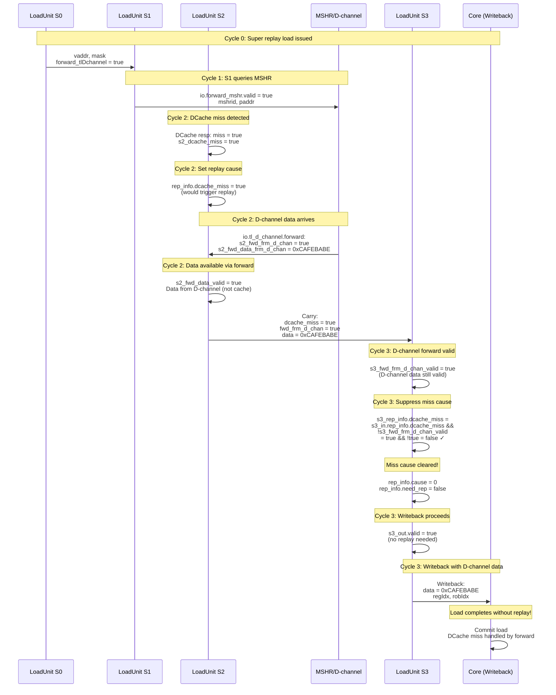
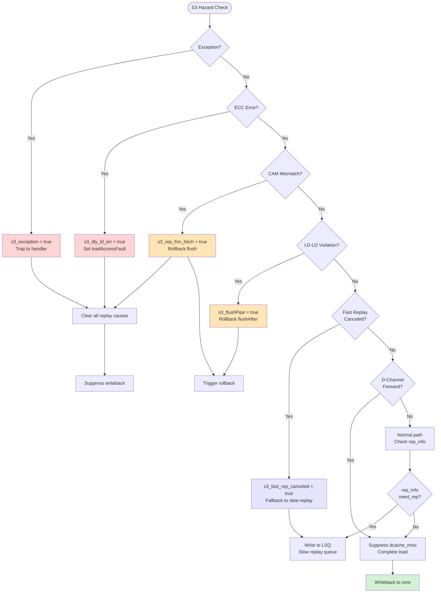
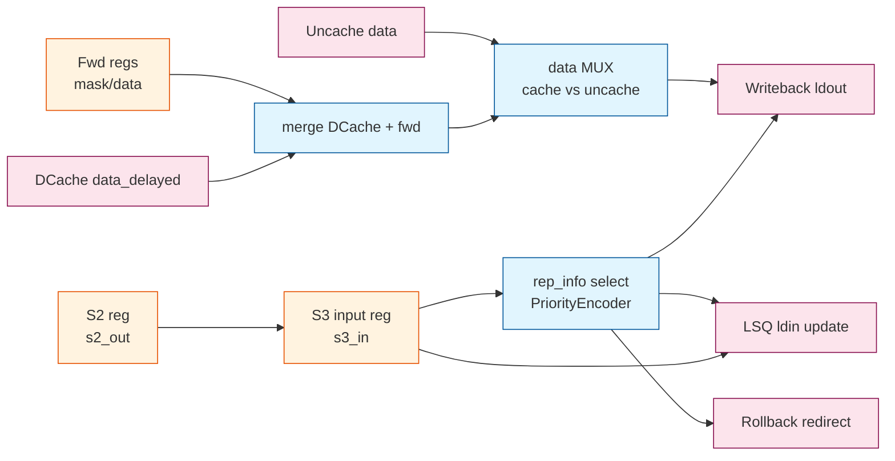

// See README.md for license details.

# LoadUnit S3 Stage (Writeback + Replay/Redirect + Data Select)

This report focuses on LoadUnit S3 in `src/main/scala/xiangshan/mem/pipeline/LoadUnit.scala`.
It follows the same style as `loadpipe_S0.md`, `loadpipe_S1.md`, and `loadpipe_S2.md`.

## Scope and References
- LoadUnit: `src/main/scala/xiangshan/mem/pipeline/LoadUnit.scala`
- Shared bundles: `src/main/scala/xiangshan/mem/MemCommon.scala`

---

## S3 Stage Summary
S3 finalizes the load result. It writes back to the core if no replay is needed,
updates the Load Queue via `lsq.ldin`, triggers rollback for certain violations,
and selects the final data from DCache/forwarded data or the uncache path.

---

## Key Inputs and Outputs (Tables)

### A) S3 input sources
| Source | Signal(s) | Type | Meaning in S3 |
|---|---|---|---|
| S2 pipeline reg | `s3_in` | `LqWriteBundle` | Registered S2 payload (data/mask/rep_info/etc.). |
| DCache resp (delayed) | `io.dcache.resp.bits.data_delayed` | UInt | Cache data for this load. |
| Forwarded data regs | `s2_fwd_mask/data`, `s2_fwd_frm_*` | Regs | Forward masks/data captured from S2. |
| D-channel forward | `io.tl_d_channel.forward(...)` | Tuple | Data forwarded from refill D channel. |
| Uncache path | `io.lsq.uncache` + `io.lsq.ld_raw_data` | Bundle | Data for MMIO/uncache loads. |
| Violation resp | `io.lsq.ldld_nuke_query.resp` | Valid | ld-ld violation response for rollback. |
| Match invalid | `io.lsq.forward.matchInvalid`, `io.sbuffer.matchInvalid` | Bool | CAM mismatch (flush/replay). |
| Redirect | `io.redirect` | Valid | Flush conditions for in-flight loads. |

### B) S3 internal control signals
| Signal | Type | Meaning |
|---|---|---|
| `s3_valid` | Reg Bool | S3 pipeline valid bit (HW prefetch filtered). |
| `s3_ready` | Bool | S3 can advance when writeback ready. |
| `s3_kill` | Bool | Kill S3 on redirect. |
| `s3_troublem` | Bool | S2 trouble path registered into S3. |
| `s3_rep_frm_fetch` | Bool | Replay-from-fetch due to CAM mismatch. |
| `s3_flushPipe` | Bool | Flush due to ld-ld violation response. |
| `s3_exception` | Bool | Exception from uop exceptionVec. |
| `s3_revoke` | Bool | Revoke ldld/stld queries when exception or replay. |
| `s3_fast_rep` | Bool | Fast replay indicator (from S2). |
| `s3_fast_rep_canceled` | Bool | Fast replay canceled by D-channel replay or dcache not ready. |

### C) S3 outputs and side effects
| Output | Signal(s) | Type | Meaning |
|---|---|---|---|
| Load queue update | `io.lsq.ldin` | Decoupled | Push final status/data into Load Queue. |
| Writeback | `io.ldout` | Decoupled | Final load writeback (unless replay). |
| Rollback | `io.rollback` | Valid Redirect | Flush on CAM mismatch / ldld violation. |
| Fast replay out | `io.fast_rep_out` | Decoupled | Sends replayed load back to S0. |
| Load-to-load fwd | `io.l2l_fwd_out` | Output | Forward data to dependent load. |
| Delayed load error | `io.s3_dly_ld_err` | Output | ECC delayed error flag. |

---

## S3 Core Logic (Code Snippets)

### 1) S3 valid/ready and LSQ update gate
```scala
val s3_valid = RegNext(s2_valid && !s2_out.isHWPrefetch && !s2_out.uop.robIdx.needFlush(io.redirect))
val s3_kill  = s3_in.uop.robIdx.needFlush(io.redirect)
s3_ready := !s3_valid || s3_kill || io.ldout.ready

val s3_fast_rep_canceled = io.replay.valid && io.replay.bits.forward_tlDchannel || !io.dcache.req.ready
io.lsq.ldin.valid := s3_valid && (!s3_fast_rep || s3_fast_rep_canceled) && !s3_in.feedbacked
```

### 2) Replay cause selection for LSQ
```scala
val s3_rep_info = WireInit(s3_in.rep_info)
val s3_sel_rep_cause = PriorityEncoderOH(s3_rep_info.cause.asUInt)

when (s3_exception || s3_dly_ld_err || s3_rep_frm_fetch) {
  io.lsq.ldin.bits.rep_info.cause := 0.U.asTypeOf(s3_rep_info.cause.cloneType)
} .otherwise {
  io.lsq.ldin.bits.rep_info.cause := VecInit(s3_sel_rep_cause.asBools)
}
```

### 3) Writeback gating
```scala
s3_out.valid := s3_valid && !io.lsq.ldin.bits.rep_info.need_rep && !s3_in.mmio
```

### 4) Rollback trigger
```scala
io.rollback.valid := s3_valid && (s3_rep_frm_fetch || s3_flushPipe) && !s3_exception
```

---

## Data Selection (Cache vs Uncache) - Detailed

S3 is responsible for selecting and formatting the final load data from multiple possible sources. The selection depends on whether the load followed the cache path (normal) or uncache path (MMIO).

### Cache Path Data Flow

For normal cached loads, S3 performs a **multi-source merge** of:
1. **DCache data** (delayed response from S2)
2. **Forward data** (LSQ/sbuffer, registered from S2)
3. **D-channel forward** (super replay path, from MSHR/refill)
4. **MSHR forward** (super replay path, from miss queue)

**LoadUnit.scala:1124-1136** - Cache path data assembly:
```scala
val s3_ld_raw_data_frm_cache = Wire(new LoadDataFromDcacheBundle)
s3_ld_raw_data_frm_cache.respDcacheData       := io.dcache.resp.bits.data_delayed
s3_ld_raw_data_frm_cache.forwardMask          := RegEnable(s2_fwd_mask, s2_valid)
s3_ld_raw_data_frm_cache.forwardData          := RegEnable(s2_fwd_data, s2_valid)
s3_ld_raw_data_frm_cache.uop                  := RegEnable(s2_out.uop, s2_valid)
s3_ld_raw_data_frm_cache.addrOffset           := RegEnable(s2_out.paddr(3, 0), s2_valid)
s3_ld_raw_data_frm_cache.forward_D            := RegEnable(s2_fwd_frm_d_chan, false.B, s2_valid) ||
                                                 s3_fwd_frm_d_chan_valid
s3_ld_raw_data_frm_cache.forwardData_D        := Mux(s3_fwd_frm_d_chan_valid,
                                                      s3_fwd_data_frm_d_chan,
                                                      RegEnable(s2_fwd_data_frm_d_chan, s2_valid))
s3_ld_raw_data_frm_cache.forward_mshr         := RegEnable(s2_fwd_frm_mshr, false.B, s2_valid)
s3_ld_raw_data_frm_cache.forwardData_mshr     := RegEnable(s2_fwd_data_frm_mshr, s2_valid)
s3_ld_raw_data_frm_cache.forward_result_valid := RegEnable(s2_fwd_data_valid, false.B, s2_valid)
```

**Data structure components**:

| Field | Source | Purpose |
|-------|--------|---------|
| `respDcacheData` | `io.dcache.resp.bits.data_delayed` | DCache data (1 cycle delayed from S2) |
| `forwardMask` | S2 forward mask (registered) | Which bytes come from LSQ/sbuffer |
| `forwardData` | S2 forward data (registered) | LSQ/sbuffer data bytes |
| `forward_D` | S2/S3 D-channel forward flag | D-channel has valid data |
| `forwardData_D` | S2/S3 D-channel data | Data from TileLink D-channel |
| `forward_mshr` | S2 MSHR forward flag | MSHR has valid data |
| `forwardData_mshr` | S2 MSHR data | Data from miss queue |
| `forward_result_valid` | S2 forward validation | Any super replay forward succeeded |
| `uop` | S2 micro-op | Load type/size for data extraction |
| `addrOffset` | S2 paddr low bits | Byte offset within cache line |

### Cache Data Merge Algorithm

**Step 1: Merge all data sources** (done by `mergedData()` method):

```scala
val s3_merged_data_frm_cache = s3_ld_raw_data_frm_cache.mergedData()
```

**mergedData() priority order**:
```
For each byte i:
  if forward_D && forward_result_valid:
    use forwardData_D(i)        // D-channel (super replay)
  else if forward_mshr && forward_result_valid:
    use forwardData_mshr(i)     // MSHR (super replay)
  else if forwardMask(i):
    use forwardData(i)          // LSQ/sbuffer (normal forward)
  else:
    use respDcacheData(i)       // DCache
```

**Key insight**: Super replay forwarding (D-channel/MSHR) has highest priority, followed by normal forwarding (LSQ/sbuffer), then DCache.

**Step 2: Extract relevant bytes based on address offset**:

```scala
val s3_picked_data_frm_cache = LookupTree(s3_ld_raw_data_frm_cache.addrOffset, List(
  "b0000".U -> s3_merged_data_frm_cache(63,    0),   // Offset 0
  "b0001".U -> s3_merged_data_frm_cache(63,    8),   // Offset 1
  "b0010".U -> s3_merged_data_frm_cache(63,   16),   // Offset 2
  ...
  "b1111".U -> s3_merged_data_frm_cache(127, 120)    // Offset 15 (128-bit VLEN)
))
```

**Purpose**: Select the 64-bit window starting from the load's byte offset.

**Step 3: Format data according to load type**:

```scala
val s3_ld_data_frm_cache = rdataHelper(s3_ld_raw_data_frm_cache.uop, s3_picked_data_frm_cache)
```

**rdataHelper** performs:
- **Sign extension** for signed loads (LB, LH, LW)
- **Zero extension** for unsigned loads (LBU, LHU, LWU)
- **Byte reordering** if needed
- **Width selection** based on load size (8/16/32/64 bits)

### Uncache Path Data Flow

For MMIO and uncached loads, data comes from the **Load Queue uncache path**:

**LoadUnit.scala:1109-1121** - Uncache path data assembly:
```scala
val s3_ld_raw_data_frm_uncache = io.lsq.ld_raw_data
val s3_merged_data_frm_uncache = s3_ld_raw_data_frm_uncache.mergedData()
val s3_picked_data_frm_uncache = LookupTree(s3_ld_raw_data_frm_uncache.addrOffset, List(
  "b000".U -> s3_merged_data_frm_uncache(63,  0),
  "b001".U -> s3_merged_data_frm_uncache(63,  8),
  ...
  "b111".U -> s3_merged_data_frm_uncache(63, 56)
))
val s3_ld_data_frm_uncache = rdataHelper(s3_ld_raw_data_frm_uncache.uop, s3_picked_data_frm_uncache)
```

**Key differences from cache path**:
- Data comes from `io.lsq.ld_raw_data` (LSQ uncache buffer)
- No forwarding (MMIO is strictly ordered, no speculation)
- Offset range is 3 bits (0-7) instead of 4 bits (smaller data width)

### Final Data Selection

**LoadUnit.scala:1160-1161** - Top-level data mux:
```scala
io.ldout.bits.data := Mux(s3_valid, s3_ld_data_frm_cache, s3_ld_data_frm_uncache)
io.ldout.valid     := s3_out.valid || (io.lsq.uncache.valid && !s3_valid)
```

**Selection logic**:
- **If `s3_valid = true`**: Use cache path data (normal load from pipeline)
- **If `s3_valid = false` AND uncache valid**: Use uncache path data (MMIO completion)

**Writeback valid**:
- **Cache path**: `s3_out.valid` (gated by `!need_rep && !mmio`)
- **Uncache path**: `io.lsq.uncache.valid && !s3_valid` (LSQ signals MMIO completion)

**Mutual exclusion**: Cache and uncache paths never both valid at same time (MMIO loads skip cache pipeline).

### Data Selection Flow Diagram



### Example: Super Replay Data Selection

**Scenario**: Load misses in DCache, super replay forwards data from D-channel

**Cycle N (S2)**:
```
s2_dcache_miss = true
s2_fwd_frm_d_chan = true (D-channel has data)
s2_fwd_data_frm_d_chan = 0xDEADBEEF_CAFEBABE
```

**Cycle N+1 (S3)**:
```
s3_ld_raw_data_frm_cache.forward_D = true
s3_ld_raw_data_frm_cache.forwardData_D = 0xDEADBEEF_CAFEBABE
s3_ld_raw_data_frm_cache.respDcacheData = INVALID (miss)

// mergedData() selects D-channel data (highest priority)
s3_merged_data_frm_cache = 0xDEADBEEF_CAFEBABE

// For 4-byte load at offset 0
s3_picked_data_frm_cache = 0xCAFEBABE (lower 64 bits, extracted)

// rdataHelper formats as 32-bit value
s3_ld_data_frm_cache = 0xCAFEBABE

// Writeback
io.ldout.bits.data = 0xCAFEBABE
```

**Result**: Load completes successfully despite DCache miss, data forwarded from D-channel.

---

## Hazards and Conflicts Addressed at S3

S3 is the **final checkpoint** before load writeback. It detects and handles several critical hazards and conflicts that couldn't be resolved in earlier stages or require delayed detection.

### Overview of S3 Hazards

S3 handles five major categories of hazards:
1. **ECC Delayed Load Errors** (data corruption detected late)
2. **CAM Mismatch** (vaddr/paddr forwarding inconsistency)
3. **Load-Load Violations** (speculative load ordering violation)
4. **Exceptions** (page faults, access faults accumulated from earlier stages)
5. **Fast Replay Cancellation** (fast replay path blocked)

Each hazard triggers specific actions: writeback suppression, rollback/flush, or replay.

---

### Hazard 1: ECC Delayed Load Error

#### What It Is
**ECC (Error-Correcting Code) delayed errors** occur when DCache detects data corruption **after** the data has already progressed through S2. The error signal arrives in S3 (one cycle late).

#### Detection

**LoadUnit.scala:1030-1035**:
```scala
val s3_dly_ld_err =
  if (EnableAccurateLoadError) {
    io.dcache.resp.bits.error_delayed &&
    RegNext(io.csrCtrl.cache_error_enable) &&
    s3_troublem
  } else {
    WireInit(false.B)
  }
```

**Conditions**:
- `error_delayed`: DCache ECC check failed (delayed by 1 cycle)
- `cache_error_enable`: CSR enables cache error detection
- `s3_troublem`: Load is on normal path (not exception/MMIO/prefetch)

#### Effect on Load Pipeline

**Writeback suppression**:
```scala
s3_out.bits.uop.cf.exceptionVec(loadAccessFault) := s3_dly_ld_err ||
                                                     s3_in.uop.cf.exceptionVec(loadAccessFault)
```

**Replay cause clearing**:
```scala
when (s3_exception || s3_dly_ld_err || s3_rep_frm_fetch) {
  io.lsq.ldin.bits.rep_info.cause := 0.U.asTypeOf(s3_rep_info.cause.cloneType)
}
```

**Result**:
- Load is marked with **loadAccessFault** exception
- All replay causes cleared (exception takes precedence)
- Load will be **flushed** and **re-executed** after exception handler

#### Why Delayed?

ECC checking requires multi-cycle computation:
- **S2**: Data arrives from cache SRAM
- **S2→S3**: ECC checker computes syndrome, detects error
- **S3**: Error signal becomes valid

**Tradeoff**: 1 cycle latency penalty for accurate error detection vs. incorrect data writeback.

#### Impact on Fast Replay

**LoadUnit.scala:1038**:
```scala
io.fast_rep_out.bits.delayedLoadError := s3_dly_ld_err
```

If fast replay was planned but delayed error detected:
- Fast replay carries the error flag
- Dependent loads see `dly_ld_err` and won't use forwarded data
- Prevents error propagation through load-to-load forwarding

---

### Hazard 2: CAM Mismatch (Vaddr/Paddr Inconsistency)

#### What It Is
**CAM (Content-Addressable Memory) mismatch** occurs when LSQ or sbuffer forward logic finds:
- **Virtual address matches** the load
- But **physical address doesn't match** (or vice versa)

This indicates a **microarchitectural bug** or **TLB aliasing issue** that requires flush and re-execution.

#### Detection

**LoadUnit.scala:1040-1041**:
```scala
val s3_vp_match_fail = RegNext(io.lsq.forward.matchInvalid ||
                                io.sbuffer.matchInvalid) &&
                       s3_troublem
val s3_rep_frm_fetch = s3_vp_match_fail
```

**Sources**:
- `io.lsq.forward.matchInvalid`: LSQ detected vaddr/paddr mismatch in S2
- `io.sbuffer.matchInvalid`: Sbuffer detected vaddr/paddr mismatch in S2
- **Registered to S3**: Signal comes from S2, registered for timing

#### Cause of CAM Mismatch

**Scenario 1: TLB Update Race**
```
Before load execution:
  - Store executed with old TLB mapping: vaddr → paddr_old
  - Store inserted into LSQ with {vaddr, paddr_old}
  - TLB update occurs (page table change, shootdown, refill)
  - Now vaddr maps to paddr_new

During load execution:
  - Load S1: DTLB translates vaddr → paddr_new (using updated TLB)
  - Load S1: Queries LSQ with {vaddr, paddr_new}
  - LSQ CAM: Finds store with {vaddr ✓ match, paddr_old ✗ mismatch}
  - Result: matchInvalid = true

Race condition: Store in LSQ hasn't drained yet, still has old paddr
```

**Scenario 2: Store Queue Aliasing**
```
Store: vaddr1 → paddr_A (aliased mapping)
Load:  vaddr2 → paddr_A (different vaddr, same paddr)
LSQ: vaddr doesn't match, but paddr matches → matchInvalid = true
```

**Scenario 3: Micro-architectural Bug**
- Incorrect vaddr/paddr CAM logic
- Buffer corruption
- Requires flush and re-execution to recover

#### Effect on Load Pipeline

**Replay cause clearing**:
```scala
when (s3_exception || s3_dly_ld_err || s3_rep_frm_fetch) {
  io.lsq.ldin.bits.rep_info.cause := 0.U.asTypeOf(s3_rep_info.cause.cloneType)
}
```

**Rollback trigger**:
```scala
io.rollback.valid := s3_valid && (s3_rep_frm_fetch || s3_flushPipe) && !s3_exception
io.rollback.bits.level := Mux(s3_rep_frm_fetch, RedirectLevel.flush, RedirectLevel.flushAfter)
```

**Result**:
- **Flush** at `RedirectLevel.flush` (most aggressive)
- All younger instructions flushed
- Load re-fetched from frontend
- Clears any aliasing or CAM inconsistency

#### Fast Replay Integration

**LoadUnit.scala:1166**:
```scala
io.fast_rep_out.bits.lateKill := s3_rep_frm_fetch
```

If fast replay active when CAM mismatch detected:
- Fast replay marked with `lateKill` flag
- S0 will **cancel** the fast replay
- Load goes to slow replay queue instead

#### Load-to-Load Forward Blocking

**LoadUnit.scala:1173-1175**:
```scala
io.l2l_fwd_out.dly_ld_err := s3_dly_ld_err ||
                             s3_ldld_rep_inst ||
                             s3_rep_frm_fetch  // CAM mismatch blocks L2L forward
```

Dependent loads won't use this load's data (marked as error).

#### Sequence Diagram: CAM Mismatch

**Example**: Store-load forwarding with TLB aliasing causing vaddr/paddr mismatch

**Pre-condition**:
- Store previously executed with vaddr 0x5000 → paddr 0x9000 (old TLB mapping)
- Store is in LSQ with {vaddr: 0x5000, paddr: 0x9000}
- TLB has been updated: vaddr 0x5000 now maps to paddr 0xA000
- Load now executes with updated TLB



**Cycle-by-cycle breakdown**:

| Cycle | Stage | Event | Signals |
|-------|-------|-------|---------|
| (before) | - | TLB updated, store still in LSQ | Store has old paddr 0x9000 |
| 0 | S0 | Load issued | `vaddr=0x5000` |
| 1 | S1 | DTLB returns **new** paddr | `paddr_new=0xA000` (TLB already updated) |
| 1 | S1 | LSQ query sent | `vaddr=0x5000, paddr=0xA000` |
| 1 | LSQ | CAM finds store with vaddr match but paddr **old** | `store: vaddr=0x5000, paddr=0x9000` |
| 2 | LSQ | Detect mismatch | `matchInvalid=true` (vaddr match, paddr mismatch) |
| 2 | S2 | Register mismatch flag | `matchInvalid` latched |
| 3 | S3 | **Mismatch arrives** | `s3_vp_match_fail=true`, `s3_rep_frm_fetch=true` |
| 3 | S3 | Trigger flush | `rollback.valid=true`, `level=flush` |
| 4+ | - | Pipeline flushed, load re-fetched | Ensures memory consistency |

**Root cause**: TLB was updated **before** the load started executing, but **after** the store was inserted into LSQ. Store has old translation (0x9000), load has new translation (0xA000).

**Why flush needed**: The vaddr/paddr mismatch indicates inconsistent memory ordering or aliasing. Flush ensures load re-executes with current LSQ state and TLB consistency.

**Example timeline**:
```
Time T0: Store executes, vaddr 0x5000 → paddr 0x9000 (TLB entry A)
         Store inserted into LSQ with {vaddr: 0x5000, paddr: 0x9000}

Time T1: TLB shootdown, entry A invalidated

Time T2: TLB refilled, vaddr 0x5000 → paddr 0xA000 (TLB entry B)
         (Store still pending in LSQ, hasn't drained yet)

Time T3: Load starts execution
         Load S1: DTLB translates vaddr 0x5000 → paddr 0xA000 (using entry B)
         Load S1: Queries LSQ with {vaddr: 0x5000, paddr: 0xA000}
         LSQ CAM: Finds store {vaddr: 0x5000 ✓, paddr: 0x9000 ✗}
         CAM mismatch detected!

The "race" is between TLB update completing and store draining from LSQ.
```

---

#### Sequence Diagram: ECC Delayed Load Error

**Example**: 4-byte load from address 0x1000, DCache returns corrupted data



**Cycle-by-cycle breakdown**:

| Cycle | Stage | Event | Signals |
|-------|-------|-------|---------|
| 0 | S0 | Load issued | `vaddr=0x1000` |
| 1 | S1 | DTLB translate, DCache request | `paddr=0x8000_1000` |
| 2 | S2 | DCache returns data, ECC check starts | `data=0xDEADBEEF`, `error_delayed` not yet valid |
| 2→3 | S2→S3 | Data carried to S3, ECC computing | ECC checker processing |
| 3 | S3 | **ECC error detected** | `error_delayed=true`, `s3_dly_ld_err=true` |
| 3 | S3 | Exception set, writeback blocked | `exceptionVec(loadAccessFault)=true`, `s3_out.valid=false` |
| 4+ | - | Pipeline flush, exception handler | Load will retry after handler |

**Key timing**: ECC error arrives **1 cycle late** (S3 instead of S2) because syndrome computation takes time.

**Example values**:
- **Raw data**: `0xDEADBEEF`
- **ECC bits**: Indicate error (e.g., parity mismatch)
- **Syndrome**: Points to uncorrectable multi-bit error
- **Result**: Exception, no writeback

---

### Hazard 3: Load-Load Violation

#### What It Is
**Load-load violations** occur when **speculative load ordering** is incorrect:
- Younger load executed before older load
- Both loads access overlapping addresses
- Older load returns different data (memory location was updated)

This violates sequential semantics and requires re-execution.

#### Detection

**LoadUnit.scala:1042-1046**:
```scala
val s3_ldld_rep_inst =
    io.lsq.ldld_nuke_query.resp.valid &&
    io.lsq.ldld_nuke_query.resp.bits.rep_frm_fetch &&
    RegNext(io.csrCtrl.ldld_vio_check_enable)
val s3_flushPipe = s3_ldld_rep_inst
```

**Conditions**:
- `ldld_nuke_query.resp.valid`: LSQ found a load-load violation
- `resp.bits.rep_frm_fetch`: Violation requires fetch-level flush
- `ldld_vio_check_enable`: CSR enables load-load violation checking

#### How Load-Load Violations Are Detected

**Query Phase (S2)**:
```scala
io.lsq.ldld_nuke_query.req.valid := s2_valid && s2_can_query
io.lsq.ldld_nuke_query.req.bits.paddr := s2_paddr
io.lsq.ldld_nuke_query.req.bits.mask := s2_in.mask
```

**LSQ Check (S2→S3)**:
- LSQ searches all **older loads** in load queue
- If older load has **same address** and **hasn't completed** → potential violation
- If older load's data differs from this load's data → confirmed violation

**Response Phase (S3)**:
- LSQ sets `resp.valid = true`, `resp.bits.rep_frm_fetch = true`
- S3 detects violation and triggers flush

#### Effect on Load Pipeline

**Rollback trigger**:
```scala
io.rollback.valid := s3_valid && (s3_rep_frm_fetch || s3_flushPipe) && !s3_exception
io.rollback.bits.level := Mux(s3_rep_frm_fetch, RedirectLevel.flush, RedirectLevel.flushAfter)
```

**Rollback level**:
- `s3_flushPipe` → `RedirectLevel.flushAfter`
- Flush this load and all younger instructions
- Older load completes first, then this load re-executes

**Result**:
- Sequential load ordering enforced
- Memory consistency preserved

#### Query Revocation

**LoadUnit.scala:1087-1089**:
```scala
val s3_revoke = s3_exception || io.lsq.ldin.bits.rep_info.need_rep
io.lsq.ldld_nuke_query.revoke := s3_revoke
io.lsq.stld_nuke_query.revoke := s3_revoke
```

If load replays or takes exception:
- **Revoke** load-load and store-load queries
- Prevents spurious violation detection
- LSQ discards query results

#### Sequence Diagram: Load-Load Violation

**Example**: Younger load executes speculatively before older load, detects ordering violation



**Cycle-by-cycle breakdown**:

| Cycle | Event | Signals |
|-------|-------|---------|
| 0 | LD1 (older) allocated in LQ, idx=5 | Not yet executed |
| 2 | LD2 (younger) allocated in LQ, idx=8 | Speculative execution |
| 3-5 | LD2 executes ahead of LD1 | Speculative load reordering |
| 5 | LD2 queries LSQ for LD-LD violation | Query older loads (lqIdx < 8) |
| 5 | LSQ finds LD1 (idx=5) not executed yet | No violation detected (premature) |
| 6 | LD1 finally executes, data=0xBBBB | Different from LD2's data (0xAAAA) |
| 7 | LD1 completes, LSQ updated | LSQ now has LD1's data |
| 7 | LSQ detects violation | LD2 used stale data (0xAAAA) instead of LD1's data (0xBBBB) |
| 8 | LSQ sends violation response to LD2 (now in S3) | `ldld_nuke_query.resp.valid=true` |
| 8 | **LD2 S3 detects violation** | `s3_ldld_rep_inst=true`, `s3_flushPipe=true` |
| 8 | Trigger rollback flushAfter | Flush LD2 and younger instructions |
| 9+ | LD2 re-executes after LD1 | Correct ordering enforced |

**Why violation occurred**:
- Memory location 0x2000 updated between LD2 and LD1
- LD2 read **old value** (0xAAAA)
- LD1 read **new value** (0xBBBB)
- LD2 should have seen new value (program order: LD1 < LD2)

**Resolution**: Flush LD2, re-execute after LD1 completes, ensuring sequential semantics.

---

### Hazard 4: Exception Handling

#### What It Is
S3 is the **final exception checkpoint** before writeback. Exceptions accumulated from S0/S1/S2 (page fault, access fault, etc.) are checked here.

#### Detection

**LoadUnit.scala:1052**:
```scala
val s3_exception = ExceptionNO.selectByFu(s3_in.uop.cf.exceptionVec, lduCfg).asUInt.orR
```

**Possible exceptions**:
- **loadPageFault**: TLB detected page fault (from S1)
- **loadAccessFault**: PMP violation or ECC error (from S2/S3)
- **loadAddrMisaligned**: Misaligned access (from S0)

#### Effect on Load Pipeline

**Replay cause clearing**:
```scala
when (s3_exception || s3_dly_ld_err || s3_rep_frm_fetch) {
  io.lsq.ldin.bits.rep_info.cause := 0.U.asTypeOf(s3_rep_info.cause.cloneType)
}
```

**Writeback suppression**:
```scala
s3_out.valid := s3_valid && !io.lsq.ldin.bits.rep_info.need_rep && !s3_in.mmio
```

**Rollback blocking**:
```scala
io.rollback.valid := s3_valid && (s3_rep_frm_fetch || s3_flushPipe) && !s3_exception
```

**Priority**:
- **Exceptions** take precedence over rollback
- Load will trap to exception handler
- Rollback is **blocked** (exception handler will redirect)

#### Sequence Diagram: Exception Handling

**Example**: Load with page fault exception (TLB miss, page not mapped)



**Cycle-by-cycle breakdown**:

| Cycle | Stage | Event | Signals |
|-------|-------|-------|---------|
| 0 | S0 | Load issued | `vaddr=0x7FFF_F000` |
| 1 | S1 | DTLB detects page fault | `excp.pf.ld=true` |
| 1 | S1 | Exception set | `exceptionVec(loadPageFault)=true` |
| 2 | S2 | Exception detected | `s2_exception=true` |
| 2 | S2 | DCache killed | `s2_kill=true` (no cache access) |
| 3 | S3 | **Exception checkpoint** | `s3_exception=true` |
| 3 | S3 | Replay causes cleared | `rep_info.cause=0` |
| 3 | S3 | Writeback suppressed | `s3_out.valid=false` |
| 3 | S3 | Rollback blocked | `rollback.valid=false` |
| 4+ | ROB | Exception committed at ROB head | Trap to handler |

**Exception types handled**:
- **loadPageFault**: Page not present (from S1/DTLB)
- **loadAccessFault**: PMP violation (from S2/PMP) or ECC error (from S3)
- **loadAddrMisaligned**: Unaligned address (from S0)

**Priority**: Exception > all other hazards (rollback, replay)

---

### Hazard 5: Fast Replay Cancellation

#### What It Is
Fast replay can be **canceled** in S3 if higher-priority traffic blocks S0.

#### Detection

**LoadUnit.scala:1020**:
```scala
val s3_fast_rep_canceled = io.replay.valid && io.replay.bits.forward_tlDchannel ||
                           !io.dcache.req.ready
```

**Cancellation conditions**:
1. **Super replay arrives**: `io.replay.valid && forward_tlDchannel`
   - Super replay has higher priority than fast replay
   - S0 will accept super replay, blocking fast replay
2. **DCache not ready**: `!io.dcache.req.ready`
   - S0 cannot accept any request this cycle
   - Fast replay must wait

#### Effect on Load Pipeline

**LSQ write override**:
```scala
io.lsq.ldin.valid := s3_valid && (!s3_fast_rep || s3_fast_rep_canceled) && !s3_in.feedbacked
```

**Decision tree**:
```
if (s3_fast_rep && !s3_fast_rep_canceled):
  Send via io.fast_rep_out (fast path)
  Do NOT write to LSQ
else if (s3_fast_rep && s3_fast_rep_canceled):
  Fallback to io.lsq.ldin (slow path)
  Write to LSQ replay queue
else:
  Already not fast replay
  Write to LSQ replay queue
```

**Result**:
- Fast replay **downgrades** to slow replay
- Adds 2-3 cycles latency (queue overhead)
- Ensures load eventually completes

See `doc/memblock/replay.md` for detailed fast vs slow replay comparison.

#### Sequence Diagram: Fast Replay Cancellation

**Example**: Bank conflict triggers fast replay, but super replay arrives and cancels it



**Cycle-by-cycle breakdown**:

| Cycle | Event | Signals |
|-------|-------|---------|
| 0-2 | LD1 hits bank conflict in S2 | `s2_bank_conflict=true`, `s2_fast_rep=true` |
| 3 | LD1 in S3, fast replay prepared | `s3_fast_rep=true` |
| 3 | **Super replay (LD2) arrives at S0** | `io.replay.valid=true`, `forward_tlDchannel=true` |
| 3 | Super replay wins S0 arbitration | `s0_super_ld_rep_select=true` (blocks fast replay) |
| 3 | **Fast replay canceled** | `s3_fast_rep_canceled=true` |
| 3 | LD1 fallback to slow replay | `io.lsq.ldin.valid=true` (write to queue) |
| 3 | LSQ allocates entry for LD1 | `blocking=false`, `cause=C_BC` |
| 4 | LD2 (super replay) executes in S0 | LD1 fast replay skipped |
| 5 | LD1 scheduled from replay queue | Normal replay priority (3rd) |
| 5 | LD1 enters S0 via slow replay | `s0_ld_rep_select=true` |
| 6-8 | LD1 completes | Bank conflict resolved |

**Latency comparison**:
- **Successful fast replay**: S3 (cycle 3) → S0 (cycle 4) = 1 cycle
- **Canceled fast replay**: S3 (cycle 3) → LSQ → S0 (cycle 5) = 2 cycles
- **Added cost**: +1 cycle due to cancellation

**Why cancellation happens**: Super replay has absolute priority (critical for D-channel forwarding timing). Fast replay must yield.

---

### Hazard 6: D-Channel Forward Suppression of Cache Miss

#### What It Is
Not strictly a "hazard," but an important **conflict resolution** in S3:
- Load missed in DCache (S2 detected miss)
- But data arrived via D-channel forward (super replay)
- Must **suppress** cache miss replay

#### Detection

**LoadUnit.scala:1049**:
```scala
val s3_rep_info = WireInit(s3_in.rep_info)
s3_rep_info.dcache_miss := s3_in.rep_info.dcache_miss && !s3_fwd_frm_d_chan_valid
```

**Logic**:
- S2 set `rep_info.dcache_miss = true` (cache missed)
- S3 checks `s3_fwd_frm_d_chan_valid` (D-channel provided data)
- If D-channel forward valid → **clear** dcache_miss cause

**Effect**:
- Load completes successfully (data forwarded)
- No replay to LSQ (miss handled)
- Writeback proceeds normally

This is the **final step** of the super replay optimization (see `doc/memblock/super_replay.md`).

#### Sequence Diagram: D-Channel Forward Suppression

**Example**: Load misses in DCache (S2), but D-channel provides data (S3), suppressing miss replay



**Cycle-by-cycle breakdown**:

| Cycle | Stage | Event | Signals |
|-------|-------|-------|---------|
| 0 | S0 | Super replay issued | `forward_tlDchannel=true` |
| 1 | S1 | Query MSHR for forward | `io.forward_mshr.valid=true` |
| 2 | S2 | **DCache miss detected** | `s2_dcache_miss=true`, `rep_info.dcache_miss=true` |
| 2 | S2 | **D-channel data arrives** | `s2_fwd_frm_d_chan=true`, `data=0xCAFEBABE` |
| 2 | S2 | Forward data valid | `s2_fwd_data_valid=true` |
| 3 | S3 | D-channel forward still valid | `s3_fwd_frm_d_chan_valid=true` |
| 3 | S3 | **Suppress miss cause** | `dcache_miss = true && !true = false` |
| 3 | S3 | No replay needed | `rep_info.need_rep=false` |
| 3 | S3 | **Writeback succeeds** | `s3_out.valid=true`, `data=0xCAFEBABE` |
| 4+ | Core | Load commits | No replay, no extra latency |

**Key logic** (LoadUnit.scala:1049):
```scala
s3_rep_info.dcache_miss := s3_in.rep_info.dcache_miss && !s3_fwd_frm_d_chan_valid
```

**Translation**:
- S2 set `dcache_miss = true` (cache missed)
- S3 checks `s3_fwd_frm_d_chan_valid = true` (D-channel provided data)
- Result: `dcache_miss` **cleared** in S3 (miss handled by forward)

**Why this works**:
1. L2 hint woke up load early (super replay)
2. Load entered pipeline at precise time
3. D-channel data arrived in S2 (or S3 if last beat)
4. Data forwarded directly to load
5. DCache miss irrelevant (data obtained without cache)

**Performance benefit**:
- **Without D-channel forward**: Load waits for cache refill, then replays, then reads cache = +5 cycles
- **With D-channel forward**: Load completes immediately with forwarded data = +0 cycles
- **Savings**: 5 cycles per cache miss (when super replay succeeds)

See `doc/memblock/super_replay.md` for complete super replay mechanism.

---

### Hazard Summary Table

| Hazard | Detection Signal | Priority | Action | Replay? | Flush? |
|--------|------------------|----------|--------|---------|--------|
| **ECC Error** | `s3_dly_ld_err` | Highest | Set loadAccessFault exception | No | Yes (exception) |
| **CAM Mismatch** | `s3_rep_frm_fetch` | High | Trigger rollback (flush level) | No | Yes (flush) |
| **LD-LD Violation** | `s3_flushPipe` | High | Trigger rollback (flushAfter) | No | Yes (flushAfter) |
| **Exception** | `s3_exception` | Highest | Suppress writeback, trap to handler | No | Yes (exception) |
| **Fast Replay Cancel** | `s3_fast_rep_canceled` | Medium | Fallback to slow replay | Yes (slow) | No |
| **D-Chan Suppress Miss** | `s3_fwd_frm_d_chan_valid` | Low | Clear dcache_miss, complete load | No | No |

**Priority resolution**:
```
Exception > ECC Error > CAM Mismatch > LD-LD Violation > Fast Replay Cancel
```

When multiple hazards detected:
- Highest priority hazard determines action
- Other hazards ignored (will be re-checked on re-execution)

---

### Hazard Interaction: Complex Scenarios

#### Scenario 1: ECC Error + Fast Replay
```
s3_dly_ld_err = true
s3_fast_rep = true
```

**Resolution**:
- ECC error takes precedence
- Fast replay **aborted** (exception path)
- Load marked with loadAccessFault
- Exception handler invoked

#### Scenario 2: CAM Mismatch + Load-Load Violation
```
s3_rep_frm_fetch = true
s3_flushPipe = true
```

**Resolution**:
```scala
io.rollback.bits.level := Mux(s3_rep_frm_fetch, RedirectLevel.flush, RedirectLevel.flushAfter)
```
- CAM mismatch wins (flush level chosen)
- Load-load violation flushed as side effect
- Both issues resolved by flush

#### Scenario 3: Fast Replay Canceled + D-Channel Forward
```
s3_fast_rep = true
s3_fast_rep_canceled = true
s3_fwd_frm_d_chan_valid = true
```

**Resolution**:
- D-channel forward succeeded (load has data)
- Fast replay cancellation **irrelevant** (load completes)
- Writeback proceeds normally
- No replay needed

---

### Hazard Detection Flow Diagram



---

### Why S3 for Hazard Detection?

**Timing reasons**:
1. **ECC check delay**: Multi-cycle ECC computation requires delayed detection
2. **CAM mismatch**: Requires full S2 forward query completion
3. **Load-load violation**: LSQ search takes time, response arrives in S3
4. **D-channel forward**: Super replay timing means S3 is earliest reliable check point

**Microarchitectural reasons**:
1. **Last chance before writeback**: S3 is final stage, must catch all errors
2. **Speculation depth**: S3 is where speculation must be resolved
3. **Rollback trigger point**: S3 can trigger rollback without affecting committed state

**Correctness**: All hazards detected before architectural state changes (writeback to register file).

---

## S3 Block Diagram (Mux-Level)


---

## S3 Sequence (Cycle-Level Order)
| Step | Phase | Action | Detailed explanation |
|---|---|---|---|
| 1 | Register | `s3_in` captures `s2_out` | HW prefetches are filtered; valid bit is updated. |
| 2 | D-channel fwd | Check D-channel forward validity | Ensures miss-forward data stays valid. |
| 3 | LSQ update | Gate `lsq.ldin` on fast replay cancel | If fast replay active and not canceled, LSQ update is suppressed. |
| 4 | Rep cause | Select highest-priority replay cause | Cleared on exception/dly_err/rep_frm_fetch. |
| 5 | Writeback | Gate writeback on `need_rep` and `mmio` | Suppresses architectural writeback on replay. |
| 6 | Rollback | Trigger redirect on CAM mismatch or ldld violation | Uses `rep_frm_fetch` or `flushPipe`. |
| 7 | Data select | Choose cache or uncache data | Cache path uses merged forward; uncache path uses LQ raw data. |

---

## Notes and Edge Cases
- `rep_info.need_rep` gates writeback; when true, the load **does not commit** and will be replayed.
- `s3_rep_frm_fetch` is asserted on vaddr/paddr CAM mismatch (`matchInvalid`), causing rollback.
- `s3_flushPipe` is asserted on ld-ld violation response, also causing rollback.
- `s3_fast_rep_out` sends the load back for fast replay if `s3_fast_rep` is set.
- MMIO loads bypass cache data and use the uncache path (`io.lsq.uncache`).

