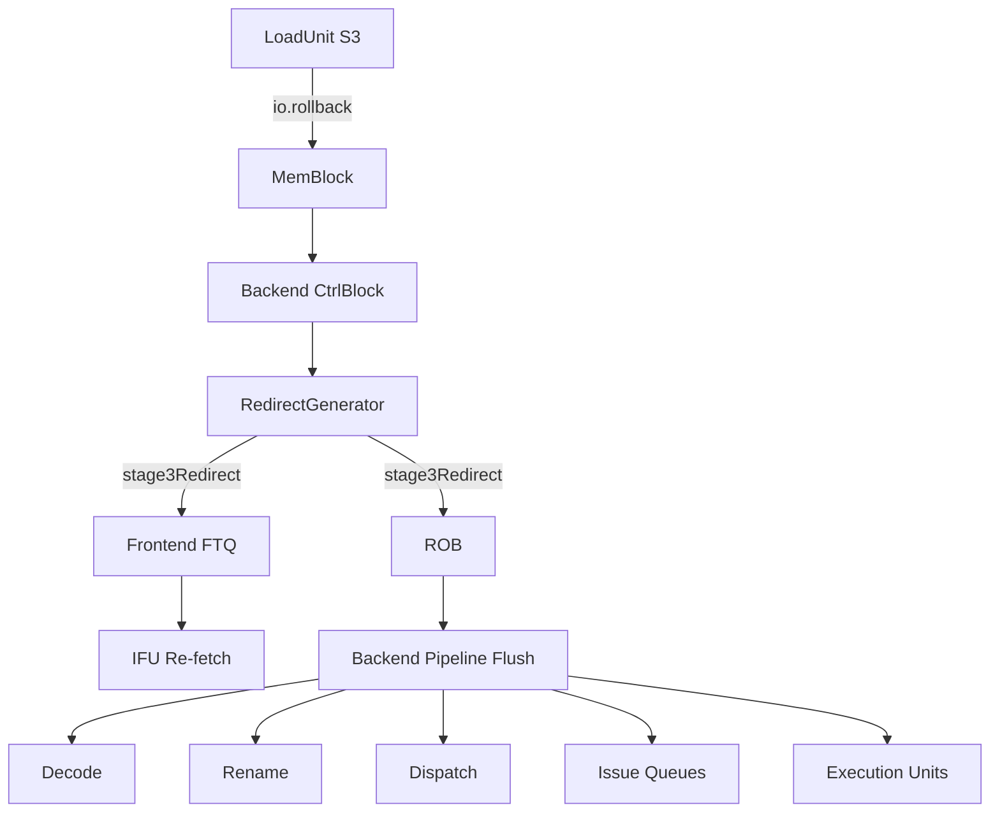
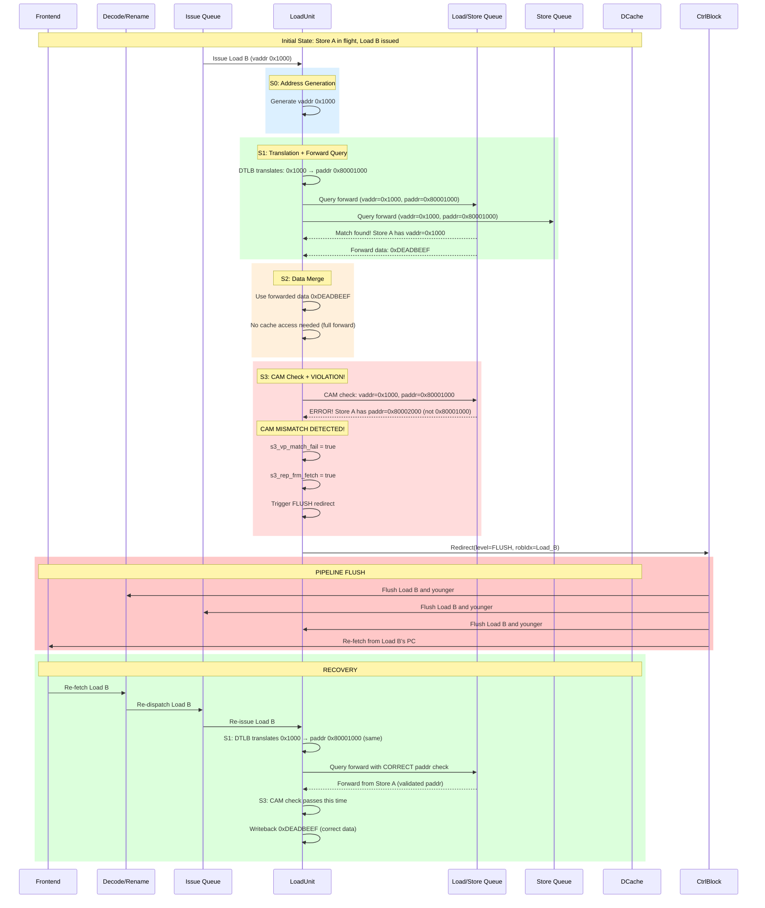
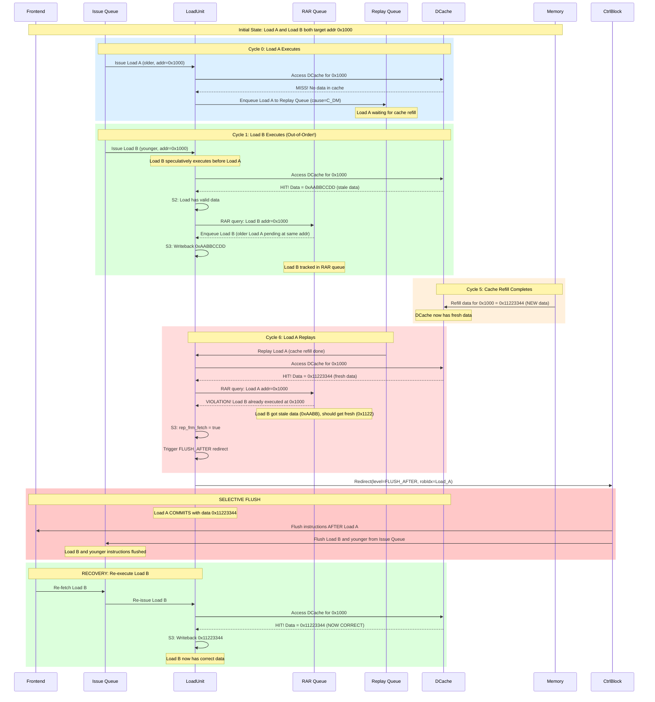
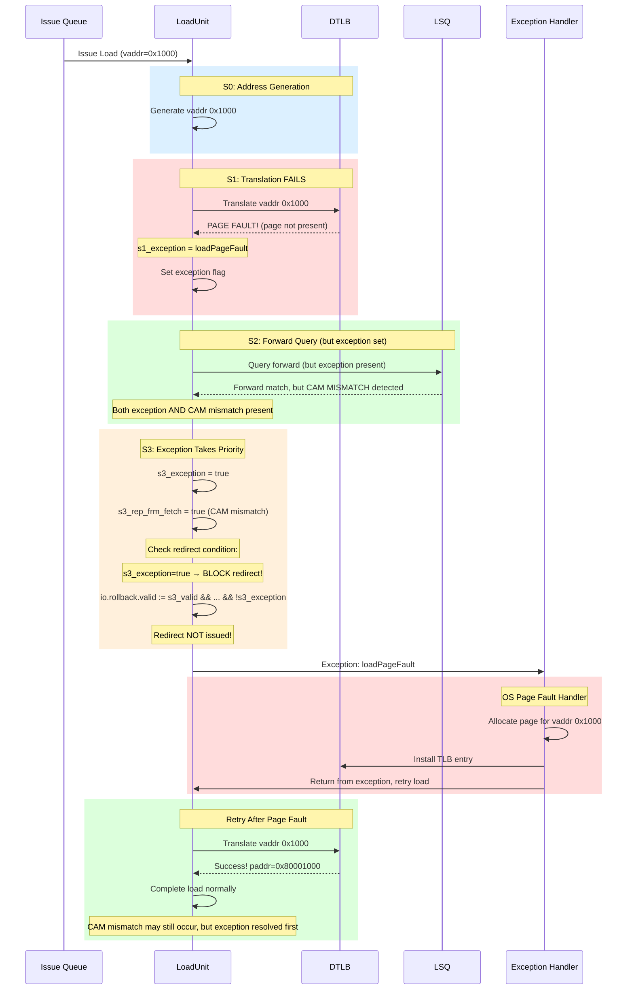

# Load Pipeline Redirect Mechanisms

## Table of Contents
1. [Overview](#overview)
2. [Redirect Types](#redirect-types)
3. [Redirect Causes in LoadPipe](#redirect-causes-in-loadpipe)
4. [Pipeline Flush Mechanism](#pipeline-flush-mechanism)
5. [Code Implementation](#code-implementation)
6. [Redirect Examples with Sequence Diagrams](#redirect-examples-with-sequence-diagrams)
7. [Performance Impact](#performance-impact)
8. [Debug and Troubleshooting](#debug-and-troubleshooting)

---

## Overview

**Redirects** (also called **rollbacks** in load context) are control flow changes initiated by the load pipeline when it detects memory ordering violations or data inconsistencies. Unlike normal replays that retry a single load instruction, redirects **flush younger instructions** from the pipeline and **restart execution** from a specific point.

### Why Redirects Are Needed

The load pipeline executes loads **speculatively and out-of-order** for performance. However, this speculation can violate:
1. **Memory consistency** (TSO model): Load-load and store-load ordering
2. **Data correctness**: Address translation or forwarding inconsistencies

When violations are detected, the pipeline must:
- **Squash speculative results** (flush younger instructions)
- **Restart execution** from the violating instruction or after it
- **Prevent incorrect architectural state** from being committed

### Redirect vs Replay

| Aspect | Replay | Redirect |
|--------|--------|----------|
| **Scope** | Single load instruction | Multiple instructions (flush pipeline) |
| **Trigger** | Resource conflict, dependency | Memory ordering violation, data inconsistency |
| **Cost** | Low (3-20 cycles) | High (10-50+ cycles) |
| **Frequency** | Common (~5-10% of loads) | Rare (<1% of loads) |
| **Examples** | Cache miss, bank conflict | Load-load violation, CAM mismatch |

---

## Redirect Types

XiangShan defines two redirect levels in `src/main/scala/xiangshan/package.scala`:

```scala
object RedirectLevel {
  def flushAfter = "b0".U  // Flush younger instructions only
  def flush      = "b1".U  // Flush this instruction and younger instructions

  def apply() = UInt(1.W)
  def flushItself(level: UInt) = level(0)
}
```

### 1. `RedirectLevel.flush` (Full Flush)

**Effect**: Flush **this instruction and all younger instructions**

**When Used**: Critical data inconsistencies that invalidate current instruction's result

**Triggers in LoadPipe**:
- **CAM mismatch** (vaddr/paddr inconsistency in store-to-load forwarding)

**Implementation** (LoadUnit.scala:1080):
```scala
io.rollback.bits.level := Mux(s3_rep_frm_fetch, RedirectLevel.flush, RedirectLevel.flushAfter)
```

**Consequences**:
- Load instruction **must re-execute** from fetch
- All younger instructions flushed from frontend and backend
- Frontend re-fetches from load's PC
- Highest cost redirect (~30-50 cycles penalty)

---

### 2. `RedirectLevel.flushAfter` (Selective Flush)

**Effect**: Flush **only younger instructions**, keep this instruction

**When Used**: Ordering violations where current instruction is correct, but younger instructions may have stale data

**Triggers in LoadPipe**:
- **Load-load violation** (younger load executed before older load completed)

**Implementation** (LoadUnit.scala:1080):
```scala
io.rollback.bits.level := Mux(s3_rep_frm_fetch, RedirectLevel.flush, RedirectLevel.flushAfter)
```

**Consequences**:
- Load instruction **commits normally**
- Only younger instructions flushed
- Frontend re-fetches from instruction after load
- Lower cost than full flush (~15-30 cycles penalty)

---

## Redirect Causes in LoadPipe

### 1. CAM Mismatch (Vaddr/Paddr Inconsistency)

**Redirect Level**: `RedirectLevel.flush`

**Detection Stage**: S3

**Root Cause**: Store-to-load forwarding used incorrect virtual-to-physical address mapping

**Scenario**:
```
Load A reads vaddr 0x1000
  S1: DTLB translates 0x1000 → paddr 0x80001000
  S1: Queries LSQ for stores matching vaddr 0x1000 + paddr 0x80001000
  S2: LSQ responds with forward data from Store B
      Forward query used: vaddr 0x1000, paddr 0x80001000
  S3: LSQ re-checks vaddr/paddr consistency (CAM check)
      Problem: Store B actually has vaddr 0x1000 → paddr 0x80002000 (different paddr!)
      Result: CAM mismatch detected → FLUSH
```

**Why This Happens**:
- Store address arrives after load queried forwarding
- TLB mapping changed between load's translation and store's translation
- Alias problem: Two virtual addresses map to different physical addresses

**Code Implementation** (LoadUnit.scala:1040-1041):
```scala
// S3: Check for vaddr/paddr mismatch from LSQ/Sbuffer forwarding
val s3_vp_match_fail = RegNext(io.lsq.forward.matchInvalid || io.sbuffer.matchInvalid) && s3_troublem
val s3_rep_frm_fetch = s3_vp_match_fail  // CAM mismatch requires full flush
```

**Redirect Generation** (LoadUnit.scala:1074-1080):
```scala
// Trigger rollback on CAM mismatch
io.rollback.valid := s3_valid && (s3_rep_frm_fetch || s3_flushPipe) && !s3_exception
io.rollback.bits.level := Mux(s3_rep_frm_fetch, RedirectLevel.flush, RedirectLevel.flushAfter)
io.rollback.bits.robIdx := s3_out.bits.uop.robIdx
io.rollback.bits.ftqIdx := s3_out.bits.uop.cf.ftqPtr
io.rollback.bits.ftqOffset := s3_out.bits.uop.cf.ftqOffset
io.rollback.bits.cfiUpdate.target := s3_out.bits.uop.cf.pc
```

**Recovery**:
1. Flush load instruction and all younger instructions
2. Frontend re-fetches from load's PC
3. Load re-executes with correct address translation
4. Forwarding query uses correct vaddr/paddr combination

---

### 2. Load-Load Violation (RAR - Read-After-Read)

**Redirect Level**: `RedirectLevel.flushAfter`

**Detection Stage**: S3

**Root Cause**: Younger load executed before older load, potentially reading stale data

**Scenario**:
```
Program Order:
  Load A (older): Read from addr 0x1000
  Load B (younger): Read from addr 0x1000

Execution Order (Out-of-Order):
  Cycle 0: Load A misses cache → enters replay queue
  Cycle 1: Load B hits cache → completes, returns data 0xAABB
  Cycle 5: Load A replays → hits cache, returns data 0xCCDD

Problem: Load B got stale data (0xAABB) because it executed before Load A
Solution: Flush Load B and re-execute with fresh data
```

**Why This Happens**:
- Load B speculatively executes while Load A waits in replay queue
- Memory location updated between Load B's execution and Load A's completion
- Load B should have seen Load A's data but didn't

**Code Implementation** (LoadUnit.scala:1042-1046):
```scala
// S3: Check for load-load violation from RAR queue
val s3_ldld_rep_inst =
    io.lsq.ldld_nuke_query.resp.valid &&
    io.lsq.ldld_nuke_query.resp.bits.rep_frm_fetch &&
    RegNext(io.csrCtrl.ldld_vio_check_enable)
val s3_flushPipe = s3_ldld_rep_inst  // Load-load violation requires flushAfter
```

**Redirect Generation** (LoadUnit.scala:1074-1080):
```scala
// Trigger rollback on load-load violation
io.rollback.valid := s3_valid && (s3_rep_frm_fetch || s3_flushPipe) && !s3_exception
io.rollback.bits.level := Mux(s3_rep_frm_fetch, RedirectLevel.flush, RedirectLevel.flushAfter)
// s3_flushPipe → RedirectLevel.flushAfter (selective flush)
```

**RAR Queue Role** (see `LoadQueueRAR.scala`):
1. **Enqueue** (S2): Load with valid data enters RAR queue if older loads pending
2. **Query** (S2): Check if younger load conflicts with older pending loads
3. **Violation Detection**: If younger load accesses same cacheline as older pending load
4. **Response** (S3): `rep_frm_fetch = true` if violation detected

**Recovery**:
1. Older load (Load A) **commits normally** with data 0xCCDD
2. Younger loads (Load B and after) **flushed**
3. Frontend re-fetches from instruction after Load A
4. Load B re-executes, now sees correct data 0xCCDD

---

### 3. Exception Blocking

**Important**: Exceptions **block redirects** to give exception handler priority

**Code Implementation** (LoadUnit.scala:1074):
```scala
// Do NOT trigger rollback if exception present
io.rollback.valid := s3_valid && (s3_rep_frm_fetch || s3_flushPipe) && !s3_exception
```

**Why**:
- Exceptions (page fault, access fault, misalignment) must trap to OS
- Redirect would discard exception information
- Exception handler has higher priority than memory ordering fixes

**Exception Priority** (from loadpipe_top.md):
```
1. loadAddrMisaligned (S0 detection)
2. loadPageFault (S1 DTLB detection)
3. loadAccessFault (S2 PMP or S3 ECC detection)
4. CAM mismatch (S3 detection, triggers flush not exception)
5. Load-load violation (S3 detection, triggers flushAfter)
```

---

## Pipeline Flush Mechanism

### Redirect Path Through Processor



### Flush Granularity

**`RedirectLevel.flush` (Full Flush)**:
```
ROB: [Inst0, Inst1, Load_A, Inst3, Inst4, Inst5]
                      ↑
                   Redirect from Load_A

After Flush:
ROB: [Inst0, Inst1]  ← Keep committed/older
                   ↑
              Load_A and younger flushed

Frontend: Re-fetch from Load_A's PC
```

**`RedirectLevel.flushAfter` (Selective Flush)**:
```
ROB: [Inst0, Inst1, Load_A, Inst3, Inst4, Inst5]
                      ↑
                   Redirect from Load_A

After Flush:
ROB: [Inst0, Inst1, Load_A]  ← Keep Load_A
                            ↑
                       Younger flushed

Frontend: Re-fetch from Inst3 (after Load_A)
```

### needFlush Logic

All pipeline stages check `robIdx.needFlush(redirect)` to determine if instruction should be killed:

**S1 Kill Logic** (LoadUnit.scala:675-679):
```scala
s1_kill := s1_fast_rep_dly_kill ||
           s1_cancel_ptr_chasing ||
           s1_in.uop.robIdx.needFlush(io.redirect) ||  // Check redirect
          (s1_in.uop.robIdx.needFlush(RegNext(io.redirect)) && !RegNext(s0_try_ptr_chasing)) ||
           RegEnable(s0_kill, false.B, io.ldin.valid || io.replay.valid || io.l2l_fwd_in.valid || io.fast_rep_in.valid)
```

**S2 Kill Logic** (LoadUnit.scala:753):
```scala
s2_kill := s2_in.uop.robIdx.needFlush(io.redirect)
```

**S3 Valid Logic** (LoadUnit.scala:1005):
```scala
val s3_valid = RegNext(s2_valid && !s2_out.isHWPrefetch && !s2_out.uop.robIdx.needFlush(io.redirect))
```

**S3 Kill Logic** (LoadUnit.scala:1012):
```scala
val s3_kill = s3_in.uop.robIdx.needFlush(io.redirect)
```

**needFlush Comparison**:
- Uses ROB index comparison: `isAfter(this.robIdx, redirect.robIdx)`
- If instruction is **after** (younger than) redirect point → flush
- If instruction is **before** (older than) redirect point → keep

---

## Code Implementation

### Redirect Bundle Structure

From `src/main/scala/xiangshan/Bundle.scala`:

```scala
class Redirect(implicit p: Parameters) extends XSBundle {
  val isRVC = Bool()                    // Is this a compressed instruction?
  val robIdx = new RobPtr               // ROB index of redirecting instruction
  val ftqIdx = new FtqPtr               // FTQ index for frontend
  val ftqOffset = UInt(log2Up(PredictWidth).W)  // Offset within fetch block
  val level = RedirectLevel()           // flush or flushAfter
  val interrupt = Bool()                // Is this an interrupt?
  val cfiUpdate = new CfiUpdateInfo     // Control flow update info

  val stFtqIdx = new FtqPtr             // For load violation predict
  val stFtqOffset = UInt(log2Up(PredictWidth).W)

  val debug_runahead_checkpoint_id = UInt(64.W)
  val debugIsCtrl = Bool()              // Is control flow redirect?
  val debugIsMemVio = Bool()            // Is memory violation redirect?

  def flushItself() = RedirectLevel.flushItself(level)
}
```

### LoadUnit Rollback Interface

From `src/main/scala/xiangshan/mem/pipeline/LoadUnit.scala`:

```scala
// Load RAR rollback
val rollback = Valid(new Redirect)
```

**Output Signals** (LoadUnit.scala:1074-1082):
```scala
io.rollback.valid := s3_valid && (s3_rep_frm_fetch || s3_flushPipe) && !s3_exception
io.rollback.bits             := DontCare
io.rollback.bits.isRVC       := s3_out.bits.uop.cf.pd.isRVC
io.rollback.bits.robIdx      := s3_out.bits.uop.robIdx
io.rollback.bits.ftqIdx      := s3_out.bits.uop.cf.ftqPtr
io.rollback.bits.ftqOffset   := s3_out.bits.uop.cf.ftqOffset
io.rollback.bits.level       := Mux(s3_rep_frm_fetch, RedirectLevel.flush, RedirectLevel.flushAfter)
io.rollback.bits.cfiUpdate.target := s3_out.bits.uop.cf.pc
io.rollback.bits.debug_runahead_checkpoint_id := s3_out.bits.uop.debugInfo.runahead_checkpoint_id
```

**Key Fields**:
- `valid`: Redirect active
- `robIdx`: Which load instruction triggers redirect
- `ftqIdx/ftqOffset`: Where to re-fetch from
- `level`: `flush` for CAM mismatch, `flushAfter` for load-load violation
- `cfiUpdate.target`: PC to restart execution

### Redirect Generator Integration

From `src/main/scala/xiangshan/backend/CtrlBlock.scala`:

```scala
class RedirectGeneratorIO(implicit p: Parameters) extends XSBundle {
  val hartId = Input(UInt(8.W))
  val exuMispredict = Vec(NumRedirect, Flipped(ValidIO(new ExuOutput)))
  val loadReplay = Flipped(ValidIO(new Redirect))  // From LoadUnit rollback
  val flush = Input(Bool())
  val redirectPcRead = new FtqRead(UInt(VAddrBits.W))
  val stage2Redirect = ValidIO(new Redirect)
  val stage3Redirect = ValidIO(new Redirect)
  val memPredUpdate = Output(new MemPredUpdateReq)
  val memPredPcRead = new FtqRead(UInt(VAddrBits.W))
  val isMisspreRedirect = Output(Bool())
  val stage2oldestOH = Output(UInt((NumRedirect + 1).W))
}
```

**Redirect Priority** (CtrlBlock.scala comments):
```
Stage1: LoadQueue, Jump, ALU0-3, Exception
         |         |      |
         |============= reg & compare =====|
                      |
Stage2:            redirect (flush backend)
                      |
                 === reg ===
                      |
Stage3:     |----- mux (exception first) -----|
                      |
              redirect (send to frontend)
```

---

## Redirect Examples with Sequence Diagrams

### Example 1: CAM Mismatch (Full Flush)

**Scenario**: Load forwards from store with incorrect paddr due to TLB aliasing



**Timeline**:
- **Cycle 0-3**: Load B executes with incorrect forward
- **Cycle 4**: CAM mismatch detected in S3
- **Cycle 5**: Redirect issued, pipeline flush starts
- **Cycle 6-10**: Frontend re-fetches, decode, rename, dispatch
- **Cycle 11-14**: Load B re-executes correctly
- **Total Penalty**: ~10-15 cycles

---

### Example 2: Load-Load Violation (Selective Flush)

**Scenario**: Younger load executes before older load, reads stale data



**Timeline**:
- **Cycle 0**: Load A misses cache, enters replay queue
- **Cycle 1**: Load B hits cache speculatively (out-of-order execution)
- **Cycle 5**: Cache refill completes with new data
- **Cycle 6**: Load A replays, detects Load B violation in RAR queue
- **Cycle 7**: Redirect issued with `flushAfter`
- **Cycle 8-12**: Load B and younger instructions re-execute
- **Total Penalty**: ~6-10 cycles (lower than CAM mismatch)

**Key Difference from CAM Mismatch**:
- Load A **commits successfully** (not flushed)
- Only **younger loads flushed and re-executed**
- Lower performance penalty

---

### Example 3: Exception Blocks Redirect

**Scenario**: Load triggers page fault, CAM mismatch ignored



**Key Points**:
- Exception has **higher priority** than redirect
- Redirect **blocked** when exception present (LoadUnit.scala:1074)
- Exception handler **resolves root cause** (page allocation)
- Load **retries after exception**, may trigger redirect on second attempt

**Why Exception Blocks Redirect**:
1. Exception must **trap to OS** for handling (page allocation, permission fix)
2. Redirect would **discard exception information**
3. Exception is **architectural state change** (more important than speculation fix)
4. After exception resolved, load naturally re-executes with correct behavior

---

## Performance Impact

### Redirect Costs

| Redirect Type | Cost (Cycles) | Frequency | Total Impact |
|---------------|---------------|-----------|--------------|
| **CAM Mismatch (flush)** | 30-50 cycles | <0.1% of loads | ~0.03-0.05 CPI |
| **Load-Load Violation (flushAfter)** | 15-30 cycles | <0.5% of loads | ~0.08-0.15 CPI |
| **Combined Redirect Overhead** | - | <0.6% of loads | ~0.11-0.20 CPI |

### Comparison with Other Penalties

| Event | Cost | Frequency | Impact |
|-------|------|-----------|--------|
| L1 Cache Miss | 8-15 cycles | 5-10% | 0.4-1.5 CPI |
| TLB Miss | 10-100 cycles | 0.5-2% | 0.05-2.0 CPI |
| Branch Misprediction | 10-20 cycles | 2-5% | 0.2-1.0 CPI |
| **Redirects** | **15-50 cycles** | **<0.6%** | **0.11-0.20 CPI** |
| Fast Replay | 1-2 cycles | 3-5% | 0.03-0.10 CPI |

**Key Insights**:
- Redirects are **rare but expensive** (high cost per occurrence)
- Combined impact **<0.2 CPI** (relatively small compared to cache misses)
- **Correctness > Performance**: Accepting redirect cost ensures memory consistency

---

### Optimization Techniques

**1. Reduce CAM Mismatches**:
- Better TLB management (reduce aliasing)
- Delay store-to-load forwarding until addresses stable
- Speculative forwarding hints from store queue

**2. Reduce Load-Load Violations**:
- Age-based load scheduling (prioritize older loads)
- RAR queue capacity increase
- Better cache miss prediction (reduce replay queue pressure)

**3. Fast Recovery**:
- Precise redirect PC calculation (minimize re-fetch overhead)
- Frontend FTQ buffering (quick restart)
- Checkpoint-based recovery (future work)

---

## Debug and Troubleshooting

### Debug Signals

**Redirect Trigger Signals** (LoadUnit.scala):
```scala
// S3 debug signals
val s3_vp_match_fail = RegNext(io.lsq.forward.matchInvalid || io.sbuffer.matchInvalid) && s3_troublem
val s3_rep_frm_fetch = s3_vp_match_fail
val s3_ldld_rep_inst = io.lsq.ldld_nuke_query.resp.valid &&
                       io.lsq.ldld_nuke_query.resp.bits.rep_frm_fetch &&
                       RegNext(io.csrCtrl.ldld_vio_check_enable)
val s3_flushPipe = s3_ldld_rep_inst
val s3_exception = ExceptionNO.selectByFu(s3_in.uop.cf.exceptionVec, lduCfg).asUInt.orR

// Redirect output
io.rollback.valid := s3_valid && (s3_rep_frm_fetch || s3_flushPipe) && !s3_exception
io.rollback.bits.level := Mux(s3_rep_frm_fetch, RedirectLevel.flush, RedirectLevel.flushAfter)
```

**DontTouch Signals for Debugging**:
```scala
dontTouch(s3_vp_match_fail)      // CAM mismatch indicator
dontTouch(s3_rep_frm_fetch)      // Full flush trigger
dontTouch(s3_ldld_rep_inst)      // Load-load violation trigger
dontTouch(s3_flushPipe)          // Selective flush trigger
```

### Redirect Bundle Debug Fields

```scala
io.rollback.bits.debugIsCtrl := false.B        // Not a control flow redirect
io.rollback.bits.debugIsMemVio := true.B       // This IS a memory violation redirect
```

### Common Issues

**Issue 1: High CAM Mismatch Rate**
- **Symptom**: Frequent `s3_vp_match_fail` assertions
- **Check**: TLB aliasing patterns, page coloring issues
- **Debug**: Monitor `io.lsq.forward.matchInvalid` and `io.sbuffer.matchInvalid`

**Issue 2: Excessive Load-Load Violations**
- **Symptom**: Frequent `s3_ldld_rep_inst` assertions
- **Check**: RAR queue capacity, replay queue congestion
- **Debug**: Monitor RAR queue occupancy and cache miss rate

**Issue 3: Redirect Not Triggering**
- **Symptom**: Violation detected but no redirect issued
- **Check**: Exception blocking logic (`s3_exception`)
- **Debug**: Check if page fault or other exception present

### Waveform Analysis

**Key Signals to Monitor**:
```
loadunit.io.rollback.valid           // Redirect triggered?
loadunit.io.rollback.bits.level      // flush (1) or flushAfter (0)?
loadunit.io.rollback.bits.robIdx     // Which load triggered?
loadunit.s3_vp_match_fail            // CAM mismatch?
loadunit.s3_ldld_rep_inst            // Load-load violation?
loadunit.s3_exception                // Exception blocking redirect?
rar_queue.violation_detected         // RAR queue saw violation?
lsq.forward.matchInvalid             // LSQ reported mismatch?
```

**Expected Patterns**:
1. **CAM Mismatch**:
   - `s3_vp_match_fail = 1` → `io.rollback.valid = 1` (if no exception)
   - `io.rollback.bits.level = 1` (flush)

2. **Load-Load Violation**:
   - `s3_ldld_rep_inst = 1` → `io.rollback.valid = 1` (if no exception)
   - `io.rollback.bits.level = 0` (flushAfter)

3. **Exception Blocking**:
   - `s3_vp_match_fail = 1` AND `s3_exception = 1` → `io.rollback.valid = 0`

---

## Summary

### Redirect Causes Quick Reference

| Cause | Redirect Level | Detection Stage | Frequency | Cost | Description |
|-------|----------------|-----------------|-----------|------|-------------|
| **CAM Mismatch** | flush | S3 | <0.1% | 30-50 cyc | Vaddr/paddr inconsistency in forwarding |
| **Load-Load Violation** | flushAfter | S3 | <0.5% | 15-30 cyc | Younger load executed before older load |
| **Exception** | (blocked) | S1-S3 | 0.5-2% | N/A | Page fault, access fault, misalignment |

### Code Locations

| Component | File | Lines | Description |
|-----------|------|-------|-------------|
| Redirect detection | LoadUnit.scala | 1040-1046 | CAM mismatch and load-load violation detection |
| Redirect generation | LoadUnit.scala | 1074-1082 | Rollback signal assignment |
| Kill logic | LoadUnit.scala | 675-679, 753, 1005, 1012 | Pipeline flush on redirect |
| Redirect bundle | Bundle.scala | 302-321 | Redirect signal structure |
| Redirect levels | package.scala | 142-150 | flush vs flushAfter definition |

### Best Practices

1. **Monitor redirect rate**: Should be <0.6% of loads in production
2. **Check exception interaction**: Verify exceptions properly block redirects
3. **Validate RAR/RAW queues**: Ensure sufficient capacity to avoid false violations
4. **Profile redirect causes**: Identify if CAM mismatches or load-load violations dominate
5. **Test corner cases**: TLB aliasing, cache line sharing, speculative execution limits

---

**Document Version**: 1.0
**Last Updated**: 2026-01-29
**Related Documents**:
- `loadpipe_top.md`: Overall load pipeline architecture
- `loadpipe_S3.md`: S3 stage hazard detection details
- `replay.md`: Fast vs slow replay mechanisms
- `super_replay.md`: L2 hint-based replay optimization
