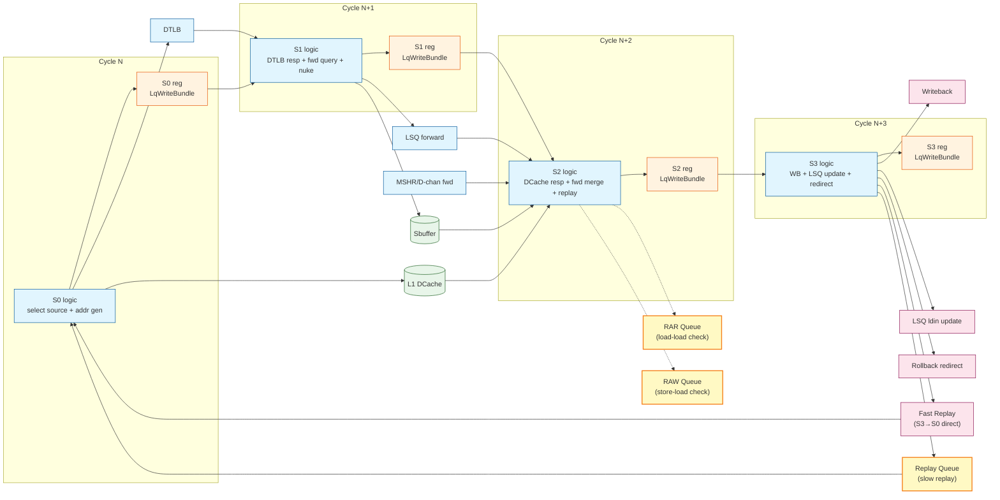

// See README.md for license details.

# Load Pipeline Top (S0-S3 High-Level View)

This file summarizes LoadUnit pipeline behavior across S0-S3 and ties together
`loadpipe_S0.md` ~ `loadpipe_S3.md`. It focuses on **high-level flow**, **cycle timing**,
and **module interactions**.

## Overview

The **Load Pipeline** is a 4-stage (S0-S3) microarchitectural pipeline that executes load instructions in the XiangShan processor. It handles:
- **Memory address translation** via DTLB
- **Cache access** to L1 DCache
- **Store-to-load forwarding** from LSQ and Sbuffer
- **Speculative execution** with replay and rollback mechanisms
- **Exception detection** (page faults, access faults, misalignment)
- **Memory ordering** enforcement (load-load, store-load violations)

The pipeline is designed for **high throughput** (1 load per cycle) and **low latency** (3-4 cycles for L1 hits) while maintaining **memory consistency** and **precise exceptions**.

### Key Design Features

1. **Multiple data sources**: DCache, LSQ forwarding, Sbuffer forwarding, MSHR/D-channel forwarding
2. **Replay mechanisms**: Fast replay (1-2 cycles) for transient conflicts, slow replay (3+ cycles) for complex dependencies
3. **Super replay**: L2 hint-based predictive scheduling for cache miss loads (see `super_replay.md`)
4. **Speculative execution**: Out-of-order load execution with violation detection
5. **Precise exceptions**: All exceptions detected before architectural state changes

## Quick Pointers
- **S0**: Source arbitration, address generation, DTLB/DCache request issue
- **S1**: DTLB response, forward queries to LSQ/Sbuffer, early violation detection
- **S2**: DCache response, forward data merge, replay cause evaluation, fast/slow replay decision
- **S3**: Data selection, writeback to register file, LSQ update, hazard detection, rollback/redirect

---

## Pipeline Diagram (Stages, Modules, Cycles)



**Notes:**
- This diagram shows the **nominal pipeline** with one stage per cycle. Stalls can stretch this.
- Forwarding and replay decision logic span S1-S3, but the key handoffs are S1->S2 and S2->S3.
- **Queues shown:**
  - **Replay Queue**: Holds loads with slow replay causes (TLB miss, cache miss, forward fail, etc.)
  - **RAR Queue**: Tracks load-load ordering violations (Read-After-Read)
  - **RAW Queue**: Tracks store-load ordering violations (Read-After-Write)
  - **Fast Replay Path**: Direct S3→S0 bypass for transient conflicts (bank conflict, MSHR NACK, way predictor fail)

---

## Stage-by-Stage Summary (High-Level)

### S0: Source Selection and Request Issue

**Primary Function**: Arbitrate between multiple load sources and issue memory requests

**Key Operations**:
- **Source selection** (priority order):
  1. **Super replay** (L2 hint-driven, D-channel forward ready) - from Replay Queue with C_DM cause
  2. **Fast replay** (bank conflict, MSHR NACK, way predictor fail recovery) - direct from S3
  3. **Normal replay** (from LSQ Replay Queue) - slow replay path for complex dependencies
  4. **High-confidence hardware prefetch** (speculative loads with confidence > 0)
  5. **Integer issue** (new loads from dispatch) or software prefetch
  6. **Vector issue** (TODO: not yet implemented)
  7. **Load-to-load forward** (pointer chasing optimization)
  8. **Low-confidence hardware prefetch** (confidence = 0)

- **Address generation**: Compute virtual address from base + offset
- **Request issue**: Send to DTLB (translation) and DCache (speculative access)
- **Blocking logic**: Super replay loads set per-entry blocking to prevent normal replay scheduling

**Queue Interactions**:
- **Replay Queue**: Provides normal and super replay loads (source 1 & 3)
- **Fast Replay Path**: Direct S3→S0 bypass (source 2)
- **RAR/RAW Queues**: May block loads via C_RAR/C_RAW NACK (checked in S2)

**Outputs**: `s0_out` bundle containing vaddr, mask, uop, replay info

**Critical Path**: Source arbitration → address generation → DTLB/DCache request

---

### S1: Translation and Forward Query

**Primary Function**: Complete address translation and initiate store-to-load forwarding

**Key Operations**:
- **DTLB response**: Receive physical address, detect TLB miss/page fault
- **Exception detection**: loadPageFault, loadAddrMisaligned
- **Forward queries** (parallel):
  - LSQ forward query (vaddr + paddr)
  - Sbuffer forward query (vaddr + paddr)
  - MSHR forward query (for super replay loads)
- **Early violation detection**: Store-load nuke query (vaddr-based speculation check)
- **Control logic**: `s1_troublem` gating (filters prefetch/exception paths)

**Outputs**: `s1_out` bundle with paddr, exception flags, query tokens

**Critical Path**: DTLB response → forward query issue

**Super Replay Handling**: Queries MSHR for pending refill data (see `loadpipe_S1.md` for details)

---

### S2: Data Response and Replay Decision

**Primary Function**: Collect data from cache/forwards and determine if replay is needed

**Key Operations**:
- **DCache response**: Receive cache data or miss/conflict signals
  - Cache hit: data valid
  - Cache miss: `s2_dcache_miss = true`
  - Bank conflict: `s2_bank_conflict = true`
  - MSHR NACK: `s2_mq_nack = true`
  - Way predictor fail: `s2_wpu_fail = true`

- **Forward data merge** (byte-level priority):
  1. LSQ forward (highest priority for each byte)
  2. Sbuffer forward
  3. DCache data
  4. D-channel forward (super replay path)
  5. MSHR forward (super replay path)

- **Violation detection queues**:
  - **RAR Queue**: Query for load-load ordering check
    - Condition: Load has valid data and can query
    - Enqueue: If uncompleted older loads exist in same cacheline
    - NACK: If RAR queue full → `C_RAR` replay cause
  - **RAW Queue**: Query for store-load ordering check
    - Condition: Load has valid data and can query
    - Enqueue: If uncompleted older stores exist
    - NACK: If RAW queue full → `C_RAW` replay cause

- **Replay cause evaluation**: Prioritized encoding of why replay is needed
  - `C_TM`: TLB miss
  - `C_MA`: Memory ambiguity (store-load conflict)
  - `C_FF`: Forward fail (partial forward, need cache)
  - `C_DM`: DCache miss
  - `C_DR`: DCache replay (transient)
  - `C_WF`: Way predictor fail
  - `C_BC`: Bank conflict
  - `C_RAR`: RAR queue full (load-load check failed)
  - `C_RAW`: RAW queue full (store-load check failed)
  - `C_NK`: Nuke (violation detected)

- **Fast vs slow replay decision**:
  - **Fast**: Transient conflicts (bank, MSHR NACK, way predictor, safe nuke) → 1-2 cycle retry via S3→S0 path
  - **Slow**: Complex dependencies (TLB miss, forward fail, cache miss, RAR/RAW NACK) → 3+ cycle retry via Replay Queue

**Outputs**: `s2_out` bundle with data, forward masks, replay info

**Critical Path**: DCache response + forward merge → replay decision

**Queue Interactions**:
- **RAR/RAW Queues**: Queried for violation detection, may generate NACK
- **Replay Queue**: Will receive entry if replay needed (in S3)

**See Also**: `replay.md` for fast vs slow replay details, `loadpipe_S2.md` for forward merge algorithm

---

### S3: Writeback and Hazard Resolution

**Primary Function**: Final data selection, writeback, and late hazard detection

**Key Operations**:
- **Data selection**: Choose between cache path and uncache path
  - Cache path: Merge DCache + forwards (LSQ/Sbuffer/D-channel/MSHR)
  - Uncache path: MMIO completion from LSQ

- **Hazard detection** (see `loadpipe_S3.md` for details):
  1. **ECC delayed error**: Data corruption detected 1 cycle late → exception
  2. **CAM mismatch**: Vaddr/paddr inconsistency in forwarding → flush
  3. **Load-load violation**: Speculative reordering violation → flushAfter
  4. **Exceptions**: Page fault, access fault, misalignment → trap
  5. **Fast replay cancellation**: Super replay blocks fast replay → downgrade to slow
  6. **D-channel forward suppression**: Miss suppressed by D-channel data → complete

- **Writeback control**:
  - Writeback if `!rep_info.need_rep && !mmio && !exception`
  - Suppress writeback on replay or exception

- **LSQ update**: Write final status/data to load queue entry via `io.lsq.ldin`

- **Replay queue management**:
  - **Fast replay**: Direct S3→S0 if eligible (transient conflicts)
  - **Slow replay**: Enqueue to Replay Queue if:
    - Not fast replay eligible, OR
    - Fast replay canceled (super replay arrived or dcache not ready)
  - **Entry allocation**: Reuse existing entry if load came from replay, otherwise allocate new
  - **Blocking flag**: Set based on replay cause (TLB miss, cache miss, etc.)

- **Rollback/redirect**:
  - CAM mismatch → `RedirectLevel.flush` (most aggressive)
  - Load-load violation → `RedirectLevel.flushAfter` (younger instructions only)
  - Exceptions block rollback (exception handler takes control)

**Outputs**: Writeback to register file, LSQ update, rollback redirect, replay queue enqueue

**Critical Path**: Hazard detection → writeback/rollback decision

**Queue Interactions**:
- **Replay Queue**: Receives loads that need slow replay
- **Fast Replay Path**: Emits loads for fast retry (S3→S0 direct)
- **LSQ**: Updates load status for commit

**D-Channel Suppression**: Clears `dcache_miss` if D-channel provided data, avoiding unnecessary replay

---

## Timing Table (Typical Path)
| Cycle | Stage | Major actions |
|---|---|---|
| N | S0 | Source select, vaddr/mask gen, DTLB/DCache req |
| N+1 | S1 | DTLB resp, forward query, early nuke, build `s1_out` |
| N+2 | S2 | DCache resp, forward merge, replay cause eval, build `s2_out` |
| N+3 | S3 | Writeback or replay, LSQ update, rollback if needed |

---

## Data Flow Paths

The load pipeline supports multiple data sources with different latencies and priorities. Understanding these paths is critical for performance analysis.

### Path 1: DCache Hit (Nominal Path)
**Latency**: 3 cycles (S0 → S1 → S2 → S3 writeback)

```
Cycle N:   S0 issues DCache request
Cycle N+1: S1 DTLB translates, no forward needed
Cycle N+2: S2 DCache returns data, no replay causes
Cycle N+3: S3 writebacks to register file
```

**Characteristics**:
- Fastest path, no conflicts or dependencies
- DCache hit in S2, no forwarding needed
- No exceptions, no replay causes
- Writeback in cycle N+3

---

### Path 2: Store-to-Load Forward (LSQ/Sbuffer)
**Latency**: 3 cycles (same as cache hit)

```
Cycle N:   S0 issues request
Cycle N+1: S1 queries LSQ/Sbuffer with vaddr+paddr
Cycle N+2: S2 receives forward data, merges with DCache (if partial)
           Forward mask determines which bytes come from LSQ vs cache
Cycle N+3: S3 writebacks merged data
```

**Forward Priority (per byte)**:
1. LSQ forward (youngest matching store)
2. Sbuffer forward
3. DCache data

**Partial Forward**: If LSQ/Sbuffer only provides some bytes, merge with DCache for remaining bytes

**See**: `loadpipe_S2.md` section "Forward Merge: Detailed Algorithm"

---

### Path 3: Cache Miss with Super Replay
**Latency**: ~11 cycles without super replay, ~8 cycles with super replay (3 cycle savings)

**Without Super Replay** (traditional):
```
Cycle N:   S0 issues request
Cycle N+1: S1 translation
Cycle N+2: S2 detects cache miss, triggers slow replay
Cycle N+3: S3 writes to LSQ replay queue, blocks scheduling
...        Wait for cache refill to complete
Cycle N+8: Cache refill completes
Cycle N+9: LSQ unblocks, load scheduled for replay
Cycle N+10: S0-S2 re-execute
Cycle N+11: S3 writeback with cache data
```

**With Super Replay** (optimized):
```
Cycle N:   S0 issues request
Cycle N+1: S1 translation
Cycle N+2: S2 detects cache miss, triggers slow replay
Cycle N+3: S3 writes to LSQ replay queue, sets blocking=true
Cycle N+4: L2 hint arrives (2-3 cycles before D-channel data)
           blocking(entry) := false (early unblock!)
Cycle N+5: Load scheduled as super replay
Cycle N+6: S0 issues super replay, queries MSHR
Cycle N+7: S1 MSHR forward query, D-channel data arrives in S2
Cycle N+8: S2 D-channel forwards data directly, S3 writeback
```

**Key Innovation**: L2 hint predicts D-channel arrival, allowing load to enter pipeline at precise time to catch D-channel data, avoiding double cache access (refill write + replay read).

**See**: `super_replay.md` for complete mechanism

---

### Path 4: TLB Miss
**Latency**: Variable (10-100+ cycles depending on page table walk)

```
Cycle N:   S0 issues request
Cycle N+1: S1 detects TLB miss, sets exception
Cycle N+2: S2 carries TLB miss cause (C_TM)
Cycle N+3: S3 writes to LSQ with slow replay cause
...        Hardware page table walker fetches page table entries
Cycle N+X: TLB refill completes
Cycle N+X+1: Load replays from LSQ, now hits DTLB
Cycle N+X+4: Writeback
```

**Blocking**: TLB miss triggers slow replay with blocking=true until TLB refill completes

---

### Path 5: Bank Conflict (Fast Replay)
**Total Latency**: 7-9 cycles (4-5 cycle penalty over normal hit)
**Penalty**: +4-5 cycles compared to normal L1 hit

```
=== First Attempt (Bank Conflict) ===
Cycle N:   S0 issues request
Cycle N+1: S1 translation
Cycle N+2: S2 detects bank conflict (another load accessing same bank)
           Sets s2_bank_conflict=true, s2_fast_rep=true
Cycle N+3: S3 NO WRITEBACK (suppressed by need_rep flag)
           Emits fast replay to S0

=== Fast Replay Loop (1-2 cycles) ===
Cycle N+4: Load re-enters S0 (1 cycle fast replay), OR
Cycle N+5: Load re-enters S0 (2 cycles if S0 busy/DCache busy)

=== Second Attempt (Success) ===
Cycle N+4: S0 re-issues (bank now available)
Cycle N+5: S1 translation
Cycle N+6: S2 cache hit (no conflict)
Cycle N+7: S3 writeback (or N+8 with data_delayed)
```

**Key Point**: First attempt reaches S3 but **does NOT writeback** because replay is needed (LoadUnit.scala:1060):
```scala
s3_out.valid := s3_valid && !io.lsq.ldin.bits.rep_info.need_rep && !s3_in.mmio
```

**Total Time**:
- Best case: 7 cycles (3 for failed attempt + 1 fast replay + 3 for success)
- Common case: 8 cycles (3 + 1 + 4 with data_delayed)
- Worst case: 9 cycles (3 + 2 + 4 with stall and data delay)

**Fast Replay**: Bypasses LSQ queue, direct S3→S0 path for low-latency retry

**Cancellation**: If super replay arrives in cycle N+3, fast replay canceled, falls back to slow replay

**See**: `replay.md` for fast vs slow comparison

---

### Path 6: MMIO/Uncached Load
**Latency**: Variable (10-1000+ cycles depending on device)

```
Cycle N:   S0 issues MMIO load
Cycle N+1: S1 detects uncacheable address, sets mmio=true
Cycle N+2: S2 skips cache, sends to LSQ uncache buffer
Cycle N+3: S3 skips writeback, waits for uncache completion
...        LSQ issues uncache request to bus
...        Device responds
Cycle N+X: LSQ signals uncache completion
Cycle N+X: S3 writes back uncache data (bypassing pipeline)
```

**Characteristics**:
- No caching, no forwarding, strictly ordered
- Bypasses normal pipeline for data path
- Writeback via `io.lsq.uncache` interface

---

## Replay Mechanisms (Fast vs Slow)

### Fast Replay
**Conditions**:
```scala
s2_fast_rep = !s2_mem_amb && !s2_tlb_miss && !s2_fwd_fail &&
              (s2_dcache_fast_rep || s2_nuke_fast_rep) && s2_troublem
```

**Triggers**:
- Bank conflict (`s2_bank_conflict`)
- MSHR NACK (`s2_mq_nack`)
- Way predictor fail (`s2_wpu_fail`)
- Safe nuke (violation detected, but no younger loads affected)

**Path**: S3 → S0 direct (1 cycle), bypasses LSQ queue

**Latency**: +1-2 cycles retry penalty

**Cancellation**: Super replay arrival or `!dcache.req.ready` causes downgrade to slow replay

---

### Slow Replay
**Conditions**: Any replay cause that doesn't qualify for fast replay

**Triggers**:
- TLB miss (`C_TM`)
- Memory ambiguity (`C_MA`)
- Forward fail (`C_FF`)
- DCache miss (`C_DM`)
- Nuke requiring flush (`C_NK`)

**Path**: S3 → LSQ replay queue → arbitration → S0 (3+ cycles)

**Latency**: +3-100+ cycles depending on cause and blocking

**Blocking**: Load marked with `blocking=true` until dependency resolves (TLB refill, cache refill, etc.)

**Priority**: Normal replay is 3rd priority in S0 (after super replay and fast replay)

---

## Load Pipeline Queues

The load pipeline uses several specialized queues to manage replays and detect memory ordering violations:

### Replay Queue (LoadQueueReplay)
**Size**: Configurable (LoadQueueReplaySize)
**Purpose**: Holds loads that need to be replayed due to complex dependencies
**Location**: Part of LSQ (Load/Store Queue)

**Entry Fields**:
- `allocated`: Entry is valid and in use
- `scheduled`: Entry has been scheduled for replay
- `uop`: Micro-op information (ROB index, LQ index, etc.)
- `vaddr`: Virtual address
- `cause`: Replay cause (one-hot encoding of C_MA, C_TM, C_FF, C_DM, etc.)
- `blocking`: Load is blocked waiting for dependency to resolve
- `blockSqIdx`: Store queue index that blocks this load (for C_MA, C_FF)
- `missMSHRId`: MSHR entry tracking cache miss (for C_DM)
- `tlbHintId`: TLB hint ID (for C_TM)
- `replacementUpdated`: Has updated cache replacement already
- `replayCarry`: Way prediction carry-over information

**Replay Causes** (priority from high to low):
1. `C_MA` (Memory Ambiguity): Store-load violation detected
2. `C_TM` (TLB Miss): DTLB miss, waiting for page table walk
3. `C_FF` (Forward Fail): Store-to-load forward failed, need cache data
4. `C_DR` (DCache Replay): MSHR NACK or other transient cache conflict
5. `C_DM` (DCache Miss): Cache miss, waiting for refill
6. `C_WF` (Way Predictor Fail): Way prediction misprediction
7. `C_BC` (Bank Conflict): Cache bank conflict
8. `C_RAR` (RAR NACK): RAR queue full
9. `C_RAW` (RAW NACK): RAW queue full
10. `C_NK` (Nuke): Store-load violation requiring flush

**Scheduling Priority**:
1. **Super replay**: Cache miss loads with L2 hint (highest priority)
2. **Higher priority replays**: Cache miss (C_DM) or forward fail (C_FF)
3. **Lower priority replays**: All other causes
4. **Program order**: Within same priority, oldest instruction first

**Blocking Conditions**:
- `C_MA`: Blocked until older store address is ready
- `C_TM`: Blocked until TLB refill completes
- `C_FF`: Blocked until store data is ready
- `C_DM`: Blocked until L2 hint arrives (early unblock via super replay)
- `C_RAR`: Blocked until RAR queue has space
- `C_RAW`: Blocked until RAW queue has space
- Other causes: Not blocked, can replay immediately

**Enqueue**: From S3 when load needs replay (`rep_info.need_rep`)
**Dequeue**: Scheduled to S0 when not blocked and resources available
**Flush**: On redirect/exception (robIdx.needFlush)

---

### RAR Queue (LoadQueueRAR)
**Size**: Configurable (LoadQueueRARSize)
**Purpose**: Detect **load-load ordering violations** (younger load executed before older load)
**Location**: Part of LSQ

**Entry Fields**:
- `allocated`: Entry is valid
- `uop`: Micro-op information
- `paddr`: Physical address (64-bit aligned block address)
- `released`: DCache released this line (evicted or invalidated)

**Operation**:
1. **Enqueue** (S2): When a load **has valid data** and there are **uncompleted older loads** in same cacheline
2. **Query** (S2): Check if younger load conflicts with older pending loads
3. **Violation Detection**: If younger load accesses same cacheline as older pending load
   - **Before older load completes**: Potential reordering violation
   - **Trigger**: `flushAfter` redirect to re-execute younger load
4. **Dequeue**: When load commits at ROB head or gets flushed
5. **Release handling**: Track cache line evictions to detect violations

**Why needed**: RISC-V memory model requires loads to execute in program order within same address. RAR queue catches cases where younger load speculatively executed before older load.

**Example Violation**:
```
Cycle 0: Load A (older) misses cache → enters replay queue
Cycle 1: Load B (younger, same address) hits cache → completes
Cycle 5: Load A replays → hits cache
Problem: Load B got stale data! Should have seen A's data.
Solution: RAR queue detects conflict, triggers flushAfter to re-execute Load B
```

---

### RAW Queue (LoadQueueRAW)
**Size**: Configurable (LoadQueueRAWSize)
**Purpose**: Detect **store-load ordering violations** (load executed before older store)
**Location**: Part of LSQ

**Entry Fields**:
- `allocated`: Entry is valid
- `uop`: Micro-op information
- `paddr`: Physical address
- `mask`: Byte mask (which bytes accessed)
- `datavalid`: Whether load got valid data

**Operation**:
1. **Enqueue** (S2): When a load **has valid data** and there are **uncompleted older stores**
2. **Query** (S1/S2): Check if store address matches pending load
3. **Violation Detection**: If store writes to address that overlapping with younger load
   - **Store address arrives late**: Store should have forwarded but didn't
   - **Trigger**: `flush` redirect to re-execute from load
4. **Dequeue**: When load commits or gets flushed
5. **Store monitoring**: Track store address arrivals to detect violations

**Why needed**: Loads may execute speculatively before older store addresses are known. RAW queue catches cases where load should have received forwarded data from store.

**Example Violation**:
```
Cycle 0: Store A (older, address unknown) → in store queue
Cycle 1: Load B (younger) speculatively executes → reads cache
Cycle 2: Store A address arrives → paddr matches Load B!
Problem: Load B should have received forwarded data from Store A
Solution: RAW queue detects conflict, triggers flush to re-execute Load B
```

---

### Fast Replay Path
**Path**: S3 → S0 direct (bypasses Replay Queue)
**Latency**: 1-2 cycles
**Purpose**: Low-latency retry for **transient conflicts** that resolve quickly

**Triggers**:
- **Bank conflict** (`s2_bank_conflict`): Another load accessing same cache bank
- **MSHR NACK** (`s2_mq_nack`): Miss queue full, retry next cycle
- **Way predictor fail** (`s2_wpu_fail`): Way prediction misprediction
- **Safe nuke** (`s2_nuke_fast_rep`): Violation detected but no flush needed

**Conditions for Fast Replay**:
```scala
s2_fast_rep = !s2_mem_amb && !s2_tlb_miss && !s2_fwd_fail &&
              (s2_dcache_fast_rep || s2_nuke_fast_rep) && s2_troublem
```

**Cancellation**: Fast replay downgrades to slow replay if:
- Super replay arrives (higher priority)
- DCache not ready (`!dcache.req.ready`)
- Violation requires flush

**Flow**:
```
Cycle N:   Load enters S0
Cycle N+1: Load in S1
Cycle N+2: Load in S2, detects bank conflict
Cycle N+3: Load in S3, emits fast replay to S0
Cycle N+4: Load re-enters S0 (1 cycle loop)
```

**Advantage**: Avoids queue allocation overhead for transient conflicts

---

### Uncache Buffer (UncacheBuffer)
**Size**: Configurable (same as load queue size)
**Purpose**: Handle **MMIO and uncached loads**
**Location**: Part of LSQ

**Entry Fields**:
- Similar to load queue entries
- Tracks uncached load requests to devices
- Handles strictly-ordered device accesses

**Operation**:
1. **Detection** (S2): Load to uncacheable address (detected by PMP)
2. **Buffering**: Store load in uncache buffer
3. **Issue**: Send uncached request to TileLink bus (strictly ordered)
4. **Completion**: Device responds, data written back via separate path
5. **Writeback**: Bypass normal pipeline, use `io.lsq.uncache` interface

**Characteristics**:
- No caching, no speculation, no forwarding
- Strictly ordered (cannot reorder with other memory operations)
- Variable latency (10-1000+ cycles depending on device)
- Blocks until device responds

---

### Unaligned Loads
**Note**: There is **NO separate unaligned queue** in XiangShan.

**Handling**:
- **Detection** (S0): Address alignment check based on access size
  ```scala
  s0_addr_aligned = LookupTree(fuOpType, List(
    "b00".U -> true.B,                          // byte: always aligned
    "b01".U -> (vaddr(0) === 0.U),             // half: 2-byte aligned
    "b10".U -> (vaddr(1,0) === 0.U),           // word: 4-byte aligned
    "b11".U -> (vaddr(2,0) === 0.U)            // double: 8-byte aligned
  ))
  ```
- **Exception** (S0): Set `loadAddrMisaligned` exception if not aligned
- **Result**: Unaligned loads trap to exception handler, no replay/queue

**Rationale**: RISC-V traps on unaligned loads (unless `Zicclsm` extension enabled, which XiangShan doesn't implement). Software must handle unalignment via trap handler.

---

## Performance Characteristics

### Load Latency (Best Case to Worst Case)

| Scenario | Latency (cycles) | Notes |
|----------|------------------|-------|
| L1 DCache hit | 3-4 | S0→S1→S2→S3 writeback |
| Store-to-load forward | 3-4 | Same as cache hit, data from LSQ/Sbuffer |
| Bank conflict (fast replay) | 7-9 | 3 failed + 1-2 replay + 3-4 retry (penalty: +4-5) |
| Way predictor fail (fast replay) | 7-9 | 3 failed + 1-2 replay + 3-4 retry (penalty: +4-5) |
| MSHR NACK (fast replay) | 7-9 | 3 failed + 1-2 replay + 3-4 retry (penalty: +4-5) |
| Cache miss (no super replay) | 11-20 | Wait for L2 refill + replay |
| Cache miss (with super replay) | 8-15 | 3 cycle savings via D-channel forward |
| TLB miss (L2 TLB hit) | 13-20 | Page table walk latency |
| TLB miss (page fault) | 100-1000+ | Exception handler, OS page allocation |
| MMIO/uncached | 50-1000+ | Device-dependent latency |

### Throughput

- **Peak**: 1 load per cycle (assuming no conflicts)
- **Sustained**: 0.8-0.9 loads per cycle (accounting for bank conflicts, replays)
- **Bottlenecks**:
  - Bank conflicts (multiple loads to same cache bank)
  - LSQ capacity (load queue full)
  - Replay queue capacity (too many pending replays)
  - Memory bandwidth (L1 miss rate × L2 latency)

### Critical Paths

1. **S0 source arbitration**: 8-way priority encoder, affects cycle time
2. **S2 forward merge**: Byte-level mux across 4 sources (LSQ/Sbuffer/DCache/D-channel)
3. **S2 replay decision**: Priority encoder over 9 replay causes
4. **S3 hazard detection**: Multiple parallel checks (ECC, CAM, LDLD, exceptions)

---

## Common Load Scenarios (Timing Examples)

### Scenario 1: Simple L1 Hit
```
Cycle 0: S0 selects from issue queue, generates vaddr 0x1000
         Issues DTLB and DCache requests

Cycle 1: S1 DTLB returns paddr 0x8000_1000
         No forwarding needed (no matching stores)
         Queries LSQ/Sbuffer (returns no match)

Cycle 2: S2 DCache returns data 0xDEADBEEF
         No forward masks, uses DCache data directly
         No replay causes (hit, no conflicts)

Cycle 3: S3 Writeback data 0xDEADBEEF to register x10
         LSQ updated with completion status
```

**Total**: 3 cycles, ideal case

---

### Scenario 2: Store-to-Load Forward (Full)
```
Background: Store to addr 0x1000 with data 0xCAFEBABE pending in LSQ

Cycle 0: S0 Load from vaddr 0x1000 (same address as pending store)

Cycle 1: S1 DTLB returns paddr 0x8000_1000
         Queries LSQ: finds matching store (vaddr + paddr match)
         LSQ forward.forwardMask = 0xF (all bytes)
         LSQ forward.forwardData = 0xCAFEBABE

Cycle 2: S2 DCache may or may not hit (doesn't matter)
         Forward merge: forwardMask(all) = 1, use LSQ data
         Merged data = 0xCAFEBABE (from LSQ)
         No replay causes

Cycle 3: S3 Writeback data 0xCAFEBABE (forwarded from store)
```

**Total**: 3 cycles, bypass cache via forwarding

---

### Scenario 3: Cache Miss with Super Replay
```
Cycle 0: S0 Load from vaddr 0x2000

Cycle 1: S1 DTLB returns paddr 0x8000_2000

Cycle 2: S2 DCache miss detected
         s2_dcache_miss = true
         Triggers slow replay (C_DM cause)

Cycle 3: S3 LSQ update with replay cause C_DM
         blocking(lqIdx) = true (wait for refill)
         MSHR allocates entry for cache miss

Cycle 4-5: L2 cache processes request, prepares data

Cycle 6: L2 hint arrives at LSQ
         LSQ detects: L2 hint valid for lqIdx
         blocking(lqIdx) = false (early unblock!)

Cycle 7: LSQ schedules super replay (highest priority)
         S0 selects super replay, sets forward_tlDchannel=true
         Issues request, queries MSHR

Cycle 8: S1 MSHR forward query sent

Cycle 9: S2 D-channel data arrives (TileLink refill beat)
         s2_fwd_frm_d_chan = true
         s2_fwd_data_frm_d_chan = 0x12345678
         DCache still shows miss (refill not written yet)

Cycle 10: S3 D-channel forward valid
          Suppresses dcache_miss cause
          Writeback data 0x12345678 (from D-channel)
```

**Total**: 10 cycles (vs 14+ without super replay)

---

### Scenario 4: Bank Conflict with Fast Replay
```
Cycle 0: S0 Load A from vaddr 0x1000 (bank 2)
         S0 Load B from vaddr 0x2000 (bank 2) - conflict!

Cycle 1: Load A in S1, Load B cannot issue (bank conflict at S0)

Cycle 2: Load A in S2 (hits), Load B retries S0
         Load B detects bank conflict again (Load A still in S2)
         s2_bank_conflict = true
         s2_fast_rep = true

Cycle 3: Load A in S3 (writeback)
         Load B in S3 (fast replay)
         io.fast_rep_out.valid = true
         Load B sent directly back to S0

Cycle 4: Load B re-enters S0 (fast replay path)
         Bank 2 now available (Load A completed)

Cycle 5: Load B in S1

Cycle 6: Load B in S2 (hit)

Cycle 7: Load B in S3 (writeback)
```

**Total**: 7 cycles for Load B (4 cycle delay due to conflict + fast replay)

---

## Exception and Rollback Handling

### Exception Priority
```
1. loadAddrMisaligned (S0 detection)
2. loadPageFault (S1 DTLB detection)
3. loadAccessFault (S2 PMP or S3 ECC detection)
4. CAM mismatch (S3 detection, triggers flush not exception)
5. Load-load violation (S3 detection, triggers flushAfter)
```

**Exception Path**:
- Exception set in exceptionVec field of uop
- Carried through all stages
- Suppresses writeback in S3
- Committed at ROB head, traps to exception handler

**Replay Blocking**: Exceptions block all replay causes (cleared in S3)

### Rollback Levels
```
RedirectLevel.flush:       Flush entire pipeline, re-fetch from PC
                           Used for: CAM mismatch

RedirectLevel.flushAfter:  Flush this load and younger instructions
                           Used for: Load-load violation
```

**Rollback vs Exception**: Exceptions have higher priority; rollback blocked if exception present

---

## Debugging and Troubleshooting Guide

### Common Issues

**Issue**: Load not completing, stuck in replay
- **Check**: `rep_info.cause` in LSQ - which replay cause is set?
- **Check**: `blocking` flag - is load waiting for dependency?
- **Check**: L2 hint for cache misses - is super replay working?

**Issue**: Incorrect data read
- **Check**: Forward masks in S2 - is forwarding working correctly?
- **Check**: CAM match logic - vaddr and paddr both matching?
- **Check**: Load-load violation detection - ordering correct?

**Issue**: Performance degradation
- **Check**: Bank conflict rate - are loads accessing same banks?
- **Check**: Replay rate - how many fast vs slow replays?
- **Check**: L1 miss rate - is cache capacity sufficient?
- **Check**: LSQ capacity - is load queue full?

### Debug Signals

**S0**:
- `s0_valid`: Is S0 stage active?
- `s0_can_go`: Can S0 advance to S1?
- Source select signals: Which source won arbitration?

**S1**:
- `s1_tlb_miss`: TLB miss detected?
- `s1_exception`: Exception in S1?
- Forward query valid: Queries issued to LSQ/Sbuffer?

**S2**:
- `s2_dcache_miss`, `s2_bank_conflict`, etc.: Which replay cause?
- `s2_fast_rep`: Fast replay triggered?
- Forward masks: Which bytes forwarded?

**S3**:
- `s3_exception`: Final exception check
- `s3_rep_frm_fetch`: CAM mismatch detected?
- `s3_flushPipe`: Load-load violation detected?
- `io.ldout.valid`: Writeback happening?

---

## Interaction with Other Subsystems

### DTLB (Data Translation Lookaside Buffer)
**Interface**: `io.dtlb`
- **S0**: Issues translation request with vaddr
- **S1**: Receives paddr, miss signal, exceptions (page fault)
- **Interaction**: TLB miss triggers slow replay, load waits for page table walk

**Performance Impact**: TLB miss adds 10-100+ cycles depending on page table level

---

### L1 DCache
**Interface**: `io.dcache`
- **S0**: Issues cache read request with vaddr (speculative)
- **S2**: Receives data, miss/hit status, bank conflict, MSHR NACK
- **S3**: Delayed data for multi-cycle paths

**Characteristics**:
- **Latency**: 2 cycles (S0 request → S2 response)
- **Bank conflicts**: Multiple loads to same bank causes NACK
- **Way predictor**: Predicts which cache way to read for power savings
- **MSHR**: Miss Status Holding Registers track outstanding cache misses

**Performance Impact**: Cache miss triggers super replay or slow replay depending on L2 hint

---

### LSQ (Load/Store Queue)
**Interface**: `io.lsq`
- **S1**: Forward query (check for matching stores)
- **S2**: Forward data response (store-to-load forwarding)
- **S2**: Nuke query (check for violations)
- **S3**: Load entry update (`ldin`), uncache completion
- **Replay**: Slow replay queue for pending loads

**Functions**:
1. **Store-to-load forwarding**: Bypass cache for recent stores
2. **Violation detection**: Load-load and store-load ordering checks via RAR/RAW queues
3. **Replay queue management**: Schedule loads waiting for dependencies (see Replay Queue section above)
4. **Blocking mechanism**: Per-load blocking flags for cache miss waits (TLB miss, cache miss, forward fail)
5. **Uncache buffer**: Handle MMIO and uncached loads

**Sub-components**:
- **LoadQueueReplay** (Replay Queue): Holds loads needing slow replay (size: LoadQueueReplaySize)
- **LoadQueueRAR** (RAR Queue): Tracks load-load ordering violations (size: LoadQueueRARSize)
- **LoadQueueRAW** (RAW Queue): Tracks store-load ordering violations (size: LoadQueueRAWSize)
- **UncacheBuffer**: Handles MMIO/uncached loads

**Performance Impact**:
- LSQ full causes replay queue full (C_RAR/C_RAW NACK), blocks new loads
- RAR/RAW queue full causes replay with C_RAR/C_RAW cause
- Replay queue prioritizes oldest and cache-miss loads for better performance

---

### Sbuffer (Store Buffer)
**Interface**: `io.sbuffer`
- **S1**: Forward query (check for draining stores)
- **S2**: Forward data response

**Function**: Provides store-to-load forwarding from committed stores that are draining to cache

**Priority**: Lower than LSQ forwarding (LSQ = younger stores, Sbuffer = older committed stores)

---

### MSHR and D-Channel (Super Replay Path)
**Interface**: `io.forward_mshr`, `io.tl_d_channel`
- **S1**: MSHR query for super replay loads
- **S2**: D-channel forward data (TileLink refill beats)

**Function**: Super replay optimization - forward data directly from L2 refill to load pipeline, avoiding double cache access

**L2 Hint**: Signals 2-3 cycles before D-channel data arrives, triggers early replay scheduling

**Performance Impact**: Saves 3 cycles per cache miss (11.5% reduction in miss latency)

---

### ROB (Reorder Buffer) and Writeback
**Interface**: `io.ldout` (writeback), `io.redirect` (flush signals)
- **S3**: Writeback to register file if load completes
- **All stages**: Monitor redirect signals for pipeline flush

**Exception Handling**: Exceptions carried through pipeline, committed at ROB head

**Rollback**: S3 can trigger rollback (CAM mismatch, load-load violation) via `io.rollback`

---

### Issue Queue
**Interface**: Source 6 in S0 (`s0_tryPointer`)
- **S0**: Receives new loads from dispatch/issue queue

**Scheduling**: Issue queue sends ready loads to load unit, competes with replays and prefetches

---

## Memory Consistency and Ordering

The load pipeline enforces **TSO (Total Store Order)** memory consistency through several mechanisms:

### Store-to-Load Ordering
- **Forward queries** in S1/S2 check all older stores
- **Store-load nuke** detects when load should have waited for store
- **Violation**: Triggers nuke (C_NK), slow replay or flush

### Load-to-Load Ordering
- **Load-load query** in S2 checks for younger loads that executed speculatively
- **Violation detection** in S3: younger load executed before older, read stale data
- **Rollback**: `RedirectLevel.flushAfter` to re-execute younger load

### Speculation and Recovery
- **Speculative execution**: Loads can execute out-of-order for performance
- **Violation detection**: Hardware checks for ordering violations
- **Recovery**: Replay (low cost) or rollback (high cost) depending on violation type

**Trade-off**: Aggressive speculation for performance vs. replay cost for violations

---

## Key Optimization Techniques

### 1. Super Replay (L2 Hint-Based Scheduling)
**Problem**: Cache miss causes load to replay multiple times - once to detect miss, again after refill completes
**Solution**: L2 hint predicts when D-channel data will arrive, schedules load to catch data in-flight
**Benefit**: 3 cycle reduction per cache miss (8.5 → 11.5 cycles → 8 cycles)
**See**: `super_replay.md`

### 2. Fast Replay (Low-Latency Retry)
**Problem**: Transient conflicts (bank conflict, MSHR NACK) don't need full replay queue overhead
**Solution**: S3→S0 direct path bypasses LSQ queue for immediate retry
**Benefit**: 1-2 cycle retry vs 3+ cycle queue path
**See**: `replay.md`

### 3. Store-to-Load Forwarding (Cache Bypass)
**Problem**: Loads after stores would read stale data from cache
**Solution**: LSQ/Sbuffer provide fresh data directly to load pipeline
**Benefit**: Bypass cache latency, maintain memory consistency, enable speculation

### 4. Way Prediction (Power Optimization)
**Problem**: Reading all cache ways wastes power
**Solution**: Predict which way will hit, only read that way
**Trade-off**: Misprediction causes replay (fast replay path)

### 5. Blocking vs Non-Blocking Replay
**Problem**: Some dependencies (TLB miss, cache miss) can't be retried immediately
**Solution**: Per-load blocking flag prevents premature replay attempts
**Benefit**: Reduces wasted replay attempts, improves replay queue efficiency

---

## Advanced Topics

### Virtual Memory and Address Translation
- **DTLB**: 2-level TLB (L1 DTLB + L2 TLB)
- **Page table walk**: Hardware walker for TLB misses
- **Huge pages**: Support for 2MB/1GB pages for reduced TLB pressure
- **ASID**: Address Space ID for multi-process TLB sharing

### Cache Coherence
- **TileLink protocol**: Coherence messages via D-channel
- **Invalidations**: Invalidate cache lines on remote writes
- **Snooping**: Monitor bus for conflicting accesses

### Prefetching
- **Hardware prefetch**: Stride prefetcher detects access patterns
- **Software prefetch**: Explicit prefetch instructions
- **Priority**: Lower than demand loads in S0 arbitration

### Performance Counters
- **Load count**: Total loads executed
- **Replay count**: Fast replay, slow replay, super replay
- **Forward rate**: LSQ forward, Sbuffer forward
- **L1 miss rate**: DCache miss percentage
- **Violation rate**: Load-load, store-load violations

---

## Document References

### Detailed Stage Documentation
- **S0 Details**: `doc/memblock/loadpipe_S0.md` - Source selection, arbitration, request issue
- **S1 Details**: `doc/memblock/loadpipe_S1.md` - DTLB response, forward queries, early violation detection
- **S2 Details**: `doc/memblock/loadpipe_S2.md` - DCache response, forward merge algorithm, replay decision
- **S3 Details**: `doc/memblock/loadpipe_S3.md` - Data selection, hazard detection, writeback, rollback

### Specialized Topics
- **Super Replay**: `doc/memblock/super_replay.md` - L2 hint mechanism, D-channel forwarding, blocking control
- **Fast vs Slow Replay**: `doc/memblock/replay.md` - Replay path comparison, latency analysis, decision tree

### Source Code
- **LoadUnit**: `src/main/scala/xiangshan/mem/pipeline/LoadUnit.scala` - Main load pipeline implementation
- **MemCommon**: `src/main/scala/xiangshan/mem/MemCommon.scala` - Shared bundles and definitions
- **LSQ**: `src/main/scala/xiangshan/mem/lsqueue/` - Load/store queue implementation

---

## Quick Reference: Key Signals

### Control Signals
- `s{0,1,2,3}_valid`: Stage valid bits
- `s{0,1,2,3}_ready`: Stage ready (can advance)
- `s{0,1,2,3}_kill`: Stage killed by redirect

### Exception Signals
- `loadAddrMisaligned`: Unaligned address (S0)
- `loadPageFault`: TLB page fault (S1)
- `loadAccessFault`: PMP violation or ECC error (S2/S3)

### Replay Signals
- `s2_fast_rep`: Fast replay triggered
- `rep_info.need_rep`: Slow replay needed
- `rep_info.cause`: Which replay cause (C_TM, C_MA, C_DM, etc.)
- `blocking`: Load blocked waiting for dependency

### Forward Signals
- `forwardMask`: Which bytes forwarded (per source)
- `forwardData`: Forwarded data (per source)
- `forward_tlDchannel`: Super replay D-channel forward
- `forward_mshr`: Super replay MSHR forward

### Hazard Signals
- `s3_dly_ld_err`: ECC delayed error
- `s3_rep_frm_fetch`: CAM mismatch
- `s3_flushPipe`: Load-load violation
- `s3_exception`: Any exception

---

## Glossary

- **CAM**: Content-Addressable Memory (vaddr/paddr matching in LSQ)
- **DCache**: L1 Data Cache
- **DTLB**: Data Translation Lookaside Buffer
- **Fast Replay**: Direct S3→S0 retry path for transient conflicts (1-2 cycle latency)
- **LSQ**: Load/Store Queue (includes Replay Queue, RAR Queue, RAW Queue, UncacheBuffer)
- **MSHR**: Miss Status Holding Register
- **MMIO**: Memory-Mapped I/O (uncached loads)
- **PMP**: Physical Memory Protection
- **RAR Queue**: Load-load ordering violation detection queue (Read-After-Read)
- **RAW Queue**: Store-load ordering violation detection queue (Read-After-Write)
- **Replay Queue**: Queue for loads needing slow replay (3+ cycle latency via queue)
- **Sbuffer**: Store Buffer (draining committed stores)
- **Slow Replay**: Retry via Replay Queue for complex dependencies (TLB miss, cache miss, etc.)
- **Super Replay**: L2 hint-based cache miss optimization (early unblock + D-channel forward)
- **TileLink**: SiFive's cache coherence protocol
- **TSO**: Total Store Order (memory consistency model)
- **UncacheBuffer**: Buffer for MMIO and uncached loads
- **Way Prediction**: Predict which cache way will hit


---

## Additional Notes: Cycle Count Variations Explained

### Why "3-4 cycles" for L1 Cache Hit?

The L1 cache hit latency varies between **3 and 4 cycles** depending on data path timing:

#### 3 Cycles (Nominal Case - Best Case)
**Pipeline Flow**:
```
Cycle N:   S0 - Address generation, DTLB/DCache request issue
Cycle N+1: S1 - DTLB response, forward query
Cycle N+2: S2 - DCache response (data arrives same cycle)
Cycle N+3: S3 - Writeback to register file
```

**Conditions**:
- DCache data available in S2 (no multi-cycle path needed)
- No forwarding from LSQ/Sbuffer required
- No pipeline stalls between stages
- Single-beat data access (64-bit load)

**Code Reference** (LoadPipe.scala:400-403):
```scala
val resp = Wire(ValidIO(new DCacheWordResp))
resp.valid := s2_valid
resp.bits := DontCare
// resp.bits.data := s2_word_decoded  // Data available in S2
```

---

#### 4 Cycles (With Data Delay - Common Case)
**Pipeline Flow**:
```
Cycle N:   S0 - Address generation, DTLB/DCache request issue
Cycle N+1: S1 - DTLB response, forward query, data read issued
Cycle N+2: S2 - DCache metadata response (hit/miss), data still in flight
Cycle N+3: S3 - DCache data arrives via data_delayed path
Cycle N+4: Data merge complete, writeback to register file
```

**Conditions Causing 1 Extra Cycle**:
1. **Multi-bank data collection**: Load spans multiple cache banks (128-bit loads)
   - Data from different banks arrives at different times
   - Need 1 extra cycle to collect all data

2. **ECC correction delay**: Error correction on cache data
   - ECC decoding adds 1 cycle latency
   - From LoadPipe.scala:504-505:
   ```scala
   resp.bits.error_delayed := s3_error && (s3_hit || s3_tag_error) && s3_valid
   resp.bits.data_delayed := s3_banked_data_resp_word
   ```

3. **Complex forwarding merge**: Byte-level merge from multiple sources
   - LSQ forward + Sbuffer forward + DCache data
   - Merge logic takes extra cycle for complex patterns
   - From LoadUnit.scala:1125-1134:
   ```scala
   s3_ld_raw_data_frm_cache.respDcacheData := io.dcache.resp.bits.data_delayed
   s3_ld_raw_data_frm_cache.forwardMask := RegEnable(s2_fwd_mask, s2_valid)
   s3_ld_raw_data_frm_cache.forwardData := RegEnable(s2_fwd_data, s2_valid)
   // ... merge happens in S3
   val s3_merged_data_frm_cache = s3_ld_raw_data_frm_cache.mergedData()
   ```

4. **S3 data path complexity**: Final data selection and formatting
   - Alignment to register boundaries
   - Sign extension for sub-word loads
   - Multi-cycle path for timing closure

**Why This is Common**:
- Modern caches optimize for **throughput** (1 load/cycle) not minimum latency
- Pipelined data arrays allow overlapping accesses
- Timing critical paths require data path staging

---

### Why "1-2 cycles" for Fast Replay?

Fast replay latency varies between **1 and 2 cycles** depending on pipeline availability:

#### 1 Cycle (Best Case - Direct Path)
**Replay Flow**:
```
Cycle N:   Load in S3, detects bank conflict
Cycle N+1: Load re-enters S0 directly (S3→S0 bypass)
Cycle N+2: Load in S1 (TLB)
Cycle N+3: Load in S2 (DCache, now available)
Cycle N+4: Load in S3 (writeback)
```

**Conditions**:
- S0 ready to accept new load (`s0_can_go = true`)
- DCache request port available (`io.dcache.req.ready = true`)
- No higher priority source blocking S0 (no super replay, no normal replay)
- Fast replay ready in priority arbitration

**Code Reference** (LoadUnit.scala:537):
```scala
// Fast replay accepted immediately if S0 ready and DCache ready
io.fast_rep_in.ready := (s0_can_go && io.dcache.req.ready && s0_ld_fast_rep_ready)
```

**Direct S3→S0 Path** (LoadUnit.scala:1164-1166):
```scala
io.fast_rep_out.valid := s3_valid && s3_fast_rep
io.fast_rep_out.bits := s3_in
io.fast_rep_out.bits.lateKill := s3_rep_frm_fetch
```

---

#### 2 Cycles (With Pipeline Stall)
**Replay Flow with Stall**:
```
Cycle N:   Load in S3, detects bank conflict
           Tries to emit fast replay but S0 NOT ready
Cycle N+1: Fast replay STALLED (S0 occupied or DCache busy)
Cycle N+2: Fast replay enters S0 (1 cycle penalty)
Cycle N+3: Load in S1
Cycle N+4: Load in S2
Cycle N+5: Load in S3 (writeback)
```

**Conditions Causing 1 Extra Cycle**:
1. **S0 occupied by higher priority source**:
   - Super replay (L2 hint) has higher priority
   - Normal replay from LSQ queue
   - From LoadUnit.scala:234-237:
   ```scala
   val s0_super_ld_rep_ready  = WireInit(true.B)
   val s0_ld_fast_rep_ready   = !s0_super_ld_rep_valid  // Blocked by super replay
   val s0_ld_rep_ready        = !s0_super_ld_rep_valid &&
                                !s0_ld_fast_rep_valid
   ```

2. **S1 stage not ready** (`!s1_ready`):
   - S1 still processing previous load
   - S2 backpressure preventing S1 from advancing
   - From LoadUnit.scala:576-577:
   ```scala
   s1_ready := !s1_valid || s1_kill || s2_ready
   val s0_can_go = s1_ready  // S0 blocked if S1 not ready
   ```

3. **DCache request port busy** (`!io.dcache.req.ready`):
   - DCache servicing other request (store, prefetch, or other load)
   - Bank conflict with concurrent access
   - Miss queue full (though this should trigger different replay)
   - Perf counter tracking (LoadUnit.scala:1205):
   ```scala
   XSPerfAccumulate("s0_stall_dcache", s0_valid && !io.dcache.req.ready)
   ```

4. **Fast replay downgrade to slow replay**:
   - Super replay arrives during fast replay attempt
   - Fast replay cancelled, must go through normal queue (3+ cycles)
   - From LoadUnit.scala:1020:
   ```scala
   val s3_fast_rep_canceled = io.replay.valid && io.replay.bits.forward_tlDchannel || !io.dcache.req.ready
   ```

**Why This Happens**:
- Pipeline is **fully pipelined** - new load can enter each cycle
- Fast replay **competes with new loads** for S0 entry
- **Structural hazards** (single DCache port) cause occasional stalls
- Trade-off: Accept 1-cycle penalty occasionally for higher average throughput

---

### Cycle Count Summary Table

| Operation | Best Case | Common Case | Worst Case | Variation Cause |
|-----------|-----------|-------------|------------|-----------------|
| **L1 Cache Hit** | 3 cycles | 3-4 cycles | 4 cycles | Data path delay (ECC, multi-bank, merge) |
| **Fast Replay Loop Only** | 1 cycle | 1-2 cycles | 2 cycles | Pipeline stall (S0 busy, DCache busy) |
| **Store-to-Load Forward** | 3 cycles | 3-4 cycles | 4 cycles | Same as L1 hit (forward in S2) |
| **Bank Conflict (Total)** | 7 cycles | 8 cycles | 9 cycles | 3 fail + 1-2 replay + 3-4 retry |
| **Bank Conflict (Penalty)** | +4 cycles | +4-5 cycles | +5 cycles | Additional delay over normal hit |
| **Cache Miss (No Super Replay)** | 11 cycles | 11-20 cycles | 20+ cycles | L2 latency variation |
| **Cache Miss (With Super Replay)** | 8 cycles | 8-15 cycles | 15+ cycles | L2 hint timing variation |

### Design Trade-offs

**Why Not Always 3 Cycles for L1 Hit?**
- **Timing closure**: 3-cycle path too aggressive for high frequency
- **Throughput priority**: 1 load/cycle sustained > minimum latency
- **Multi-bank support**: 128-bit loads need extra collection time
- **Reliability**: ECC correction requires extra cycle

**Why Not Always 1 Cycle for Fast Replay?**
- **Resource contention**: Single DCache port shared by all sources
- **Priority scheduling**: Super replay must have priority for correctness
- **Pipeline hazards**: Structural conflicts unavoidable in pipelined design
- **Cost-benefit**: 1-2 cycle variation acceptable for rare fast replay events

---

### IMPORTANT: Fast Replay Total Latency vs Penalty

**Common Misconception**: "Fast replay is 1-2 cycles" might suggest the total latency is 1-2 cycles.

**Reality**: Fast replay involves THREE phases:

1. **First Attempt** (3 cycles): Load goes through S0→S1→S2→S3
   - Bank conflict detected in S2
   - **NO WRITEBACK** in S3 (suppressed by `need_rep` flag)
   - LoadUnit.scala:1060:
   ```scala
   s3_out.valid := s3_valid && !io.lsq.ldin.bits.rep_info.need_rep && !s3_in.mmio
   ```

2. **Fast Replay Loop** (1-2 cycles): S3→S0 direct path
   - This is the actual "fast replay" mechanism
   - 1 cycle if S0 ready, 2 cycles if stalled

3. **Second Attempt** (3-4 cycles): Load retries through pipeline
   - Goes through S0→S1→S2→S3 again
   - This time bank is free, cache hits
   - **WRITEBACK** happens in S3

**Total Latency Breakdown**:
```
Best case:  3 (fail) + 1 (replay) + 3 (success) = 7 cycles
Common:     3 (fail) + 1 (replay) + 4 (success) = 8 cycles
Worst case: 3 (fail) + 2 (replay) + 4 (success) = 9 cycles
```

**Penalty vs Total**:
- **Total latency**: 7-9 cycles (from initial issue to final writeback)
- **Penalty**: +4-5 cycles (compared to 3-4 cycle normal hit)
- **Fast replay loop**: 1-2 cycles (just the S3→S0 portion)

**Why This Matters**:
- "Fast replay" refers to the S3→S0 **mechanism** (1-2 cycles)
- But the **total impact** includes both failed and successful attempts (7-9 cycles)
- The **penalty** is the additional delay compared to a normal hit (+4-5 cycles)

**Timeline Visualization**:
```
Normal L1 Hit:
Cycle 0: S0 ──┐
Cycle 1: S1   │ 3-4 cycles total
Cycle 2: S2   │
Cycle 3: S3 WB┘

Bank Conflict (Fast Replay):
Cycle 0: S0 ──┐
Cycle 1: S1   │ 3 cycles (fail, no WB)
Cycle 2: S2   │ Detect conflict
Cycle 3: S3 ──┘ Emit fast replay
         │
Cycle 4: S0 ──┐ Fast replay (1-2 cyc)
Cycle 5: S1   │
Cycle 6: S2   │ 3-4 cycles (success)
Cycle 7: S3 WB┘

Total: 7-8 cycles (Penalty: +4 cycles vs normal hit)
```

---

### Implementation Notes

**Data Delay Signal Flow** (LoadUnit.scala:1125):
```scala
// S3 receives delayed data from DCache
s3_ld_raw_data_frm_cache.respDcacheData := io.dcache.resp.bits.data_delayed
```

**Pipeline Ready Logic** (LoadUnit.scala:171, 576-577, 754, 1013):
```scala
// Stage ready signals control pipeline advancement
val s1_ready, s2_ready, s3_ready = WireInit(false.B)
s1_ready := !s1_valid || s1_kill || s2_ready  // S1 ready when empty or downstream ready
s2_ready := !s2_valid || s2_kill || s3_ready  // S2 ready when empty or downstream ready
s3_ready := !s3_valid || s3_kill || io.ldout.ready  // S3 ready when writeback available
```

**Fast Replay Priority** (LoadUnit.scala:234-237):
```scala
// Fast replay priority: after super replay, before normal replay
val s0_super_ld_rep_ready  = WireInit(true.B)
val s0_ld_fast_rep_ready   = !s0_super_ld_rep_valid
val s0_ld_rep_ready        = !s0_super_ld_rep_valid && !s0_ld_fast_rep_valid
```
