MemBlock itself is not under `src/main/scala/xiangshan/mem`; the top-level wrapper is in `src/main/scala/xiangshan/backend/MemBlock.scala`. The `mem/` directory holds the submodules that MemBlock instantiates and wires (load/store pipelines, LSQ, sbuffer, prefetch, vector LSU interfaces, etc.). Below is a detailed walkthrough reflecting `commands/analysis_common.md`, with data structures, pipeline diagrams, and scenario sequence diagrams.

**Where to Look (Key Files)**
- MemBlock wrapper + wiring: `src/main/scala/xiangshan/backend/MemBlock.scala`
- Load pipeline: `src/main/scala/xiangshan/mem/pipeline/LoadUnit.scala`
- Store pipeline: `src/main/scala/xiangshan/mem/pipeline/StoreUnit.scala`
- LSQ wrapper: `src/main/scala/xiangshan/mem/lsqueue/LSQWrapper.scala`
- Sbuffer + SRAM structure: `src/main/scala/xiangshan/mem/sbuffer/Sbuffer.scala`
- Shared bundles/utilities: `src/main/scala/xiangshan/mem/MemCommon.scala`
- Vector LSU interfaces (currently wired to DummyVectorLsq): `src/main/scala/xiangshan/mem/vector/*`

**MemBlock Responsibilities (High-Level)**
- Owns and wires L1D cache, uncache/MMIO path, PTW/L2TLB, DTLBs, LSQ, sbuffer, load/store units, and atomics.
- Connects OOO issue & writeback to memory subsystem and back.
- Feeds prefetchers (SMS + L1 stream/stride) and sends prefetch requests to L2/L3.
- Bridges frontend bus through instruction buffers (ICache path + instr MMIO).

**Table of Contents**
- [Key Interfaces and Data Types (with sizes)](#key-interfaces-and-data-types-with-sizes)
- [Top-Level MemBlock Diagram (modules + buses + pipeline regions)](#top-level-memblock-diagram-modules--buses--pipeline-regions)
- [Load Pipeline (s0–s3) with registers](#load-pipeline-s0s3-with-registers)
- [Store Pipeline (s0–s2/3) with registers](#store-pipeline-s0s23-with-registers)
- [Load/Store Pipeline Deep Dive](#loadstore-pipeline-deep-dive)
- [Data Structures (LSQ + Sbuffer)](#data-structures-lsq--sbuffer)
- [Core Control Logic (pseudocode)](#core-control-logic-pseudocode)
- [Working Scenarios (sequence diagrams)](#working-scenarios-sequence-diagrams)
- [How MemBlock Wires It All (selected highlights)](#how-memblock-wires-it-all-selected-highlights)

---

## Key Interfaces and Data Types (with sizes)

### 1) `ooo_to_mem` and `mem_to_ooo` (from `MemBlock.scala`)
These are the main OOO ↔ MemBlock buses.

**`ooo_to_mem` fields (selected):**
- `loadFastMatch`: Vec(LduCnt) of UInt(LduCnt.W)
- `loadFastFuOpType`: Vec(LduCnt) of FuOpType
- `loadFastImm`: Vec(LduCnt) of UInt(12.W)
- `sfence`: `SfenceBundle`
- `tlbCsr`: `TlbCsrBundle`
- `lsqio.lcommit/scommit`: UInt(log2Up(CommitWidth+1).W)
- `lsqio.pendingPtr`: `RobPtr`
- `csrCtrl`: `CustomCSRCtrlIO`
- `enqLsq`: `LsqEnqIO`
- `issue`: Vec(LsExuCnt + StuCnt) of Decoupled `ExuInput`
- `loadPc/storePc`: Vec(LduCnt/StuCnt) of UInt(VAddrBits.W)

**`mem_to_ooo` fields (selected):**
- `writeback`: Vec(LsExuCnt + StuCnt) of Decoupled `ExuOutput`
- `otherFastWakeup`: Vec(LduCnt + 2*StuCnt) of Valid `MicroOp`
- `lqCancelCnt/sqCancelCnt`: UInt(log2Up(VirtualLoadQueueSize+1).W) / UInt(log2Up(StoreQueueSize+1).W)
- `lqDeq/sqDeq`: UInt(log2Up(CommitWidth+1).W) / UInt(log2Ceil(EnsbufferWidth+1).W)
- `memoryViolation`: Valid `Redirect`
- `sbIsEmpty`: Bool

### 2) `LsPipelineBundle` (from `MemCommon.scala`)
Core pipeline data for load/store:
- `vaddr`: UInt(VAddrBits.W)
- `paddr`: UInt(PAddrBits.W)
- `mask`: UInt((VLEN/8).W)
- `data`: UInt((VLEN+1).W)
- `wlineflag`: Bool
- `miss/tlbMiss/ptwBack/mmio/atomic`: Bool
- `rsIdx`: UInt(log2Up(IssQueSize).W)
- `forwardMask`: Vec(VLEN/8, Bool)
- `forwardData`: Vec(VLEN/8, UInt(8.W))
- `isPrefetch/isHWPrefetch/isFirstIssue/hasROBEntry`: Bool
- `isLoadReplay/isFastPath/isFastReplay`: Bool
- `replayCarry`: `ReplayCarry(nWays)`
- `mshrid`: UInt(log2Up(nMissEntries).W)
- `handledByMSHR/replacementUpdated/missDbUpdated`: Bool
- `dcacheRequireReplay/delayedLoadError/lateKill/feedbacked`: Bool
- `schedIndex`: UInt(log2Up(LoadQueueReplaySize).W)

### 3) `LqWriteBundle` (from `MemCommon.scala`)
Extends `LsPipelineBundle`, adds:
- `rep_info`: `LoadToLsqReplayIO`
- `data_wen_dup`: Vec(6, Bool)

### 4) LSQ Memory Structures (from `LSQWrapper.scala`)
- Load Queue: size = `VirtualLoadQueueSize`
- Store Queue: size = `StoreQueueSize`
- Replay queue: `LoadQueueReplaySize`
- Per-entry metadata keyed by `LSIdx`, `SqPtr`, `RobPtr`
- Enq interface uses `LsqEnqIO` (needs alloc, valid uop, returns lqIdx/sqIdx)

### 5) Sbuffer SRAM Layout (from `Sbuffer.scala`)
- Data storage:
  `data: Vec(StoreBufferSize, Vec(CacheLineVWords, Vec(VDataBytes, UInt(8.W))))`
- Mask storage:
  `mask: Vec(StoreBufferSize, Vec(CacheLineVWords, Vec(VDataBytes, Bool())))`
- Index widths:
  - `SbufferIndexWidth = log2Up(StoreBufferSize)`
  - `CacheLineBytes = CacheLineSize/8`
  - `CacheLineVWords = CacheLineBytes / VDataBytes`

### 6) `LoadToLsqReplayIO` (from `LoadUnit.scala`)
Replay metadata written into LSQ for re-issue handling:
- `mshr_id`: UInt(log2Up(cfg.nMissEntries).W) — MSHR index for miss replay.
- `full_fwd`: Bool — load was fully forwarded from store queue/sbuffer.
- `data_inv_sq_idx`: `SqPtr` — SQ entry to wait for data (pointer = flag + value).
- `addr_inv_sq_idx`: `SqPtr` — SQ entry to wait for address (pointer = flag + value).
- `rep_carry`: `ReplayCarry(nWays)` — `{ real_way_en: UInt(nWays.W), valid: Bool }`.
- `last_beat`: Bool — last beat seen (for multi-beat lines).
- `cause`: Vec(LoadReplayCauses.allCauses, Bool) — one-hot-ish replay cause vector.
- `debug`: `PerfDebugInfo`:
  - `eliminatedMove`: Bool
  - `renameTime/dispatchTime/enqRsTime/selectTime/issueTime/writebackTime`: UInt(XLEN.W)
  - `runahead_checkpoint_id`: UInt(XLEN.W)
  - `tlbFirstReqTime/tlbRespTime`: UInt(XLEN.W)
- `tlb_id`: UInt(log2Up(loadfiltersize).W) — TLB filter entry id.
- `tlb_full`: Bool — filter full indicator.

### 7) Pointer types used by LSQ
Pointers are circular, each has `{ flag: Bool, value: UInt(log2Up(Size).W) }`:
- `LqPtr`: `Size = VirtualLoadQueueSize`
- `SqPtr`: `Size = StoreQueueSize`
- `LSIdx`: `{ lqIdx: LqPtr, sqIdx: SqPtr }`

### 8) `LoadToLoadIO` (from `LoadUnit.scala`)
Load-to-load fast-forward bundle:
- `valid`: Bool
- `data`: UInt(XLEN.W) — 64b load data for vaddr src1 usage.
- `dly_ld_err`: Bool — delayed load error flag.

### 9) `LoadReplayCauses` (from `LoadQueueReplay.scala`)
Cause vector has fixed priority (lower index = higher priority): `C_MA=0, C_TM=1, C_FF=2, C_DR=3, C_DM=4, C_WF=5, C_BC=6, C_RAR=7, C_RAW=8, C_NK=9`, total `allCauses=10`.

### 10) Forward query bundles (from `MemCommon.scala`)
`LoadForwardQueryIO` (LSQ/sbuffer forward path):
- `vaddr`: UInt(VAddrBits.W)
- `paddr`: UInt(PAddrBits.W)
- `mask`: UInt((VLEN/8).W)
- `uop`: `MicroOp` (see `src/main/scala/xiangshan/Bundle.scala` for full structure)
- `pc`: UInt(VAddrBits.W)
- `valid`: Bool
- `forwardMaskFast`: Vec(VLEN/8, Bool) — response to load_s1
- `forwardMask`: Vec(VLEN/8, Bool) — response to load_s2
- `forwardData`: Vec(VLEN/8, UInt(8.W)) — response to load_s2
- `sqIdx`: `SqPtr`
- `dataInvalid`: Bool — addr match but data not ready (replay)
- `matchInvalid`: Bool — mismatch between vaddr/paddr CAMs (flush)
- `addrInvalid`: Bool — addr not ready (replay)

`PipeLoadForwardQueryIO` extends `LoadForwardQueryIO` with:
- `sqIdxMask`: UInt(StoreQueueSize.W) — predecoded SQ mask
- `dataInvalidFast`: Bool — early resp to load_s1
- `dataInvalidSqIdx`: `SqPtr` — squashed/replay index
- `addrInvalidSqIdx`: `SqPtr`

### 11) Violation query bundles (from `MemCommon.scala`)
- `LoadNukeQueryIO`:
  - `req`: Decoupled `LoadNukeQueryReq`
    - `mask`: UInt((VLEN/8).W)
    - `paddr`: UInt(PAddrBits.W)
    - `data_valid`: Bool
    - `uop`: `MicroOp`
  - `resp`: Valid `LoadNukeQueryResp`
    - `rep_frm_fetch`: Bool
  - `revoke`: Bool
- `StoreNukeQueryIO`:
  - `robIdx`: `RobPtr`
  - `paddr`: UInt(PAddrBits.W)
  - `mask`: UInt((VLEN/8).W)

### 12) Store mask update bundle (from `MemCommon.scala`)
- `StoreMaskBundle`:
  - `sqIdx`: `SqPtr`
  - `mask`: UInt((VLEN/8).W)

### 13) Default core params snapshot (from `Parameters.scala`)
These are the default values in `Parameters.scala` (used by `BaseConfig` unless overridden):
- `LduCnt = 2`, `StuCnt = 2`, `LsExuCnt = LduCnt + StuCnt`
- `LoadPipelineWidth = 2`, `StorePipelineWidth = 2`
- `VirtualLoadQueueSize = 80`, `StoreQueueSize = 64`, `LoadQueueReplaySize = 72`
- `StoreBufferSize = 16`, `EnsbufferWidth = 2`, `UncacheBufferSize = 4`

---

## Top-Level MemBlock Diagram (modules + buses + pipeline regions)

```mermaid
flowchart LR
  %% styling
  classDef memory fill:#e8f5e9,stroke:#1b5e20,stroke-width:1px;
  classDef reg fill:#fff3e0,stroke:#e65100,stroke-width:1px;
  classDef logic fill:#e1f5fe,stroke:#01579b,stroke-width:1px;
  classDef io fill:#fce4ec,stroke:#880e4f,stroke-width:1px;

  subgraph OOO[OOO / Backend]
    issue["Issue (LsExuCnt+StuCnt)"]:::io
    wb["Writeback"]:::io
    rsfb["RS feedback"]:::io
    rob["ROB/commit signals"]:::io
  end

  subgraph FE[Frontend]
    icache["ICache req"]:::io
    iunc["Instr MMIO"]:::io
  end

  subgraph MB[MemBlock]
    ldu["LoadUnit x LduCnt"]:::logic
    stu["StoreUnit x StuCnt"]:::logic
    std["StdExeUnit x StuCnt"]:::logic
    lsq["LSQ (LQ+SQ)"]:::logic
    sbuf[(SbufferData SRAM)]:::memory
    dcache[(L1 DCache)]:::memory
    uncache[(Uncache/MMIO)]:::memory
    dtlb["DTLBs + PMP check"]:::logic
    ptw[(PTW/L2TLB)]:::memory
    pf["Prefetchers (SMS/L1)"]:::logic
    atom["AtomicsUnit"]:::logic
    fbridge["FrontendBridge buffers"]:::logic
  end

  subgraph L2["L2/L3 TL Bus"]
    l2bus[(TileLink)]:::memory
  end

  issue --> ldu
  issue --> stu
  stu --> std
  ldu --> lsq
  stu --> lsq
  lsq --> sbuf
  sbuf --> dcache
  ldu --> dcache
  stu --> dcache
  atom --> dcache
  lsq --> uncache
  uncache --> l2bus
  dcache --> l2bus
  dtlb --> ldu
  dtlb --> stu
  dtlb --> pf
  ptw --> dtlb
  pf --> l2bus
  fbridge --> l2bus

  ldu --> wb
  stu --> wb
  std --> wb
  rsfb <-- ldu
  rsfb <-- stu
  rob <-- lsq
```

---

## Load Pipeline (s0–s3) with registers

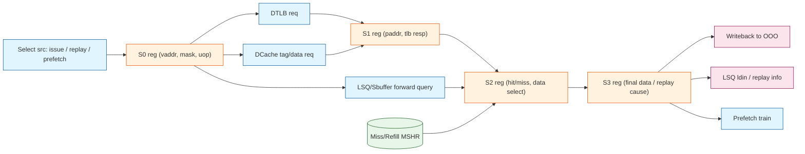

**What happens per stage (from `LoadUnit.scala`):**
- **S0**: Selects highest-priority source (replay, fast replay, prefetch, issue). Generates vaddr, mask; sends DTLB + DCache request.
- **S1**: Receives DTLB response; computes paddr; handles tlb miss/kill.
- **S2**: Gets DCache/forwarded data; determines replay/miss; produces fast feedback.
- **S3**: Finalize data, exceptions, replay cause; writes back and/or enqueue replay.

---

## Store Pipeline (s0–s2/3) with registers

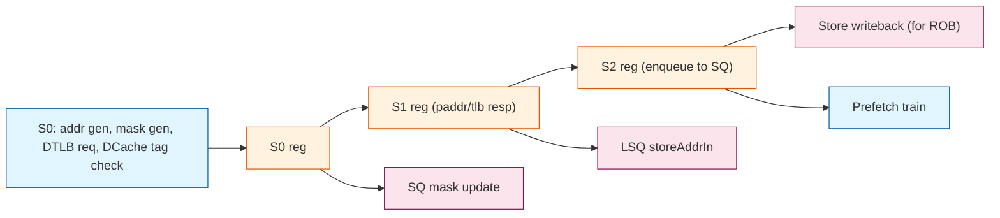

**Stage notes (from `StoreUnit.scala`):**
- **S0**: Builds vaddr & mask, issues DTLB; queries DCache tags (for hit/miss prediction).
- **S1**: Uses paddr; detects exceptions; issues store feedback; sends to LSQ.
- **S2**: Completes store bookkeeping; writeback for ROB/commit.

---

## Load/Store Pipeline Deep Dive

### Combined pipeline + component diagram (actions labeled)

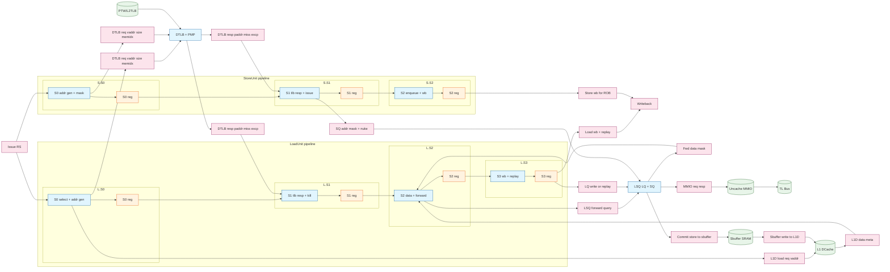

### Load Unit stage breakdown (s0–s3)
- **S0 (select + addr gen)**: selects source (issue, replay, fast replay, prefetch) and builds `s0_out` (`LqWriteBundle`). Sends DTLB request and L1D load request; initiates LSQ/sbuffer forward query. Input priority follows the replay/prefetch order in `LoadUnit.scala`.
- **S1 (TLB resp + kill)**: latches DTLB response, computes kill on redirect or miss, generates early wakeup (`fast_uop`) for RS, and passes paddr/exceptions to S2.
- **S2 (data/forward)**: merges L1D data, LSQ/sbuffer forwarding, and MSHR forward paths; decides replay cause (e.g., tlb miss, forward fail, bank conflict). Emits RS feedback and latches replay metadata.
- **S3 (wb/replay/rollback)**: finalizes data, handles delayed error (`s3_dly_ld_err`), writes back to OOO, and optionally enqueues replay or issues `rollback` (for violations).

#### LoadUnit S0 source selection (detailed)
S0 arbitrates among multiple request sources, then builds a single `FlowSource` that feeds the S0 register. These are the concrete sources in `LoadUnit.scala` (there is no separate “unaligned buffer” input; alignment is checked on `s0_sel_src.vaddr`):

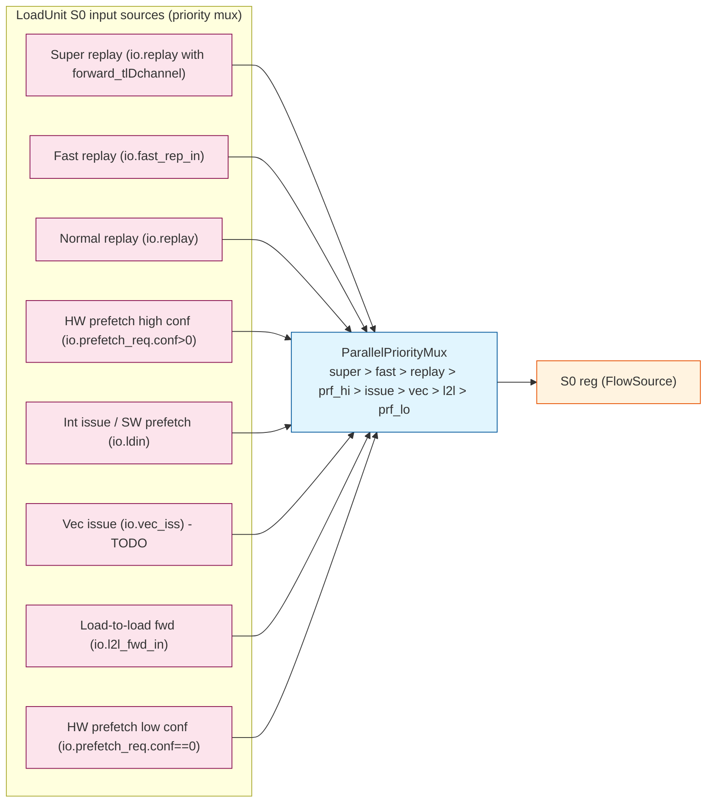

Selection/gating logic (from `LoadUnit.scala`):
- `s0_valid` is asserted if any source is valid **and** `io.dcache.req.ready` **and** `!s0_kill`.
- Each source has a ready chain that enforces the strict priority above (e.g., `s0_ld_rep_ready` is false if any higher-priority source is valid).
- When `s0_hw_prf_select` is true, DTLB uses `io.prefetch_req.bits.paddr` and dcache uses prefetch opcode.

For reference, the selection booleans are named:
`s0_super_ld_rep_select`, `s0_ld_fast_rep_select`, `s0_ld_rep_select`, `s0_hw_prf_select`, `s0_int_iss_select`, `s0_vec_iss_select`, `s0_l2l_fwd_select`.

Key load fast paths:
- **Load-to-load fast forward** (`l2l_fwd_in/out`): propagates early data for dependent loads (XLEN width).
- **Fast replay path** (`fast_rep_in/out`): short-circuits replayed loads for timing.

### Store Unit stage breakdown (s0–s2)
- **S0 (addr gen + mask)**: computes vaddr with imm, builds byte mask (e.g., `genVWmask`), sends DTLB request, and probes L1D tags (predict hit/miss). For store prefetch, waits for L1D to be ready.
- **S1 (TLB resp + issue)**: receives paddr/exceptions, sends `stld_nuke_query` (st-ld violation check), issues to store issue queue, and enqueues to LSQ (`storeAddrIn`).
- **S2 (enqueue/commit)**: completes SQ bookkeeping, trains prefetchers, and produces store writeback for ROB. Store data itself comes from `StdExeUnit` and is pushed to SQ via `storeDataIn`.

### DTLB/PTW/PMP path (load/store side)
- **Requestors**: MemBlock builds a DTLB request vector for load ports + store ports + prefetch ports (load ports count = `exuParameters.LduCnt`, store ports count = `exuParameters.StuCnt`).
- **PTW**: PTW response is broadcast to DTLB requestors; replacement is handled by `TlbReplace` (shared or per-TLB, depending on config).
- **PMP**: A `PMPChecker(3)` instance is created per requestor; responses are consumed by load/store units in parallel with DTLB results.

### Replay and violation handling
- **Replay causes**: carried in `LoadToLsqReplayIO.cause` (`LoadReplayCauses` priority vector). LoadUnit selects the highest-priority cause to replay.
- **Violation redirects**: MemBlock combines `lsq.io.nuke_rollback`, `lsq.io.nack_rollback`, and per-load `io.rollback`, then selects the oldest by ROB index.

```text
oldest = selectOldestRedirect([lsq.nuke, lsq.nack, load0.rb, ...])
mem_to_ooo.memoryViolation := oldest
```

### LSQ forwarding and dependency checks
- **Store-to-load forwarding**: LoadUnit issues `PipeLoadForwardQueryIO` into LSQ, which returns forward mask/data (from SQ or sbuffer).
- **Load-load & store-load violation checks**: `ldld_nuke_query` and `stld_nuke_query` guard speculative execution; violations trigger `rollback`.

### Sbuffer writeback path (data structures)
From `Sbuffer.scala`:
- `DataWriteReq`:
  - `wvec`: UInt(StoreBufferSize.W) — one-hot line select
  - `mask`: UInt((VLEN/8).W)
  - `data`: UInt(VLEN.W)
  - `vwordOffset`: UInt(VWordOffsetWidth.W)
  - `wline`: Bool — write full cacheline
- `MaskFlushReq`:
  - `wvec`: UInt(StoreBufferSize.W)
- `SbufferEntryState`:
  - `state_valid`: Bool
  - `state_inflight`: Bool
  - `w_timeout`: Bool
  - `w_sameblock_inflight`: Bool

### Uncache/MMIO path
LSQ arbitrates between load/store uncache requests, tracks outstanding status, and forwards to `uncache`. `AddPipelineReg` is used between LSQ and uncache for timing.

### Prefetch training and injection
- **Training**: Load/Store units emit `prefetch_train` bundles (miss/hit dependent) to SMS and stream prefetchers.
- **Injection**: L1 prefetch requests (`prefetch_req`) enter LoadUnit S0 and contend with normal issue sources.

### Additional sequence diagrams (pipeline-focused)

#### 5) Store-to-Load forwarding
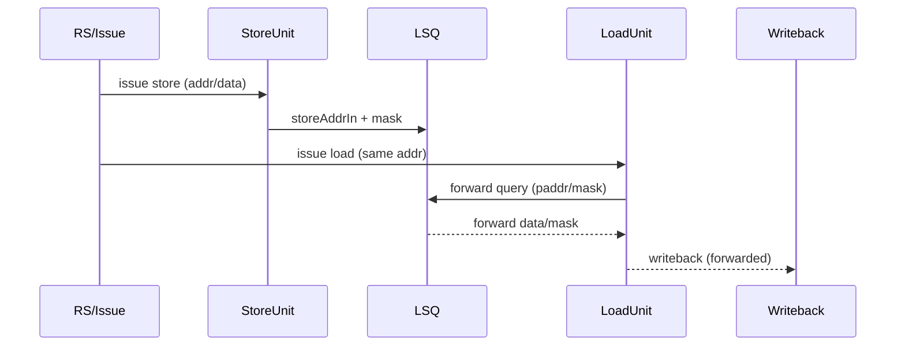

#### 6) Store-load violation redirect
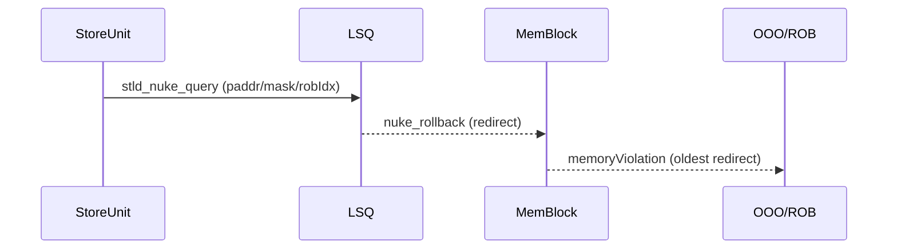

---

## Data Structures (LSQ + Sbuffer)

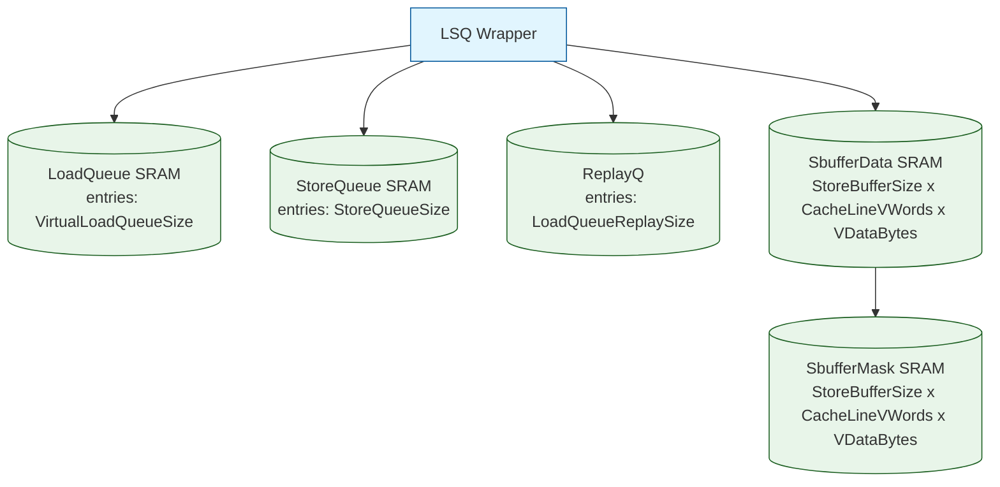

---

## Core Control Logic (pseudocode)

### Load pipeline source selection (from `LoadUnit.scala`)
```text
priority order (high -> low):
1) super load replay (forward_tlDchannel)
2) fast load replay
3) normal load replay
4) high-conf prefetch
5) issued load (int/soft-prefetch)
6) ptr-chasing opportunistic
7) low-conf prefetch
```

### Uncache arb in LSQ (from `LSQWrapper.scala`)
```text
state = idle | load | store

if idle:
  if uncache.req fires:
    state = (loadQueue has req) ? load : store

if load and resp fires: state = idle
if store and resp fires: state = idle

route uncache.req to loadQueue if it has req else storeQueue
route uncache.resp to loadQueue if outstanding or state==load, else storeQueue
```

### Store buffer data update (from `SbufferData`)
```text
for each writeReq (pipeline width):
  if line selected:
    latch data/mask/offset
    after 1 cycle: update data(line, word, byte) if mask set or full-line write
    update mask accordingly
```

---

## Working Scenarios (sequence diagrams)

### 1) Load hit in L1D
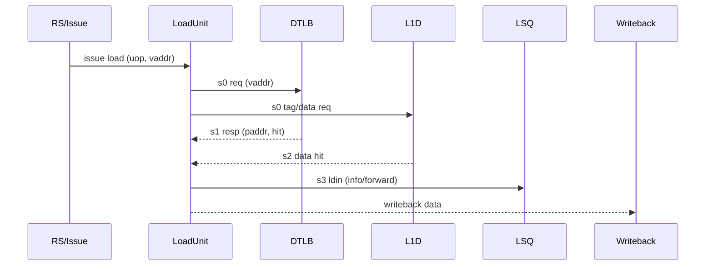

### 2) Load miss + replay after refill
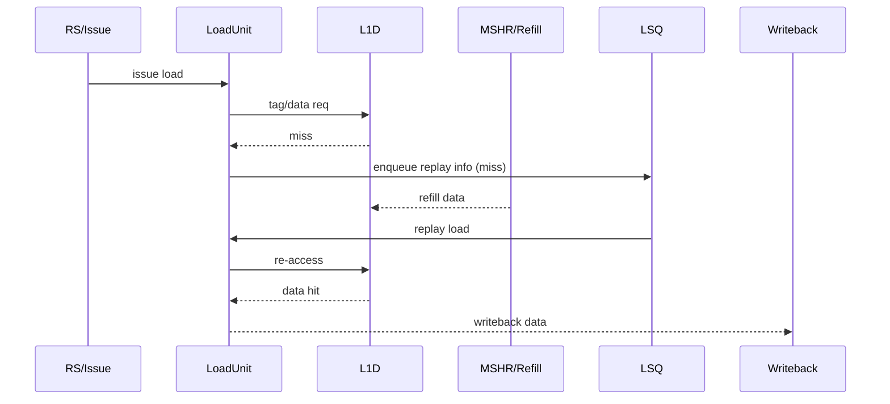

### 3) Store issue → LSQ → Sbuffer → DCache
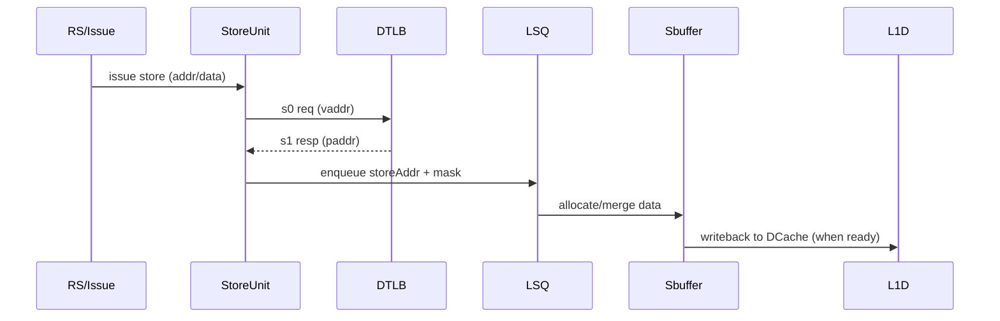

### 4) MMIO access (uncache path)
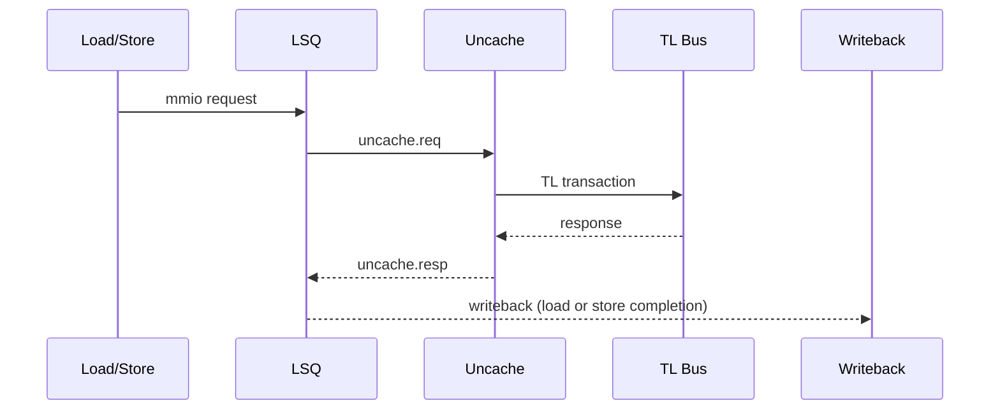

---

## How MemBlock Wires It All (selected highlights)

- **LoadUnits ↔ DCache + LSQ + TLB:**
  Each load unit connects to `dcache.io.lsu.load(i)`, `lsq.io.forward(i)`, `lsq.io.ldu.ldin(i)`, `dtlb` requestors, and PMP checks.
- **StoreUnits ↔ LSQ + TLB + Sbuffer:**
  Store units send address/mask into LSQ, data goes via StdExeUnit into LSQ → Sbuffer → DCache.
- **LSQ ↔ Uncache:**
  `AddPipelineReg` pipes uncache req/resp between LSQ and Uncache for timing; LSQ arbitrates load/store MMIO.
- **Prefetcher:**
  SMS and stream prefetchers train on load/store info and push L2/L3 prefetches; they also use a DTLB port.
- **Atomics:**
  AtomicsUnit overrides regular store issue; uses load0 TLB port and dcache atomics interface.
