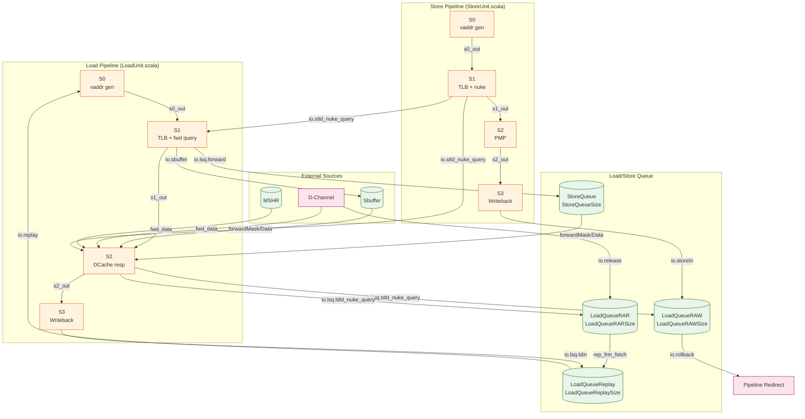
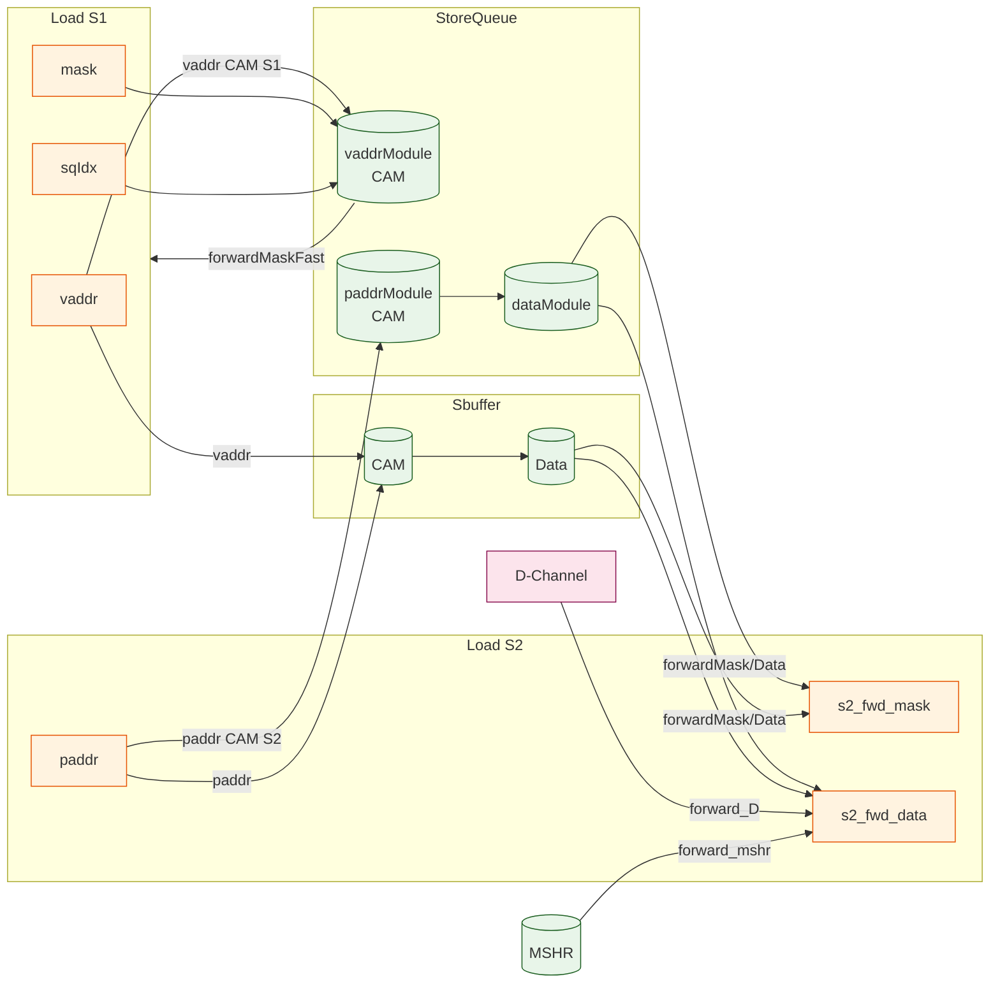
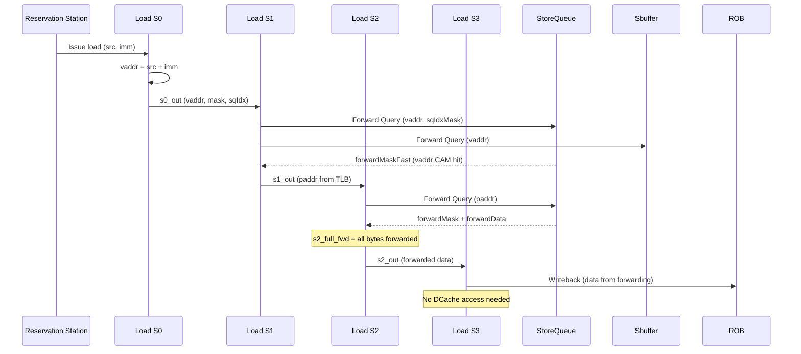
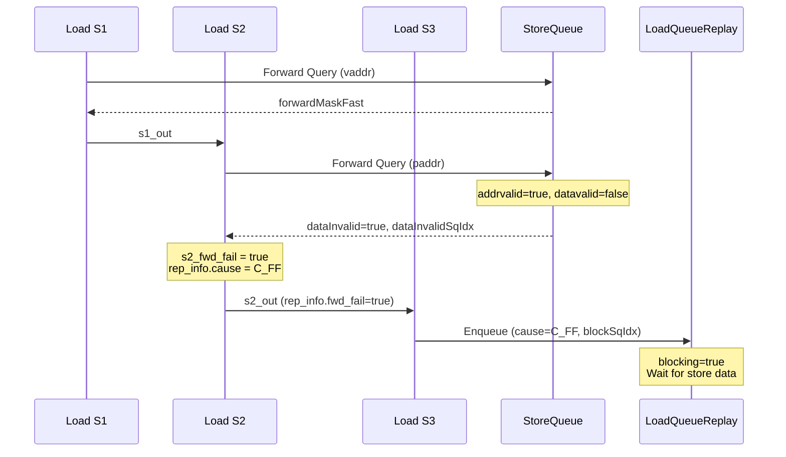
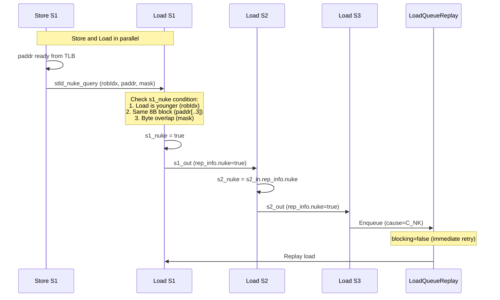
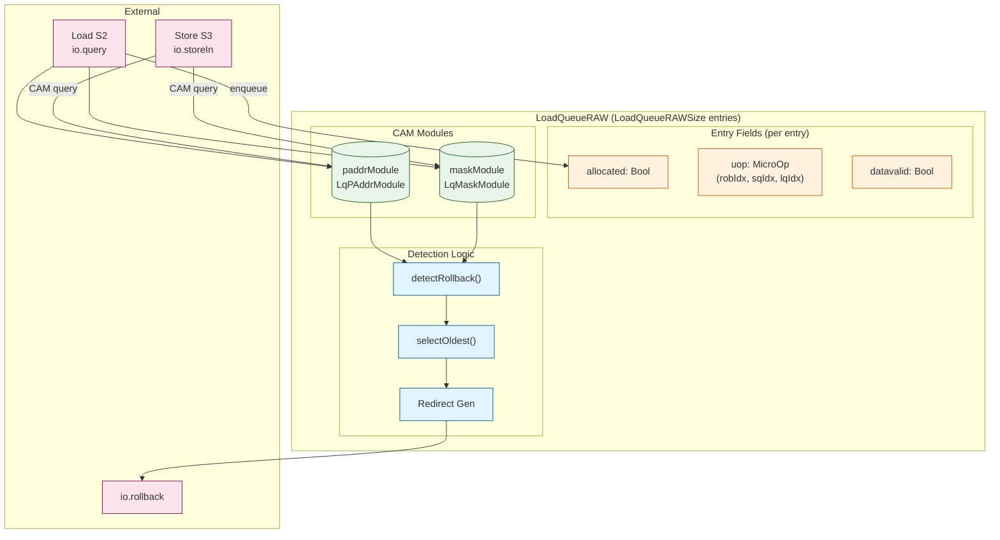
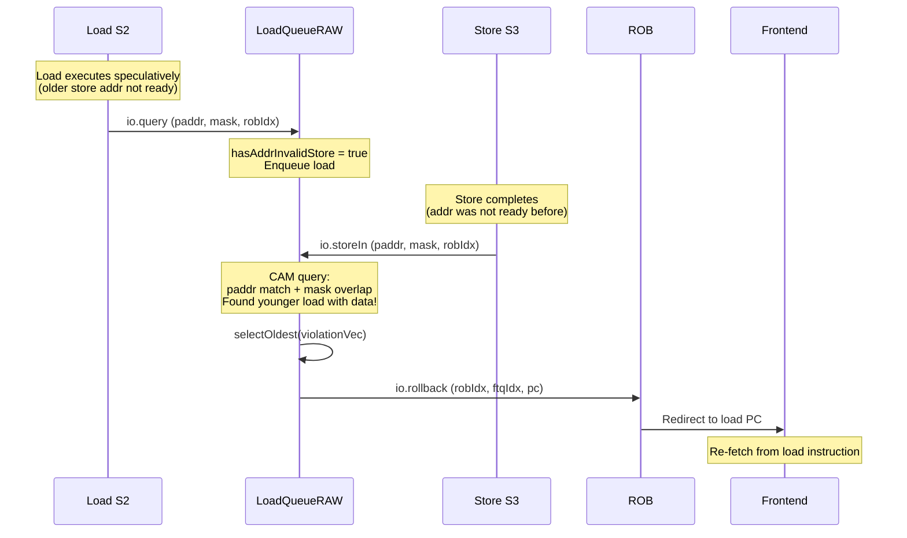
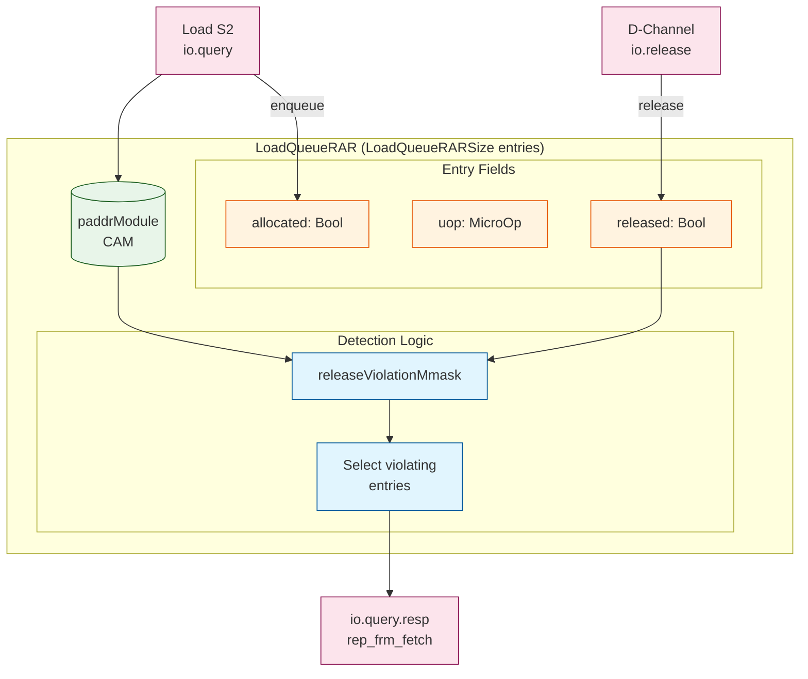
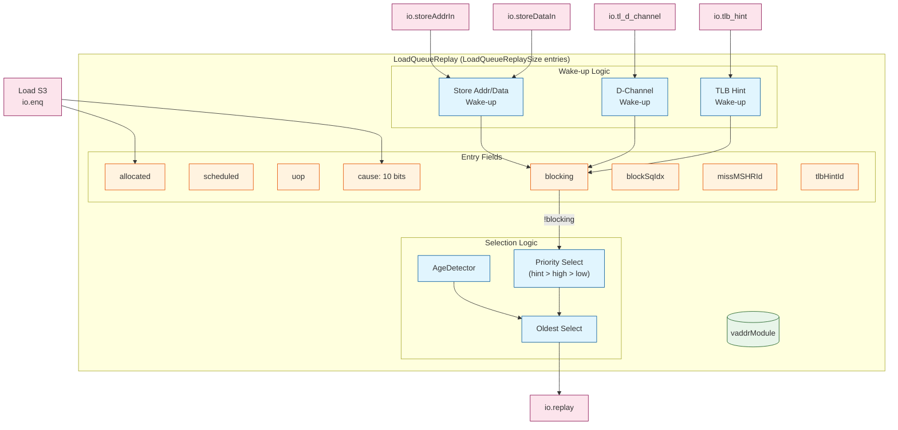

# Memory Disambiguation in XiangShan

## Overview

XiangShan implements a **Three-Layer Defense** mechanism for memory disambiguation to ensure correct memory ordering in out-of-order execution:

1. **Store-to-Load Forwarding** (Prevention) - Proactively forwards data from older stores to younger loads
2. **s1_nuke** (Early Detection) - Detects violations when store addresses become ready
3. **RAW/RAR Queue** (Late Detection) - CAM-based final safety net when stores complete or cache lines are released

---

## Memory Hazard Types

XiangShan explicitly handles **two types** of memory hazards that require violation detection:

### Hazard Classification

| Hazard Type | Description | XiangShan Handling | Detection Module |
|-------------|-------------|-------------------|------------------|
| **RAW** (Read-After-Write) | Load reads data before older store writes | ✅ Explicit detection | LoadQueueRAW |
| **RAR** (Read-After-Read) | Load-to-Load ordering violation (RVWMO) | ✅ Explicit detection | LoadQueueRAR |
| **WAW** (Write-After-Write) | Store ordering violation | ❌ Not needed | In-order commit guarantees |
| **WAR** (Write-After-Read) | Store writes before older load reads | ❌ Not needed | In-order commit guarantees |

### Why Only RAW and RAR?

1. **RAW (Store→Load)**: Load instructions can execute **speculatively** before older stores complete their address calculation. If the load and store overlap, the load may have read stale data → **Requires explicit violation detection**.

2. **RAR (Load→Load)**: Under **RISC-V Weak Memory Ordering (RVWMO)**, loads to the same address must appear to execute in program order to external observers. If a younger load obtains data and then the cache line is released/modified by another core, the older load might see different data → **Requires explicit violation detection**.

3. **WAW (Store→Store)**: Stores are **committed in program order** through the ROB. Even though stores execute out-of-order, they write to the Store Buffer and commit to memory in order → **No explicit detection needed**.

4. **WAR (Load→Store)**: Stores commit after all older instructions (including loads) commit. This is guaranteed by the ROB → **No explicit detection needed**.

---

## Top-Level Architecture



---

## Key Data Structures

### 1. LoadForwardQueryIO

**File**: `MemCommon.scala:226-255`

Store-to-Load forwarding query interface between LoadUnit and StoreQueue/Sbuffer.

```scala
class LoadForwardQueryIO {
  // Query signals (Output from Load Unit)
  val vaddr: UInt(VAddrBits.W)              // Virtual address for S1 CAM
  val paddr: UInt(PAddrBits.W)              // Physical address for S2 CAM
  val mask:  UInt((VLEN/8).W)               // Byte enable mask
  val sqIdx: SqPtr                          // Store queue index
  val valid: Bool                           // Query valid

  // Response signals (Input to Load Unit)
  val forwardMaskFast: Vec(VLEN/8, Bool)    // S1 fast response
  val forwardMask:     Vec(VLEN/8, Bool)    // S2 response
  val forwardData:     Vec(VLEN/8, UInt(8)) // Forwarded data
  val dataInvalid:     Bool                 // Store data not ready
  val matchInvalid:    Bool                 // VA/PA CAM mismatch
  val addrInvalid:     Bool                 // Store addr not ready
}
```

| Field | Width | Data Type | Description |
|-------|-------|-----------|-------------|
| vaddr | VAddrBits (39) | UInt | Virtual address for S1 vaddr CAM lookup |
| paddr | PAddrBits (36) | UInt | Physical address for S2 paddr CAM lookup |
| mask | VLEN/8 (16) | UInt | Byte enable mask (1=byte accessed) |
| sqIdx | log2(SQSize)+1 | SqPtr | Load's sqIdx to search older stores |
| forwardMaskFast | VLEN/8 (16) | Vec[Bool] | S1 fast path forwarding mask |
| forwardMask | VLEN/8 (16) | Vec[Bool] | S2 forwarding mask per byte |
| forwardData | VLEN (128) | Vec[UInt(8)] | Forwarded data (byte granularity) |
| dataInvalid | 1 | Bool | Addr match but data not ready → Replay |
| matchInvalid | 1 | Bool | vaddr/paddr CAM mismatch → Redirect |
| addrInvalid | 1 | Bool | Store addr not calculated → Replay |

### 2. StoreNukeQueryIO

**File**: `MemCommon.scala:301-310`

Store broadcast interface for early violation detection.

```scala
class StoreNukeQueryIO {
  val robIdx: RobPtr      // Store's ROB index for age comparison
  val paddr:  UInt(PAddrBits.W)  // Store physical address
  val mask:   UInt((VLEN/8).W)   // Store data mask
}
```

| Field | Width | Data Type | Description |
|-------|-------|-----------|-------------|
| robIdx | log2(ROBSize)+1 | RobPtr | Store's ROB index for age comparison |
| paddr | PAddrBits (36) | UInt | Store physical address for match |
| mask | VLEN/8 (16) | UInt | Byte mask for overlap check |

### 3. LoadNukeQueryIO

**File**: `MemCommon.scala:273-299`

Load-to-RAW/RAR queue query interface.

```scala
class LoadNukeQueryReq {
  val uop:        MicroOp            // Includes robIdx, sqIdx, lqIdx
  val mask:       UInt((VLEN/8).W)   // Data mask
  val paddr:      UInt(PAddrBits.W)  // Physical address
  val data_valid: Bool               // Load obtained data
}

class LoadNukeQueryIO {
  val req    = Decoupled(new LoadNukeQueryReq)
  val resp   = Flipped(Valid(new LoadNukeQueryResp))
  val revoke = Output(Bool)  // Revoke allocation on exception/replay
}
```

### 4. LoadReplayCauses

**File**: `LoadQueueReplay.scala:34-70`

```scala
object LoadReplayCauses {
  val C_MA  = 0  // Memory Ambiguity (store addr not ready)
  val C_TM  = 1  // TLB Miss
  val C_FF  = 2  // Forward Fail (store data not ready)
  val C_DR  = 3  // DCache Replay (MSHR conflict)
  val C_DM  = 4  // DCache Miss
  val C_WF  = 5  // WPU Predict Fail
  val C_BC  = 6  // Bank Conflict
  val C_RAR = 7  // RAR Queue Full
  val C_RAW = 8  // RAW Queue Full
  val C_NK  = 9  // Nuke (st-ld violation)

  val allCauses = 10
}
```

| Cause | Priority | Description | Recovery Action |
|-------|----------|-------------|-----------------|
| C_MA | 0 (highest) | Store address not ready | Wait for store addr → Replay |
| C_TM | 1 | TLB miss | Wait for TLB refill → Replay |
| C_FF | 2 | Forward fail (data not ready) | Wait for store data → Replay |
| C_DR | 3 | DCache replay (MSHR conflict) | Immediate retry |
| C_DM | 4 | DCache miss | Wait for D-channel refill → Replay |
| C_WF | 5 | Way prediction fail | Immediate retry |
| C_BC | 6 | Bank conflict | Immediate retry |
| C_RAR | 7 | RAR queue full | Wait for RAR space → Replay |
| C_RAW | 8 | RAW queue full | Wait for RAW space → Replay |
| C_NK | 9 (lowest) | Store-load nuke | Immediate replay |

---

## Load Pipeline Stages (Memory Disambiguation View)

**File**: `LoadUnit.scala`

| Stage | Functional Behavior | Reg Signals |
|-------|-------------------|-------------|
| **S0** | Generate vaddr from RS/Replay<br>Send TLB request<br>Send DCache tag request | `s0_out`: LqWriteBundle<br>`s0_valid`: Bool<br>`s0_sel_src`: FlowSource |
| **S1** | Receive TLB response (paddr)<br>Send forward query to SQ (vaddr CAM)<br>Send forward query to Sbuffer<br>Check s1_nuke from store broadcast<br>Query RAW Queue for allocation | `s1_in`: RegEnable(s0_out)<br>`s1_paddr`: io.tlb.resp.bits.paddr<br>`s1_nuke`: detected violation<br>`s1_sqIdx_mask`: older store mask |
| **S2** | Receive DCache data response<br>Forward query response (paddr CAM)<br>Check D-Channel/MSHR forwarding<br>Merge forwarded data<br>Check s2_nuke<br>Determine replay cause | `s2_in`: RegEnable(s1_out)<br>`s2_fwd_mask/data`: merged forward<br>`s2_full_fwd`: all bytes forwarded<br>`s2_nuke`: s2 violation check<br>`s2_out.rep_info`: replay cause |
| **S3** | Final data selection<br>Writeback to ROB or<br>Enqueue to LoadQueueReplay<br>Check VA/PA match invalid | `s3_in`: RegEnable(s2_out)<br>`s3_rep_info`: final replay cause<br>`s3_vp_match_fail`: redirect needed |

---

## Layer 1: Store-to-Load Forwarding

### Architecture



### Forwarding Algorithm (Pseudo-code)

**File**: `StoreQueue.scala:399-573`

```python
def store_forward_query(load_sqIdx, load_vaddr, load_paddr, load_mask):
    # Step 1: Generate search mask (only search older stores)
    differentFlag = deqPtrExt.flag != load_sqIdx.flag
    forwardMask1 = Mux(differentFlag, ~deqMask, deqMask ^ sqIdxMask)
    forwardMask2 = Mux(differentFlag, sqIdxMask, 0)
    needForward = forwardMask1 | forwardMask2

    # Step 2: Virtual address CAM (S1 fast path)
    vaddr_match = vaddrModule.cam_query(load_vaddr, load_mask) & needForward

    # Step 3: Physical address CAM (S2)
    paddr_match = paddrModule.cam_query(load_paddr, load_mask) & needForward

    # Step 4: Check VA/PA consistency (synonym/homonym detection)
    vpmaskNotEqual = (paddr_match ^ vaddr_match) & needForward & addrValidVec
    if vpmaskNotEqual != 0:
        return matchInvalid  # Need pipeline redirect

    # Step 5: Check data validity
    canForward = needForward & allValidVec  # addr & data both valid
    dataInvalidMask = needForward & addrValidVec & ~dataValidVec & vaddr_match
    if dataInvalidMask != 0:
        return (dataInvalid=True, dataInvalidSqIdx=oldest_invalid)

    # Step 6: Forward data (byte granularity)
    for byte in range(VLEN/8):
        forward_mask[byte] = canForward & vaddr_match[byte]
        forward_data[byte] = dataModule[matched_entry].data[byte]

    return (forward_mask, forward_data)
```

### Scenario 1: Successful Store-to-Load Forwarding



### Scenario 2: Forward Fail (Store Data Not Ready)



---

## Layer 2: s1_nuke Early Detection

### Pipeline Integration

| Stage | Store Pipeline Action | Load Pipeline Action |
|-------|----------------------|---------------------|
| Store S1 | paddr ready from TLB<br>Broadcast `io.stld_nuke_query` | Receive broadcast<br>Check `s1_nuke` condition |
| Store S2 | PMP check | Check `s2_nuke` condition<br>(carry from S1 or new match) |
| Load S3 | - | Set `rep_info.nuke=true`<br>Enqueue to LoadQueueReplay |

### Detection Logic

**File**: `LoadUnit.scala:635-641`

```scala
// In Load S1 - check against store broadcast
val s1_nuke = VecInit((0 until StorePipelineWidth).map(w => {
  io.stld_nuke_query(w).valid &&                                    // Store query valid
  isAfter(s1_in.uop.robIdx, io.stld_nuke_query(w).bits.robIdx) &&  // Load is younger
  (s1_paddr(PAddrBits-1, 3) === io.stld_nuke_query(w).bits.paddr(PAddrBits-1, 3)) && // Same 8B block
  (s1_in.mask & io.stld_nuke_query(w).bits.mask).orR               // Byte overlap
})).asUInt.orR && !s1_tlb_miss
```

**File**: `LoadUnit.scala:827-833`

```scala
// In Load S2 - check again or carry from S1
val s2_nuke = VecInit((0 until StorePipelineWidth).map(w => {
  io.stld_nuke_query(w).valid &&
  isAfter(s2_in.uop.robIdx, io.stld_nuke_query(w).bits.robIdx) &&
  (s2_in.paddr(PAddrBits-1, 3) === io.stld_nuke_query(w).bits.paddr(PAddrBits-1, 3)) &&
  (s2_in.mask & io.stld_nuke_query(w).bits.mask).orR
})).asUInt.orR && !s2_tlb_miss || s2_in.rep_info.nuke  // Carry from S1
```

### Scenario 3: s1_nuke Detection and Replay



---

## Layer 3: RAW Queue (LoadQueueRAW)

### Structure

**File**: `LoadQueueRAW.scala`



### Entry Data Structure

| Field | Width | Data Type | Description |
|-------|-------|-----------|-------------|
| allocated | 1 | Bool | Entry is valid and allocated |
| uop | MicroOp | Bundle | Micro-op info (robIdx, sqIdx, lqIdx for age comparison) |
| paddr | PAddrBits (36) | UInt | Physical address (stored in paddrModule CAM) |
| mask | VLEN/8 (16) | UInt | Byte enable mask (stored in maskModule CAM) |
| datavalid | 1 | Bool | Load has obtained data (potential violation if match) |

### RAW Queue Lifecycle

| Phase | Condition | Action |
|-------|-----------|--------|
| **Enqueue** | Load S2 valid<br>+ hasAddrInvalidStore (older stores with addr not ready) | allocated := true<br>Write paddr/mask to CAM<br>datavalid := data_valid from query |
| **Stay** | allocated && older stores still pending | Wait for store addr ready |
| **Dequeue (safe)** | All older stores have addresses ready | allocated := false<br>No violation detected |
| **Dequeue (redirect)** | Store complete queries CAM<br>+ match found (younger load with data) | Generate redirect<br>allocated := false |
| **Dequeue (flush)** | robIdx.needFlush(redirect) | allocated := false |

### Violation Detection (Pseudo-code)

**File**: `LoadQueueRAW.scala:307-344`

```python
def detectRollback(store_idx):
    # Step 1: CAM query with store's paddr and mask
    paddr_match = paddrModule.cam_query(store_paddr)  # cache line match
    mask_match = maskModule.cam_query(store_mask)      # byte overlap

    # Step 2: Address and mask match (RegNext for timing)
    addrMaskMatch = RegNext(paddr_match & mask_match)

    # Step 3: Filter entries
    entryNeedCheck = RegNext([
        allocated[j] &&
        isAfter(uop[j].robIdx, store.robIdx) &&  # Load is younger
        datavalid[j] &&                           # Load has data
        !uop[j].needFlush(redirect)
        for j in range(LoadQueueRAWSize)
    ])

    # Step 4: Generate violation vector
    violationVec = [addrMaskMatch[j] && entryNeedCheck[j]
                    for j in range(LoadQueueRAWSize)]

    # Step 5: Select oldest violating load (tree-based)
    oldest_valid, oldest_uop = selectOldest(violationVec, uop)

    return (oldest_valid, oldest_uop)
```

### Scenario 4: RAW Violation Detection and Redirect



### Select Oldest Algorithm

**File**: `LoadQueueRAW.scala:260-305`

Uses tree-based selection with `SelectGroupSize` for timing:

```
Stage 0: All LoadQueueRAWSize entries
         ↓ (group into SelectGroupSize)
Stage 1: LoadQueueRAWSize/SelectGroupSize groups
         ↓ (select oldest per group)
Stage 2: Compare group winners
         ↓
Stage X: Final oldest entry
```

Total cycles = `ceil(log(LoadQueueRAWSize) / log(SelectGroupSize)) + 1`

---

## Layer 3-B: RAR Queue (LoadQueueRAR)

### Purpose

**File**: `LoadQueueRAR.scala`

The RAR Queue detects **Load-to-Load ordering violations** required by RISC-V Weak Memory Ordering (RVWMO). When a cache line is **released** (evicted or invalidated by coherence), younger loads that already obtained data from that line may have violated ordering with respect to older loads.

### Entry Data Structure (LoadQueueRAR.scala:51-74)

```scala
// LoadQueueRAR entry structure
val allocated = RegInit(VecInit(List.fill(LoadQueueRARSize)(false.B)))
val uop       = Reg(Vec(LoadQueueRARSize, new MicroOp))
val paddrModule = Module(new LqPAddrModule(...))  // CAM for paddr
val released  = RegInit(VecInit(List.fill(LoadQueueRARSize)(false.B)))
```

| Field | Width | Data Type | Description |
|-------|-------|-----------|-------------|
| allocated | 1 | Bool | Entry is valid |
| uop | MicroOp | Bundle | Micro-op (robIdx, lqIdx for age comparison) |
| paddr | PAddrBits (36) | UInt | Physical address (CAM key) |
| released | 1 | Bool | Cache line has been released |

### RAR Queue Lifecycle



### Enqueue Condition (LoadQueueRAR.scala:99-102)

A load enqueues to RAR Queue when:
1. Load query is valid
2. There are **not-yet-completed loads** before current load (`hasNotWritebackedLoad`)

```scala
val canEnqueue = io.query.map(_.req.valid)
val cancelEnqueue = io.query.map(_.req.bits.uop.robIdx.needFlush(io.redirect))
val hasNotWritebackedLoad = io.query.map(_.req.bits.uop.lqIdx).map(lqIdx => isAfter(lqIdx, io.ldWbPtr))
val needEnqueue = canEnqueue.zip(hasNotWritebackedLoad).zip(cancelEnqueue).map {
  case ((v, r), c) => v && r && !c
}
```

### Release Detection (LoadQueueRAR.scala:210-223)

When `io.release` fires (cache line released by D-Channel), update the `released` flag:

```scala
when (release1Cycle.valid) {
  paddrModule.io.releaseMdata.takeRight(1)(0) := release1Cycle.bits.paddr
}

(0 until LoadQueueRARSize).map(i => {
  when (RegNext(paddrModule.io.releaseMmask.takeRight(1)(0)(i) &&
                allocated(i) && release1Cycle.valid)) {
    released(i) := true.B  // Mark as released
  }
})
```

### Violation Detection (LoadQueueRAR.scala:183-207)

```scala
// Load-to-Load violation check condition:
// 1. Physical address match by CAM port
// 2. released is set (cache line was evicted/invalidated)
// 3. Entry is younger than current load instruction

for ((query, w) <- io.query.zipWithIndex) {
  paddrModule.io.releaseViolationMdata(w) := query.req.bits.paddr

  // Generate violation mask
  val robIdxMask = VecInit(uop.map(_.robIdx).map(isAfter(_, query.req.bits.uop.robIdx)))
  val matchMask = (0 until LoadQueueRARSize).map(i => {
    RegNext(allocated(i) &
            paddrModule.io.releaseViolationMmask(w)(i) &  // paddr match
            robIdxMask(i) &&                               // younger load
            released(i))                                   // cache line released
  })

  // If any match, signal violation
  query.resp.bits.rep_frm_fetch := ParallelORR(matchMask)
}
```

### Dequeue Condition (LoadQueueRAR.scala:157-165)

An entry is deallocated when:
1. All older loads have been writebacked (`!isBefore(ldWbPtr, lqIdx)`)
2. Or the load is flushed by redirect

```scala
for (i <- 0 until LoadQueueRARSize) {
  val deqNotBlock = !isBefore(io.ldWbPtr, uop(i).lqIdx)
  val needFlush = uop(i).robIdx.needFlush(io.redirect)

  when (allocated(i) && (deqNotBlock || needFlush)) {
    allocated(i) := false.B
    freeMaskVec(i) := true.B
  }
}
```

### RAR vs RAW Comparison

| Aspect | LoadQueueRAW | LoadQueueRAR |
|--------|--------------|--------------|
| **Hazard** | Store→Load (RAW) | Load→Load (RAR) |
| **Trigger** | Store complete (S3) | Cache line release |
| **Detection Key** | Store addr/mask overlap | Same cache line + released |
| **Age Comparison** | Load younger than Store | Entry younger than querying Load |
| **Recovery** | Pipeline redirect | Load replay (rep_frm_fetch) |
| **Replay Cause** | C_NK (nuke) | C_RAR |

---

## LoadQueueReplay

### Structure

**File**: `LoadQueueReplay.scala`



### Blocking Conditions and Wake-up

| Cause | Blocking Condition | Wake-up Trigger | Wake-up Logic |
|-------|-------------------|-----------------|---------------|
| C_MA | Store addr not ready | Store addr execute | `stAddrDeqVec(i)` = blockSqIdx matches storeAddrIn |
| C_TM | TLB miss | TLB hint response | `tlb_hint.resp.valid && (replay_all \|\| id==tlbHintId)` |
| C_FF | Store data not ready | Store data execute | `stDataDeqVec(i)` = blockSqIdx matches storeDataIn |
| C_DR | DCache replay | Immediate | `blocking := false` at enqueue |
| C_DM | DCache miss | D-channel refill | `tl_d_channel.valid && mshrid==missMSHRId` |
| C_WF | WPU predict fail | Immediate | `blocking := false` at enqueue |
| C_BC | Bank conflict | Immediate | `blocking := false` at enqueue |
| C_RAR | RAR queue full | RAR has space | `!rarFull \|\| !isAfter(lqIdx, ldWbPtr)` |
| C_RAW | RAW queue full | RAW has space | `!rawFull \|\| !isAfter(sqIdx, stAddrReadySqPtr)` |
| C_NK | Nuke | Immediate | `blocking := false` at enqueue |

### Selection Priority

```
1. L2 Hint Wake-up (highest) - MSHR refill hint from L2
2. Higher Priority Replay - C_DM (dcache miss) or C_FF (forward fail)
3. Lower Priority Replay - Other causes
4. Age-based Selection - Oldest entry among ready entries
```

---

## Summary

### Three-Layer Defense Comparison

| Layer | Mechanism | Hazard Type | Trigger Point | Detection Method | Recovery |
|-------|-----------|-------------|--------------|------------------|----------|
| **Layer 1** | Store-to-Load Forwarding | RAW | Load S1/S2 | CAM query in SQ/Sbuffer | Data forwarding |
| **Layer 2** | s1_nuke | RAW | Store S1 (addr ready) | Broadcast + paddr/mask compare | Load replay |
| **Layer 3-A** | RAW Queue | RAW | Store S3 (complete) | CAM query in RAW Queue | Pipeline redirect |
| **Layer 3-B** | RAR Queue | RAR | Cache line release | CAM query + released flag | Load replay |

### Memory Hazard Summary

| Hazard | Description | Detection | Recovery |
|--------|-------------|-----------|----------|
| **RAW** | Load executes before older store | LoadQueueRAW + s1_nuke | Redirect / Replay |
| **RAR** | Load-to-load ordering (RVWMO) | LoadQueueRAR | Replay (C_RAR) |
| **WAW** | Store-to-store ordering | ❌ Not needed | In-order commit |
| **WAR** | Load-to-store ordering | ❌ Not needed | In-order commit |

### Coverage

- **Layer 1 (Forwarding)**: Handles ~95%+ of store-load dependencies proactively
- **Layer 2 (s1_nuke)**: Catches RAW violations when store address becomes ready
- **Layer 3-A (RAW Queue)**: Final safety net for RAW violations when stores complete
- **Layer 3-B (RAR Queue)**: Ensures load-to-load ordering under RVWMO

This multi-layered design minimizes average latency (most cases resolved by forwarding) while guaranteeing correctness (RAW/RAR Queues catch all violations).

---

## Related Files

| File | Role |
|------|------|
| [MemCommon.scala](../../src/main/scala/xiangshan/mem/MemCommon.scala) | Core data structures (LoadForwardQueryIO, etc.) |
| [LoadUnit.scala](../../src/main/scala/xiangshan/mem/pipeline/LoadUnit.scala) | Load pipeline with forwarding and nuke check |
| [StoreUnit.scala](../../src/main/scala/xiangshan/mem/pipeline/StoreUnit.scala) | Store pipeline with nuke broadcast |
| [LoadQueueRAW.scala](../../src/main/scala/xiangshan/mem/lsqueue/LoadQueueRAW.scala) | RAW (Store→Load) violation detection |
| [LoadQueueRAR.scala](../../src/main/scala/xiangshan/mem/lsqueue/LoadQueueRAR.scala) | RAR (Load→Load) violation detection |
| [LoadQueueReplay.scala](../../src/main/scala/xiangshan/mem/lsqueue/LoadQueueReplay.scala) | Load replay management |
| [StoreQueue.scala](../../src/main/scala/xiangshan/mem/lsqueue/StoreQueue.scala) | Store forwarding logic |

---

## Glossary

| Term | Description |
|------|-------------|
| **RAW** | Read-After-Write hazard (load reads data before store writes) |
| **RAR** | Read-After-Read hazard (load-to-load ordering violation under RVWMO) |
| **WAW** | Write-After-Write hazard (store ordering - handled by in-order commit) |
| **WAR** | Write-After-Read hazard (handled by in-order commit) |
| **RVWMO** | RISC-V Weak Memory Ordering (memory model) |
| **CAM** | Content-Addressable Memory (parallel lookup by content) |
| **Nuke** | Pipeline flush due to Store-Load violation |
| **Forwarding** | Bypassing store data to load without cache access |
| **Replay** | Re-execute load instruction from LoadQueueReplay |
| **Redirect** | Pipeline flush and instruction re-fetch from frontend |
| **sqIdx** | Store Queue index (circular queue pointer) |
| **lqIdx** | Load Queue index (circular queue pointer) |
| **robIdx** | ROB index (used for age comparison) |
| **released** | Cache line evicted or invalidated by coherence protocol |
