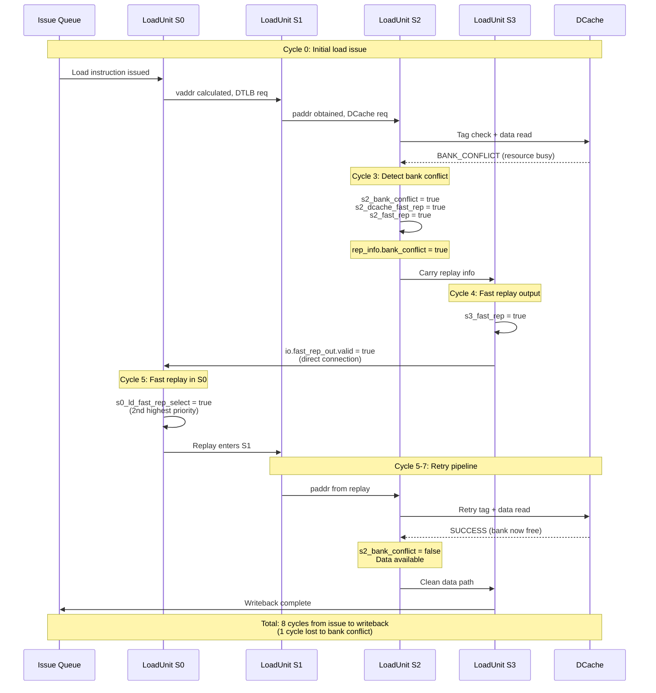
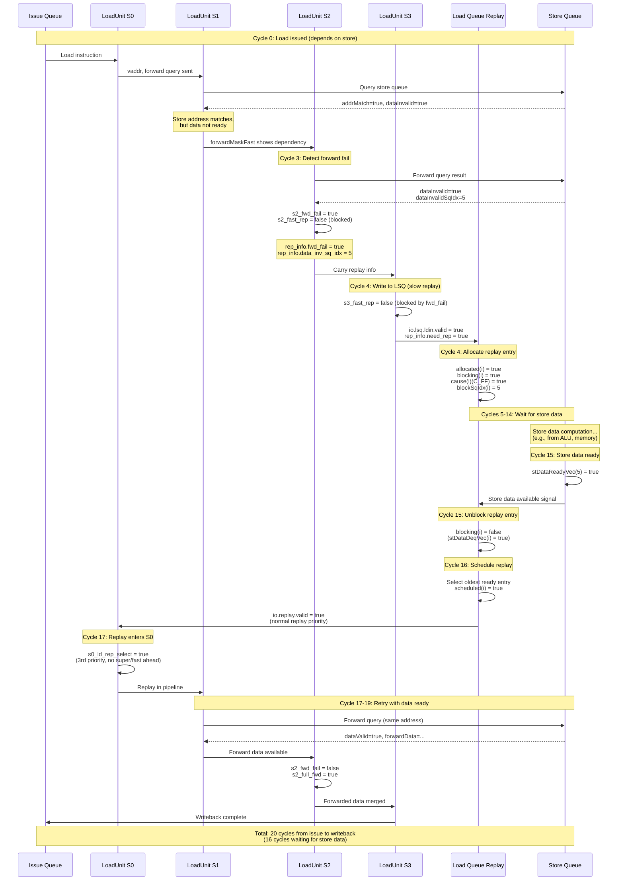
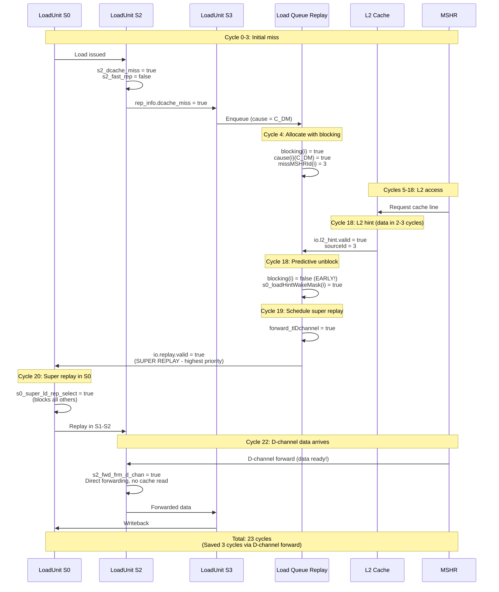
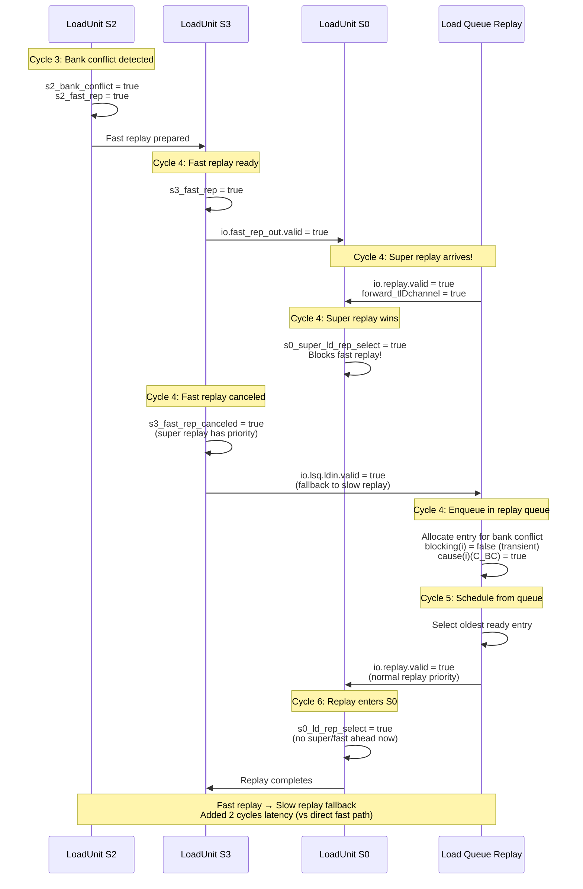

# Load Replay Mechanisms: Fast vs Slow Replay

## Overview

When a load instruction cannot complete successfully in the load pipeline (S0→S1→S2→S3), it must be **replayed** (re-executed). XiangShan implements two distinct replay paths with different latencies and triggering conditions:

1. **Fast Replay**: Low-latency retry path (1-2 cycle turnaround) for transient resource conflicts
2. **Slow Replay**: High-latency retry path via Load Queue Replay (3+ cycle turnaround) for complex dependencies

This document explains what each replay type is, when it happens, and provides detailed sequence diagrams.

## Scope and References

- Load pipeline: `src/main/scala/xiangshan/mem/pipeline/LoadUnit.scala`
- Replay queue: `src/main/scala/xiangshan/mem/lsqueue/LoadQueueReplay.scala`
- Replay causes: `src/main/scala/xiangshan/mem/lsqueue/LoadQueueReplay.scala` (LoadReplayCauses object)
- Related docs: `doc/memblock/loadpipe_S0.md`, `doc/memblock/loadpipe_S2.md`, `doc/memblock/super_replay.md`

---

## Table of Contents

- [Replay Causes Reference](#replay-causes-reference)
- [Fast Replay Mechanism](#fast-replay-mechanism)
- [Slow Replay Mechanism](#slow-replay-mechanism)
- [Comparison: Fast vs Slow](#comparison-fast-vs-slow)
- [Detailed Sequence Diagrams](#detailed-sequence-diagrams)
- [Code References](#code-references)

---

## Replay Causes Reference

All replay causes are defined in `LoadReplayCauses` object with fixed priority (lower index = higher priority):

| Cause | Index | Mnemonic | Full Name | Meaning | Fast Replay? |
|-------|-------|----------|-----------|---------|--------------|
| C_MA | 0 | mem_amb | Memory Ambiguity | Store-set hit, but store address not ready | ❌ No |
| C_TM | 1 | tlb_miss | TLB Miss | Page table walk required | ❌ No |
| C_FF | 2 | fwd_fail | Forward Fail | Store data not ready for forwarding | ❌ No |
| C_DR | 3 | dcache_rep | DCache Replay | Miss queue NACK (resource conflict) | ✅ Yes |
| C_DM | 4 | dcache_miss | DCache Miss | Real cache miss, requires refill | ❌ No (super replay) |
| C_WF | 5 | wpu_fail | Way Predictor Fail | Way prediction incorrect | ✅ Yes |
| C_BC | 6 | bank_conflict | Bank Conflict | DCache bank resource conflict | ✅ Yes |
| C_RAR | 7 | rar_nack | RAR NACK | Load-load query queue full | ❌ No |
| C_RAW | 8 | raw_nack | RAW NACK | Store-load query queue full | ❌ No |
| C_NK | 9 | nuke | Nuke | Store-load ordering violation | ✅ Conditional |

**Key insight**: Fast replay is only for **transient, quickly-resolvable** issues. Long-latency dependencies (TLB miss, store data wait, cache miss) use slow replay.

---

## Fast Replay Mechanism

### What is Fast Replay?

**Fast replay** is a **low-latency bypass path** that feeds a replayed load directly back to S0 with **highest priority** (after super replay). It is designed for transient resource conflicts that will be resolved within 1-2 cycles.

**Key characteristics**:
- **Latency**: 1-2 cycles from S3 to re-entering S0
- **Source**: `io.fast_rep_out` (from LoadUnit S3) → `io.fast_rep_in` (to LoadUnit S0)
- **Priority**: 2nd highest in S0 (only super replay is higher)
- **Capacity**: Single-entry direct connection (no queue)
- **Eligible causes**: DCache NACK, bank conflict, way predictor fail, nuke (under specific conditions)

### When Fast Replay Happens

**LoadUnit.scala:858-862** - Fast replay decision in S2:
```scala
val s2_fast_rep = !s2_mem_amb &&
                  !s2_tlb_miss &&
                  !s2_fwd_fail &&
                  (s2_dcache_fast_rep || s2_nuke_fast_rep) &&
                  s2_troublem
```

**Breakdown**:

#### 1. Must NOT have these blocking conditions:
- `!s2_mem_amb`: No store-set address ambiguity (C_MA)
- `!s2_tlb_miss`: No TLB miss (C_TM)
- `!s2_fwd_fail`: No forward data missing (C_FF)
- `s2_troublem`: Must be a normal, replay-eligible load (not exception/MMIO/prefetch)

#### 2. Must have ONE of these fast-resolvable conditions:

**a) DCache fast replay** (`s2_dcache_fast_rep`):
```scala
val s2_dcache_fast_rep = (s2_mq_nack || !s2_dcache_miss && (s2_bank_conflict || s2_wpu_pred_fail))
```
- **`s2_mq_nack`** (C_DR): Miss queue temporarily full → retry in 1-2 cycles when space opens
- **`s2_bank_conflict`** (C_BC): DCache bank busy → retry in 1 cycle when bank is free
- **`s2_wpu_pred_fail`** (C_WF): Way prediction wrong but tag check corrected it → retry with correct way

**Note**: Bank conflict and way predictor fail only qualify if `!s2_dcache_miss` (no real miss).

**b) Nuke fast replay** (`s2_nuke_fast_rep`):
```scala
val s2_nuke_fast_rep = !s2_mq_nack &&
                       !s2_dcache_miss &&
                       !s2_bank_conflict &&
                       !s2_wpu_pred_fail &&
                       !s2_rar_nack &&
                       !s2_raw_nack &&
                       s2_nuke
```
- **`s2_nuke`** (C_NK): Store-load violation detected, BUT all other conditions are clean
- **Rationale**: If the only issue is nuke (no cache/bank/queue problems), fast replay to quickly re-execute after flushing

**Key condition**: Nuke fast replay requires a **clean slate** - no other replay causes present.

### Fast Replay Data Path

**LoadUnit.scala:1164-1166** - S3 sends fast replay:
```scala
io.fast_rep_out.valid := s3_valid && s3_fast_rep
io.fast_rep_out.bits := s3_in
io.fast_rep_out.bits.lateKill := s3_rep_frm_fetch
```

**What gets sent**:
- Full `LqWriteBundle` from S3 (includes vaddr, paddr, mask, uop, replay metadata)
- `lateKill` flag if vaddr/paddr CAM mismatch detected (flush required)
- `delayedLoadError` flag if ECC error delayed to S3

**LoadUnit.scala (S0)** - Fast replay input:
```scala
val s0_ld_fast_rep_valid = io.fast_rep_in.valid
val s0_ld_fast_rep_ready = !s0_super_ld_rep_valid  // Only blocked by super replay
```

**Priority**: Fast replay only yields to super replay, blocks all lower-priority sources.

### Fast Replay Advantages

1. **Low latency**: Direct S3 → S0 connection bypasses replay queue (saves 2-3 cycles)
2. **No allocation overhead**: Single-entry wire, no queue management
3. **Preserves context**: Carries all metadata (paddr, way prediction, MSHR ID) for quick retry
4. **High success rate**: Transient conflicts usually resolve within 1-2 cycles

### Fast Replay Limitations

1. **Single entry**: Can only hold one replayed load at a time
2. **Cancellation**: If super replay arrives or S0 is blocked, fast replay is **canceled** and load goes to slow replay queue
3. **Selective conditions**: Only specific, transient issues qualify

---

## Slow Replay Mechanism

### What is Slow Replay?

**Slow replay** (also called **normal replay**) is the **default, queue-based replay path** that handles loads with complex dependencies or long-latency waits. Replayed loads are stored in the **Load Queue Replay** (72 entries) and scheduled when their blocking conditions clear.

**Key characteristics**:
- **Latency**: 3+ cycles from S3 to re-entering S0 (depends on blocking duration)
- **Source**: `io.lsq.ldin` (S3 writes to LSQ) → LoadQueueReplay schedules → `io.replay` (to S0)
- **Priority**: 3rd in S0 (after super replay and fast replay)
- **Capacity**: 72-entry replay queue (`LoadQueueReplaySize`)
- **Eligible causes**: All causes except those eligible for fast replay, plus cache miss (handled specially)

### When Slow Replay Happens

**LoadUnit.scala:1021** - S3 writes to LSQ when NOT fast replaying:
```scala
io.lsq.ldin.valid := s3_valid && (!s3_fast_rep || s3_fast_rep_canceled) && !s3_in.feedbacked
```

**Conditions**:
1. **Load is valid in S3** (`s3_valid`)
2. **Either**:
   - Load is NOT fast replay eligible (`!s3_fast_rep`), OR
   - Fast replay was canceled (`s3_fast_rep_canceled`)
3. **Not already written to LSQ** (`!s3_in.feedbacked`)

**Fast replay cancellation** happens when:
- Super replay arrives and takes priority (`io.replay.valid && io.replay.bits.forward_tlDchannel`)
- S0 is not ready to accept fast replay (`!io.dcache.req.ready`)

### Slow Replay Causes

Any of these causes trigger slow replay (via LSQ):

| Cause | Why Slow? | Blocking Cleared When... |
|-------|-----------|--------------------------|
| **C_MA** (mem_amb) | Must wait for store address to be computed | Store address becomes ready (`stAddrDeqVec(i)`) |
| **C_TM** (tlb_miss) | Must wait for page table walk | TLB hint signals refill complete (`io.tlb_hint.resp.valid`) |
| **C_FF** (fwd_fail) | Must wait for store data to be written | Store data becomes ready (`stDataDeqVec(i)`) |
| **C_DM** (dcache_miss) | Must wait for L2/memory refill | **Super replay** path (L2 hint + D-channel forward) |
| **C_RAR** (rar_nack) | RAR queue full, must wait for space | RAR queue has space (`!io.rarFull`) |
| **C_RAW** (raw_nack) | RAW queue full, must wait for space | RAW queue has space (`!io.rawFull`) |
| **C_NK** (nuke) | Store-load violation with other complications | Violation cleared (store committed or load re-executed after flush) |

**Note**: C_DR (dcache_rep), C_BC (bank_conflict), C_WF (wpu_fail) can also go to slow replay if fast replay is canceled.

### Slow Replay Queue Management

**LoadQueueReplay.scala** - Entry structure:
```scala
val allocated = RegInit(VecInit(List.fill(LoadQueueReplaySize)(false.B)))
val blocking  = RegInit(VecInit(List.fill(LoadQueueReplaySize)(false.B)))
val scheduled = RegInit(VecInit(List.fill(LoadQueueReplaySize)(false.B)))
val cause     = Reg(Vec(LoadQueueReplaySize, Vec(LoadReplayCauses.allCauses, Bool())))
val missMSHRId = RegInit(VecInit(List.fill(LoadQueueReplaySize)(0.U(...))))
```

**Entry lifecycle**:
1. **Enqueue** (S3): Load written to replay queue with cause bits set
2. **Blocking** (wait): Entry marked `blocking = true` until dependency resolves
3. **Unblocking** (signal): External signal clears `blocking` (e.g., TLB hint, store data ready)
4. **Scheduling** (select): Age-based scheduler picks oldest ready entry
5. **Dispatch** (S0): Entry sent to S0 via `io.replay`, marked `scheduled = true`
6. **Dealloc** (complete): Entry freed when load completes or is flushed

### Blocking Conditions (Per Cause)

**LoadQueueReplay.scala:311-338** - Blocking update logic:

```scala
// C_MA: Memory ambiguity
when (cause(i)(LoadReplayCauses.C_MA)) {
  blocking(i) := Mux(stAddrDeqVec(i), false.B, blocking(i))
}

// C_TM: TLB miss
when (cause(i)(LoadReplayCauses.C_TM)) {
  blocking(i) := Mux(io.tlb_hint.resp.valid &&
                     (io.tlb_hint.resp.bits.replay_all ||
                      io.tlb_hint.resp.bits.id === tlbHintId(i)),
                     false.B, blocking(i))
}

// C_FF: Forward fail
when (cause(i)(LoadReplayCauses.C_FF)) {
  blocking(i) := Mux(stDataDeqVec(i), false.B, blocking(i))
}

// C_DM: DCache miss (super replay path)
when (cause(i)(LoadReplayCauses.C_DM)) {
  blocking(i) := Mux(io.tl_d_channel.valid && io.tl_d_channel.mshrid === missMSHRId(i),
                     false.B, blocking(i))
}
// ... additional L2 hint path for early wakeup (see super_replay.md)

// C_RAR: RAR queue full
when (cause(i)(LoadReplayCauses.C_RAR)) {
  blocking(i) := Mux(!io.rarFull || !isAfter(uop(i).lqIdx, io.ldWbPtr),
                     false.B, blocking(i))
}

// C_RAW: RAW queue full
when (cause(i)(LoadReplayCauses.C_RAW)) {
  blocking(i) := Mux(!io.rawFull || !isAfter(uop(i).sqIdx, io.stAddrReadySqPtr),
                     false.B, blocking(i))
}
```

**Key pattern**: Each cause has a specific unblocking condition. The `blocking` bit acts as a **gate** preventing scheduling until the dependency is satisfied.

### Slow Replay Scheduling

**LoadQueueReplay.scala** - Priority-based selection:

**Selection priority**:
1. **L2 hint wakeup**: Cache-missed loads woken by L2 hint (super replay candidates)
2. **Higher priority causes**: C_DM (cache miss) and C_FF (forward fail)
3. **Lower priority causes**: All other causes

**Age-based arbitration**: Within each priority group, oldest entry (by enqueue time) is selected first.

### Slow Replay Advantages

1. **High capacity**: 72 entries can buffer many pending replays
2. **Handles complex dependencies**: Can wait indefinitely for long-latency events
3. **Priority management**: Ensures critical replays (cache miss, super replay) get scheduled first
4. **State tracking**: Maintains blocking conditions, MSHR IDs, SQ indices for precise wakeup

### Slow Replay Disadvantages

1. **Higher latency**: Queueing overhead + scheduling delay = 3+ cycles minimum
2. **Allocation cost**: Must allocate/free entries, track state
3. **Complexity**: More intricate control logic for blocking/unblocking

---

## Comparison: Fast vs Slow

| Aspect | Fast Replay | Slow Replay |
|--------|-------------|-------------|
| **Latency** | 1-2 cycles (S3 → S0) | 3+ cycles (S3 → LSQ → S0) |
| **Capacity** | 1 entry (single wire) | 72 entries (replay queue) |
| **Priority in S0** | 2nd (after super replay) | 3rd (after super/fast) |
| **Triggering causes** | C_DR, C_BC, C_WF, C_NK (clean) | C_MA, C_TM, C_FF, C_DM, C_RAR, C_RAW, C_NK (dirty) |
| **Use case** | Transient resource conflicts | Long-latency dependencies |
| **Blocking** | No blocking (immediate retry) | Explicit blocking until dependency clears |
| **Cancellation** | Yes (if super replay or S0 busy) | No (queued until ready) |
| **State management** | Minimal (just wire) | Complex (allocated, blocking, scheduled) |
| **Overhead** | None (direct path) | Queue allocation + scheduling |
| **Success scenario** | DCache bank free in 1 cycle | Store data arrives after 10 cycles |
| **Failure handling** | Falls back to slow replay | Waits indefinitely (or until flush) |

**When to use each**:
- **Fast replay**: "I know the problem will be fixed in 1-2 cycles, retry immediately"
- **Slow replay**: "I don't know when this will be fixed, park it and wake me up when ready"

---

## Detailed Sequence Diagrams

### Fast Replay: Bank Conflict Example

**Scenario**: Load accesses DCache but hits a bank conflict in S2. Fast replay retries 1 cycle later.



**Key timing**:
- **Cycle 0-3**: Initial attempt, bank conflict detected in S2
- **Cycle 4**: S3 sends fast replay to S0
- **Cycle 5**: Fast replay wins S0 arbitration, re-enters pipeline
- **Cycle 6-7**: Retry succeeds (bank now free)
- **Cycle 8**: Writeback

**Latency overhead**: 1 cycle (fast replay turnaround)

---

### Slow Replay: Forward Fail Example

**Scenario**: Load needs data from a store, but store data isn't ready yet. Slow replay waits for store data to arrive.



**Key timing**:
- **Cycle 0-3**: Initial attempt, forward fail detected in S2
- **Cycle 4**: S3 writes to LSQ replay queue (slow replay path)
- **Cycle 5-14**: Blocking wait for store data (10 cycles)
- **Cycle 15**: Store data ready, blocking cleared
- **Cycle 16**: Replay scheduled from queue
- **Cycle 17**: Replay wins S0 arbitration (normal priority)
- **Cycle 18-20**: Retry succeeds with forwarded data

**Latency overhead**: 13 cycles (10 cycles data wait + 3 cycles queue overhead)

---

### Slow Replay: Cache Miss with Super Replay

**Scenario**: Load misses in DCache. L2 hint enables super replay (highest priority) for D-channel forwarding.

See `doc/memblock/super_replay.md` for the complete super replay mechanism.

**Brief summary**:


**Key differences from normal slow replay**:
1. **Predictive unblocking**: L2 hint clears `blocking` 2-3 cycles early
2. **Highest priority**: `forward_tlDchannel = true` gives super replay absolute priority
3. **D-channel forwarding**: Data caught in-flight, avoiding cache write + read

---

### Fast Replay Cancellation → Slow Replay Fallback

**Scenario**: Fast replay is prepared but gets canceled by super replay arrival.



**Latency comparison**:
- **Successful fast replay**: 1 cycle overhead (S3 → S0 direct)
- **Canceled fast replay**: 3 cycles overhead (S3 → LSQ → S0 via queue)
- **Cost of cancellation**: +2 cycles

---

## rep_info Fields and Replay Decision

The `rep_info` structure (populated in S2, used in S3) contains all replay metadata:

### Fields Reference

| Field | Type | Source | Meaning | Used For |
|-------|------|--------|---------|----------|
| `mem_amb` | Bool | `s2_mem_amb` | Store-set hit, address not ready | Blocks fast replay, causes C_MA slow replay |
| `tlb_miss` | Bool | `s2_tlb_miss` | TLB miss detected | Blocks fast replay, causes C_TM slow replay |
| `fwd_fail` | Bool | `s2_fwd_fail` | Store data not ready for forward | Blocks fast replay, causes C_FF slow replay |
| `dcache_rep` | Bool | `s2_mq_nack` | Miss queue NACK (resource conflict) | Enables fast replay (C_DR) |
| `dcache_miss` | Bool | `s2_dcache_miss` | Real cache miss (requires refill) | Causes C_DM slow replay (super replay path) |
| `bank_conflict` | Bool | `s2_bank_conflict` | DCache bank busy | Enables fast replay (C_BC) if no miss |
| `wpu_fail` | Bool | `s2_wpu_pred_fail` | Way prediction incorrect | Enables fast replay (C_WF) if no miss |
| `rar_nack` | Bool | `s2_rar_nack` | RAR queue full | Blocks fast replay, causes C_RAR slow replay |
| `raw_nack` | Bool | `s2_raw_nack` | RAW queue full | Blocks fast replay, causes C_RAW slow replay |
| `nuke` | Bool | `s2_nuke` | Store-load ordering violation | Conditional fast replay (C_NK) if no other issues |
| `full_fwd` | Bool | `s2_data_fwded` | All bytes forwarded (miss satisfied) | Suppresses miss handling if forward covers data |
| `data_inv_sq_idx` | SqPtr | `io.lsq.forward.dataInvalidSqIdx` | SQ index with missing data | Precise wakeup when store data ready |
| `addr_inv_sq_idx` | SqPtr | `io.lsq.forward.addrInvalidSqIdx` | SQ index with missing address | Precise wakeup when store address ready |
| `rep_carry` | ReplayCarry | `io.dcache.resp.bits.replayCarry` | Way prediction carry for retry | Passed to replay for correct way selection |
| `mshr_id` | UInt | `io.dcache.resp.bits.mshr_id` | MSHR index handling this miss | Used for super replay D-channel matching |
| `last_beat` | Bool | `s2_in.paddr(log2Up(refillBytes))` | Last beat of multi-beat refill | Scheduling priority for multi-beat loads |
| `tlb_id` | UInt | `io.tlb_hint.id` | TLB filter entry ID | Precise wakeup when TLB refills |
| `tlb_full` | Bool | `io.tlb_hint.full` | TLB filter full indicator | Affects TLB hint scheduling |

### Replay Decision Logic (S3)

**LoadUnit.scala:1060** - Writeback gating:
```scala
s3_out.valid := s3_valid && !io.lsq.ldin.bits.rep_info.need_rep && !s3_in.mmio
```

**Writeback suppression**: If `rep_info.need_rep = true`, load does NOT writeback. Instead:
- **Fast replay eligible**: Goes via `io.fast_rep_out`
- **Not fast replay eligible**: Goes via `io.lsq.ldin` to replay queue

**LoadUnit.scala:1021** - LSQ write condition:
```scala
io.lsq.ldin.valid := s3_valid && (!s3_fast_rep || s3_fast_rep_canceled) && !s3_in.feedbacked
```

**Decision tree**:
```
S3 load with rep_info.need_rep = true
├─ Is s3_fast_rep = true?
│  ├─ Yes → Check cancellation
│  │  ├─ Not canceled → io.fast_rep_out (fast path)
│  │  └─ Canceled → io.lsq.ldin (slow path fallback)
│  └─ No → io.lsq.ldin (slow path)
└─ Writeback suppressed (s3_out.valid = false)
```

---

## Code References

### Fast Replay

**S2 decision** (LoadUnit.scala:849-862):
```scala
// Fast replay conditions
val s2_dcache_fast_rep = (s2_mq_nack || !s2_dcache_miss && (s2_bank_conflict || s2_wpu_pred_fail))
val s2_nuke_fast_rep   = !s2_mq_nack && !s2_dcache_miss && !s2_bank_conflict &&
                         !s2_wpu_pred_fail && !s2_rar_nack && !s2_raw_nack && s2_nuke

val s2_fast_rep = !s2_mem_amb && !s2_tlb_miss && !s2_fwd_fail &&
                  (s2_dcache_fast_rep || s2_nuke_fast_rep) && s2_troublem
```

**S3 output** (LoadUnit.scala:1164-1166):
```scala
io.fast_rep_out.valid := s3_valid && s3_fast_rep
io.fast_rep_out.bits := s3_in
io.fast_rep_out.bits.lateKill := s3_rep_frm_fetch
```

**S0 input** (LoadUnit.scala):
```scala
val s0_ld_fast_rep_valid = io.fast_rep_in.valid
val s0_ld_fast_rep_ready = !s0_super_ld_rep_valid  // 2nd priority
```

### Slow Replay

**S3 LSQ write** (LoadUnit.scala:1021):
```scala
io.lsq.ldin.valid := s3_valid && (!s3_fast_rep || s3_fast_rep_canceled) && !s3_in.feedbacked
```

**Blocking update** (LoadQueueReplay.scala:311-338):
```scala
when (cause(i)(LoadReplayCauses.C_MA)) {
  blocking(i) := Mux(stAddrDeqVec(i), false.B, blocking(i))
}
when (cause(i)(LoadReplayCauses.C_FF)) {
  blocking(i) := Mux(stDataDeqVec(i), false.B, blocking(i))
}
// ... etc for each cause
```

**Scheduling** (LoadQueueReplay.scala:392-400):
```scala
val s0_loadHigherPriorityReplaySelMask = VecInit((0 until LoadQueueReplaySize).map(i => {
  val hasHigherPriority = cause(i)(LoadReplayCauses.C_DM) || cause(i)(LoadReplayCauses.C_FF)
  allocated(i) && !scheduled(i) && !blocking(i) && hasHigherPriority
})).asUInt
```

---

## Summary

### Fast Replay
- **Purpose**: Quick turnaround for transient issues (1-2 cycles)
- **Mechanism**: Direct S3 → S0 wire bypass
- **Eligible**: Bank conflict, MSHR NACK, way pred fail, clean nuke
- **Limitation**: Single entry, can be canceled

### Slow Replay
- **Purpose**: Handle complex dependencies with indefinite wait
- **Mechanism**: Queue-based (72 entries) with blocking/unblocking
- **Eligible**: TLB miss, store wait, cache miss, queue full
- **Advantage**: High capacity, precise wakeup, priority management

### Key Insight
The **two-tier replay system** optimizes for both common cases (transient conflicts → fast) and rare cases (long waits → slow), achieving low average latency while handling worst-case scenarios gracefully.

**Fast replay** is an **optimization** for the expected case (resources free up quickly).
**Slow replay** is the **robust fallback** for the general case (arbitrary blocking duration).

Together, they form a comprehensive load replay infrastructure that balances latency, capacity, and complexity.
