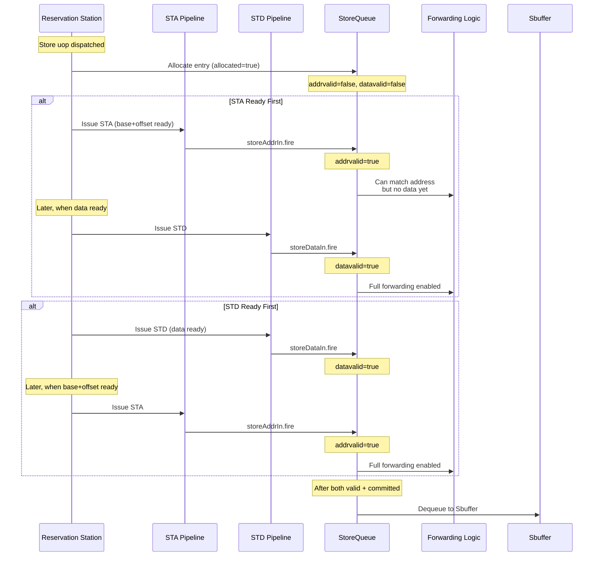

# Store Pipeline Analysis

This document provides a comprehensive analysis of the Store Pipeline in XiangShan processor.

---

## Overview

The **Store Pipeline** in XiangShan consists of multiple cooperating components:

1. **StoreUnit (STA Pipeline)**: Store address calculation and TLB lookup
2. **StorePipe (DCache)**: Hit/Miss determination and Prefetch generation
3. **StoreQueue**: Store instruction management and Store-to-Load Forwarding
4. **Sbuffer**: Committed store buffering with write combining
5. **MainPipe**: Actual DCache write operations

### Key Features

- **Non-Blocking Store**: Stores execute before commit, then transfer to Sbuffer after commit
- **Store-to-Load Forwarding**: Provides store data not yet written to cache to loads
- **Store Prefetch**: Generates prefetch requests on miss to reduce latency
- **MMIO Support**: Memory-Mapped I/O handled through separate path

---

## Overall Data Flow


---

## Key Data Structures

### DcacheStoreRequestIO

Interface for sending store requests to DCache.

```scala
class DcacheStoreRequestIO {
  val cmd: UInt(M_SZ.W)           // Memory command (M_PFW for prefetch write)
  val vaddr: UInt(VAddrBits.W)    // Virtual address
  val instrtype: UInt             // Source type (STORE_SOURCE / DCACHE_PREFETCH_SOURCE)
}
```

| Field | Width | Description |
|-------|-------|-------------|
| `cmd` | M_SZ (5 bits) | Memory operation command |
| `vaddr` | VAddrBits (39/48 bits) | Virtual address for index extraction |
| `instrtype` | sourceTypeWidth | Distinguishes store vs prefetch |

### DCacheStoreIO

Complete interface between StoreUnit and StorePipe.

```scala
class DCacheStoreIO {
  // Physical address from STA S1 for hit check
  val s1_paddr: Output(UInt(PAddrBits.W))

  // Kill DCache request on TLB miss or exception in STA S1
  val s1_kill: Output(Bool())

  // Kill DCache request on Access Fault or MMIO in STA S2
  val s2_kill: Output(Bool())

  // Debug PC
  val s2_pc: Output(UInt(VAddrBits.W))

  // Request/Response channels
  val req: DecoupledIO(DcacheStoreRequestIO)
  val resp: Flipped(DecoupledIO({
    val miss: Bool        // Cache miss
    val replay: Bool      // Replay needed (currently unused)
    val tag_error: Bool   // Tag error (TODO)
  }))
}
```

### LsPipelineBundle (Store Pipeline Payload)

`LsPipelineBundle` is the payload carried through the STA pipeline and into LSQ.
StoreQueue state flags like `allocated/addrvalid/datavalid/committed/pending/mmio/atomic/prefetch`
are **internal StoreQueue arrays**, not fields in `LsPipelineBundle`.

```scala
class LsPipelineBundle {
  val vaddr = UInt(VAddrBits.W)
  val paddr = UInt(PAddrBits.W)
  val mask = UInt((VLEN/8).W)
  val data = UInt((VLEN+1).W)
  val wlineflag = Bool() // store write whole cache line

  val miss = Bool()
  val tlbMiss = Bool()
  val ptwBack = Bool()
  val mmio = Bool()
  val atomic = Bool()
  val rsIdx = UInt(log2Up(IssQueSize).W)

  val isPrefetch = Bool()
  val isHWPrefetch = Bool()
  val isFirstIssue = Bool()
  // ... additional fields omitted
}
```

---

## Store Address/Data Split Issue

### Overview

XiangShan implements **split store address/data issue**:

- **STA (Store Address)**: Issues from reservation station when base + offset operands are ready
- **STD (Store Data)**: Issues separately when store data operand is ready

This split-issue design allows stores to:
1. Reserve resources early (via STA issue)
2. Participate in store-to-load forwarding as soon as address is known
3. Overlap address calculation with data computation

### StoreQueue State Tracking

StoreQueue maintains separate valid flags for address and data (StoreQueue.scala:129-131):

```scala
val addrvalid = RegInit(VecInit(List.fill(StoreQueueSize)(false.B))) // addr ready
val datavalid = RegInit(VecInit(List.fill(StoreQueueSize)(false.B))) // data ready
val allvalid  = VecInit((0 until StoreQueueSize).map(i =>
  addrvalid(i) && datavalid(i))) // both ready
```

### Issue Readiness from Reservation Station

Store instructions can issue **independently** for address and data:

| Component | Ready Condition | Issued To |
|-----------|----------------|-----------|
| **STA (Address)** | `src(0)` (base register) ready | StoreUnit (STA Pipeline) |
| **STD (Data)** | `src(1)` (data register) ready | StoreQueue directly |

**Key Points**:
- STA and STD issue **independently** when their respective operands are ready
- A store instruction may issue STA first, STD first, or both simultaneously
- RS tracks issue status separately for address and data operations

### Issue Cases and StoreQueue Entry States

| Case | Operands Ready | addrvalid | datavalid | STA Issued | STD Issued | Forwarding | Commit to Sbuffer |
|------|----------------|-----------|-----------|------------|------------|------------|-------------------|
| **1. Nothing Ready** | None | false | false | ❌ Waiting | ❌ Waiting | ❌ Cannot forward | ❌ Cannot commit |
| **2. Base Ready** | `src(0)` only | true | false | ✅ Issued | ❌ Waiting | ⚠️ `dataInvalid` replay | ❌ Cannot commit |
| **3. Data Ready** | `src(1)` only | false | true | ❌ Waiting | ✅ Issued | ⚠️ `addrInvalid` replay | ❌ Cannot commit |
| **4. Both Ready** | Both `src(0,1)` | true | true | ✅ Issued | ✅ Issued | ✅ Full forward | ✅ Ready after commit |

### Issue Flow



### Ready Pointers (StoreQueue.scala:143-144, 241-278)

StoreQueue tracks separate ready pointers:

```scala
val addrReadyPtrExt = RegInit(0.U.asTypeOf(new SqPtr))  // oldest addr-ready entry
val dataReadyPtrExt = RegInit(0.U.asTypeOf(new SqPtr))  // oldest data-ready entry

// Addr ready lookup
val addrReadyLookup = addrReadyLookupVec.map(ptr =>
  allocated(ptr.value) && (mmio(ptr.value) || addrvalid(ptr.value)) &&
  ptr =/= enqPtrExt(0))

// Data ready lookup
val dataReadyLookup = dataReadyLookupVec.map(ptr =>
  allocated(ptr.value) && (mmio(ptr.value) || datavalid(ptr.value)) &&
  ptr =/= enqPtrExt(0))
```

These pointers are used by:
- **Load RAW Queue**: Checks if older stores have addresses ready
- **Replay mechanism**: Wakes up loads waiting for store addr/data

### Impact on Store-to-Load Forwarding

When a load queries StoreQueue for forwarding (see [memory_disambiguation.md](memory_disambiguation.md)):

#### Case 1: Address Ready, Data Not Ready
```scala
// StoreQueue.scala:~450-500 (forwarding logic)
val addr_only_match = vaddr_match & addrvalid & ~datavalid

when (addr_only_match.any()) {
  io.forward.dataInvalid := true.B  // Trigger load replay (C_FF cause)
}
```
- Load matches the address range
- But store data is not yet available
- **Result**: Load replays with `LoadReplayCauses.C_FF` (Forward Fail)

#### Case 2: Address Not Ready
```scala
val hasAddrInvalidStore = io.query.map(_.req.bits.uop.sqIdx).map(sqIdx => {
  Mux(!allAddrCheck, isBefore(io.stAddrReadySqPtr, sqIdx), false.B)
})
```
- Older stores exist without known addresses
- **Result**: Load replays with `LoadReplayCauses.C_MA` (Memory Ambiguity)

#### Case 3: Both Ready
```scala
// Full forwarding path
val data_match = vaddr_match & allvalid  // addrvalid && datavalid

for (byte <- 0 until VLEN/8) {
  when (data_match(byte)) {
    io.forward.forwardMask(byte) := true.B
    io.forward.forwardData(byte) := dataModule.read(matched_entry, byte)
  }
}
```
- Load can successfully forward data from StoreQueue
- No replay needed

### Commit to Sbuffer

A store can only dequeue to Sbuffer when:

```scala
// Dequeue condition (StoreQueue.scala:~600)
val canDequeue = allocated(deqPtr) &&
                 committed(deqPtr) &&
                 allvalid(deqPtr) &&    // Both addr and data ready!
                 !pending(deqPtr)
```

**CRITICAL**: Even if a store is committed by ROB, it cannot write to Sbuffer until **both** address and data are available.

---

## StoreUnit (STA Pipeline) Detail

**File**: `src/main/scala/xiangshan/mem/pipeline/StoreUnit.scala`

StoreUnit is the Store Address (STA) pipeline, responsible for store address calculation and TLB lookup.

### Pipeline Diagram


### S0: Address Generation

**Key Operations**:
1. Select between Issue Queue or Prefetch request
2. Calculate virtual address: `base + SignExt(imm12)`
3. Send TLB request (write access)
4. Send DCache request (for hit/miss check)
5. Check alignment exception

```
// Address calculation logic
saddr_lo = src(0)(11:0) + imm12
saddr_hi = carry handling (based on saddr_lo(12))
vaddr = Cat(saddr_hi, saddr_lo(11:0))

// Alignment check
addr_aligned = based on fuOpType:
  - byte (b00): always aligned
  - half (b01): vaddr(0) == 0
  - word (b10): vaddr(1:0) == 0
  - double (b11): vaddr(2:0) == 0
```

**Outputs**:
- `s0_out.vaddr`: Virtual address
- `s0_out.mask`: Byte mask
- `s0_out.data`: Store data
- `io.st_mask_out`: Mask to StoreQueue

### S1: TLB Response Handling

**Key Operations**:
1. Receive TLB response (paddr, miss, exception)
2. Store-Load violation detection (nuke query)
3. Write store info to LSQ
4. Generate DCache kill signal

```scala
// Kill condition
s1_kill = robIdx.needFlush(redirect) || s1_tlb_miss

// DCache kill
io.dcache.s1_kill = s1_tlb_miss || s1_exception ||
                    s1_mmio || robIdx.needFlush(redirect)
```

**How DCache Kill Works (StoreUnit ↔ StorePipe Synchronization)**:

StoreUnit and StorePipe are **loosely coupled**. StorePipe only advances when
`io.dcache.req.fire` happens; if DCache is not ready, the request is dropped for that cycle.


The key insight is that **"kill" does not cancel an already-issued request**. Instead, it **prevents progression to the next stage**:

| Cycle | StoreUnit | StorePipe | Kill Effect |
|-------|-----------|-----------|-------------|
| N | S0: Compute vaddr, send `io.dcache.req` **if ready** | S0: Tag/Meta read only when req fires | - |
| N+1 | S1: TLB response, determine `s1_kill` | S1: Tag compare (uses **paddr** from `io.dcache.s1_paddr`) | `s1_kill` sent |
| N+2 | S2: PMP check | S2: **`s2_valid = RegNext(s1_valid) && RegNext(!s1_kill)`** | If `s1_kill` was true → `s2_valid = false` |

In StorePipe.scala:156:
```scala
val s2_valid = RegNext(s1_valid) && RegNext(!io.lsu.s1_kill)
```

- S0 Tag/Meta read already started (cannot be cancelled)
- But if `s1_kill` is asserted, **S2 becomes invalid** (`s2_valid = false`)
- Therefore, no `miss_req` is generated, no prefetch is issued

Additionally, `s2_kill` provides a second cancellation point:
```scala
io.miss_req.bits.cancel := io.lsu.s2_kill  // Cancel miss request on MMIO/exception/redirect
```

**Store-Load Nuke Query**:
```scala
io.stld_nuke_query.valid := s1_valid && !s1_tlb_miss && !s1_in.isHWPrefetch
io.stld_nuke_query.bits.robIdx := s1_in.uop.robIdx
io.stld_nuke_query.bits.paddr := s1_paddr
io.stld_nuke_query.bits.mask := s1_in.mask
```

**What the nuke query does**:
When the store's physical address is known in S1, the store pipeline broadcasts a
`stld_nuke_query` to the load side to check for **store→load ordering violations**.
Each load compares:
- `robIdx`: the load must be younger than the store (i.e., it may have executed early),
- `paddr`: same cache-line / 8B-aligned region (compare `paddr[...:3]`),
- `mask`: overlapping byte lanes.

If all match, the load is marked for **nuke/replay** (store-load RAW violation),
because it may have consumed stale data before the store address was resolved.

**Exception Handling**:
- `storePageFault`: Page fault detected by TLB
- `storeAccessFault`: Access fault detected by TLB

**LSQ Write (io.lsq)**:

The primary purpose of S1 LSQ write is to notify StoreQueue that **"this store's address has been determined"**.

```scala
// StoreUnit.scala:216-218
io.lsq.valid     := s1_valid && !s1_in.isHWPrefetch
io.lsq.bits      := s1_out
io.lsq.bits.miss := s1_tlb_miss  // override miss field
```

Data written to StoreQueue via `io.lsq` (LsPipelineBundle):

| Field | Source | Description |
|-------|--------|-------------|
| `paddr` | `io.tlb.resp.bits.paddr` | Physical address from TLB translation |
| `vaddr` | from S0 | Virtual address |
| `mask` | from S0 | Byte mask |
| `data` | from S0 | Store data |
| `uop` | from S0 | Micro-op info (includes sqIdx) |
| `tlbMiss` | `io.tlb.resp.bits.miss` | TLB miss flag |
| `mmio` | CBO instruction check | MMIO flag (cbo_clean/flush/inval) |
| `miss` | `s1_tlb_miss` | Overwritten to TLB miss status |
| `exceptionVec` | TLB exception | `storePageFault`, `storeAccessFault` |

When StoreQueue receives this data:
- Sets `addrvalid := true` for the entry
- Writes paddr to `paddrModule`
- Writes vaddr to `vaddrModule`
- Now this store can participate in **Store-to-Load Forwarding**

### S2: PMP Check

**Key Operations**:
1. PMP (Physical Memory Protection) check
2. MMIO region determination
3. Generate prefetch training signal

```scala
// MMIO determination
s2_mmio = s2_in.mmio || s2_pmp.mmio

// Kill condition (MMIO handled via separate path)
s2_kill = (s2_mmio && !s2_exception) ||
          s2_in.uop.robIdx.needFlush(redirect)

// Access fault update
s2_out.uop.cf.exceptionVec(storeAccessFault) =
  s2_in.uop.cf.exceptionVec(storeAccessFault) || s2_pmp.st
```

### S3+: Writeback

Store writeback happens after S2 and then passes through a variable delay
(rollback select pipeline) and `io.stout.ready` backpressure.

```scala
// Writeback timing
// - Only writeback if not MMIO
// - HW Prefetch does not writeback
s3_valid := (!s2_mmio || s2_exception) && !s2_out.isHWPrefetch
```

---

## StorePipe (DCache) Detail

**File**: `src/main/scala/xiangshan/cache/dcache/storepipe/StorePipe.scala`

StorePipe is the Store hit/miss determination pipeline inside DCache. It runs in parallel with StoreUnit and generates prefetch requests on miss.

### Purpose

1. **Hit/Miss Determination**: Compare Tag/Meta to check cache hit
2. **Prefetch Generation**: Send prefetch write request to MissQueue on miss
3. **(Note)** Store miss **training** signals are generated in StoreUnit, not StorePipe

### Pipeline Diagram


### S0: Tag/Meta Read Request

```scala
// Meta read request
io.meta_read.valid := s0_valid
io.meta_read.bits.idx := get_idx(io.lsu.req.bits.vaddr)
io.meta_read.bits.way_en := ~0.U(nWays.W)  // Read all ways

// Tag read request
io.tag_read.valid := s0_valid
io.tag_read.bits.idx := get_idx(io.lsu.req.bits.vaddr)
io.tag_read.bits.way_en := ~0.U(nWays.W)

// Ready condition
io.lsu.req.ready := io.meta_read.ready && io.tag_read.ready
```

### S1: Hit/Miss Determination

```scala
// Tag matching (per way)
s1_tag_match := wayMap(w =>
  s1_tag_resp(w) === get_tag(s1_paddr) &&
  s1_meta_resp(w).coh.isValid()
).asUInt

// Hit determination
val (s1_has_permission, _, s1_new_hit_coh) = s1_hit_coh.onAccess(s1_req.cmd)
val s1_hit = s1_has_permission &&
             s1_new_hit_coh === s1_hit_coh &&
             s1_tag_match.orR

// Replacement way selection
io.replace_way.set.valid := s1_valid
io.replace_way.set.bits := get_idx(s1_req.vaddr)
io.replace_way.dmWay := get_direct_map_way(s1_req.vaddr)

// Need replacement determination
s1_need_replacement := !s1_tag_match.orR
s1_way_en := Mux(s1_need_replacement, s1_repl_way_en, s1_tag_match)
```

**Coherence State Handling**:
```
Tag Match + Valid coherence → s1_hit_coh
Replacement needed → s1_repl_coh (coherence of replacement way)
```

### S2: Miss Request and Response

```scala
// LSU response
io.lsu.resp.valid := s2_valid
io.lsu.resp.bits.miss := !s2_hit
io.lsu.resp.bits.replay := false.B
io.lsu.resp.bits.tag_error := false.B

// Miss request (Prefetch Write)
if (EnableStorePrefetchAtIssue) {
  // All miss stores send request directly to MSHR
  io.miss_req.valid := s2_valid && !s2_hit
} else {
  // Only prefetched miss stores send request to MSHR
  io.miss_req.valid := s2_valid && !s2_hit && s2_is_prefetch
}

io.miss_req.bits.source := DCACHE_PREFETCH_SOURCE.U
io.miss_req.bits.pf_source := L1_HW_PREFETCH_STORE
io.miss_req.bits.cmd := MemoryOpConstants.M_PFW  // Prefetch Write
io.miss_req.bits.addr := get_block_addr(s2_paddr)
io.miss_req.bits.vaddr := s2_req.vaddr
io.miss_req.bits.way_en := s2_way_en
io.miss_req.bits.req_coh := s2_hit_coh
io.miss_req.bits.replace_coh := s2_repl_coh
io.miss_req.bits.replace_tag := s2_repl_tag
io.miss_req.bits.cancel := io.lsu.s2_kill
io.miss_req.bits.pc := io.lsu.s2_pc
```

---

## StoreQueue Detail

**File**: `src/main/scala/xiangshan/mem/lsqueue/StoreQueue.scala`

StoreQueue manages all in-flight stores and supports Store-to-Load Forwarding.

### Structure


### Key Pointers

| Pointer | Description |
|---------|-------------|
| `enqPtrExt` | Next allocation position |
| `deqPtrExt` | Next Sbuffer transfer position |
| `cmtPtrExt` | Next commit position |
| `addrReadyPtrExt` | Oldest store with ready address |
| `dataReadyPtrExt` | Oldest store with ready data |

### Store Lifecycle

```
1. Dispatch → allocated := true, addrvalid := false, datavalid := false

2. STA writeback → addrvalid := true, paddr/vaddr written
   (StoreQueue.scala:296-352: io.storeAddrIn)

3. STD writeback → datavalid := true, data written
   (StoreQueue.scala:354-386: io.storeDataIn)

   ⚠️ Steps 2 and 3 can occur in ANY ORDER or in parallel!
   - If STD issues first: datavalid=true, addrvalid=false
   - If STA issues first: addrvalid=true, datavalid=false
   - Both must complete before dequeue to Sbuffer

4. ROB commit → committed := true

5. Dequeue to Sbuffer → allocated := false
   (Only when: committed && addrvalid && datavalid)
```

### Separate Address/Data Input Ports

StoreQueue receives address and data through **separate interfaces** (StoreQueue.scala:69-71):

```scala
// Address input from STA pipeline
val storeAddrIn = Vec(StorePipelineWidth, Flipped(Valid(new LsPipelineBundle)))

// Data input from STD pipeline
val storeDataIn = Vec(StorePipelineWidth, Flipped(Valid(new ExuOutput)))

// Mask input from RS (sent early in S0)
val storeMaskIn = Vec(StorePipelineWidth, Flipped(Valid(new StoreMaskBundle)))
```

**Write Timing**:
1. **Mask** (S0): Written when STA issues, sent to SQ immediately
2. **Address** (S1): Written when STA completes TLB lookup
3. **Data** (variable): Written when STD issues from RS

These writes are **independent** and can occur in any order.

### Store-to-Load Forwarding

```scala
// Forward query interface (simplified view)
class LoadForwardQueryIO {
  val vaddr: UInt
  val paddr: UInt
  val mask: UInt
  val uop: MicroOp
  val pc: UInt
  val valid: Bool

  val forwardMaskFast: Vec[Bool] // resp to load_s1
  val forwardMask: Vec[Bool]     // resp to load_s2
  val forwardData: Vec[UInt]     // resp to load_s2
  val sqIdx: SqPtr

  val dataInvalid: Bool
  val matchInvalid: Bool
  val addrInvalid: Bool
}
```
`PipeLoadForwardQueryIO` adds `sqIdxMask`, `dataInvalidFast`, and `*InvalidSqIdx` for timing.

**Forward Conditions**:
1. Store is older than load (`isAfter(loadSqIdx, storeSqIdx)`)
2. Address matches (based on paddr)
3. Mask overlap

---

## Sbuffer Detail

**File**: `src/main/scala/xiangshan/mem/sbuffer/Sbuffer.scala`

Sbuffer coalesces committed stores at cacheline granularity and writes to DCache.

### Key Features

- **Size**: `StoreBufferSize` entries
- **Cacheline Granularity**: Merges at 64-byte units
- **Write Combining**: Merges multiple stores to same cacheline
- **Forward Support**: Provides data not yet written to DCache to loads

### Entry State

```scala
class SbufferEntryState {
  val state_valid: Bool           // Entry active
  val state_inflight: Bool        // DCache write in progress
  val w_timeout: Bool             // Waiting for timeout
  val w_sameblock_inflight: Bool  // Same block request in progress
}
```

### DCache Write Path

```
Sbuffer → MainPipe (S0-S3) → DCache Data Array
```

---

## MainPipe (DCache Write) Detail

**File**: `src/main/scala/xiangshan/cache/dcache/mainpipe/MainPipe.scala`

MainPipe is the 4-stage pipeline responsible for actual DCache writes.

### Request Types

1. **Store**: Store writes from Sbuffer
2. **AMO**: Atomic operations
3. **Probe**: Coherence probes from L2
4. **Replace**: Cache line replacement

### Priority

```scala
arbiter(
  in = Seq(
    io.probe_req,    // Highest priority
    io.replace_req,
    store_req,
    io.atomic_req    // Lowest priority
  ),
  out = req
)
```

### Pipeline Stages

| Stage | Operation |
|-------|-----------|
| S0 | Meta/Tag read request |
| S1 | Hit/Miss determination, Data read request |
| S2 | Data merge, MissQueue request on miss |
| S3 | Data/Meta/Tag write |

---

## Store Miss Handling Flow

### Case 1: Miss Detected in StorePipe (Prefetch)

```
Cycle N:   StorePipe S0 - Tag/Meta read
Cycle N+1: StorePipe S1 - Miss detected
Cycle N+2: StorePipe S2 - Prefetch Write request to MissQueue
           MissQueue → L2 request sent
...
Cycle N+X: L2 response → MissQueue → RefillPipe
           (subsequent store will hit)
```

### Case 2: Miss Detected in MainPipe

```
Cycle N:   MainPipe S0 - Meta/Tag read
Cycle N+1: MainPipe S1 - Miss detected, Data read
Cycle N+2: MainPipe S2 - Request to MissQueue
           (store waits in MissQueue)
...
Cycle N+X: L2 response → MainPipe replay
           MainPipe S3 - Actual write
```

---

## Timing Summary

### Store Instruction Processing (Normal Path)

| Cycle | StoreUnit | StorePipe | StoreQueue | Sbuffer | MainPipe |
|-------|-----------|-----------|------------|---------|----------|
| N | S0: Addr Gen | S0: Tag/Meta Read | - | - | - |
| N+1 | S1: TLB Resp | S1: Hit/Miss | Enqueue | - | - |
| N+2 | S2: PMP | S2: Miss Req | addrvalid | - | - |
| N+3 | S3: WB | - | datavalid | - | - |
| ... | - | - | committed | - | - |
| N+X | - | - | dequeue | Enqueue | - |
| N+X+1 | - | - | - | DCache Req | S0 |
| N+X+2 | - | - | - | - | S1 |
| N+X+3 | - | - | - | - | S2 |
| N+X+4 | - | - | - | - | S3: Write |

### Store Prefetch Latency

| Scenario | Latency | Description |
|----------|---------|-------------|
| StorePipe Hit | - | No prefetch needed |
| StorePipe Miss (L2 Hit) | ~10 cycles | Prefetch → L2 → Refill |
| StorePipe Miss (L2 Miss) | ~50+ cycles | Prefetch → L2 → DRAM |

---

## Configuration Options

### Store Prefetch Related

```scala
// EnableStorePrefetchAtIssue (check default value)
// - true: All store misses immediately generate prefetch
// - false: Only prefetch requests generate prefetch

// EnableStorePrefetchSMS
// - true: Enable prefetch learning via Store Miss Sampler
// - false: Disable SMS

// EnableStorePrefetchAtCommit / EnableStorePrefetchSPB
// - Prefetch at commit time or via SPB
```

---

## Performance Counters

### StoreUnit

```scala
XSPerfAccumulate("s0_in_valid", s0_valid)
XSPerfAccumulate("s0_in_fire", s0_fire)
XSPerfAccumulate("s0_in_fire_first_issue", s0_fire && s0_isFirstIssue)
XSPerfAccumulate("s0_addr_spec_success", s0_fire && addr_spec_success)
XSPerfAccumulate("s0_addr_spec_failed", s0_fire && addr_spec_failed)
XSPerfAccumulate("s1_tlb_miss", s1_fire && s1_tlb_miss)
```

### StorePipe

```scala
XSPerfAccumulate("s0_valid", io.lsu.req.valid)
XSPerfAccumulate("s0_valid_not_ready", io.lsu.req.valid && !io.lsu.req.ready)
XSPerfAccumulate("store_fire", s2_valid && !io.lsu.s2_kill)
XSPerfAccumulate("sta_hit", s2_valid && s2_hit && !io.lsu.s2_kill)
XSPerfAccumulate("sta_miss", s2_valid && !s2_hit && !io.lsu.s2_kill)
XSPerfAccumulate("store_miss_prefetch_fire", io.miss_req.fire && !io.miss_req.bits.cancel)
XSPerfAccumulate("store_miss_prefetch_not_fire", io.miss_req.valid && !io.miss_req.ready && !cancel)
```

---

## Related Files

| File | Role |
|------|------|
| [StoreUnit.scala](../../src/main/scala/xiangshan/mem/pipeline/StoreUnit.scala) | STA Pipeline |
| [StorePipe.scala](../../src/main/scala/xiangshan/cache/dcache/storepipe/StorePipe.scala) | DCache Store Pipeline |
| [StoreQueue.scala](../../src/main/scala/xiangshan/mem/lsqueue/StoreQueue.scala) | Store Queue |
| [Sbuffer.scala](../../src/main/scala/xiangshan/mem/sbuffer/Sbuffer.scala) | Store Buffer |
| [MainPipe.scala](../../src/main/scala/xiangshan/cache/dcache/mainpipe/MainPipe.scala) | DCache Main Pipeline |
| [MissQueue.scala](../../src/main/scala/xiangshan/cache/dcache/mainpipe/MissQueue.scala) | Miss Queue |

---

## Glossary

| Term | Description |
|------|-------------|
| **STA** | Store Address - store address calculation pipeline |
| **STD** | Store Data - store data delivery |
| **MMIO** | Memory-Mapped I/O |
| **Nuke** | Pipeline flush due to Store-Load violation |
| **Prefetch Write (M_PFW)** | Prefetch command for write |
| **Coherence** | Cache coherence state (Trunk, Tip, Branch, Invalid, etc.) |
| **PMP** | Physical Memory Protection |
| **SMS** | Store Miss Sampler (for prefetch learning) |

## Overview

XiangShan implements a **Three-Layer Defense** mechanism for memory disambiguation to ensure correct memory ordering in out-of-order execution:

1. **Store-to-Load Forwarding** (Prevention) - Proactively forwards data from older stores to younger loads
2. **s1_nuke** (Early Detection) - Detects violations when store addresses become ready
3. **RAW Queue** (Late Detection) - CAM-based final safety net when stores complete


---

## Key Data Structures

### LoadForwardQueryIO (MemCommon.scala:226-255)

Store-to-Load forwarding query interface:

```scala
class LoadForwardQueryIO {
  // Query signals (Output from Load Unit)
  val vaddr: UInt(VAddrBits.W)              // Virtual address for S1 CAM
  val paddr: UInt(PAddrBits.W)              // Physical address for S2 CAM
  val mask:  UInt((VLEN/8).W)               // Byte enable mask (16 bytes for 128-bit VLEN)
  val sqIdx: SqPtr                          // Store queue index (search older stores)
  val valid: Bool                           // Query valid

  // Response signals (Input to Load Unit)
  val forwardMaskFast: Vec(VLEN/8, Bool)    // S1 fast response (vaddr CAM)
  val forwardMask:     Vec(VLEN/8, Bool)    // S2 response (paddr CAM)
  val forwardData:     Vec(VLEN/8, UInt(8)) // Forwarded data per byte
  val dataInvalid:     Bool                 // Data not ready (need replay)
  val matchInvalid:    Bool                 // vaddr/paddr CAM mismatch (need redirect)
  val addrInvalid:     Bool                 // Store addr not calculated (need replay)
}
```

| Field | Width | Description |
|-------|-------|-------------|
| vaddr | 39 bits | Virtual address for S1 CAM lookup |
| paddr | 36 bits | Physical address for S2 CAM lookup |
| mask | 16 bits | Byte mask (1=byte accessed) |
| forwardMask | 16 bits | Which bytes forwarded from SQ |
| forwardData | 128 bits | Forwarded data (byte granularity) |
| dataInvalid | 1 bit | Store data not ready, replay needed |
| matchInvalid | 1 bit | VA/PA mismatch, redirect needed |
| addrInvalid | 1 bit | Store addr not ready, replay needed |

### LoadNukeQueryIO (MemCommon.scala:295-299)

Load-to-RAW/RAR queue query interface:

```scala
class LoadNukeQueryIO {
  val req = Decoupled(new LoadNukeQueryReq)  // Query request
  val resp = Flipped(Valid(new LoadNukeQueryResp)) // Response
  val revoke = Output(Bool)                   // Revoke allocation
}

class LoadNukeQueryReq {
  val uop:        MicroOp                     // Includes robIdx, sqIdx, lqIdx
  val mask:       UInt((VLEN/8).W)            // Data mask
  val paddr:      UInt(PAddrBits.W)           // Physical address
  val data_valid: Bool                        // Load obtained data
}
```

### StoreNukeQueryIO (MemCommon.scala:301-310)

Store broadcast for early violation detection:

```scala
class StoreNukeQueryIO {
  val robIdx: RobPtr                          // Store's ROB index
  val paddr:  UInt(PAddrBits.W)               // Store physical address
  val mask:   UInt((VLEN/8).W)                // Store data mask
}
```

### LoadReplayCauses (LoadQueueReplay.scala:34-70)

```scala
object LoadReplayCauses {
  val C_MA  = 0  // Memory Ambiguity (store addr not ready)
  val C_TM  = 1  // TLB Miss
  val C_FF  = 2  // Forward Fail (store data not ready)
  val C_DR  = 3  // DCache Replay (MSHR conflict)
  val C_DM  = 4  // DCache Miss
  val C_WF  = 5  // WPU Predict Fail
  val C_BC  = 6  // Bank Conflict
  val C_RAR = 7  // RAR Queue Full
  val C_RAW = 8  // RAW Queue Full
  val C_NK  = 9  // Nuke (st-ld violation)

  val allCauses = 10
}
```

| Cause | Priority | Description | Recovery |
|-------|----------|-------------|----------|
| C_MA | 0 (highest) | Store address not ready | Wait for store addr |
| C_TM | 1 | TLB miss | Wait for TLB refill |
| C_FF | 2 | Forward fail (data not ready) | Wait for store data |
| C_DR | 3 | DCache replay | Retry immediately |
| C_DM | 4 | DCache miss | Wait for refill |
| C_WF | 5 | Way prediction fail | Retry immediately |
| C_BC | 6 | Bank conflict | Retry immediately |
| C_RAR | 7 | RAR queue full | Wait for RAR space |
| C_RAW | 8 | RAW queue full | Wait for RAW space |
| C_NK | 9 (lowest) | Store-load nuke | Replay load |

---

## Layer 1: Store-to-Load Forwarding

### Pipeline Integration


### StoreQueue Forwarding Logic (StoreQueue.scala:399-573)

The StoreQueue maintains:
- `paddrModule`: CAM for physical address matching
- `vaddrModule`: CAM for virtual address matching
- `dataModule`: Store data and mask storage

**Forwarding Algorithm (Pseudo-code):**

```python
def store_forward_query(load_sqIdx, load_paddr, load_mask):
    # Step 1: Generate search mask (only search older stores)
    search_mask = get_older_entries(load_sqIdx, deqPtr)

    # Step 2: Virtual address CAM (S1 fast path)
    vaddr_match = vaddrModule.cam_query(load_vaddr) & search_mask

    # Step 3: Physical address CAM (S2)
    paddr_match = paddrModule.cam_query(load_paddr) & search_mask

    # Step 4: Check VA/PA consistency
    if (vaddr_match ^ paddr_match) & addrvalid != 0:
        return matchInvalid  # Need redirect (synonym/homonym)

    # Step 5: Check data validity
    data_match = vaddr_match & allvalid  # addr & data both valid
    addr_only_match = vaddr_match & addrvalid & ~datavalid

    if addr_only_match.any():
        return dataInvalid  # Need replay (wait for store data)

    # Step 6: Forward data
    for byte in range(VLEN/8):
        if data_match[byte]:
            forward_mask[byte] = True
            forward_data[byte] = dataModule[matched_entry].data[byte]

    return (forward_mask, forward_data)
```

### Full Forwarding Detection

A load can bypass DCache when **all** accessed bytes are forwarded:

```scala
// LoadUnit.scala:890
s2_full_fwd := ((~s2_fwd_mask.asUInt).asUInt & s2_in.mask) === 0.U &&
               !io.lsq.forward.dataInvalid
```

### Forwarding Sources Priority


```scala
// LoadUnit.scala:892-895 - LSQ has higher priority than Sbuffer
for (i <- 0 until VLEN / 8) {
  s2_fwd_mask(i) := io.lsq.forward.forwardMask(i) || io.sbuffer.forwardMask(i)
  s2_fwd_data(i) := Mux(io.lsq.forward.forwardMask(i),
                        io.lsq.forward.forwardData(i),
                        io.sbuffer.forwardData(i))
}
```

---

## Layer 2: s1_nuke Early Detection

### Mechanism

When a store's address becomes ready in Store S1, it broadcasts to all Load pipelines:


### Detection Logic (LoadUnit.scala:635-641, 827-833)

**In Load S1:**
```scala
val s1_nuke = VecInit((0 until StorePipelineWidth).map(w => {
  io.stld_nuke_query(w).valid &&                                    // Store query valid
  isAfter(s1_in.uop.robIdx, io.stld_nuke_query(w).bits.robIdx) &&  // Load is younger
  (s1_paddr(PAddrBits-1, 3) === io.stld_nuke_query(w).bits.paddr(PAddrBits-1, 3)) && // Same 8-byte block
  (s1_in.mask & io.stld_nuke_query(w).bits.mask).orR               // Byte overlap
})).asUInt.orR && !s1_tlb_miss
```

**In Load S2:**
```scala
val s2_nuke = VecInit((0 until StorePipelineWidth).map(w => {
  io.stld_nuke_query(w).valid &&
  isAfter(s2_in.uop.robIdx, io.stld_nuke_query(w).bits.robIdx) &&
  (s2_in.paddr(PAddrBits-1, 3) === io.stld_nuke_query(w).bits.paddr(PAddrBits-1, 3)) &&
  (s2_in.mask & io.stld_nuke_query(w).bits.mask).orR
})).asUInt.orR && !s2_tlb_miss || s2_in.rep_info.nuke  // Carry from S1
```

### Recovery: Load Replay

When s1_nuke is detected, the load is replayed via LoadQueueReplay with cause `C_NK`:

```scala
s2_out.rep_info.nuke := s2_nuke && s2_troublem
```

---

## Layer 3: RAW Queue (LoadQueueRAW)

### Overview

The RAW Queue is the final safety net. When a store **completes** (S3), it queries the RAW Queue for younger loads that may have read stale data.


### RAW Queue Entry (LoadQueueRAW.scala:56-90)

```scala
// Entry structure
val allocated = RegInit(VecInit(List.fill(LoadQueueRAWSize)(false.B)))
val uop       = Reg(Vec(LoadQueueRAWSize, new MicroOp))
val paddrModule = Module(new LqPAddrModule(...))  // CAM for paddr
val maskModule  = Module(new LqMaskModule(...))   // CAM for byte mask
val datavalid = RegInit(VecInit(List.fill(LoadQueueRAWSize)(false.B)))
```

| Field | Width | Description |
|-------|-------|-------------|
| allocated | 1 bit | Entry is valid |
| uop.robIdx | ~8 bits | ROB index for age comparison |
| uop.sqIdx | ~6 bits | Store queue index |
| paddr | 36 bits | Physical address (CAM key) |
| mask | 16 bits | Byte enable mask (CAM key) |
| datavalid | 1 bit | Load has obtained data |

### Enqueue Condition

A load enqueues to RAW Queue when:
1. Load query is valid
2. There are older stores with addresses not yet ready

```scala
// LoadQueueRAW.scala:106-112
val allAddrCheck = io.stIssuePtr === io.stAddrReadySqPtr
val hasAddrInvalidStore = io.query.map(_.req.bits.uop.sqIdx).map(sqIdx => {
  Mux(!allAddrCheck, isBefore(io.stAddrReadySqPtr, sqIdx), false.B)
})
val needEnqueue = canEnqueue.zip(hasAddrInvalidStore).zip(cancelEnqueue).map {
  case ((v, r), c) => v && r && !c
}
```

### Dequeue Condition

A load dequeues from RAW Queue when:
1. All older stores have their addresses ready
2. Or the load is flushed by redirect

```scala
// LoadQueueRAW.scala:178-186
for (i <- 0 until LoadQueueRAWSize) {
  val deqNotBlock = Mux(!allAddrCheck,
                        !isBefore(io.stAddrReadySqPtr, uop(i).sqIdx),
                        true.B)
  val needCancel = uop(i).robIdx.needFlush(io.redirect)

  when (allocated(i) && (deqNotBlock || needCancel)) {
    allocated(i) := false.B
    freeMaskVec(i) := true.B
  }
}
```

### Violation Detection (LoadQueueRAW.scala:307-344)

```scala
def detectRollback(i: Int) = {
  // Step 1: CAM query with store's paddr and mask
  paddrModule.io.violationMdata(i) := io.storeIn(i).bits.paddr
  maskModule.io.violationMdata(i) := io.storeIn(i).bits.mask

  // Step 2: Address and mask match
  val addrMaskMatch = RegNext(paddrModule.io.violationMmask(i).asUInt &
                              maskModule.io.violationMmask(i).asUInt)

  // Step 3: Filter entries - must be younger, allocated, data valid
  val entryNeedCheck = RegNext(VecInit((0 until LoadQueueRAWSize).map(j => {
    allocated(j) &&
    isAfter(uop(j).robIdx, io.storeIn(i).bits.uop.robIdx) &&  // Load is younger
    datavalid(j) &&                                            // Load has data
    !uop(j).robIdx.needFlush(io.redirect)
  })))

  // Step 4: Generate violation vector
  val lqViolationSelVec = VecInit((0 until LoadQueueRAWSize).map(j => {
    addrMaskMatch(j) && entryNeedCheck(j)
  }))

  // Step 5: Select oldest violating load
  val lqSelect = selectOldest(lqViolationSelVec, uop)

  (lqSelect._1(0), lqSelect._2(0).uop)
}
```

### Select Oldest Algorithm (LoadQueueRAW.scala:260-305)

Uses tree-based selection to find the oldest violating load:


### Redirect Generation (LoadQueueRAW.scala:375-392)

```scala
val allRedirect = (0 until StorePipelineWidth).map(i => {
  val redirect = Wire(Valid(new Redirect))
  redirect.valid := rollbackLqWb(i).valid
  redirect.bits.robIdx      := rollbackLqWb(i).bits.robIdx
  redirect.bits.ftqIdx      := rollbackLqWb(i).bits.cf.ftqPtr
  redirect.bits.ftqOffset   := rollbackLqWb(i).bits.cf.ftqOffset
  redirect.bits.level       := RedirectLevel.flush  // Full pipeline flush
  redirect.bits.cfiUpdate.target := rollbackLqWb(i).bits.cf.pc
  redirect
})

// Select oldest redirect if multiple violations
val oldestOneHot = selectOldestRedirect(allRedirect)
io.rollback := Mux1H(oldestOneHot, allRedirect)
```

---

## Complete Flow: Load Pipeline with Disambiguation


---

## Replay Causes and Recovery

### LoadQueueReplay Structure


### Blocking Conditions and Wake-up

| Cause | Blocking Condition | Wake-up Trigger |
|-------|-------------------|-----------------|
| C_MA | Store addr not ready | Store addr execute |
| C_TM | TLB miss | TLB hint response |
| C_FF | Store data not ready | Store data execute |
| C_DR | DCache replay | Immediate (no block) |
| C_DM | DCache miss | D-channel refill |
| C_WF | WPU fail | Immediate (no block) |
| C_BC | Bank conflict | Immediate (no block) |
| C_RAR | RAR queue full | RAR has space |
| C_RAW | RAW queue full | RAW has space |
| C_NK | Nuke | Immediate (no block) |

```scala
// LoadQueueReplay.scala:311-338
// C_MA: Memory Ambiguity
when (cause(i)(LoadReplayCauses.C_MA)) {
  blocking(i) := Mux(stAddrDeqVec(i), false.B, blocking(i))
}

// C_FF: Forward Fail
when (cause(i)(LoadReplayCauses.C_FF)) {
  blocking(i) := Mux(stDataDeqVec(i), false.B, blocking(i))
}

// C_DM: DCache Miss
when (cause(i)(LoadReplayCauses.C_DM)) {
  blocking(i) := Mux(io.tl_d_channel.valid &&
                     io.tl_d_channel.mshrid === missMSHRId(i), false.B, blocking(i))
}
```

---

## Memory Disambiguation Summary

XiangShan's memory disambiguation uses a multi-layered defense:

| Layer | Mechanism | Trigger | Recovery | Latency |
|-------|-----------|---------|----------|---------|
| **Layer 1** | Store-to-Load Forwarding | Load S1/S2 | Data forwarding | 0 cycles (best) |
| **Layer 2** | s1_nuke | Store addr ready | Load replay | ~30-50 cycles |
| **Layer 3** | RAW Queue | Store complete | Pipeline redirect | ~25-40 cycles |

- **Layer 1 (Forwarding)**: Handles ~95%+ of store-load dependencies proactively
- **Layer 2 (s1_nuke)**: Early detection when store address is ready, triggers replay
- **Layer 3 (RAW Queue)**: Final CAM-based safety net, triggers pipeline redirect

This design minimizes average latency (most cases resolved by forwarding) while guaranteeing correctness (RAW Queue catches all violations).
