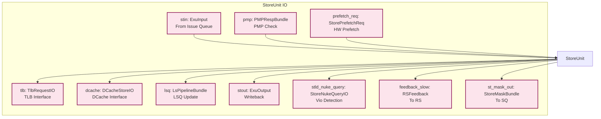
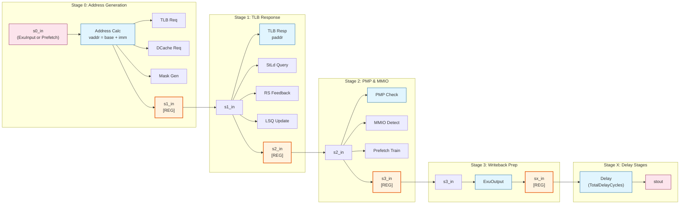
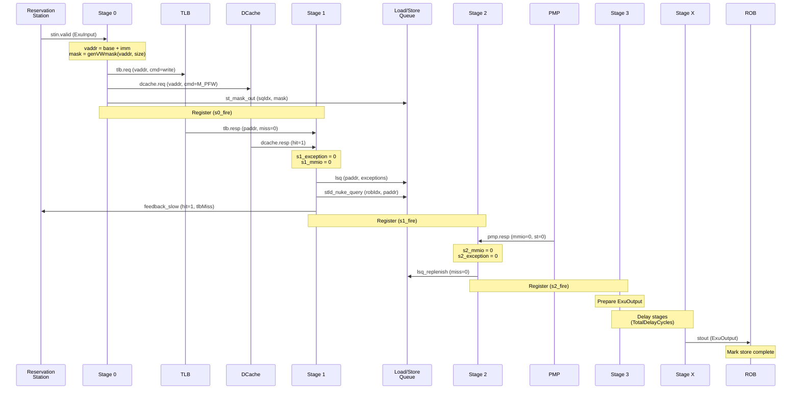
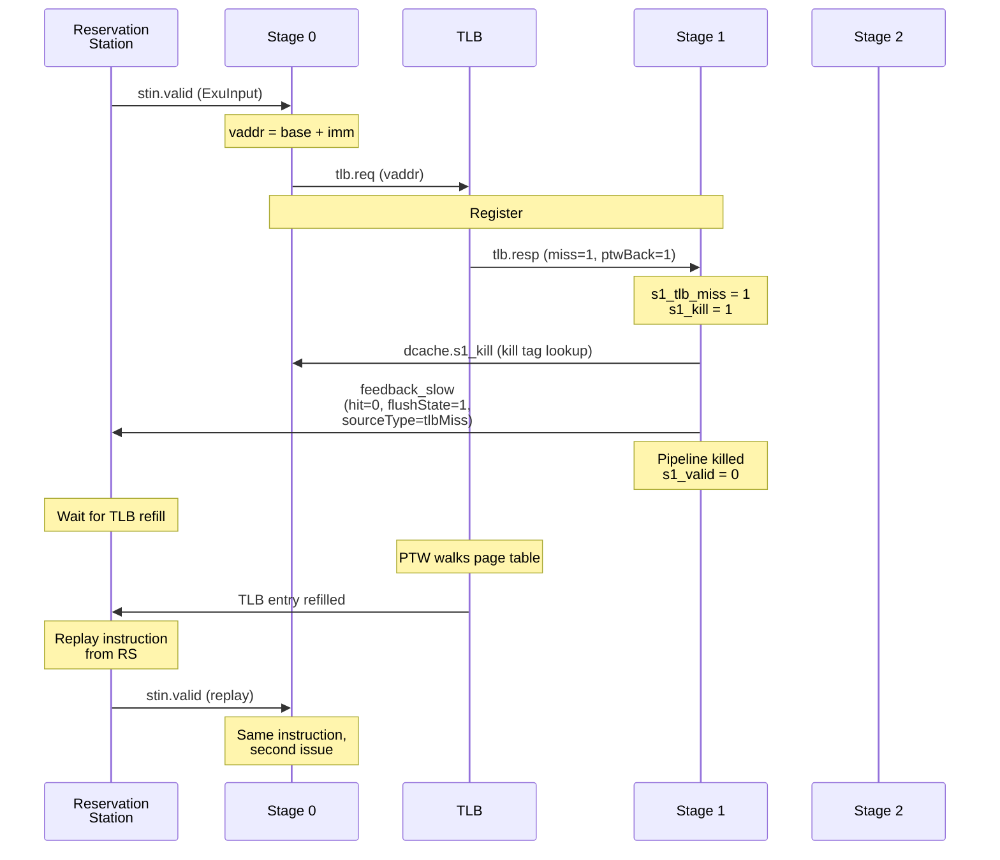
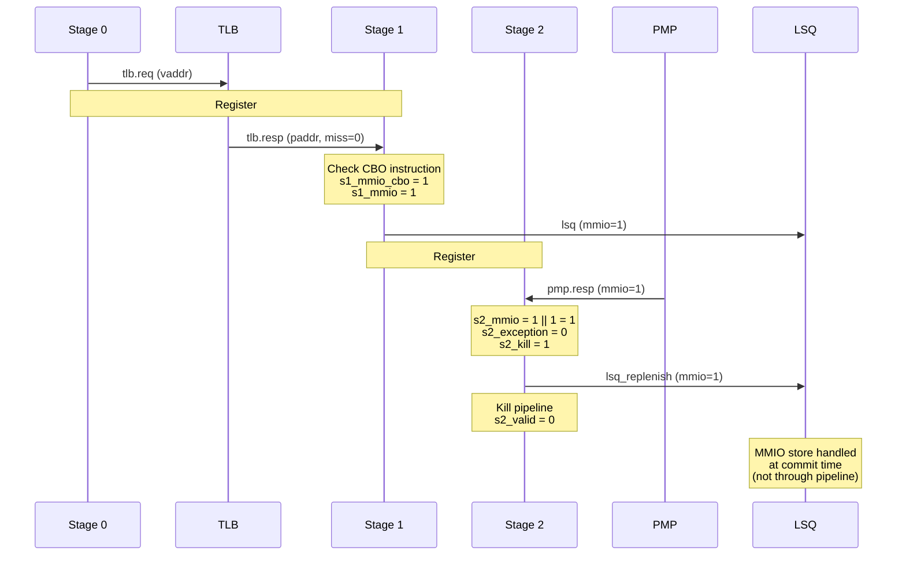
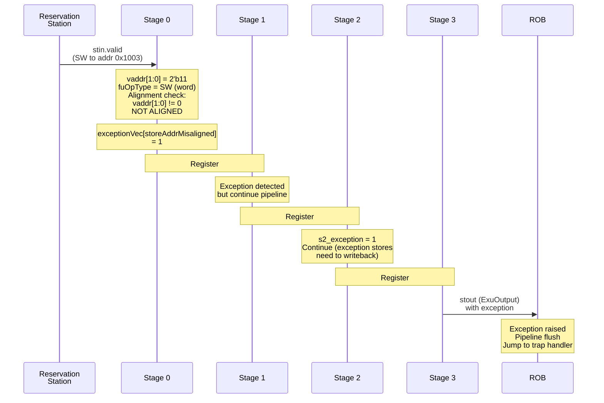
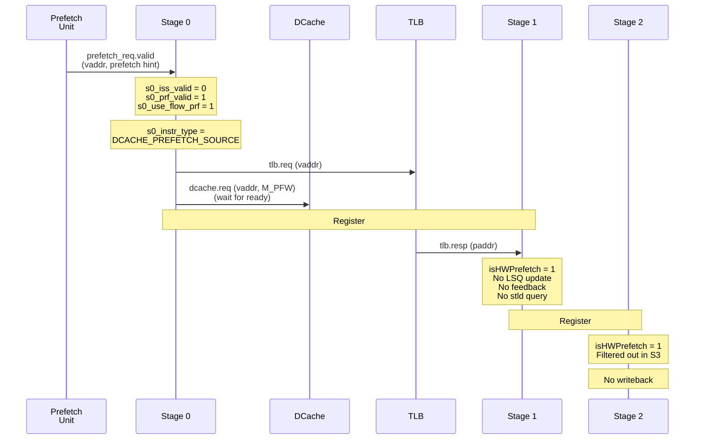

# StoreUnit Pipeline Analysis

## Overview

The `StoreUnit` is a critical component in XiangShan's memory subsystem, responsible for executing store operations in the out-of-order execution engine. It implements a multi-stage pipeline that handles store address calculation, virtual-to-physical address translation, cache tag/meta lookups, and integration with the Load-Store Queue (LSQ).

**Location**: `/home/kswan7004/XiangShan/src/main/scala/xiangshan/mem/pipeline/StoreUnit.scala`

### Key Responsibilities

1. **Store Address Generation** - Compute effective address from base + offset
2. **TLB Translation** - Virtual to physical address translation with exception handling
3. **DCache Query** - Check cache hit/miss status for prefetching decisions
4. **Store-Load Violation Detection** - Query LSQ to detect ordering violations
5. **Exception Detection** - Address misalignment, page faults, access faults
6. **Prefetch Integration** - Support hardware prefetch requests
7. **Pipeline Management** - Handle flushes, stalls, and backpressure

### Pipeline Architecture

The StoreUnit implements a variable-length pipeline:
- **S0**: Address generation, TLB/DCache request
- **S1**: TLB response processing, LSQ update, RS feedback
- **S2**: PMP check, MMIO detection, prefetch training
- **S3**: Writeback preparation
- **SX**: Additional delay stages (based on `TotalSelectCycles`)

---

## Top-Level Interface

### IO Bundle Structure



### Interface Signals

| Signal | Direction | Type | Description |
|--------|-----------|------|-------------|
| `stin` | Input | `Decoupled[ExuInput]` | Store instruction input from reservation station |
| `issue` | Output | `Valid[ExuInput]` | Issue signal to other components |
| `tlb` | Bidir | `TlbRequestIO` | TLB request/response for address translation |
| `dcache` | Bidir | `DCacheStoreIO` | DCache interface for tag/meta queries |
| `pmp` | Input | `PMPRespBundle` | Physical Memory Protection check results |
| `rsIdx` | Input | `UInt` | Reservation station index for feedback |
| `isFirstIssue` | Input | `Bool` | First issue flag for this instruction |
| `lsq` | Output | `Valid[LsPipelineBundle]` | Store information to LSQ |
| `lsq_replenish` | Output | `LsPipelineBundle` | LSQ replenishment data (S2 MMIO/exception) |
| `feedback_slow` | Output | `Valid[RSFeedback]` | Slow feedback to RS (TLB miss, etc.) |
| `prefetch_req` | Input | `Decoupled[StorePrefetchReq]` | Hardware prefetch request input |
| `prefetch_train` | Output | `Valid[StPrefetchTrainBundle]` | Prefetch training signals |
| `stld_nuke_query` | Output | `Valid[StoreNukeQueryIO]` | Store-load violation query |
| `stout` | Output | `Decoupled[ExuOutput]` | Store instruction writeback |
| `st_mask_out` | Output | `Valid[StoreMaskBundle]` | Store mask to Store Queue (S0) |
| `redirect` | Input | `Valid[Redirect]` | Pipeline flush/redirect signal |

---

## Data Structures

### LsPipelineBundle

The primary data structure flowing through the pipeline.

```scala
class LsPipelineBundle extends XSBundleWithMicroOp with HasDCacheParameters {
  val vaddr: UInt(VAddrBits.W)                // Virtual address
  val paddr: UInt(PAddrBits.W)                // Physical address (filled in S1)
  val mask: UInt((VLEN/8).W)                  // Byte mask (16B for VLEN=128)
  val data: UInt((VLEN+1).W)                  // Store data (129 bits)
  val wlineflag: Bool                         // Whole cacheline write flag

  val miss: Bool                              // DCache miss flag
  val tlbMiss: Bool                           // TLB miss flag
  val ptwBack: Bool                           // PTW feedback flag
  val mmio: Bool                              // MMIO operation flag
  val atomic: Bool                            // Atomic operation flag
  val rsIdx: UInt(log2Up(IssQueSize).W)       // RS index for feedback

  val forwardMask: Vec(VLEN/8, Bool)          // Forward mask (16 bytes)
  val forwardData: Vec(VLEN/8, UInt(8.W))     // Forward data (16 bytes)

  val isPrefetch: Bool                        // Prefetch flag
  val isHWPrefetch: Bool                      // Hardware prefetch flag
  val isFirstIssue: Bool                      // First issue debug flag
  val hasROBEntry: Bool                       // Has ROB entry flag

  // ... other fields for load replay, mshr, etc.
  val uop: MicroOp                            // Micro-operation details
}
```

**Key Fields**:
- `vaddr` (39 bits): Virtual address calculated in S0
- `paddr` (36 bits): Physical address from TLB in S1
- `mask` (16 bits): Byte enable mask for 128-bit vector stores
- `data` (129 bits): Store data from source register
- `uop`: Contains instruction metadata (PC, ROB index, SQ index, exception vector, etc.)

### ExuInput

Input bundle from the reservation station.

```scala
class ExuInput extends XSBundleWithMicroOp {
  val src: Vec(3, UInt(XLEN.W))               // Source operands
  val uop: MicroOp                            // Micro-operation
}
```

- `src(0)`: Base address (64 bits)
- `src(1)`: Store data (64 bits)
- `src(2)`: Not used for stores
- `uop.ctrl.imm`: 12-bit immediate offset

### StoreMaskBundle

Store byte mask sent to Store Queue in S0.

```scala
class StoreMaskBundle extends XSBundle {
  val sqIdx: SqPtr                            // Store Queue index
  val mask: UInt((VLEN/8).W)                  // Byte mask (16 bits)
}
```

### RSFeedback

Feedback to Reservation Station for replay control.

```scala
class RSFeedback extends XSBundle {
  val rsIdx: UInt(log2Up(IssQueSize).W)       // RS index
  val hit: Bool                               // TLB hit flag
  val flushState: Bool                        // PTW feedback flag
  val sourceType: RSFeedbackType()            // Feedback type (tlbMiss, etc.)
  val dataInvalidSqIdx: SqPtr                 // Invalid data SQ index
}
```

**Feedback Types**:
- `RSFeedbackType.tlbMiss = 1`: TLB miss, replay from RS

### StoreNukeQueryIO

Store-load violation detection query to LSQ.

```scala
class StoreNukeQueryIO extends XSBundle {
  val robIdx: RobPtr                          // Store ROB index
  val paddr: UInt(PAddrBits.W)                // Store physical address
  val mask: UInt((VLEN/8).W)                  // Store byte mask
}
```

---

## Pipeline Detailed Design

### Pipeline Overview Diagram



### Pipeline Stage Details

---

## Stage 0 (S0): Address Generation

**Location**: `StoreUnit.scala:56-148`

### Purpose
- Generate virtual address from base register and immediate offset
- Initiate TLB and DCache lookups
- Generate store byte mask
- Check address alignment

### Input Selection

The stage supports two input sources with priority arbitration:

```scala
val s0_iss_valid    = io.stin.valid               // From issue queue
val s0_prf_valid    = io.prefetch_req.valid       // From prefetch
val s0_use_flow_rs  = s0_iss_valid                // Priority: issue > prefetch
val s0_use_flow_prf = !s0_iss_valid && s0_prf_valid
```

**Priority**: Issue queue requests have higher priority than prefetch requests.

### Address Calculation

The address generation uses an optimized carry chain to reduce critical path delay:

```scala
// Pseudo code for address generation
imm12 = s0_in.uop.ctrl.imm[11:0]
saddr_lo = s0_in.src(0)[11:0] + {1'b0, imm12}  // 13-bit addition

// High bits with carry propagation optimization
if (saddr_lo[12]) {  // Carry out
  if (imm12[11]) {  // Negative immediate
    saddr_hi = s0_in.src(0)[VAddrBits-1:12]
  } else {  // Positive immediate
    saddr_hi = s0_in.src(0)[VAddrBits-1:12] + 1
  }
} else {  // No carry
  if (imm12[11]) {  // Negative immediate
    saddr_hi = s0_in.src(0)[VAddrBits-1:12] + sign_extend(1)
  } else {  // Positive immediate
    saddr_hi = s0_in.src(0)[VAddrBits-1:12]
  }
}

s0_vaddr = {saddr_hi, saddr_lo[11:0]}
```

**Address Calculation Example**:
- Base address: `0x0000_7FFF_FFFF_F800` (src(0))
- Immediate: `0x7FF` (2047, positive)
- Low 12-bit add: `0x800 + 0x7FF = 0x0FFF` (no carry)
- Result: `0x0000_7FFF_FFFF_FFFF`

### Byte Mask Generation

Store mask indicates which bytes are valid based on operation size:

```scala
// genVWmask for vector stores (uses addr[3:0])
val s0_mask = genVWmask(s0_vaddr, size_encode)

// Mask generation logic
size_encode = uop.ctrl.fuOpType[1:0]
mask_base = LookupTree(size_encode, [
  2'b00 -> 8'h01,   // Byte (SB)
  2'b01 -> 8'h03,   // Half (SH)
  2'b10 -> 8'h0F,   // Word (SW)
  2'b11 -> 8'hFF    // Double (SD)
])
s0_mask = mask_base << vaddr[3:0]  // Shift by low 4 bits
```

**Mask Examples**:
- `SW` (word) to addr `0x0004`: mask = `0x000F << 4 = 0x00F0` (bytes 4-7)
- `SD` (double) to addr `0x0008`: mask = `0x00FF << 8 = 0xFF00` (bytes 8-15)
- `SB` (byte) to addr `0x0005`: mask = `0x0001 << 5 = 0x0020` (byte 5)

### TLB Request

```scala
io.tlb.req.valid              := s0_valid
io.tlb.req.bits.vaddr         := s0_vaddr
io.tlb.req.bits.cmd           := TlbCmd.write
io.tlb.req.bits.size          := s0_size
io.tlb.req.bits.memidx.is_st  := true.B
io.tlb.req.bits.memidx.idx    := s0_mem_idx  // SQ index
```

**Key Fields**:
- `cmd = TlbCmd.write`: Indicates store operation for permission check
- `memidx.idx`: Store Queue index for tracking
- `vaddr`: Virtual address for translation

### DCache Request

```scala
io.dcache.req.valid           := s0_fire
io.dcache.req.bits.cmd        := MemoryOpConstants.M_PFW  // Prefetch for write
io.dcache.req.bits.vaddr      := s0_vaddr
io.dcache.req.bits.instrtype  := s0_instr_type
```

**Purpose**: Query cache tag/meta arrays to determine if the store will hit or miss (for prefetch decisions).

**Note**: DCache request is **not** a real write operation, just a tag lookup for hit/miss prediction.

### Address Alignment Check

```scala
s0_addr_aligned = LookupTree(fuOpType[1:0], [
  2'b00 -> true,                  // Byte: always aligned
  2'b01 -> (vaddr[0] == 0),       // Half: addr[0] must be 0
  2'b10 -> (vaddr[1:0] == 0),     // Word: addr[1:0] must be 00
  2'b11 -> (vaddr[2:0] == 0)      // Double: addr[2:0] must be 000
])

s0_out.uop.cf.exceptionVec[storeAddrMisaligned] := !s0_addr_aligned
```

### Store Mask Output

Immediately sent to Store Queue in S0:

```scala
io.st_mask_out.valid       := s0_use_flow_rs
io.st_mask_out.bits.mask   := s0_out.mask
io.st_mask_out.bits.sqIdx  := s0_out.uop.sqIdx
```

### Flow Control

```scala
val s0_kill    = s0_in.uop.robIdx.needFlush(io.redirect)
val s0_can_go  = s1_ready
val s0_fire    = s0_valid && !s0_kill && s0_can_go

io.stin.ready := s1_ready
io.prefetch_req.ready := s1_ready && io.dcache.req.ready && !s0_iss_valid
```

**Backpressure**: S0 stalls if S1 is not ready.

---

## Stage 1 (S1): TLB Response & LSQ Update

**Location**: `StoreUnit.scala:150-230`

### Purpose
- Receive physical address from TLB
- Detect TLB miss and exceptions
- Send feedback to Reservation Station
- Update LSQ with store information
- Query for store-load violations
- Kill DCache request on TLB miss/exception

### TLB Response Processing

```scala
val s1_paddr     = io.tlb.resp.bits.paddr(0)
val s1_tlb_miss  = io.tlb.resp.bits.miss

// Update output bundle
s1_out.paddr   := s1_paddr
s1_out.tlbMiss := s1_tlb_miss

// Exception extraction
s1_out.uop.cf.exceptionVec[storePageFault]   := io.tlb.resp.bits.excp(0).pf.st
s1_out.uop.cf.exceptionVec[storeAccessFault] := io.tlb.resp.bits.excp(0).af.st
```

**TLB Response Fields**:
- `paddr`: Translated physical address (36 bits)
- `miss`: TLB miss flag (need PTW)
- `excp.pf.st`: Store page fault
- `excp.af.st`: Store access fault

### MMIO Detection (CBO Instructions)

```scala
val s1_mmio_cbo = s1_in.uop.ctrl.fuOpType === LSUOpType.cbo_clean ||
                  s1_in.uop.ctrl.fuOpType === LSUOpType.cbo_flush ||
                  s1_in.uop.ctrl.fuOpType === LSUOpType.cbo_inval

val s1_mmio = s1_mmio_cbo
s1_out.mmio := s1_mmio
```

**Cache Block Operations (CBO)**: Treated as MMIO operations.

### RS Feedback Generation

Feedback sent to Reservation Station for replay decisions:

```scala
s1_feedback.valid                 := s1_valid && !s1_in.isHWPrefetch
s1_feedback.bits.hit              := !s1_tlb_miss
s1_feedback.bits.flushState       := io.tlb.resp.bits.ptwBack
s1_feedback.bits.rsIdx            := s1_out.rsIdx
s1_feedback.bits.sourceType       := RSFeedbackType.tlbMiss

// Delayed by one cycle in S2
io.feedback_slow := RegNext(s1_feedback)
```

**Feedback Flow**:
1. Generated in S1
2. Registered and sent in S2 (for timing)
3. Received by RS to replay instruction on TLB miss

### LSQ Update

```scala
io.lsq.valid     := s1_valid && !s1_in.isHWPrefetch
io.lsq.bits      := s1_out
io.lsq.bits.miss := s1_tlb_miss
```

**Purpose**: Update Store Queue entry with physical address and exception information.

### Store-Load Violation Query

```scala
io.stld_nuke_query.valid       := s1_valid && !s1_tlb_miss && !s1_in.isHWPrefetch
io.stld_nuke_query.bits.robIdx := s1_in.uop.robIdx
io.stld_nuke_query.bits.paddr  := s1_paddr
io.stld_nuke_query.bits.mask   := s1_in.mask
```

**Purpose**: Check if any younger loads have already executed with overlapping address, which would require a pipeline flush.

**Violation Condition**: `(store.paddr overlaps load.paddr) && (store.robIdx < load.robIdx) && load.executed`

### DCache Kill Signal

```scala
io.dcache.s1_kill := (s1_tlb_miss || s1_exception || s1_mmio ||
                      s1_in.uop.robIdx.needFlush(io.redirect))
io.dcache.s1_paddr := s1_paddr
```

**Purpose**: Cancel DCache tag lookup initiated in S0 if:
- TLB miss occurred
- Exception detected
- MMIO operation
- Pipeline flush

### Issue Signal

```scala
io.issue.valid := s1_valid && !s1_tlb_miss && !s1_in.isHWPrefetch
io.issue.bits  := RegEnable(s0_in, s0_valid)
```

**Purpose**: Notify other components that the store has issued.

### Flow Control

```scala
s1_kill := s1_in.uop.robIdx.needFlush(io.redirect) || s1_tlb_miss

s1_ready := !s1_valid || s1_kill || s2_ready
when (s0_fire) { s1_valid := true.B }
.elsewhen (s1_fire) { s1_valid := false.B }
.elsewhen (s1_kill) { s1_valid := false.B }
```

---

## Stage 2 (S2): PMP Check & Prefetch Training

**Location**: `StoreUnit.scala:231-288`

### Purpose
- Physical Memory Protection (PMP) check
- Final MMIO detection
- Generate prefetch training signals
- Replenish LSQ with MMIO/exception information
- Kill DCache request on MMIO/exception

### PMP Check

```scala
val s2_pmp = WireInit(io.pmp)

val s2_mmio = s2_in.mmio || s2_pmp.mmio
s2_out.mmio   := s2_mmio && !s2_exception
s2_out.atomic := s2_in.atomic || s2_pmp.atomic

s2_out.uop.cf.exceptionVec[storeAccessFault] :=
  s2_in.uop.cf.exceptionVec[storeAccessFault] || s2_pmp.st
```

**PMP Response**:
- `pmp.mmio`: Physical address is in MMIO region
- `pmp.atomic`: Atomic operation region
- `pmp.st`: PMP store access fault

### MMIO Handling

```scala
val s2_exception = ExceptionNO.selectByFu(s2_out.uop.cf.exceptionVec, staCfg).asUInt.orR
val s2_mmio = s2_in.mmio || s2_pmp.mmio

s2_kill := (s2_mmio && !s2_exception) || s2_in.uop.robIdx.needFlush(io.redirect)
```

**Kill Condition**: MMIO operations (without exceptions) are killed in S2 because they will be handled separately by LSQ/SBuffer at commit time, not through normal store pipeline.

### LSQ Replenishment

```scala
io.lsq_replenish := s2_out
io.lsq_replenish.miss := io.dcache.resp.fire && io.dcache.resp.bits.miss
```

**Purpose**: Update LSQ with:
- Final MMIO flag
- DCache miss information
- Complete exception vector

### Prefetch Training

```scala
io.prefetch_train.bits.fromLsPipelineBundle(s2_in, latch = true)
io.prefetch_train.bits.miss := RegNext(io.dcache.resp.bits.miss)
io.prefetch_train.bits.meta_prefetch := false.B
io.prefetch_train.bits.meta_access := false.B

if (EnableStorePrefetchSMS) {
  io.prefetch_train.valid := RegNext(
    s2_valid && io.dcache.resp.fire &&
    !s2_out.mmio && !s2_in.tlbMiss && !s2_in.isHWPrefetch
  )
}
```

**Training Timing**: Prefetch training signals are registered, so they appear in **S3** (next cycle after S2).

**Training Conditions**:
- DCache response received (hit/miss determined)
- Not MMIO operation
- Not TLB miss
- Not hardware prefetch request itself

### DCache Kill Signal

```scala
io.dcache.s2_kill := (s2_mmio || s2_exception || s2_in.uop.robIdx.needFlush(io.redirect))
io.dcache.s2_pc   := s2_out.uop.cf.pc
```

### Flow Control

```scala
s2_ready := !s2_valid || s2_kill || s3_ready
when (s1_fire) { s2_valid := true.B }
.elsewhen (s2_fire) { s2_valid := false.B }
.elsewhen (s2_kill) { s2_valid := false.B }
```

---

## Stage 3 (S3): Writeback Preparation

**Location**: `StoreUnit.scala:289-320`

### Purpose
- Prepare ExuOutput for writeback to ROB
- Filter out MMIO operations (handled separately)
- Propagate micro-operation and debug information

### Writeback Bundle Preparation

```scala
s3_out                 := DontCare
s3_out.uop             := s3_in.uop
s3_out.data            := DontCare
s3_out.redirectValid   := false.B
s3_out.redirect        := DontCare
s3_out.debug.isMMIO    := s3_in.mmio
s3_out.debug.paddr     := s3_in.paddr
s3_out.debug.vaddr     := s3_in.vaddr
s3_out.debug.isPerfCnt := false.B
s3_out.fflags          := DontCare
```

**Key Points**:
- `data`: Not used for stores (data sent separately to SBuffer)
- `redirectValid = false`: Stores don't cause redirects
- `debug.isMMIO`: Indicates if this is an MMIO operation

### Valid Signal

```scala
when (s2_fire) {
  s3_valid := (!s2_mmio || s2_exception) && !s2_out.isHWPrefetch
}
.elsewhen (s3_fire) { s3_valid := false.B }
.elsewhen (s3_kill) { s3_valid := false.B }
```

**Filtering**:
- MMIO operations (without exceptions) are filtered out
- Hardware prefetch requests are filtered out
- Only normal stores and stores with exceptions proceed

### Delay Calculation

```scala
val SelectGroupSize   = RollbackGroupSize
val lgSelectGroupSize = log2Ceil(SelectGroupSize)
val TotalSelectCycles = ceil(log2Ceil(LoadQueueRAWSize) / lgSelectGroupSize) + 1
val TotalDelayCycles  = TotalSelectCycles - 2
```

**Purpose**: Calculate pipeline delay based on Load Queue size for load-store ordering checks.

---

## Stage X (SX): Additional Delay Stages

**Location**: `StoreUnit.scala:321-358`

### Purpose
- Add variable delay stages based on `TotalDelayCycles`
- Maintain program order for writeback
- Handle flushes during delay period

### Delay Pipeline Implementation

```scala
val TotalDelayCycles = TotalSelectCycles - 2
val sx_valid = Wire(Vec(TotalDelayCycles + 1, Bool()))
val sx_ready = Wire(Vec(TotalDelayCycles + 1, Bool()))
val sx_in    = Wire(Vec(TotalDelayCycles + 1, new ExuOutput))

// Backward ready propagation
s3_ready := sx_ready.head

for (i <- 0 until TotalDelayCycles + 1) {
  if (i == 0) {
    sx_valid(i) := s3_valid
    sx_in(i)    := s3_out
    sx_ready(i) := !sx_valid(i) || sx_kill(i) || next_ready
  } else {
    // Pipeline register with kill/flush handling
    sx_valid(i) := RegEnable(prev_fire, false.B, valid_can_go)
    sx_in(i)    := RegEnable(sx_in(i-1), prev_fire)
    sx_ready(i) := !sx_valid(i) || cur_kill || next_ready
  }
}
```

### Final Writeback

```scala
io.stout.valid := sx_last_valid && !sx_last_in.uop.robIdx.needFlush(io.redirect)
io.stout.bits  := sx_last_in
io.stout.bits.redirectValid := false.B
```

**Writeback Timing**: Store instructions writeback after `TotalDelayCycles` to ensure proper ordering with load queue operations.

---

## Key Scenarios

### Scenario 1: Normal Store Hit Path



### Scenario 2: TLB Miss with Replay



### Scenario 3: MMIO Operation Handling



### Scenario 4: Store Address Misalignment



### Scenario 5: Hardware Prefetch Request



---

## Implementation Details

### Address Speculation Optimization

The address calculation in S0 uses an optimized carry chain that speculatively computes both cases (carry/no-carry) and selects the correct result. This reduces critical path delay compared to a standard ripple-carry adder.

**Critical Path**: Register read → 13-bit addition → 2:1 MUX → TLB/DCache access

### Pipeline Stall Conditions

The pipeline can stall at any stage if the next stage is not ready:

```scala
// S0 stalls if S1 not ready
s0_fire = s0_valid && !s0_kill && s1_ready

// S1 stalls if S2 not ready
s1_fire = s1_valid && !s1_kill && s2_ready

// S2 stalls if S3 not ready
s2_fire = s2_valid && !s2_kill && s3_ready

// SX stalls if ROB writeback not ready
sx_fire = sx_valid && !sx_kill && io.stout.ready
```

### Kill/Flush Handling

Each stage can be killed independently:

1. **S0 Kill**: Redirect flush before entering pipeline
2. **S1 Kill**: TLB miss or redirect flush
3. **S2 Kill**: MMIO operation (without exception) or redirect flush
4. **S3/SX Kill**: Redirect flush only

**Kill Effect**:
- Valid bit cleared
- Stage becomes ready immediately
- Data discarded (no writeback)

### Exception Accumulation

Exceptions accumulate through the pipeline:

```scala
// S0: Address misalignment
exceptionVec[storeAddrMisaligned] = !addr_aligned

// S1: TLB exceptions
exceptionVec[storePageFault]   |= tlb.resp.excp.pf.st
exceptionVec[storeAccessFault] |= tlb.resp.excp.af.st

// S2: PMP exceptions
exceptionVec[storeAccessFault] |= pmp.st
```

**Priority**: Earlier exceptions take priority (evaluated at ROB commit).

### Timing Optimizations

1. **S0 Address Calculation**: Optimized carry propagation
2. **S1 Feedback**: Registered to S2 for better timing
3. **S2 Prefetch Training**: Registered to S3
4. **DCache Response**: Sampled in S2, used in replenish

### DCache Interface

The DCache interface is **non-blocking**:
- S0: Send request (may not wait for ready)
- S1: Provide paddr and kill signal
- S2: Provide final kill signal and sample response

**Kill Semantics**:
- `s1_kill`: Cancel tag/meta lookup initiated in S0
- `s2_kill`: Cancel any pending prefetch or miss request

### Store-Load Violation Detection

Query sent in S1 with physical address:

```scala
io.stld_nuke_query.valid  := s1_valid && !s1_tlb_miss
io.stld_nuke_query.paddr  := s1_paddr
io.stld_nuke_query.mask   := s1_mask
io.stld_nuke_query.robIdx := s1_robIdx
```

**LSQ Action**:
- Compare with executed loads
- If younger load already executed with overlapping address → trigger nuke/replay

---

## Performance Considerations

### Critical Paths

1. **S0 Address Generation → TLB/DCache**
   - Register read → Add → MUX → TLB/DC access
   - Optimized with speculative carry computation

2. **S1 TLB Response → LSQ Update**
   - TLB response → Exception merge → LSQ write
   - Single cycle timing

3. **S2 PMP Check → MMIO Decision**
   - PMP response → MMIO detect → Kill signal
   - Must complete in one cycle

### Throughput

**Ideal Throughput**: 1 store per cycle

**Throughput Limiters**:
- TLB request bandwidth (shared with loads)
- DCache tag/meta port conflicts
- LSQ write ports
- Backpressure from ROB writeback

### Latency

**Best Case Latency (No Stalls)**:
- S0 → S1 → S2 → S3 → SX → Writeback
- Total: `4 + TotalDelayCycles` cycles

**Typical Latency**:
- TLB hit: 4 + delay cycles
- TLB miss: 4 + delay + PTW latency (10-100+ cycles)
- DCache miss: Doesn't block store (only affects prefetch)

### Pipeline Efficiency

**Stall Sources**:
1. TLB miss: Replays from RS (~1-5% of stores)
2. Backpressure from ROB: Rare (ROB writeback is multi-ported)
3. DCache port conflicts: Minimal (stores don't wait for DCache ready)

**Kill Sources**:
1. Branch misprediction/redirect: ~10-20% of in-flight stores
2. TLB miss: ~1-5%
3. MMIO detection: <1%

---

## Debug and Performance Counters

### Debug Signals

```scala
io.debug_ls.s1.isTlbFirstMiss := io.tlb.resp.valid &&
                                 io.tlb.resp.bits.miss &&
                                 io.tlb.resp.bits.debug.isFirstIssue
io.debug_ls.s1_robIdx := s1_in.uop.robIdx.value
```

### Performance Counters

```scala
// S0 counters
XSPerfAccumulate("s0_in_valid", s0_valid)
XSPerfAccumulate("s0_in_fire", s0_fire)
XSPerfAccumulate("s0_in_fire_first_issue", s0_fire && s0_isFirstIssue)
XSPerfAccumulate("s0_addr_spec_success",
  s0_fire && s0_saddr[VAddrBits-1:12] === s0_in.src(0)[VAddrBits-1:12])
XSPerfAccumulate("s0_addr_spec_failed",
  s0_fire && s0_saddr[VAddrBits-1:12] =/= s0_in.src(0)[VAddrBits-1:12])

// S1 counters
XSPerfAccumulate("s1_in_valid", s1_valid)
XSPerfAccumulate("s1_in_fire", s1_fire)
XSPerfAccumulate("s1_tlb_miss", s1_fire && s1_tlb_miss)
XSPerfAccumulate("s1_tlb_miss_first_issue",
  s1_fire && s1_tlb_miss && s1_in.isFirstIssue)
```

**Key Metrics**:
- `s0_addr_spec_success/failed`: Address high bits prediction accuracy
- `s1_tlb_miss`: TLB miss rate
- `s1_tlb_miss_first_issue`: First-time TLB miss rate

---

## Configuration Parameters

### Configurable Values

From `XSCoreParameters` and `HasDCacheParameters`:

| Parameter | Description | Typical Value |
|-----------|-------------|---------------|
| `VAddrBits` | Virtual address width | 39 bits |
| `PAddrBits` | Physical address width | 36 bits |
| `XLEN` | Register width | 64 bits |
| `VLEN` | Vector register width | 128 bits |
| `IssQueSize` | Issue queue size | 16-32 entries |
| `LoadQueueRAWSize` | Load queue RAW size | 80 entries |
| `RollbackGroupSize` | Rollback group size | 8 entries |
| `EnableStorePrefetchSMS` | Store prefetch SMS enable | True/False |

### Derived Parameters

```scala
TotalSelectCycles = ceil(log2(LoadQueueRAWSize) / log2(RollbackGroupSize)) + 1
                  = ceil(log2(80) / log2(8)) + 1
                  = ceil(6.32 / 3) + 1
                  = 3 + 1 = 4

TotalDelayCycles = TotalSelectCycles - 2 = 4 - 2 = 2
```

**Total Pipeline Depth**: 4 (S0-S3) + 2 (SX) = 6 cycles (typical)

---

## Integration with Other Components

### Load-Store Queue (LSQ)

**Interfaces**:
1. `st_mask_out` (S0): Store byte mask
2. `lsq` (S1): Initial store information with paddr
3. `lsq_replenish` (S2): Final MMIO/exception/miss info

**LSQ Uses**:
- Track store order for memory disambiguation
- Forward store data to younger loads
- Handle MMIO stores at commit
- Detect store-load violations

### DCache

**Interface**: `DCacheStoreIO`

**Request Flow**:
1. S0: Send request with vaddr
2. S1: Provide paddr and s1_kill signal
3. S2: Provide s2_kill signal, receive response

**Purpose**: Determine hit/miss for prefetch hints (not actual write).

**Actual Store Write**: Happens later at commit through SBuffer, not through this pipeline.

### TLB (DTLB)

**Interface**: `TlbRequestIO`

**Request**: S0 sends vaddr, cmd=write, size
**Response**: S1 receives paddr, exceptions, miss flag

**Miss Handling**: Instruction replays from RS after PTW completes.

### Reservation Station (RS)

**Feedback Interface**: `feedback_slow`

**Feedback Timing**: Generated in S1, sent in S2

**Feedback Types**:
- `tlbMiss`: TLB miss, replay after PTW
- (Future: other replay conditions)

### ROB (Reorder Buffer)

**Writeback Interface**: `stout`

**Writeback Content**:
- Micro-operation with exceptions
- Debug info (MMIO, paddr, vaddr)
- No data (data sent separately to SBuffer)

**ROB Action**:
- Mark store as completed
- Trigger exception handling if needed
- Allow store to commit

---

## Error Handling

### Exception Types

1. **Store Address Misaligned** (S0)
   - Detected: When address not aligned to operation size
   - Effect: Exception recorded, pipeline continues
   - Resolution: ROB raises exception at commit

2. **Store Page Fault** (S1)
   - Detected: TLB indicates page fault
   - Effect: Exception recorded, pipeline continues
   - Resolution: ROB raises exception at commit

3. **Store Access Fault** (S1 and S2)
   - S1: TLB access fault
   - S2: PMP access fault
   - Effect: Exception recorded, pipeline continues
   - Resolution: ROB raises exception at commit

### Exception Priority

From highest to lowest priority:
1. Store address misaligned (S0)
2. Store page fault (S1)
3. Store access fault (S1, S2)

**Note**: Only the highest priority exception will be taken at commit.

### Flush Handling

**Redirect Sources**:
- Branch misprediction
- Exception from older instruction
- Memory ordering violation

**Flush Mechanism**:
```scala
s0_kill = s0_in.uop.robIdx.needFlush(io.redirect)
s1_kill = s1_in.uop.robIdx.needFlush(io.redirect) || s1_tlb_miss
s2_kill = s2_in.uop.robIdx.needFlush(io.redirect) || (s2_mmio && !s2_exception)
s3_kill = s3_in.uop.robIdx.needFlush(io.redirect)
sx_kill = sx_in.uop.robIdx.needFlush(io.redirect)
```

**Effect**:
- Valid bit cleared immediately
- Stage becomes ready for new instruction
- In-flight work discarded

---

## Special Cases

### CBO (Cache Block Operation) Instructions

**Types**:
- `cbo.clean`: Write back dirty cache line
- `cbo.flush`: Write back and invalidate cache line
- `cbo.inval`: Invalidate cache line
- `cbo.zero`: Zero entire cache line

**Handling**:
- Detected as MMIO in S1
- Killed in S2 (if no exception)
- Executed at commit time by LSQ

### Whole Cache Line Stores

```scala
val s0_wlineflag = s0_in.uop.ctrl.fuOpType === LSUOpType.cbo_zero
s0_out.wlineflag := s0_wlineflag
```

**Purpose**: Indicate store will write entire cache line (optimization).

### Vector Stores

**Support**: 128-bit vector stores (VLEN=128)

**Mask**: 16-bit byte mask (128/8 = 16 bytes)

**Address**: Uses low 4 bits for mask shift (addr[3:0])

---

## Future Enhancements

### Potential Optimizations

1. **Early Store-Load Forwarding**
   - Current: Forwarding happens in LSQ
   - Enhancement: Bypass directly from store pipeline

2. **Store Coalescing**
   - Current: Each store handled independently
   - Enhancement: Merge adjacent stores to same cache line

3. **Prefetch Accuracy**
   - Current: Simple hit/miss based prefetch training
   - Enhancement: Confidence-based prefetch with feedback

4. **Dual-Issue Support**
   - Current: Single store per cycle
   - Enhancement: Two stores in parallel (requires dual TLB/DCache ports)

### Known Limitations

1. **DCache Request Not Guaranteed**
   - S0 may not wait for DCache ready
   - Prefetch requests always wait for DCache ready
   - Impact: Some stores may not query cache

2. **Single TLB Port**
   - Shared with loads
   - Impact: Potential conflicts and stalls

3. **Fixed Delay Stages**
   - SX delay based on LoadQueue size
   - Impact: All stores pay delay cost even if not needed

---

## Appendix

### Reference Files

- **StoreUnit**: `src/main/scala/xiangshan/mem/pipeline/StoreUnit.scala`
- **MemCommon**: `src/main/scala/xiangshan/mem/MemCommon.scala`
- **Bundle**: `src/main/scala/xiangshan/Bundle.scala`
- **DCache StorePipe**: `src/main/scala/xiangshan/cache/dcache/storepipe/StorePipe.scala`

### Related Components

- **LoadUnit**: Load instruction pipeline
- **LoadQueue**: Load instruction tracking and forwarding
- **StoreQueue**: Store instruction tracking
- **SBuffer**: Store buffer for committed stores
- **DTLB**: Data TLB for address translation
- **DCache**: L1 data cache

### Acronyms

- **CBO**: Cache Block Operation
- **DCache**: Data Cache
- **DTLB**: Data Translation Lookaside Buffer
- **LSQ**: Load-Store Queue
- **MMIO**: Memory-Mapped I/O
- **PMP**: Physical Memory Protection
- **PTW**: Page Table Walker
- **RAW**: Read-After-Write
- **ROB**: Reorder Buffer
- **RS**: Reservation Station
- **SBuffer**: Store Buffer
- **TLB**: Translation Lookaside Buffer

---

## Revision History

| Date | Version | Changes |
|------|---------|---------|
| 2026-02-02 | 1.0 | Initial comprehensive analysis |
