# StoreUnit Component Interaction Analysis

This document details how the StoreUnit interacts with other components in the XiangShan memory subsystem.

---

## System Context Diagram

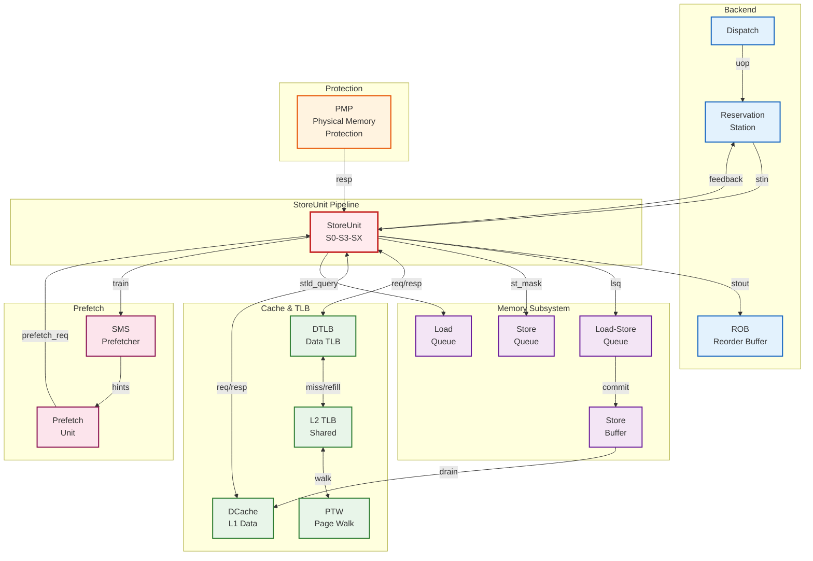

---

## Detailed Component Interactions

### 1. Reservation Station (RS) Interface

#### Input: Store Instruction Issue

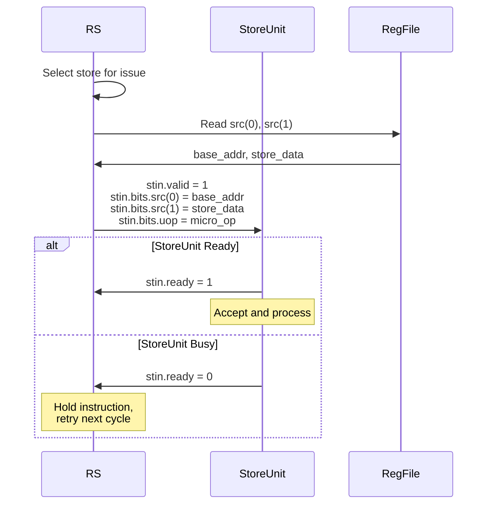

**Interface Details**:

```scala
// Input from RS (DecoupledIO)
io.stin.valid    : Bool              // RS has a store to issue
io.stin.ready    : Bool              // StoreUnit can accept
io.stin.bits     : ExuInput          // Store instruction bundle
  .src(0)        : UInt[64]          // Base address register
  .src(1)        : UInt[64]          // Store data register
  .uop           : MicroOp           // Micro-operation details
    .ctrl.imm    : UInt[12]          // Immediate offset
    .ctrl.fuOpType : UInt           // Operation type (SB/SH/SW/SD)
    .robIdx      : RobPtr            // ROB index for ordering
    .sqIdx       : SqPtr             // Store Queue index
```

**Ready Condition**: `stin.ready = s1_ready` (backpressure from S1)

#### Output: Feedback to RS

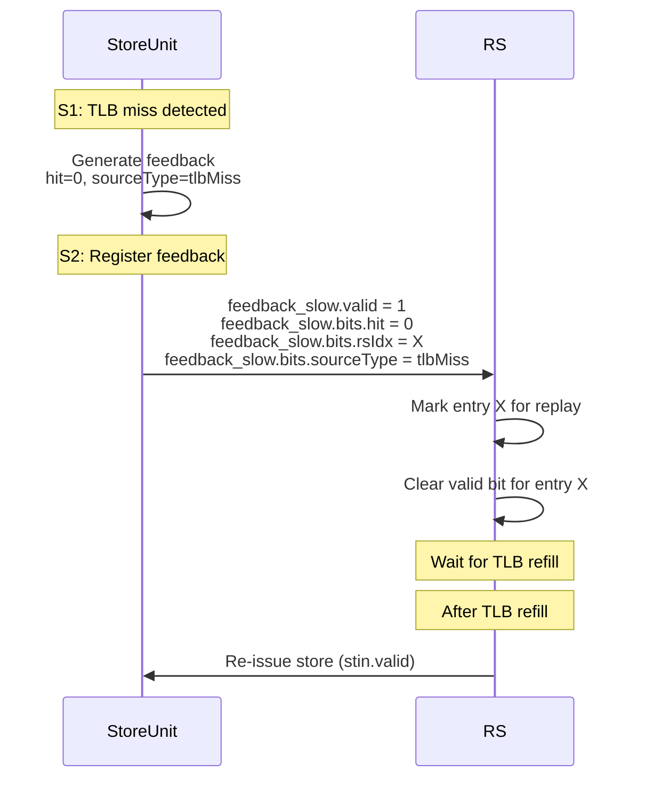

**Feedback Interface**:

```scala
// Output to RS (ValidIO, delayed 1 cycle)
io.feedback_slow.valid : Bool        // Feedback valid
io.feedback_slow.bits  : RSFeedback
  .rsIdx        : UInt               // RS entry index
  .hit          : Bool               // TLB hit (0 = miss)
  .flushState   : Bool               // PTW feedback flag
  .sourceType   : UInt[3]            // Feedback type (tlbMiss = 1)
```

**Feedback Timing**: Generated in S1, sent in S2 (1-cycle delay for timing)

**Feedback Types**:
- `tlbMiss (1)`: Replay after TLB/PTW refill

---

### 2. TLB (DTLB) Interface

#### TLB Request Flow

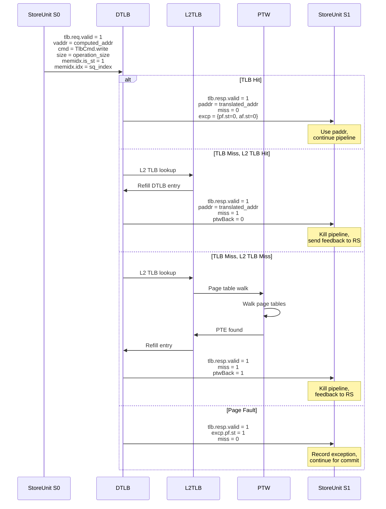

**TLB Request Interface**:

```scala
// Stage 0 → TLB
io.tlb.req.valid         : Bool      // Request valid
io.tlb.req.bits          : TlbReq
  .vaddr                 : UInt[39]  // Virtual address
  .cmd                   : UInt      // TlbCmd.write
  .size                  : UInt[2]   // 0=byte, 1=half, 2=word, 3=double
  .kill                  : Bool      // Kill request (always 0)
  .memidx                : Bundle
    .is_ld               : Bool      // 0 for stores
    .is_st               : Bool      // 1 for stores
    .idx                 : UInt      // Store Queue index
  .debug                 : Bundle
    .robIdx              : RobPtr    // For tracking
    .pc                  : UInt[39]  // For debug
    .isFirstIssue        : Bool      // First issue flag
  .no_translate          : Bool      // Always 0 for normal stores
```

**TLB Response Interface**:

```scala
// TLB → Stage 1
io.tlb.resp.valid        : Bool      // Response valid
io.tlb.resp.ready        : Bool      // Always 1 (StoreUnit always accepts)
io.tlb.resp.bits         : TlbResp
  .paddr                 : Vec[UInt[36]]  // paddr(0) for single request
  .miss                  : Bool      // TLB miss flag
  .excp                  : Vec[Bundle]    // excp(0) for single request
    .pf.st               : Bool      // Store page fault
    .af.st               : Bool      // Store access fault
  .ptwBack               : Bool      // PTW feedback flag
  .memidx                : Bundle    // Echo of request memidx
    .is_st               : Bool
    .idx                 : UInt
```

**TLB Timing**:
- Request sent in S0
- Response received in S1 (1-cycle latency for DTLB hit)
- L2 TLB hit: 2-3 cycle latency
- PTW: 10-200+ cycle latency

---

### 3. DCache Interface

#### DCache Store Pipe Interaction

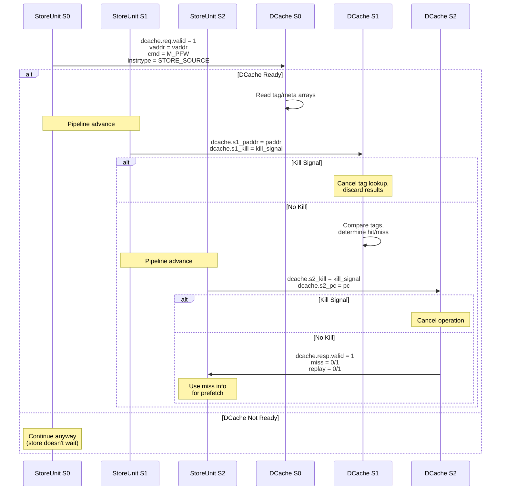

**DCache Request Interface**:

```scala
// Stage 0 → DCache
io.dcache.req.valid      : Bool      // Request valid
io.dcache.req.ready      : Bool      // DCache ready (may be ignored)
io.dcache.req.bits       : DcacheStoreRequestIO
  .cmd                   : UInt      // M_PFW (prefetch for write)
  .vaddr                 : UInt[39]  // Virtual address
  .instrtype             : UInt      // STORE_SOURCE or DCACHE_PREFETCH_SOURCE
```

**DCache Control Signals**:

```scala
// Stage 1 → DCache
io.dcache.s1_paddr       : UInt[36]  // Physical address
io.dcache.s1_kill        : Bool      // Kill tag lookup
  // Kill if: TLB miss || exception || MMIO || redirect

// Stage 2 → DCache
io.dcache.s2_kill        : Bool      // Kill operation
  // Kill if: MMIO || exception || redirect
io.dcache.s2_pc          : UInt[39]  // PC for debug

// DCache → Stage 2
io.dcache.resp.valid     : Bool      // Response valid
io.dcache.resp.ready     : Bool      // Always 1
io.dcache.resp.bits      : Bundle
  .miss                  : Bool      // Cache miss flag
  .replay                : Bool      // Replay required flag
  .tag_error             : Bool      // Tag ECC error
```

**Important Notes**:
1. **Not a real write**: DCache request is for tag/meta lookup only
2. **May not wait**: Store doesn't stall if DCache not ready
3. **Actual write**: Happens at commit through SBuffer
4. **Miss info**: Used for prefetch training only

---

### 4. Load-Store Queue (LSQ) Interface

#### LSQ Update Flow

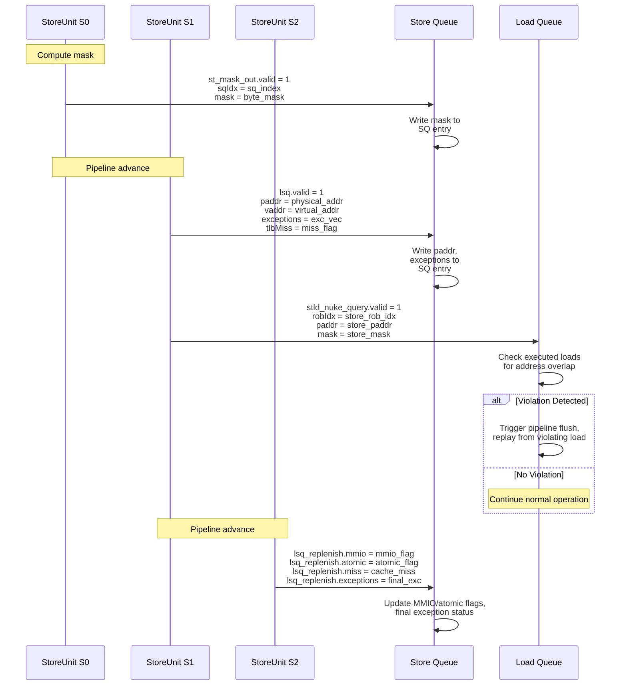

**LSQ Interface Details**:

```scala
// Stage 0 → Store Queue (immediate)
io.st_mask_out.valid     : Bool      // Mask valid
io.st_mask_out.bits      : StoreMaskBundle
  .sqIdx                 : SqPtr     // Store Queue index
  .mask                  : UInt[16]  // Byte mask (VLEN/8 = 16)

// Stage 1 → Store Queue
io.lsq.valid             : Bool      // Update valid
io.lsq.bits              : LsPipelineBundle
  .vaddr                 : UInt[39]  // Virtual address
  .paddr                 : UInt[36]  // Physical address
  .mask                  : UInt[16]  // Byte mask
  .data                  : UInt[129] // Store data
  .uop                   : MicroOp   // Micro-op (includes sqIdx)
    .sqIdx               : SqPtr     // Store Queue index
  .tlbMiss               : Bool      // TLB miss flag
  .uop.cf.exceptionVec   : Vec[Bool] // Exception vector
  // ... other fields

// Stage 1 → Load Queue (violation detection)
io.stld_nuke_query.valid : Bool      // Query valid
io.stld_nuke_query.bits  : StoreNukeQueryIO
  .robIdx                : RobPtr    // Store ROB index
  .paddr                 : UInt[36]  // Store physical address
  .mask                  : UInt[16]  // Store byte mask

// Stage 2 → Store Queue (replenishment)
io.lsq_replenish         : LsPipelineBundle
  .mmio                  : Bool      // Final MMIO flag
  .atomic                : Bool      // Final atomic flag
  .miss                  : Bool      // DCache miss flag
  .uop.cf.exceptionVec   : Vec[Bool] // Final exceptions
  // ... complete bundle
```

**Update Sequence**:
1. **S0**: Send byte mask to SQ (early for timing)
2. **S1**: Send paddr and initial exception info to SQ
3. **S1**: Query LQ for store-load violations
4. **S2**: Send final MMIO/atomic/exception info to SQ

---

### 5. PMP (Physical Memory Protection) Interface

#### PMP Check Flow

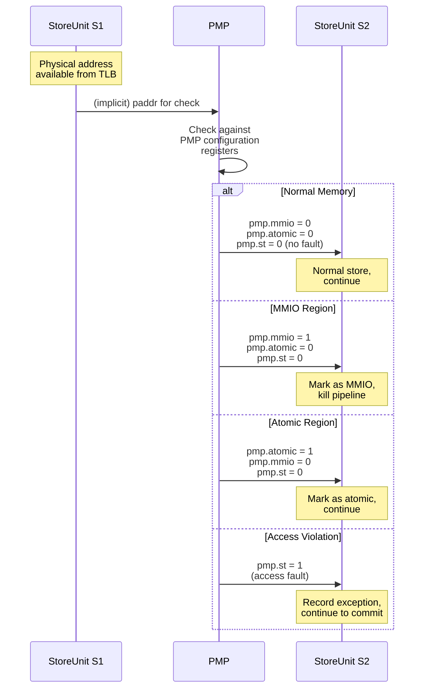

**PMP Response Interface**:

```scala
// PMP → Stage 2
io.pmp                   : PMPRespBundle
  .mmio                  : Bool      // MMIO region flag
  .atomic                : Bool      // Atomic region flag
  .st                    : Bool      // Store access fault

// Internal processing in S2
val s2_pmp = WireInit(io.pmp)
val s2_mmio = s2_in.mmio || s2_pmp.mmio
val s2_atomic = s2_in.atomic || s2_pmp.atomic

s2_out.uop.cf.exceptionVec[storeAccessFault] :=
  s2_in.uop.cf.exceptionVec[storeAccessFault] || s2_pmp.st
```

**PMP Timing**: Combinational response in S2

---

### 6. Prefetch System Interface

#### Prefetch Training Flow

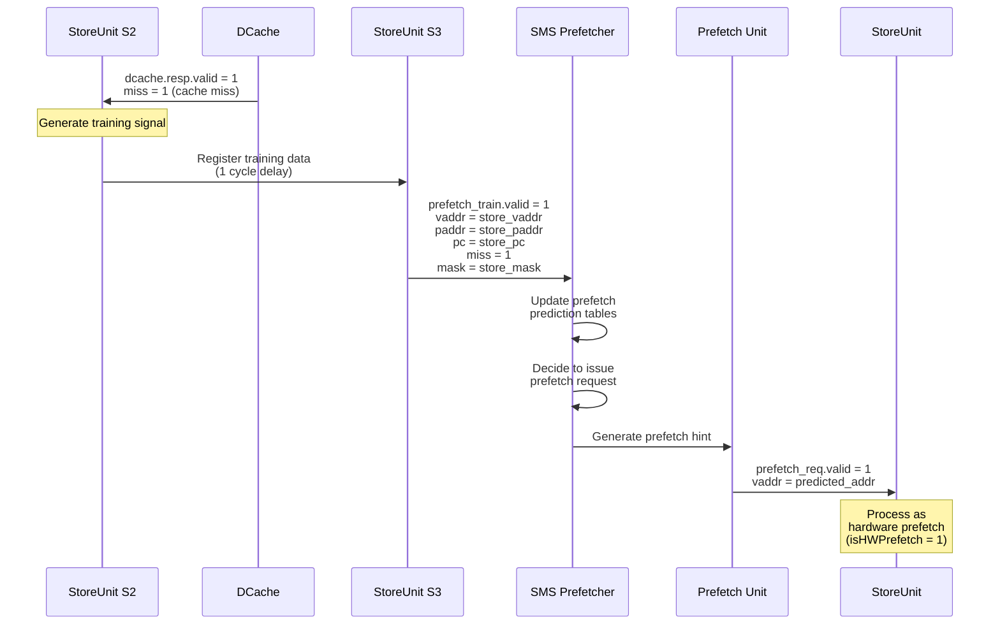

**Prefetch Request Input**:

```scala
// Prefetch Unit → Stage 0
io.prefetch_req.valid    : Bool      // Prefetch request valid
io.prefetch_req.ready    : Bool      // StoreUnit can accept
  // ready = s1_ready && dcache.req.ready && !s0_iss_valid
io.prefetch_req.bits     : StorePrefetchReq
  .vaddr                 : UInt[39]  // Prefetch virtual address
```

**Prefetch Training Output**:

```scala
// Stage 3 → SMS Prefetcher
io.prefetch_train.valid  : Bool      // Training signal valid
  // valid = s2_valid && dcache.resp.fire && !mmio && !tlbMiss && !isHWPrefetch
io.prefetch_train.bits   : StPrefetchTrainBundle
  .vaddr                 : UInt[39]  // Store virtual address
  .paddr                 : UInt[36]  // Store physical address
  .mask                  : UInt[16]  // Store mask
  .uop.cf.pc             : UInt[39]  // Store PC
  .miss                  : Bool      // Cache miss flag
  .meta_prefetch         : UInt      // Prefetch source
  .meta_access           : Bool      // Access flag
```

**Training Conditions**:
- DCache response received (hit/miss known)
- Not MMIO operation
- Not TLB miss
- Not hardware prefetch itself
- EnableStorePrefetchSMS = true

**Training Timing**: Registered in S2, sent in S3 (1-cycle delay)

---

### 7. ROB (Reorder Buffer) Interface

#### Store Writeback Flow

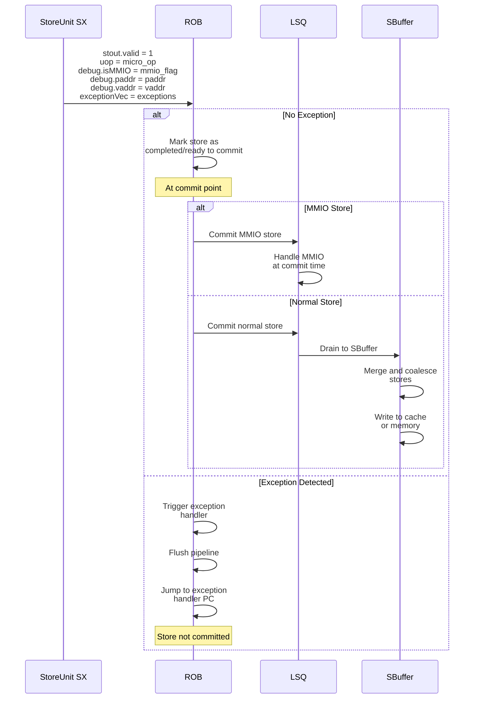

**Writeback Interface**:

```scala
// Stage X → ROB
io.stout.valid           : Bool      // Writeback valid
io.stout.ready           : Bool      // ROB ready to accept
io.stout.bits            : ExuOutput
  .uop                   : MicroOp   // Micro-operation
    .robIdx              : RobPtr    // ROB index
    .cf.exceptionVec     : Vec[Bool] // Exception vector
    .cf.pc               : UInt[39]  // PC for exception handling
  .data                  : UInt[64]  // DontCare for stores
  .redirectValid         : Bool      // Always false for stores
  .redirect              : Redirect  // DontCare
  .debug                 : DebugBundle
    .isMMIO              : Bool      // MMIO flag
    .isPerfCnt           : Bool      // Always false
    .paddr               : UInt[36]  // Physical address
    .vaddr               : UInt[39]  // Virtual address
  .fflags                : UInt[5]   // DontCare for stores
```

**Writeback Timing**: After S0+S1+S2+S3+SX delay cycles

**ROB Actions**:
1. Mark store as completed
2. Check for exceptions
3. At commit: handle MMIO or drain to SBuffer
4. Update retirement counters

---

## Inter-Component Timing Diagram

### Complete Store Execution Timeline

```mermaid
gantt
    title Complete Store Execution with All Components
    dateFormat X
    axisFormat %L

    section StoreUnit
    S0 (Addr Gen)       :s0, 0, 1000
    S1 (TLB Resp)       :s1, 1000, 2000
    S2 (PMP Check)      :s2, 2000, 3000
    S3 (WB Prep)        :s3, 3000, 4000
    SX (Delay)          :sx, 4000, 6000
    Writeback           :wb, 6000, 7000

    section TLB
    Receive Req         :tlb_r, 0, 1000
    Lookup              :tlb_l, 1000, 2000
    Send Resp           :tlb_s, 2000, 3000

    section DCache
    Receive Req         :dc_r, 0, 1000
    Tag Lookup          :dc_t, 1000, 2000
    Send Resp           :dc_s, 2000, 3000

    section LSQ
    Receive Mask        :lsq_m, 0, 1000
    Receive Paddr       :lsq_p, 1000, 2000
    Violation Check     :lsq_v, 2000, 3000
    Receive Replenish   :lsq_r, 3000, 4000
    Wait Commit         :lsq_w, 4000, 7000

    section PMP
    Receive Paddr       :pmp_r, 1000, 2000
    Check               :pmp_c, 2000, 3000
    Send Resp           :pmp_s, 3000, 4000

    section ROB
    Wait WB             :rob_w, 0, 6000
    Receive WB          :rob_r, 6000, 7000
    Mark Complete       :rob_m, 7000, 8000
    Commit              :rob_c, 8000, 9000

    section SBuffer
    Wait Commit         :sb_w, 0, 8000
    Receive Store       :sb_r, 8000, 9000
    Drain to Cache      :sb_d, 9000, 12000
```

---

## Pipeline Bubble Propagation

### Bubble Example: TLB Miss

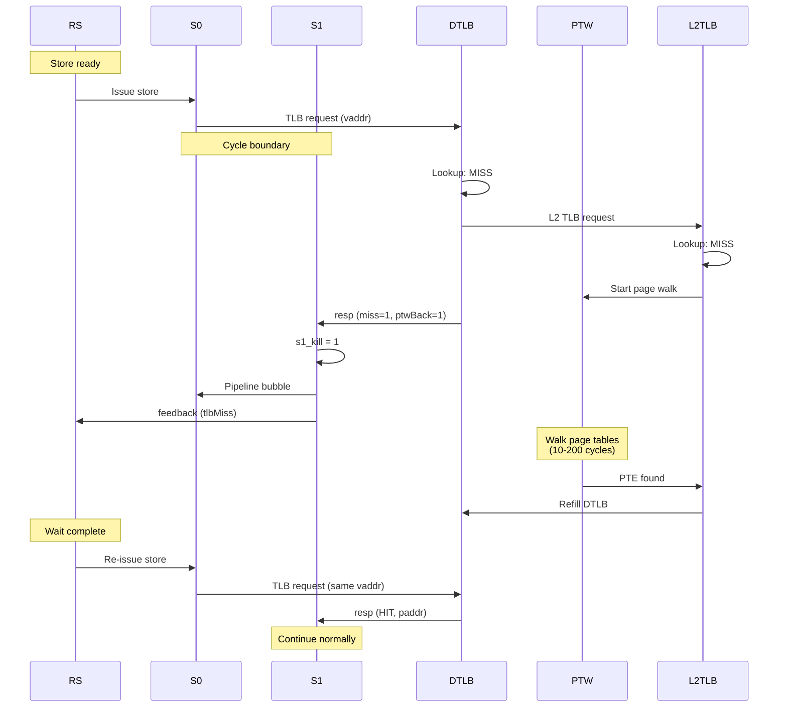

---

## Error and Exception Propagation

### Exception Accumulation Through Pipeline

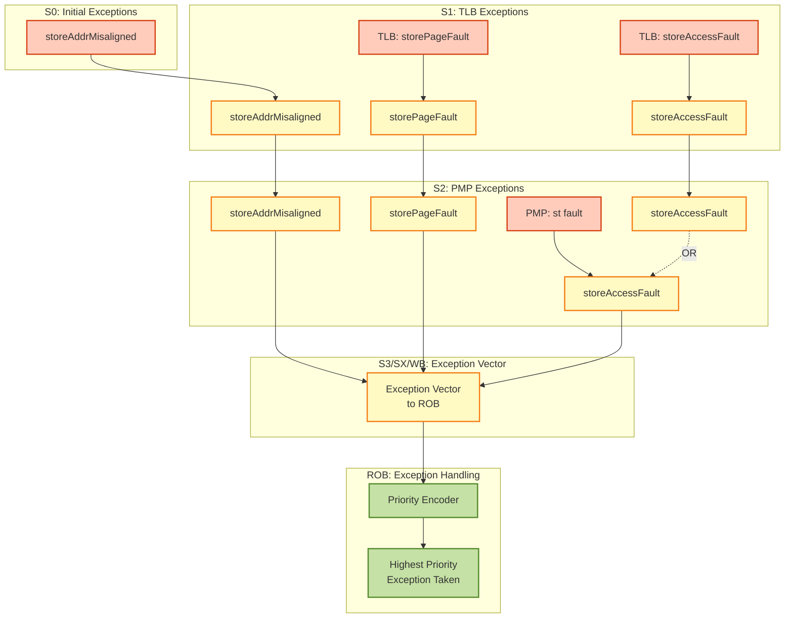

**Exception Priority** (high to low):
1. Store Address Misaligned (S0)
2. Store Page Fault (S1)
3. Store Access Fault (S1, S2)

---

## Resource Conflict Handling

### TLB Port Arbitration

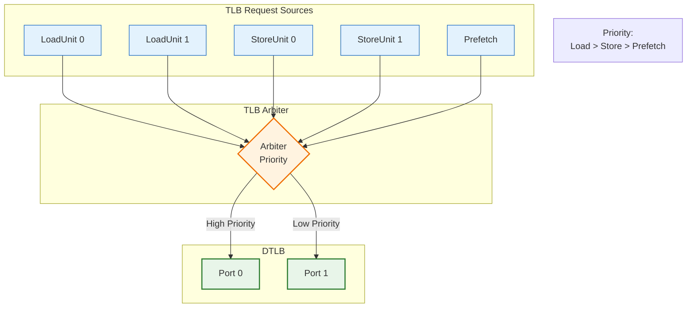

**Conflict Resolution**:
- Loads have higher priority (critical for performance)
- Stores can tolerate some latency
- Prefetch has lowest priority

---

## Configuration-Dependent Behavior

### Impact of Load Queue Size on Delay Stages

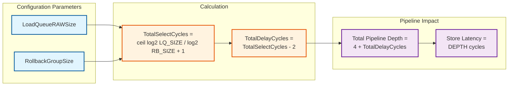

**Example Configurations**:

| Config | LQ RAW Size | Rollback Size | Total Select | Delay Cycles | Total Depth |
|--------|-------------|---------------|--------------|--------------|-------------|
| Default | 80 | 8 | 4 | 2 | 6 cycles |
| Minimal | 40 | 8 | 3 | 1 | 5 cycles |
| Large | 160 | 8 | 5 | 3 | 7 cycles |

---

## Appendix: Interface Summary Table

### Complete Interface Reference

| Interface | Direction | Stage | Purpose | Timing |
|-----------|-----------|-------|---------|--------|
| `stin` | Input | S0 | Store instruction from RS | Ready/Valid |
| `tlb.req` | Output | S0 | TLB translation request | Combinational |
| `tlb.resp` | Input | S1 | TLB translation response | 1-cycle latency |
| `dcache.req` | Output | S0 | DCache tag lookup | May not wait |
| `dcache.s1_paddr` | Output | S1 | Physical address | Combinational |
| `dcache.s1_kill` | Output | S1 | Kill S0 request | Combinational |
| `dcache.s2_kill` | Output | S2 | Kill S1 request | Combinational |
| `dcache.resp` | Input | S2 | DCache hit/miss | 2-cycle latency |
| `pmp` | Input | S2 | PMP check result | Combinational |
| `st_mask_out` | Output | S0 | Store mask to SQ | Combinational |
| `lsq` | Output | S1 | Store info to LSQ | Combinational |
| `lsq_replenish` | Output | S2 | Final store info | Combinational |
| `stld_nuke_query` | Output | S1 | Violation check | Combinational |
| `feedback_slow` | Output | S2 | Feedback to RS | 1-cycle delayed |
| `prefetch_req` | Input | S0 | Prefetch request | Ready/Valid |
| `prefetch_train` | Output | S3 | Prefetch training | 1-cycle delayed |
| `stout` | Output | SX | Writeback to ROB | Ready/Valid |
| `redirect` | Input | All | Pipeline flush | Asynchronous |

---

## Revision History

| Date | Version | Changes |
|------|---------|---------|
| 2026-02-02 | 1.0 | Initial component interaction analysis |
