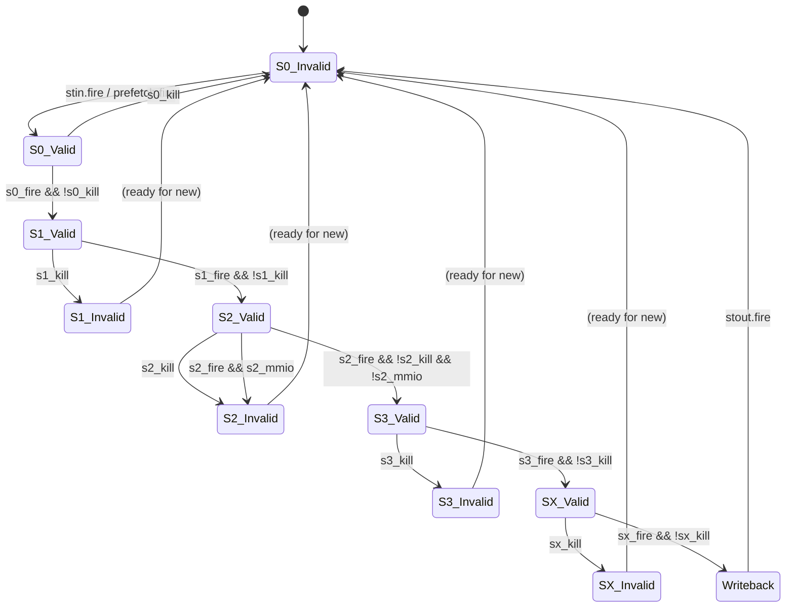
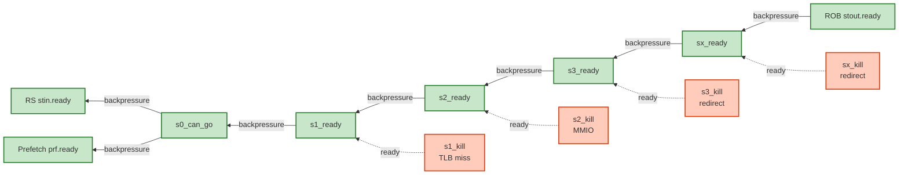
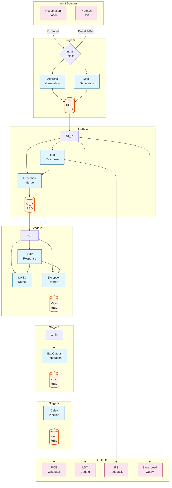

# StoreUnit Pipeline Timing and Detailed Logic

This document provides detailed timing diagrams and pseudo-code for critical paths in the StoreUnit pipeline.

---

## Pipeline Timing Diagram

### Normal Store Execution Timeline

```mermaid
gantt
    title Store Instruction Pipeline Timeline (Normal Hit Case)
    dateFormat X
    axisFormat %s

    section S0
    Address Calc     :s0_addr, 0, 1
    TLB Req          :s0_tlb, 0, 1
    DCache Req       :s0_dc, 0, 1
    Mask Gen         :s0_mask, 0, 1

    section S1
    Wait             :s0_s1, 1, 2
    TLB Resp         :s1_tlb, 2, 3
    LSQ Update       :s1_lsq, 2, 3
    StLd Query       :s1_stld, 2, 3
    Feedback Gen     :s1_fb, 2, 3

    section S2
    Wait             :s1_s2, 3, 4
    PMP Check        :s2_pmp, 4, 5
    MMIO Detect      :s2_mmio, 4, 5
    Prefetch Train   :s2_pf, 4, 5

    section S3
    Wait             :s2_s3, 5, 6
    ExuOut Prep      :s3_wb, 6, 7

    section SX
    Wait             :s3_sx, 7, 8
    Delay Stage 1    :sx_d1, 8, 9
    Delay Stage 2    :sx_d2, 9, 10

    section WB
    Wait             :sx_wb, 10, 11
    ROB Writeback    :wb_rob, 11, 12
```



**Total Latency**: 11-12 cycles for typical configuration

---

## Detailed Stage Logic

### S0: Address Generation Logic

#### Address Calculation Pseudo-Code

```scala
// Input: s0_in.src(0) = base address (64-bit)
//        s0_in.uop.ctrl.imm[11:0] = signed immediate (12-bit)
// Output: s0_vaddr = effective address (39-bit)

def calculateAddress(base: UInt[64], imm: UInt[12]): UInt[39] = {
  // Extract components
  val base_lo = base[11:0]              // Low 12 bits
  val base_hi = base[38:12]             // High 27 bits
  val imm12   = imm[11:0]               // 12-bit immediate

  // Low 13-bit addition (with carry out)
  val sum_lo_13 = base_lo.zeroExtend(13) + imm12.zeroExtend(13)
  val carry = sum_lo_13[12]             // Carry out bit
  val result_lo = sum_lo_13[11:0]       // Result low 12 bits

  // High bits calculation (4-way MUX based on carry and sign)
  val imm_sign = imm12[11]              // Sign bit of immediate

  val result_hi = (carry, imm_sign) match {
    case (0, 0) => base_hi                      // No carry, positive imm
    case (0, 1) => base_hi - 1                  // No carry, negative imm (borrow)
    case (1, 0) => base_hi + 1                  // Carry, positive imm
    case (1, 1) => base_hi                      // Carry, negative imm (cancel)
  }

  // Concatenate result
  val vaddr = Cat(result_hi, result_lo)
  return vaddr[38:0]  // Return 39-bit virtual address
}

// Example calculations:
// base = 0x0000_0000_0000_1FF8, imm = 0x008 (+8)
//   → low: 0xFF8 + 0x008 = 0x1000 (carry=1)
//   → high: 0x00000001 (base_hi + 1)
//   → result: 0x0000_0000_0000_2000

// base = 0x0000_0000_0000_2008, imm = 0xFF8 (-8)
//   → low: 0x008 + 0xFF8 = 0x1000 (carry=1, but sign=1)
//   → high: 0x00000002 (no change due to sign)
//   → result: 0x0000_0000_0000_2000
```

#### Mask Generation Pseudo-Code

```scala
// Input: vaddr[3:0] = low 4 bits of address
//        size_encode = uop.ctrl.fuOpType[1:0]
// Output: mask = byte enable mask (16-bit for VLEN=128)

def generateMask(vaddr_low: UInt[4], size_encode: UInt[2]): UInt[16] = {
  // Determine base mask based on size
  val base_mask = size_encode match {
    case 0 => 0x0001  // SB: 1 byte   (00000001)
    case 1 => 0x0003  // SH: 2 bytes  (00000011)
    case 2 => 0x000F  // SW: 4 bytes  (00001111)
    case 3 => 0x00FF  // SD: 8 bytes  (11111111)
  }

  // Shift mask based on address offset
  val mask = base_mask << vaddr_low

  return mask
}

// Examples:
// SB to 0x0005: 0x0001 << 5 = 0x0020 = 0000_0000_0010_0000
// SH to 0x0006: 0x0003 << 6 = 0x00C0 = 0000_0000_1100_0000
// SW to 0x0004: 0x000F << 4 = 0x00F0 = 0000_0000_1111_0000
// SD to 0x0008: 0x00FF << 8 = 0xFF00 = 1111_1111_0000_0000
```

#### Alignment Check Pseudo-Code

```scala
// Input: vaddr[2:0] = low 3 bits of address
//        size_encode = uop.ctrl.fuOpType[1:0]
// Output: aligned = true if properly aligned

def checkAlignment(vaddr_low: UInt[3], size_encode: UInt[2]): Bool = {
  val aligned = size_encode match {
    case 0 => true                    // SB: always aligned
    case 1 => vaddr_low[0] == 0       // SH: addr[0] must be 0
    case 2 => vaddr_low[1:0] == 0     // SW: addr[1:0] must be 00
    case 3 => vaddr_low[2:0] == 0     // SD: addr[2:0] must be 000
  }

  return aligned
}

// Examples:
// SW to 0x1003: vaddr[1:0] = 2'b11 ≠ 0 → NOT ALIGNED → EXCEPTION
// SD to 0x2008: vaddr[2:0] = 3'b000 = 0 → ALIGNED → OK
// SH to 0x3001: vaddr[0] = 1'b1 ≠ 0 → NOT ALIGNED → EXCEPTION
```

---

### S1: TLB Response Processing

#### Exception Merging Logic

```scala
// Input: s1_in.uop.cf.exceptionVec (from S0)
//        tlb_resp.excp (TLB exceptions)
// Output: s1_out.uop.cf.exceptionVec (merged)

def mergeExceptions(
  prev_exceptions: ExceptionVec,
  tlb_excp: TlbException
): ExceptionVec = {

  val new_exceptions = prev_exceptions.clone()

  // OR in TLB exceptions (accumulate)
  new_exceptions.storePageFault   |= tlb_excp.pf.st
  new_exceptions.storeAccessFault |= tlb_excp.af.st

  return new_exceptions
}
```

#### Feedback Generation Logic

```scala
// Input: s1_valid, s1_tlb_miss, s1_in.rsIdx
// Output: feedback to RS

def generateFeedback(
  valid: Bool,
  tlb_miss: Bool,
  ptwBack: Bool,
  rsIdx: UInt,
  isHWPrefetch: Bool
): RSFeedback = {

  val feedback = new RSFeedback()

  feedback.valid      = valid && !isHWPrefetch
  feedback.hit        = !tlb_miss
  feedback.flushState = ptwBack
  feedback.rsIdx      = rsIdx
  feedback.sourceType = RSFeedbackType.tlbMiss

  // Note: Feedback is registered and sent in S2
  return RegNext(feedback)
}
```

---

### S2: PMP and MMIO Detection

#### MMIO Detection Logic

```scala
// Input: s2_in.mmio (CBO detection from S1)
//        s2_pmp.mmio (PMP MMIO region)
// Output: s2_out.mmio (final MMIO flag)

def detectMMIO(
  cbo_mmio: Bool,
  pmp_mmio: Bool,
  has_exception: Bool
): Bool = {

  // MMIO if either CBO instruction or PMP region indicates MMIO
  val is_mmio = cbo_mmio || pmp_mmio

  // But if there's an exception, treat as normal store for exception handling
  val final_mmio = is_mmio && !has_exception

  return final_mmio
}

// Kill logic
def shouldKill(mmio: Bool, exception: Bool, redirect: Bool): Bool = {
  // Kill if MMIO (will be handled at commit) or redirect flush
  return (mmio && !exception) || redirect
}
```

#### Prefetch Training Logic

```scala
// Input: s2_in (LsPipelineBundle)
//        dcache.resp.bits.miss
// Output: prefetch_train (training signal)

def generatePrefetchTraining(
  s2_valid: Bool,
  s2_in: LsPipelineBundle,
  dcache_resp_fire: Bool,
  dcache_miss: Bool
): Valid[StPrefetchTrainBundle] = {

  val train = new StPrefetchTrainBundle()

  // Copy pipeline bundle with latching (RegNext)
  train.fromLsPipelineBundle(s2_in, latch = true)

  // Override miss bit with actual DCache response
  train.miss = RegNext(dcache_miss)

  // Generate valid signal
  val train_valid = RegNext(
    s2_valid &&
    dcache_resp_fire &&
    !s2_in.mmio &&
    !s2_in.tlbMiss &&
    !s2_in.isHWPrefetch
  )

  return Valid(train_valid, train)
}
```

---

### S3: Writeback Preparation

#### ExuOutput Generation

```scala
// Input: s3_in (LsPipelineBundle)
// Output: s3_out (ExuOutput)

def prepareWriteback(s3_in: LsPipelineBundle): ExuOutput = {
  val wb = new ExuOutput()

  wb.uop             = s3_in.uop
  wb.data            = DontCare           // No data for stores
  wb.redirectValid   = false.B            // Stores don't redirect
  wb.redirect        = DontCare
  wb.debug.isMMIO    = s3_in.mmio
  wb.debug.paddr     = s3_in.paddr
  wb.debug.vaddr     = s3_in.vaddr
  wb.debug.isPerfCnt = false.B
  wb.fflags          = DontCare

  return wb
}

// Valid signal generation
def s3ValidLogic(
  s2_fire: Bool,
  s2_mmio: Bool,
  s2_exception: Bool,
  s2_isHWPrefetch: Bool
): Bool = {
  // Valid if not MMIO (unless exception) and not hardware prefetch
  val s3_valid_next = (!s2_mmio || s2_exception) && !s2_isHWPrefetch

  when (s2_fire) {
    s3_valid := s3_valid_next
  } .elsewhen (s3_fire) {
    s3_valid := false.B
  } .elsewhen (s3_kill) {
    s3_valid := false.B
  }
}
```

---

### SX: Delay Stage Pipeline

#### Delay Pipeline Logic

```scala
// Input: s3_out (ExuOutput)
//        TotalDelayCycles = N
// Output: sx_out (ExuOutput after N cycles)

def delayPipeline(
  s3_valid: Bool,
  s3_out: ExuOutput,
  stout_ready: Bool,
  redirect: Redirect,
  N: Int  // TotalDelayCycles
): (Bool, ExuOutput) = {

  // Create pipeline registers
  val sx_valid = Wire(Vec(N+1, Bool()))
  val sx_in    = Wire(Vec(N+1, ExuOutput))
  val sx_ready = Wire(Vec(N+1, Bool()))

  // Stage 0 (input from S3)
  sx_valid(0) := s3_valid
  sx_in(0)    := s3_out

  // Stages 1 to N
  for (i <- 1 to N) {
    val prev_fire = sx_valid(i-1) && sx_ready(i)
    val cur_kill  = sx_in(i).uop.robIdx.needFlush(redirect)
    val cur_fire  = sx_valid(i) && !cur_kill && sx_ready(i+1)

    val valid_can_go = prev_fire || cur_fire || cur_kill

    // Valid register
    when (valid_can_go) {
      sx_valid(i) := Mux(prev_fire, true.B, false.B)
    }

    // Data register
    when (prev_fire) {
      sx_in(i) := sx_in(i-1)
    }

    // Ready signal (combinational)
    sx_ready(i) := !sx_valid(i) || cur_kill ||
                   (if (i == N) stout_ready else sx_ready(i+1))
  }

  // Backward ready propagation
  for (i <- N to 0 by -1) {
    if (i == N) {
      sx_ready(i) = !sx_valid(i) ||
                    sx_in(i).uop.robIdx.needFlush(redirect) ||
                    stout_ready
    } else if (i == 0) {
      s3_ready := sx_ready(0)
    } else {
      sx_ready(i) = !sx_valid(i) ||
                    sx_in(i).uop.robIdx.needFlush(redirect) ||
                    sx_ready(i+1)
    }
  }

  // Output
  val out_valid = sx_valid(N) && !sx_in(N).uop.robIdx.needFlush(redirect)
  val out_data  = sx_in(N)

  return (out_valid, out_data)
}
```

---

## Control Flow State Machine

### Stage Valid State Transitions



### Ready Signal Propagation



---

## Critical Timing Paths

### Path 1: S0 Address → TLB Request

```
┌─────────────────────────────────────────────────────────────┐
│ Critical Path: Register Read → Add → MUX → TLB Request     │
└─────────────────────────────────────────────────────────────┘

Timing Breakdown:
  1. Register File Read (src(0))         : 300 ps
  2. 13-bit Adder (low bits)             : 400 ps
  3. 4:1 MUX (high bits select)          : 200 ps
  4. TLB Request Setup                   : 100 ps
  ────────────────────────────────────────────────
  Total                                  : 1000 ps (1 ns)

Optimization: Speculative computation of all 4 MUX cases in parallel
```

### Path 2: TLB Response → LSQ Write

```
┌─────────────────────────────────────────────────────────────┐
│ Critical Path: TLB Output → Exception Merge → LSQ Write    │
└─────────────────────────────────────────────────────────────┘

Timing Breakdown:
  1. TLB Response Output                 : 200 ps
  2. Exception Vector OR gates           : 150 ps
  3. LSQ Write Port MUX                  : 200 ps
  4. LSQ Array Write Setup               : 150 ps
  ────────────────────────────────────────────────
  Total                                  : 700 ps

Optimization: Single cycle LSQ update, no additional pipelining
```

### Path 3: PMP Response → Kill Signal

```
┌─────────────────────────────────────────────────────────────┐
│ Critical Path: PMP Output → MMIO Detect → Kill Propagate   │
└─────────────────────────────────────────────────────────────┘

Timing Breakdown:
  1. PMP Response Output                 : 200 ps
  2. MMIO OR gate (cbo || pmp.mmio)      : 100 ps
  3. Kill Logic (mmio && !exception)     : 150 ps
  4. Kill Signal Fanout                  : 150 ps
  ────────────────────────────────────────────────
  Total                                  : 600 ps

Optimization: Fast kill propagation to prevent wasted work
```

---

## Pipeline Bubble Analysis

### Bubble Sources and Impact

```mermaid
graph TB
    subgraph "Bubble Source: TLB Miss"
        A1[S0: Request] --> A2[S1: TLB Miss]
        A2 --> A3[S1: Kill Pipeline]
        A3 --> A4[Bubble: Wait PTW]
        A4 --> A5[S0: Replay]

        style A4 fill:#ffebee,stroke:#c62828
    end

    subgraph "Bubble Source: Backpressure"
        B1[S3: Ready to Write] --> B2[SX: Full]
        B2 --> B3[S3: Stall]
        B3 --> B4[S2: Stall]
        B4 --> B5[S1: Stall]
        B5 --> B6[S0: Stall]

        style B3,B4,B5,B6 fill:#fff3e0,stroke:#ef6c00
    end

    subgraph "Bubble Source: Redirect"
        C1[S0-S3: In-flight] --> C2[Redirect Signal]
        C2 --> C3[All Stages: Kill]
        C3 --> C4[Bubble: Flush]
        C4 --> C5[S0: New Inst]

        style C4 fill:#ffebee,stroke:#c62828
    end
```



### Bubble Mitigation Strategies

1. **TLB Miss Bubbles**
   - **Impact**: 10-100+ cycles (PTW latency)
   - **Mitigation**:
     - L2 TLB with high hit rate
     - Prefetch TLB entries
     - Out-of-order execution hides some latency

2. **Backpressure Bubbles**
   - **Impact**: 1-2 cycles typically
   - **Mitigation**:
     - Multi-port writeback
     - Elastic pipeline stages

3. **Redirect Bubbles**
   - **Impact**: 4-6 cycles (pipeline depth)
   - **Mitigation**:
     - Accurate branch prediction
     - Early redirect detection
     - Fast flush mechanism

---

## Data Flow Diagram

### Complete Data Flow Through Pipeline



---

## Performance Analysis

### Throughput Calculation

**Maximum Throughput**: 1 store per cycle (single-issue pipeline)

**Effective Throughput** depends on:
- TLB miss rate: α
- MMIO ratio: β
- Redirect rate: γ
- Backpressure ratio: δ

```
Effective_Throughput = 1.0 × (1 - α - β - γ - δ)

Typical values:
  α = 0.01-0.05  (1-5% TLB miss)
  β = 0.001      (0.1% MMIO)
  γ = 0.10-0.20  (10-20% redirect)
  δ = 0.01       (1% backpressure)

Effective_Throughput ≈ 0.75-0.87 stores/cycle
```

### Latency Breakdown

**Best Case (TLB Hit, No Stalls)**:
- S0: 1 cycle
- S1: 1 cycle
- S2: 1 cycle
- S3: 1 cycle
- SX: 2 cycles (typical TotalDelayCycles)
- **Total: 6 cycles**

**Worst Case (TLB Miss)**:
- S0: 1 cycle
- S1: 1 cycle (miss detection)
- PTW: 10-200 cycles
- Replay S0-SX: 6 cycles
- **Total: 18-208 cycles**

---

## Appendix: Configuration Examples

### DefaultConfig Pipeline Depth

```scala
// Parameters
VAddrBits = 39
PAddrBits = 36
LoadQueueRAWSize = 80
RollbackGroupSize = 8

// Calculated
TotalSelectCycles = ceil(log2(80) / log2(8)) + 1
                  = ceil(6.32 / 3.0) + 1
                  = 3 + 1 = 4

TotalDelayCycles = 4 - 2 = 2

// Total Pipeline Depth
S0 + S1 + S2 + S3 + SX = 1 + 1 + 1 + 1 + 2 = 6 cycles
```

### MinimalConfig Pipeline Depth

```scala
// Parameters
VAddrBits = 39
PAddrBits = 36
LoadQueueRAWSize = 40
RollbackGroupSize = 8

// Calculated
TotalSelectCycles = ceil(log2(40) / log2(8)) + 1
                  = ceil(5.32 / 3.0) + 1
                  = 2 + 1 = 3

TotalDelayCycles = 3 - 2 = 1

// Total Pipeline Depth
S0 + S1 + S2 + S3 + SX = 1 + 1 + 1 + 1 + 1 = 5 cycles
```

---

## Revision History

| Date | Version | Changes |
|------|---------|---------|
| 2026-02-02 | 1.0 | Initial timing and logic analysis |
