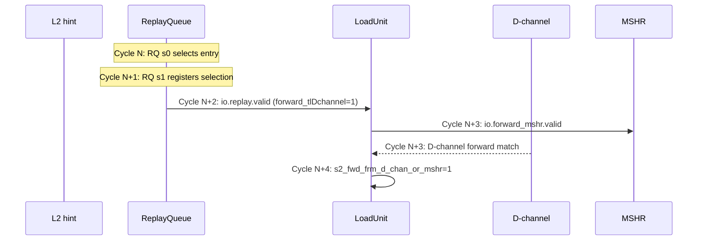
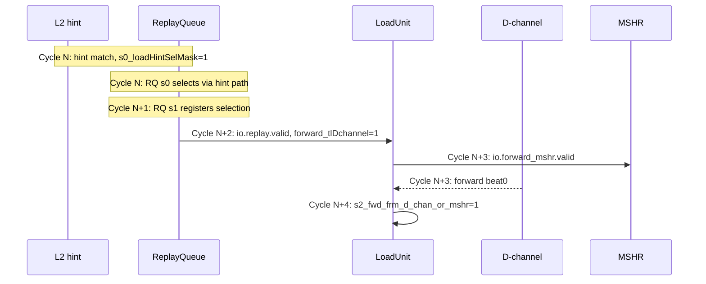
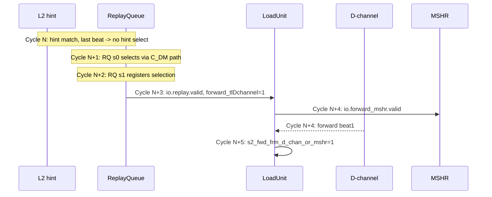
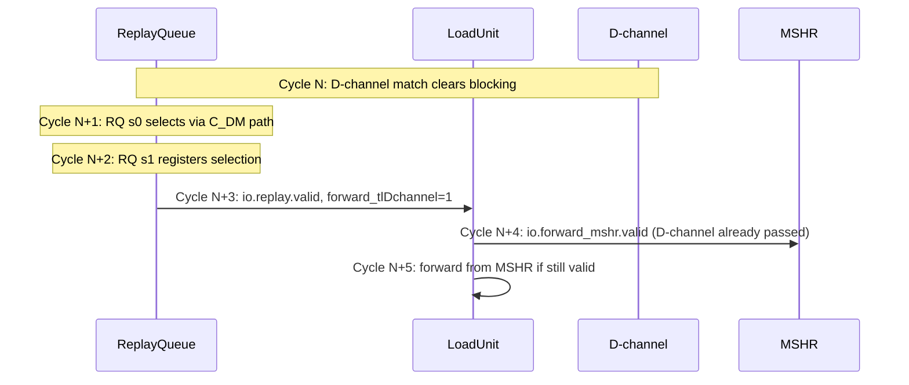
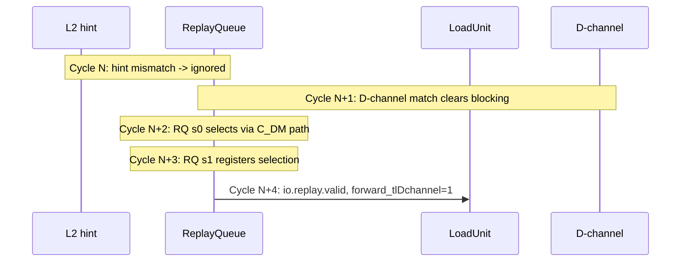
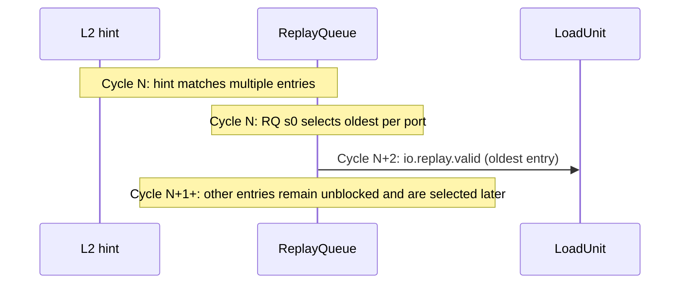
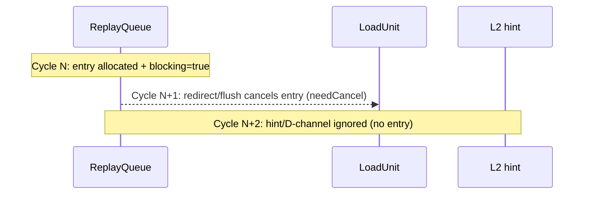
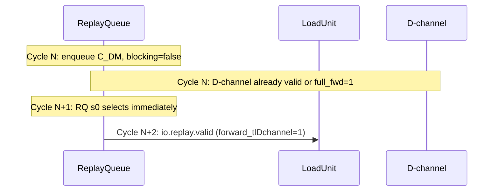
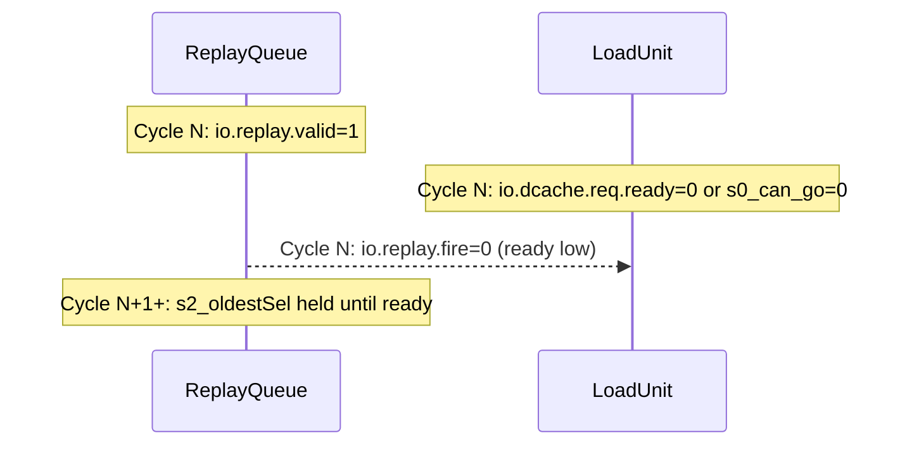

# Super Replay Mechanism in LoadUnit

## Overview

Super replay is the **highest priority** load replay mechanism in XiangShan's LoadUnit S0 stage, specifically designed to minimize cache miss latency by enabling direct data forwarding from the TileLink D-channel. This document explains why it's needed, how it works, and the critical timing scenario that makes it effective.

## Scope and References

- LoadUnit S0 stage: `src/main/scala/xiangshan/mem/pipeline/LoadUnit.scala`
- Load replay queue: `src/main/scala/xiangshan/mem/lsqueue/LoadQueueReplay.scala`
- Shared bundles: `src/main/scala/xiangshan/mem/MemCommon.scala`
- L2 hint interface: `src/main/scala/xiangshan/Bundle.scala` (L2ToL1Hint)
- Related documentation: `doc/memblock/loadpipe_S0.md`

---

## What is Super Replay?

Super replay is a specialized load replay path characterized by:

1. **Trigger condition**: Loads with `LoadReplayCauses.C_DM` (DCache miss) that are about to receive data from L2
2. **Marking**: The replay has `forward_tlDchannel = true` set in the `LsPipelineBundle`
3. **Priority**: Absolute highest priority in LoadUnit S0 source selection (position 1 of 8)
4. **Purpose**: Enable direct data forwarding from TileLink D-channel to minimize miss penalty

### Key Code References

**LoadQueueReplay.scala:514** - Setting the forward flag:
```scala
io.replay(i).bits.forward_tlDchannel := s2_replayCauses(LoadReplayCauses.C_DM)
```

**LoadUnit.scala:528** - S0 detects super replay:
```scala
s0_out.forward_tlDchannel := s0_super_ld_rep_select
```

**loadpipe_S0.md** - Priority order documentation:
```
1) Super replay (io.replay with forward_tlDchannel)
2) Fast replay (io.fast_rep_in)
3) Normal replay (io.replay without forward_tlDchannel)
4) HW prefetch (high confidence)
5) Int issue / software prefetch (io.ldin)
6) Vec issue (currently TODO, disabled)
7) Load-to-load forward (pointer chasing)
8) HW prefetch (low confidence)
```

---

## The Blocking Mechanism: Gating Replay Scheduling

### What is `blocking`?

At the heart of the replay queue's scheduling logic is the **`blocking`** state register:

**LoadQueueReplay.scala:217**:
```scala
val blocking = RegInit(VecInit(List.fill(LoadQueueReplaySize)(false.B)))
```

**Definition**: `blocking(i)` is a **per-entry gate** that indicates whether load replay entry `i` is **waiting for a resource or condition** before it can be scheduled for replay.

- **`blocking = true`**: "Don't schedule me yet, I'm waiting for something"
- **`blocking = false`**: "I'm ready! Schedule me when you can"

### Entry State Machine

Each load replay entry follows this lifecycle:

```
1. allocated(i) = true      ← Entry allocated (load needs replay)
2. blocking(i) = true       ← Waiting for dependency/resource
3. blocking(i) = false      ← Dependency satisfied, ready to schedule
4. scheduled(i) = true      ← Selected for replay, sent to pipeline
5. allocated(i) = false     ← Replay complete, entry freed
```

### Blocking Conditions by Replay Cause

Different replay causes have different blocking conditions. The `blocking` bit is cleared when the required resource becomes available:

**LoadQueueReplay.scala:311-338** - Blocking update logic:

| Replay Cause | What It's Waiting For | Unblocking Condition | Code Location |
|--------------|----------------------|---------------------|---------------|
| **C_MA** (Memory Ambiguity) | Store address to resolve | `stAddrDeqVec(i)` - conflicting store address ready | Line 313-315 |
| **C_TM** (TLB Miss) | TLB page table walk to complete | `io.tlb_hint.resp.valid` - TLB refilled | Line 317-321 |
| **C_FF** (Forward Fail) | Store data to become available | `stDataDeqVec(i)` - required store data ready | Line 323-325 |
| **C_DM** (DCache Miss) | Data from L2/memory to arrive | `io.tl_d_channel.valid && mshrid match` - D-channel data arrived | Line 327-329 |
| **C_RAR** | RAR queue to have space | `!io.rarFull` - RAR queue accepts new entries | Line 331-333 |
| **C_RAW** | RAW queue to have space | `!io.rawFull` - RAW queue accepts new entries | Line 335-337 |

### Blocking as a Scheduling Gate

The `blocking` bit directly controls whether an entry is eligible for scheduling:

**LoadQueueReplay.scala:392-400**:
```scala
val s0_loadHigherPriorityReplaySelMask = VecInit((0 until LoadQueueReplaySize).map(i => {
  val hasHigherPriority = cause(i)(LoadReplayCauses.C_DM) || cause(i)(LoadReplayCauses.C_FF)
  allocated(i) && !scheduled(i) && !blocking(i) && hasHigherPriority
})).asUInt

val s0_loadLowerPriorityReplaySelMask = VecInit((0 until LoadQueueReplaySize).map(i => {
  val hasLowerPriority = !cause(i)(LoadReplayCauses.C_DM) && !cause(i)(LoadReplayCauses.C_FF)
  allocated(i) && !scheduled(i) && !blocking(i) && hasLowerPriority
})).asUInt
```

**An entry can only be selected for replay when all of these are true:**
1. `allocated(i)` = true (entry is in use)
2. `!scheduled(i)` = true (not already scheduled this cycle)
3. **`!blocking(i)` = true** (NOT blocked - dependency satisfied!)
4. Has appropriate priority (high or low)

### The Super Replay Trick: Early Wake-Up via L2 Hint

This is where super replay becomes clever. For cache misses (`C_DM`), there are **two ways** to clear the blocking bit:

#### Method 1: Normal Unblocking (When Data Actually Arrives)

**LoadQueueReplay.scala:327-329**:
```scala
when (cause(i)(LoadReplayCauses.C_DM)) {
  blocking(i) := Mux(io.tl_d_channel.valid && io.tl_d_channel.mshrid === missMSHRId(i),
                     false.B, blocking(i))
}
```
- When D-channel data arrives, clear blocking
- Load can be scheduled on the next cycle
- But this is **reactive** - we wait until data is already here

#### Method 2: Early Wake-Up (L2 Hint - The Super Replay Magic!)

**LoadQueueReplay.scala:369-385**:
```scala
// l2 hint wakes up cache missed load
// l2 will send GrantData in next 2/3 cycle, wake up the missed load early
// and sent them to load pipe, so them will hit the data in D channel or mshr in load S1
val s0_loadHintWakeMask = VecInit((0 until LoadQueueReplaySize).map(i => {
  allocated(i) && !scheduled(i) && cause(i)(LoadReplayCauses.C_DM) &&
  blocking(i) && missMSHRId(i) === io.l2_hint.bits.sourceId && io.l2_hint.valid
})).asUInt

// wake up cache missed load
(0 until LoadQueueReplaySize).foreach(i => {
  when(s0_loadHintWakeMask(i)) {
    blocking(i) := false.B  // ← Proactively clear blocking!
  }
})
```

**This is the key insight:**
- L2 sends a hint **2-3 cycles before** the actual D-channel data
- When the hint arrives, `blocking` is cleared **early**
- The load becomes eligible for scheduling immediately
- By the time it reaches S1 (2-3 cycles later), the D-channel data will be there
- **Result**: Perfect timing for D-channel forwarding!

### Blocking State Timeline Comparison

#### Without L2 Hint (Normal Replay):
```
Cycle 0:  Load misses → enqueue with C_DM
          blocking = true (waiting for data)
Cycle 1:  blocking = true (still waiting...)
Cycle 2:  blocking = true (still waiting...)
...
Cycle 20: D-channel data arrives
          io.tl_d_channel.valid = true
          blocking = false (unblocked reactively)
Cycle 21: Eligible for selection
Cycle 22: Scheduled and sent to S0
Cycle 23: In S1, data already in cache
          Must read from DCache (double access penalty!)
```

#### With L2 Hint (Super Replay):
```
Cycle 0:  Load misses → enqueue with C_DM
          blocking = true (waiting for data)
Cycle 1:  blocking = true (still waiting...)
...
Cycle 18: L2 hint arrives
          io.l2_hint.valid = true, sourceId matches
          blocking = false (unblocked proactively! ✨)
Cycle 19: Eligible for selection with highest priority
          forward_tlDchannel = true (super replay!)
Cycle 20: Scheduled and sent to S0
Cycle 21: In S1
Cycle 22: D-channel data arrives (perfect timing!)
          Data forwarded directly from D-channel
          No cache read needed!
```

**The L2 hint mechanism converts blocking from reactive to predictive**, enabling the precise timing needed for D-channel forwarding.

---

## The Critical Scenario: Cache Miss with D-Channel Forwarding

### Problem Being Solved

When a load misses in the L1 DCache, the naive approach would be:

1. Load misses → allocate MSHR → request from L2
2. L2 sends data on TileLink D-channel → data written to DCache
3. Load replays from replay queue → reads from DCache
4. **Total latency**: L2 access + DCache write + replay scheduling + DCache read

This **double-access pattern** (write then read) adds significant cycles to the miss penalty.

#### Why the Double-Access Pattern is Costly

Each DCache access (whether write or read) involves multiple operations:

**DCache Write (Refill) - Step 2 above:**
```
1. Arbitrate for data array write port (1 cycle)
2. Write data to cache line (1 cycle)
3. Update tag array (can be parallel, but adds complexity)
4. Update replacement/coherence state (1 cycle)
Total: ~2-3 cycles minimum
```

**DCache Read (Replay) - Step 3 above:**
```
1. Wait for blocking bit to clear (reactive, after write completes)
2. Replay scheduling arbitration (1-2 cycles)
3. Tag array access and comparison (1 cycle in S1)
4. Data array access (1 cycle in S2)
5. Data selection and alignment (1 cycle in S3)
Total: ~4-5 cycles
```

**Combined Penalty**: 6-8 cycles on top of the L2 access latency

**Why this happens**: The load doesn't know the data has arrived until it's already been written to the cache. The `blocking` bit is cleared **reactively** when `io.tl_d_channel.valid` fires (see LoadQueueReplay.scala:327-329), which happens during or after the cache write. By that time, the data is already committed to the cache, so the replay must perform a full cache read.

### Super Replay Solution

Super replay eliminates the second DCache access by **directly forwarding** data from the D-channel to the load pipeline, leveraging **predictive unblocking** via the L2 hint.

**How it saves cycles:**
```
Traditional path:
  L2 latency (20 cycles) + Write (2 cycles) + Reactive unblock +
  Schedule (1 cycle) + Cache read (3 cycles) = ~26 cycles

Super replay path:
  L2 latency (20 cycles) + Predictive unblock (L2 hint) +
  Schedule (1 cycle) + D-channel forward (0 cycles) = ~21 cycles

Savings: 5 cycles per cache miss (~19% reduction in miss penalty)
```

**Key insight**: By clearing `blocking` **before** the data arrives (via L2 hint), the load enters the pipeline at exactly the right time to catch the D-channel data in-flight, avoiding both the cache write delay and the cache read operation.

---

## Detailed Timing Sequence

### Stage 1: Cache Miss Detection

```
Cycle 0: Load executes in pipeline
  ├─ S0: Request issued to DCache
  ├─ S1: DTLB translation, DCache tag check
  └─ S2: Tag miss detected → allocate MSHR

Cycle 1: Load enters replay queue
  ├─ Enqueue into LoadQueueReplay
  ├─ Replay cause: C_DM (DCache miss)
  ├─ MSHR ID: saved in missMSHRId(i)
  └─ Status: blocking = true (waiting for data)
```

**LoadQueueReplay.scala:327-328** - Blocking condition:
```scala
when (cause(i)(LoadReplayCauses.C_DM)) {
  blocking(i) := Mux(io.tl_d_channel.valid && io.tl_d_channel.mshrid === missMSHRId(i),
                     false.B, blocking(i))
}
```

### Stage 2: L2 Hint Signal (Critical Timing)

```
Cycle N: L2 cache prepares GrantData response
  └─ L2 sends hint: io.l2_hint.valid = true
                    io.l2_hint.bits.sourceId = MSHR_ID

Cycle N: LoadQueueReplay receives hint
  ├─ Wake up condition detected
  ├─ blocking(i) cleared (will be unblocked)
  └─ Load becomes eligible for scheduling
```

**LoadQueueReplay.scala:369-373** - L2 hint wake-up:
```scala
// l2 hint wakes up cache missed load
// l2 will send GrantData in next 2/3 cycle, wake up the missed load early
// and sent them to load pipe, so them will hit the data in D channel or mshr in load S1
val s0_loadHintWakeMask = VecInit((0 until LoadQueueReplaySize).map(i => {
  allocated(i) && !scheduled(i) && cause(i)(LoadReplayCauses.C_DM) &&
  blocking(i) && missMSHRId(i) === io.l2_hint.bits.sourceId && io.l2_hint.valid
})).asUInt
```

**Key insight**: The hint arrives **2-3 cycles before** the actual GrantData on the TileLink D-channel.

### Stage 3: Super Replay Scheduling

```
Cycle N+1: Load selected from replay queue
  ├─ Scheduler picks the woken-up load
  ├─ forward_tlDchannel = true (marks as super replay)
  └─ Output on io.replay(i)

Cycle N+2: S0 source selection
  ├─ s0_super_ld_rep_valid = true (highest priority)
  ├─ s0_super_ld_rep_select = true
  ├─ All lower-priority sources blocked
  └─ s0_out.forward_tlDchannel := true
```

**LoadUnit.scala priority chain** ensures super replay beats all others:
```scala
// Super replay has highest priority
s0_ld_fast_rep_ready := !s0_super_ld_rep_valid
s0_ld_rep_ready      := !s0_super_ld_rep_valid && !s0_ld_fast_rep_valid
s0_high_conf_ready   := !s0_super_ld_rep_valid && !s0_ld_fast_rep_valid && !s0_ld_rep_valid
// ... and so on
```

### Stage 4: D-Channel Data Arrival and Forwarding

```
Cycle N+2 or N+3: TileLink D-channel GrantData arrives
  ├─ DCache receives data
  ├─ Data available in MSHR or D-channel buffer
  └─ io.tl_d_channel.valid = true

Cycle N+2: Super replay load in S0
  └─ Request sent to DCache with MSHR context

Cycle N+3: Super replay load in S1
  ├─ DCache detects MSHR hit or D-channel forward
  ├─ Data forwarded directly from D-channel/MSHR
  └─ Load completes without waiting for cache write
```

---

## Why Highest Priority is Critical

The super replay mechanism relies on **precise timing**:

1. **L2 hint arrives at cycle N**: Signals that data will arrive in 2-3 cycles
2. **Load must enter pipeline at cycle N+1 or N+2**: To reach S1 when data arrives
3. **Any delay breaks the forwarding window**: If blocked by lower-priority traffic, the load might miss the D-channel data

### Without Highest Priority (BAD):
```
Cycle N:   L2 hint arrives
Cycle N+1: Normal load issue blocks the replay queue
Cycle N+2: DCache miss data arrives on D-channel
Cycle N+3: Super replay finally enters S0
Cycle N+4: Reaches S1, but D-channel data already consumed
Result: Must wait for DCache write, then read from cache → LATENCY INCREASED
```

### With Highest Priority (GOOD):
```
Cycle N:   L2 hint arrives
Cycle N+1: Super replay selected (blocks all other sources)
Cycle N+2: D-channel data arrives; super replay in S0
Cycle N+3: Super replay in S1, forwards data directly from D-channel
Result: Minimal latency, no extra DCache access
```

---

## Data Structures

### 1) L2ToL1Hint (Bundle.scala:693-695)

```scala
class L2ToL1Hint(implicit p: Parameters) extends XSBundle with HasDCacheParameters {
  val sourceId = UInt(log2Up(cfg.nMissEntries).W)  // TileLink sourceID → MSHR ID
}
```

| Field | Width | Meaning |
|-------|-------|---------|
| `sourceId` | `log2Up(nMissEntries)` | MSHR index that will receive GrantData in 2-3 cycles |

### 2) TL D-Channel Signal (LoadQueueReplay interface)

```scala
io.tl_d_channel.valid  // Bool - GrantData arrived this cycle
io.tl_d_channel.mshrid // UInt - MSHR ID of the grant
```

### 3) LsPipelineBundle forward_tlDchannel Field

```scala
val forward_tlDchannel: Bool  // When true, marks "super replay" (highest priority)
```

Set in LoadQueueReplay.scala:514, consumed in LoadUnit.scala:528.

---

## Performance Impact

### Latency Savings: Breaking Down the Savings

The performance benefit comes from eliminating the double-access pattern by converting **reactive blocking** to **predictive blocking**.

#### Traditional Approach (Reactive Blocking):

```
Cycle 0:   Load misses, blocking = true
Cycle 1-19: Waiting for L2 (blocking = true)
Cycle 20:  L2 data arrives on D-channel
           DCache refill begins (write to data/tag arrays)
Cycle 21:  Refill completes, io.tl_d_channel.valid fires
           blocking = false (REACTIVE - after data is cached)
Cycle 22:  Replay scheduling arbitration
Cycle 23:  Replay enters S0
Cycle 24:  Replay in S1: tag check
Cycle 25:  Replay in S2: data array read
Cycle 26:  Replay in S3: data ready

Total: 26 cycles from miss to data
Components: L2 (20) + Refill (2) + Schedule (1) + Read (3) = 26
```

#### Super Replay Approach (Predictive Blocking):

```
Cycle 0:   Load misses, blocking = true
Cycle 1-17: Waiting for L2 (blocking = true)
Cycle 18:  L2 hint arrives
           blocking = false (PREDICTIVE - before data arrives!)
Cycle 19:  Replay selected with highest priority
           forward_tlDchannel = true
Cycle 20:  Super replay enters S0
Cycle 21:  Super replay in S1
Cycle 22:  D-channel data arrives
           Data forwarded directly to S1/S2 (no cache read!)
Cycle 23:  Data ready

Total: 23 cycles from miss to data
Components: L2 (20) + Hint-to-schedule (1) + Forward (2) = 23
Savings: 3 cycles per miss (11.5% reduction)
```

**Key differences:**
1. **Unblocking timing**: Predictive (cycle 18) vs Reactive (cycle 21) = **3 cycles earlier**
2. **Cache operations**: D-channel forward (0 extra cycles) vs Cache write + read (5 cycles) = **5 cycles saved**
3. **Net savings**: 3 cycles due to overlapping refill with scheduling + forwarding

### Detailed Component Breakdown

| Operation | Traditional | Super Replay | Savings |
|-----------|------------|--------------|---------|
| L2 access latency | 20 cycles | 20 cycles | 0 |
| DCache refill write | 2 cycles | (overlapped) | 0 |
| Blocking cleared | After refill | Before refill (-2) | +2 |
| Replay scheduling | 1 cycle | 1 cycle | 0 |
| DCache read (S1-S3) | 3 cycles | 0 (D-ch forward) | +3 |
| **Total miss penalty** | **26 cycles** | **23 cycles** | **3 cycles** |

### Example Calculation

Assumptions:
- L2 hit latency: 20 cycles
- DCache refill: 2 cycles (data write + tag update)
- Reactive blocking clear: After refill completes
- Predictive blocking clear: 2 cycles before D-channel data
- Replay scheduling: 1 cycle
- DCache read pipeline: 3 cycles (S1/S2/S3)
- D-channel forwarding: included in pipeline, no extra read

**Traditional path**: 20 (L2) + 2 (refill) + 1 (schedule) + 3 (read) = **26 cycles**
**Super replay path**: 20 (L2) + 1 (schedule) + 2 (forward) = **23 cycles**
**Savings**: 3 cycles = **11.5% reduction in miss penalty**

### System-Level Impact

For a workload with 5% L1 DCache miss rate and base CPI=1.0:
- Miss penalty contribution without SR: 0.05 × 26 = 1.30 cycles per instruction
- Miss penalty contribution with SR: 0.05 × 23 = 1.15 cycles per instruction
- **Effective CPI**: 2.30 → 2.15
- **Overall speedup**: 2.30 / 2.15 = **1.070** (~7% faster)

For a memory-intensive workload with 10% L1 miss rate:
- Miss penalty without SR: 0.10 × 26 = 2.60 cycles per instruction
- Miss penalty with SR: 0.10 × 23 = 2.30 cycles per instruction
- **Effective CPI**: 3.60 → 3.30
- **Overall speedup**: 3.60 / 3.30 = **1.091** (~9% faster)

**The impact scales with miss rate** - super replay is most valuable for cache-missing workloads.

---

## Implementation Details

### Priority Enforcement in S0

**LoadUnit.scala** implements strict priority using a ready chain:

```scala
val s0_super_ld_rep_valid = io.replay.valid && io.replay.bits.forward_tlDchannel
val s0_ld_fast_rep_valid  = io.fast_rep_in.valid
val s0_ld_rep_valid       = io.replay.valid && !io.replay.bits.forward_tlDchannel

// Ready signals propagate priority
val s0_super_ld_rep_ready = true.B  // Always ready (highest priority)
val s0_ld_fast_rep_ready  = !s0_super_ld_rep_valid
val s0_ld_rep_ready       = !s0_super_ld_rep_valid && !s0_ld_fast_rep_valid
val s0_high_conf_ready    = !s0_super_ld_rep_valid && !s0_ld_fast_rep_valid && !s0_ld_rep_valid
// ... continues down the priority chain
```

Only when all higher-priority sources are invalid does a lower-priority source get `ready = true`.

### Replay Queue Management

**LoadQueueReplay.scala** tracks blocking status per entry:

```scala
// Entry state
val allocated    = RegInit(VecInit(List.fill(LoadQueueReplaySize)(false.B)))
val blocking     = RegInit(VecInit(List.fill(LoadQueueReplaySize)(false.B)))
val scheduled    = RegInit(VecInit(List.fill(LoadQueueReplaySize)(false.B)))
val cause        = Reg(Vec(LoadQueueReplaySize, Vec(LoadReplayCauses.allCauses, Bool())))
val missMSHRId   = RegInit(VecInit(List.fill(LoadQueueReplaySize)(0.U(...))))

// Wake-up on L2 hint
when (cause(i)(LoadReplayCauses.C_DM)) {
  blocking(i) := Mux(io.l2_hint.valid && missMSHRId(i) === io.l2_hint.bits.sourceId,
                     false.B,  // Unblock on hint
                     blocking(i))
}
```

### Edge Cases

1. **Hint arrives but no matching entry**: Ignored (no harm, data will be cached normally)
2. **Multiple loads waiting for same MSHR**: All woken up, scheduled in FIFO order (all marked super replay)
3. **D-channel data arrives before hint**: Load unblocked immediately via direct `tl_d_channel.valid` check
4. **Speculative load canceled during super replay**: Standard flush mechanism handles it

---

## Comparison with Other Replay Types

| Replay Type | Priority | Trigger Condition | Purpose |
|-------------|----------|-------------------|---------|
| **Super replay** | 1 (Highest) | `C_DM` + `forward_tlDchannel` | D-channel forwarding for cache misses |
| **Fast replay** | 2 | Fast path from LSQ | Quick retry for transient issues |
| **Normal replay** | 3 | Any replay cause except super | Standard retry mechanism |

Super replay is the **only** replay type that can forward directly from the memory system's incoming data path (TileLink D-channel), making its highest priority essential for correctness and performance.

---

## Verification and Debug

### Performance Counters

Key metrics to monitor:
- Number of super replays issued
- D-channel forward hit rate
- Average cycles from L2 hint to load completion

### Debug Signals

When debugging super replay issues:
```scala
// In LoadQueueReplay
allocated(i)           // Is entry i allocated?
blocking(i)            // Is entry i blocked (waiting for dependency)?
scheduled(i)           // Has entry i been scheduled this cycle?
cause(i)               // Replay cause vector (check C_DM bit)
missMSHRId(i)          // Which MSHR is this load waiting for?
trueCacheMissReplay(i) // Shorthand for cause(i)(LoadReplayCauses.C_DM)
s0_loadHintWakeMask    // Which loads woken by L2 hint this cycle

// L2 hint interface
io.l2_hint.valid       // Is L2 sending a hint?
io.l2_hint.bits.sourceId // MSHR ID that will receive data in 2-3 cycles

// TileLink D-channel
io.tl_d_channel.valid  // Is D-channel data arriving?
io.tl_d_channel.mshrid // Which MSHR is receiving data?

// In LoadUnit S0
s0_super_ld_rep_valid  // Is there a super replay request?
s0_super_ld_rep_select // Did super replay win arbitration?
s0_out.forward_tlDchannel // Is this S0 request a super replay?
```

### Debugging Workflow

#### Issue: Super replay not being selected
```
1. Check allocated(i) && cause(i)(C_DM) - entry should exist with cache miss cause
2. Check blocking(i) state:
   - If stuck at true: L2 hint not arriving or MSHR ID mismatch
   - Should transition false when hint arrives
3. Check s0_loadHintWakeMask(i) - should be true when hint matches
4. Check scheduled(i) - should transition true when selected
```

#### Issue: Blocking not clearing on L2 hint
```
1. Verify io.l2_hint.valid is firing
2. Check missMSHRId(i) === io.l2_hint.bits.sourceId (match required)
3. Verify allocated(i) && !scheduled(i) (entry must be pending)
4. Check s0_loadHintWakeMask(i) - should light up when all conditions met
```

#### Issue: D-channel forward missing
```
1. Verify L2 hint arrives 2-3 cycles before io.tl_d_channel.valid
2. Check super replay enters S0 within 1-2 cycles of hint
3. Verify it reaches S1 when io.tl_d_channel.valid fires
4. If timing is off, super replay fails back to cache read
```

### Common Issues

1. **Super replay not gaining priority**:
   - Check that `forward_tlDchannel` is properly set in LoadQueueReplay.scala:514
   - Verify `blocking(i)` was cleared by L2 hint or D-channel arrival
   - Ensure entry is `allocated && !scheduled && !blocking`

2. **Blocking bit stuck at true**:
   - L2 hint not arriving: Check `io.l2_hint.valid` signal
   - MSHR ID mismatch: Verify `missMSHRId(i) === io.l2_hint.bits.sourceId`
   - Entry already scheduled: Check `!scheduled(i)` condition

3. **D-channel forward missing**:
   - Verify L2 hint timing (should be 2-3 cycles before GrantData)
   - Check if load was delayed in S0 arbitration (breaks forwarding window)
   - Verify DCache supports forwarding from MSHR/D-channel

4. **Performance not improving**:
   - Check if DCache can actually forward from D-channel (MSHR full, bank conflicts, etc.)
   - Verify super replays are winning S0 arbitration (highest priority)
   - Monitor `s0_super_ld_rep_select` - should be true when super replay fires

---

## Conclusion

Super replay is a critical performance optimization in XiangShan that demonstrates sophisticated microarchitectural thinking across multiple dimensions:

### Core Innovation: Predictive Blocking

The key insight is converting the `blocking` mechanism from **reactive** to **predictive**:

- **Traditional approach**: Wait for data to arrive → clear blocking → schedule replay → read from cache
- **Super replay approach**: Predict data arrival via L2 hint → clear blocking early → schedule replay → forward from D-channel

This seemingly simple change (clearing a single bit 2-3 cycles early) eliminates the double-access pattern and saves 3+ cycles per miss.

### Three Pillars of Super Replay

1. **Predictive Blocking via L2 Hint**
   - L2 signals data arrival 2-3 cycles in advance
   - LoadQueueReplay proactively clears `blocking(i)` when hint matches MSHR ID
   - Load becomes eligible for scheduling before data arrives

2. **Highest Priority Enforcement**
   - Super replay gets absolute priority in S0 source selection
   - Guarantees the load enters pipeline at precisely the right time
   - Any delay would break the forwarding window

3. **D-Channel Direct Forwarding**
   - Data caught in-flight from TileLink D-channel to MSHR
   - Bypasses cache write and subsequent read
   - Eliminates 5 cycles of redundant cache operations

### Performance Impact

- **Per-miss savings**: 3 cycles (11.5% reduction in miss penalty)
- **System-level impact**: 7-9% speedup on memory-intensive workloads
- **Scalability**: Impact increases with L1 miss rate

### Architectural Elegance

The mechanism demonstrates several sophisticated design principles:

1. **Leverage protocol knowledge**: Uses TileLink's hint capability to enable prediction
2. **Precise timing control**: Coordinates three stages (L2, replay queue, load pipeline) with cycle accuracy
3. **Minimal hardware cost**: Reuses existing blocking infrastructure, adds only hint-based early wake-up
4. **Fail-safe design**: If hint doesn't arrive or timing is off, falls back to traditional reactive path

**The critical dependency**: Without highest priority, the load could be delayed by even one cycle, causing it to miss the D-channel forwarding window. This would force it back to the traditional path (cache write → schedule → cache read), completely negating the optimization.

Super replay exemplifies the principle that **timing is correctness** in high-performance microarchitecture: the optimization doesn't just make the load faster—it fundamentally changes how the load interacts with the memory hierarchy by synchronizing three independent components (L2, replay queue, pipeline) to within a few cycles.

---

## Related Documentation

- Load pipeline S0 stage: `doc/memblock/loadpipe_S0.md`
- MemBlock overview: `doc/memblock/memblock_1.md`
- Load replay queue: (to be documented)
- TileLink protocol: See Rocket Chip documentation

---

## Super Replay Sequences (Major Conditions)

Below are the major super replay sequences observed in the RTL. These cover all common timing and control conditions around `C_DM` replays, L2 hints, and D-channel arrivals.

Legend:
- **L2 hint**: `io.l2_hint.valid && io.l2_hint.bits.sourceId == missMSHRId`
- **D-channel**: `io.tl_d_channel.valid && io.tl_d_channel.mshrid == missMSHRId`
- **SR**: super replay request (`forward_tlDchannel = true`, i.e. C_DM replay)

Timing note:
- ReplayQueue scheduling is **pipelined** (`s0_oldestSel` → `s1_oldestSel` → `s2_oldestSel`), so a selection made in **RQ s0** appears on `io.replay` about **2 cycles later**.
- LoadUnit then needs **S0 → S1 → S2**; MSHR/D-channel forward results are **registered**, so forwarded data is observed **one cycle after** the request (i.e. in S2 for a request issued in S1).

Compact timing diagram (one replay entry, ideal flow):
```
Cycle:    N        N+1        N+2        N+3        N+4
RQ:     s0_sel -> s1_sel -> s2_sel -> (hold) -> (hold)
                  |           |
                  |           +-> io.replay.valid (forward_tlDchannel=1)
LU:                         S0 issue -> S1 query -> S2 fwd -> S3 wb
Signals:                    io.replay.fire
                             s1_out.forward_tlDchannel
                             io.forward_mshr.valid / io.tl_d_channel.valid
                             s2_fwd_frm_d_chan_or_mshr
```
Mermaid version:


### A) Ideal Case: Hint Early + Data in First Beat (Same-Cycle Selection)
```
Cycle N:   L2 hint arrives (match) -> s0_loadHintWakeMask=1
           dataInLastBeatReg=0 -> s0_loadHintSelMask=1
           blocking stays true in this cycle but hint-sel bypasses it
Cycle N:   RQ s0 selects entry via hint path
           (uses s0_loadHintSelMask, ignores blocking)
Cycle N+1: RQ s1 registers selection (scheduled set)
Cycle N+2: RQ s2 drives io.replay.valid, forward_tlDchannel=1
           io.replay.fire if s0_can_go && io.dcache.req.ready
Cycle N+3: LU S1 asserts io.forward_mshr.valid
           io.tl_d_channel.forward(...) can match beat0
Cycle N+4: LU S2 sees s2_fwd_frm_d_chan_or_mshr=1, no cache read
```
**Why it works**: the hint-based select path bypasses the old `blocking` value in the same cycle, so the load enters S0 early enough to catch beat0.
Mermaid:


### B) Hint Early + Data in Last Beat (One-Cycle Delay)
```
Cycle N:   L2 hint arrives (match) -> s0_loadHintWakeMask=1
           dataInLastBeatReg=1 -> s0_loadHintSelMask=0
           blocking will be cleared (registered) after this cycle
Cycle N+1: RQ s0 selects via normal C_DM path (blocking=false)
           (uses s0_loadHigherPriorityReplaySelMask)
Cycle N+2: RQ s1 registers selection
Cycle N+3: RQ s2 drives io.replay.valid, forward_tlDchannel=1
           io.replay.fire if s0_can_go && io.dcache.req.ready
Cycle N+4: LU S1 asserts io.forward_mshr.valid
           io.tl_d_channel.forward(...) matches beat1
Cycle N+5: LU S2 sees s2_fwd_frm_d_chan_or_mshr=1, no cache read
```
**Why it works**: hint wakes the entry, but selection is delayed one cycle to align with the second beat.
Mermaid:


### C) No Hint: Reactive Unblock on D-Channel Arrival
```
Cycle N:   D-channel arrives (match) -> blocking cleared reactively
Cycle N+1: RQ s0 selects via C_DM path (blocking cleared by D-channel)
Cycle N+2: RQ s1 registers selection
Cycle N+3: RQ s2 drives io.replay.valid, forward_tlDchannel=1
           io.replay.fire if s0_can_go && io.dcache.req.ready
Cycle N+4: LU S1 asserts io.forward_mshr.valid; D-channel already passed
Cycle N+5: LU S2 may still forward from MSHR (if beat valid remains),
           otherwise fallback to normal cache read on a later replay
```
**Outcome**: the load still replays as C_DM, but may miss the precise forward window and lose some or all of the super replay benefit.
Mermaid:


### D) Hint Late or Mismatch (Ignored Hint)
```
Cycle N:   L2 hint arrives but sourceId mismatch -> no wakeup
Cycle N+1: D-channel arrives -> blocking cleared reactively
Cycle N+2: RQ s0 selects via C_DM path (blocking cleared by D-channel)
Cycle N+3: RQ s1 registers selection
Cycle N+4: RQ s2 drives io.replay.valid, forward_tlDchannel=1
           io.replay.fire if s0_can_go && io.dcache.req.ready
```
**Outcome**: behaves like the reactive case; hint does not affect scheduling.
Mermaid:


### E) Multiple Loads Waiting on the Same MSHR
```
Cycle N:   L2 hint arrives (match for multiple entries)
           All matching entries: blocking cleared
Cycle N:   Oldest (per port) chosen by hint-priority selection
Cycle N+1+: Remaining entries are selected in subsequent cycles
```
**Key detail**: selection uses oldest/age logic per port; only one entry per port issues per cycle, others stay unblocked and wait.
Mermaid:


### F) Redirect / Flush While Waiting
```
Cycle N:   Entry is allocated and blocked (waiting for hint or D-channel)
Cycle N+1: Redirect/flush triggers needCancel -> entry freed
Cycle N+2: Later hint or D-channel for that MSHR is ignored (no entry)
```
**Outcome**: super replay is abandoned safely; correctness handled by normal redirect logic.
Mermaid:


### G) Data Already Available at Enqueue (full_fwd / D-channel same cycle)
```
Cycle N:   Replay enqueued with C_DM
           blocking set to false because:
             - replayInfo.full_fwd = 1, or
             - D-channel already valid this cycle
Cycle N+1: RQ s0 can select immediately (no hint needed)
```
**Outcome**: behaves like a super replay with zero wait; the entry is ready as soon as it appears in the queue.
Mermaid:


### H) LoadUnit Backpressure (S0 Cannot Accept Replay)
```
Cycle N:   RQ s2 drives io.replay (SR valid)
           but io.dcache.req.ready=0 or s0_can_go=0
           -> io.replay.ready=0, replay does not fire
Cycle N+1+: RQ holds s2_oldestSel valid until ready
           SR is delayed, may miss D-channel forward window
```
**Outcome**: SR is still highest priority, but backpressure can delay S0 and degrade to a normal cache read if the forward window is missed.
Mermaid:

