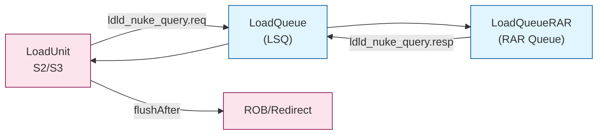
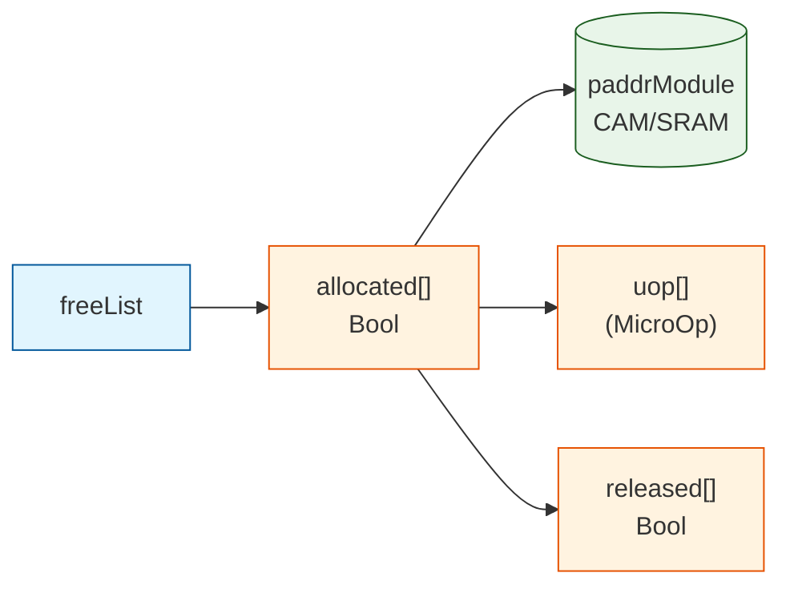
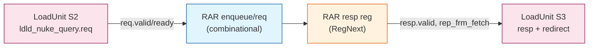
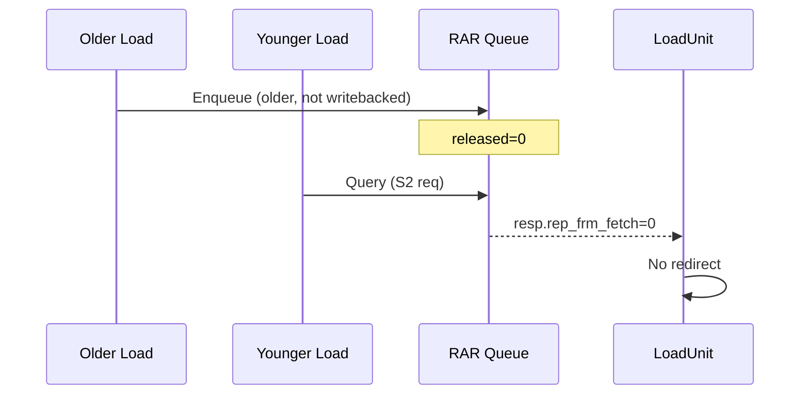
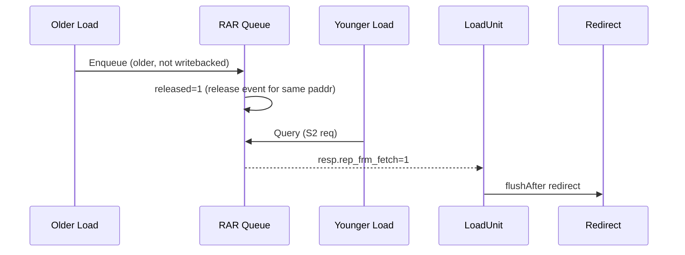
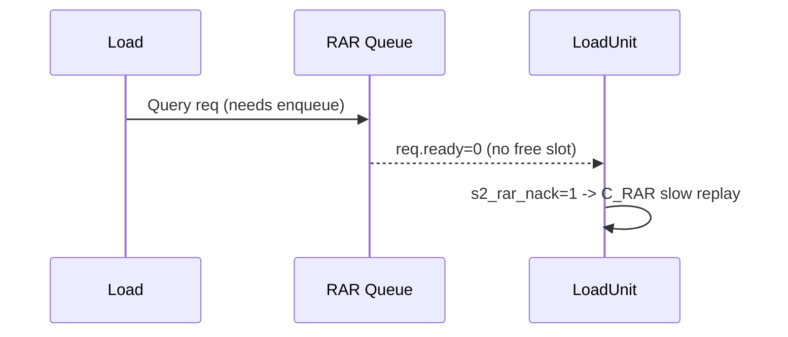

# RAR Queue (LoadQueueRAR) - Detailed Explanation

## Overview

The **RAR Queue** (LoadQueueRAR) detects **load-load (Read-After-Read) violations**.
It tracks **older loads that are still in flight** and checks whether a **younger load**
has read a line **before** the older load becomes globally visible (release). If so,
the younger load is **flushed and re-fetched** (RedirectLevel.flushAfter).

**Where used**:
- Request: **LoadUnit S2** sends `ldld_nuke_query.req`
- Response: **LoadUnit S3** consumes `ldld_nuke_query.resp`
- Redirect: **flushAfter** when `rep_frm_fetch` is true

---

## What It Is (Conceptual)

RAR Queue = a small CAM-backed structure that:
1. **Enqueues older loads** that have not yet completed (writeback).
2. **Marks them as released** when a release event for the same cache line arrives.
3. **Checks younger loads** for address match against released older loads.
4. **Triggers redirect** if violation is found.

This is **load-load ordering protection**. It is independent of store-load hazards.

---

## Architecture (Top-Level View)



---

## Data Structures (Sizes & Types)

RAR Queue is sized by `LoadQueueRARSize`.

**Entry fields** (per RAR entry):
- `allocated`: **Bool (1)** - entry valid
- `uop`: **MicroOp** - includes:
  - `robIdx`: **RobPtr** (used for age check)
  - `lqIdx`: **LqPtr** (used for writeback tracking)
- `paddr`: **UInt(PAddrBits)** - load physical address (CAM key)
- `released`: **Bool (1)** - set when release event matches paddr

**SRAM/CAM-like structures**:
- `paddrModule`: CAM/SRAM for paddr match
- `freeList`: freelist for entry allocation



---

## How It Works (Pipeline & Logic)

### 1) Enqueue (LoadUnit S2 -> RAR)

**When a load is eligible**, it sends `ldld_nuke_query.req` from S2.
RAR will **enqueue** the load only if there are **older, not-writebacked loads**:

**Condition**:
```
needEnqueue = req.valid &&
              (lqIdx is after ldWbPtr) &&
              !redirectFlush
```

If enqueue is needed and **freelist has no slot**, `req.ready = 0` -> `s2_rar_nack`
-> **slow replay** with cause `C_RAR`.

### 2) Release (mark older load as visible)

RAR listens to `io.release` (from cache/release path).
If a release paddr matches an entry, it sets:
```
released(i) := true
```
This marks the older load as "visible" for RAR violation checks.

### 3) Violation Check (LoadUnit S3 consumes response)

RAR responds one cycle later (`resp.valid := RegNext(req.valid)`).
Violation condition:
```
matchMask = allocated & paddrMatch & released & (olderThanThisLoad)
rep_frm_fetch := OR(matchMask)
```

If `rep_frm_fetch` is true, LoadUnit S3 triggers:
```
RedirectLevel.flushAfter
```

---

## Pipeline Diagram (with registers)



---

## Scenarios (with Sequence Diagrams)

### Scenario A: No Violation (Older load not released yet)


### Scenario B: Violation (Older load released, younger load read early)


### Scenario C: RAR Queue Full -> C_RAR Replay


---

## Pseudocode (Aligned to RTL)

```scala
// Enqueue condition
needEnqueue = req.valid && isAfter(req.lqIdx, ldWbPtr) && !flush
req.ready = !needEnqueue || freeList.canAllocate

// Release update
if (release.valid && paddrMatch(release.paddr)) released(i) := true

// Violation check (1 cycle later)
rep_frm_fetch =
  OR( allocated & released & paddrMatch(req.paddr) & olderThan(req.robIdx) )
```

---

## Summary

1. RAR Queue is a **load-load violation detector**.
2. **Selection** uses paddr CAM + age check + release flag.
3. If violation is found, **flushAfter** is triggered in S3.
4. If the queue is full, the load **replays** with cause `C_RAR`.

