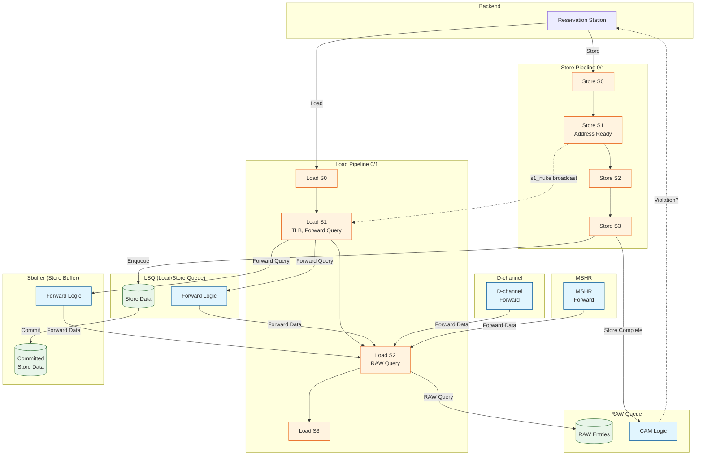
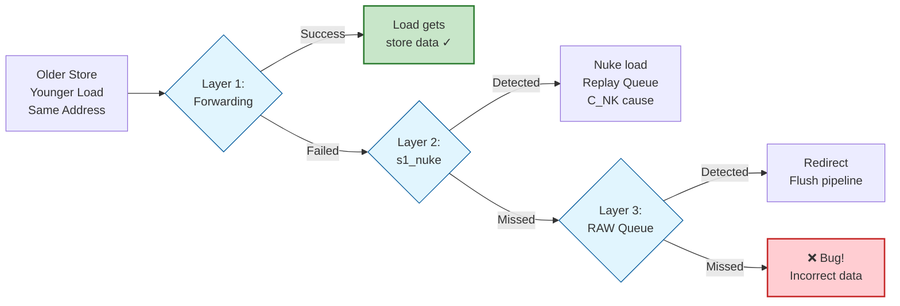
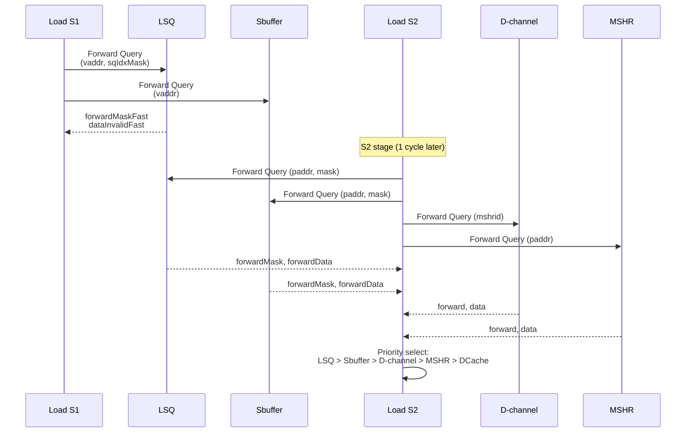
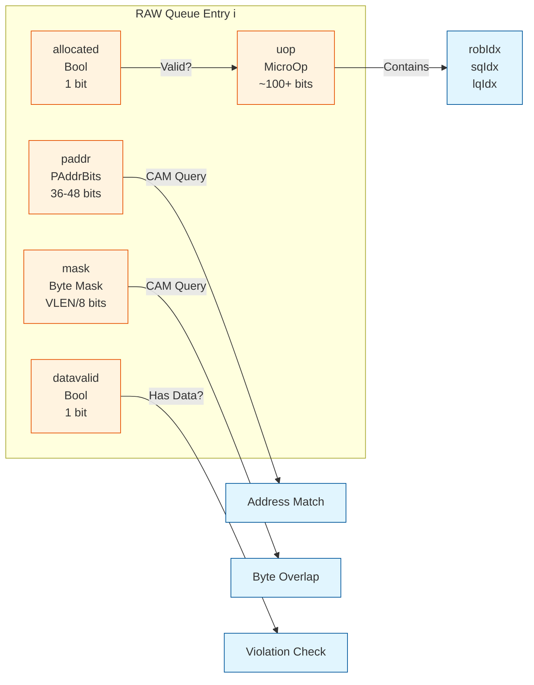
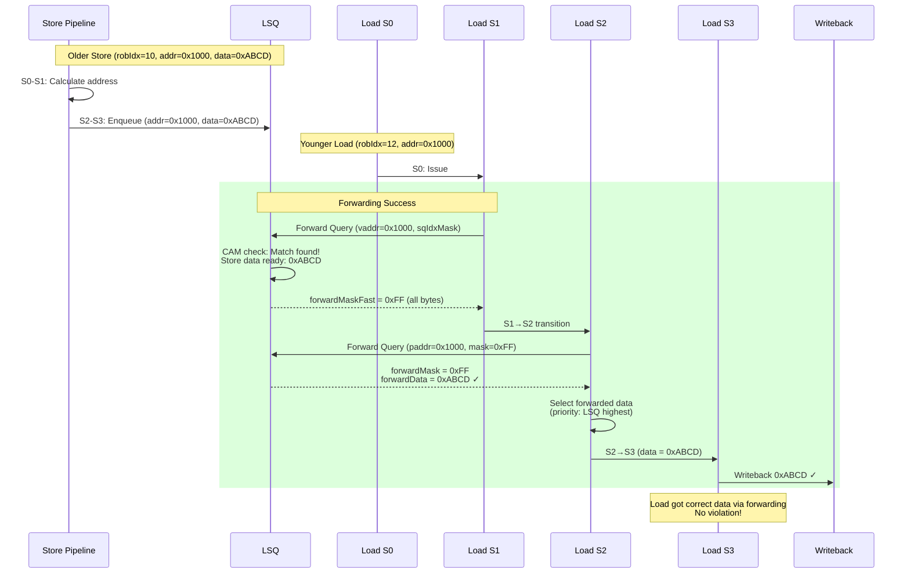
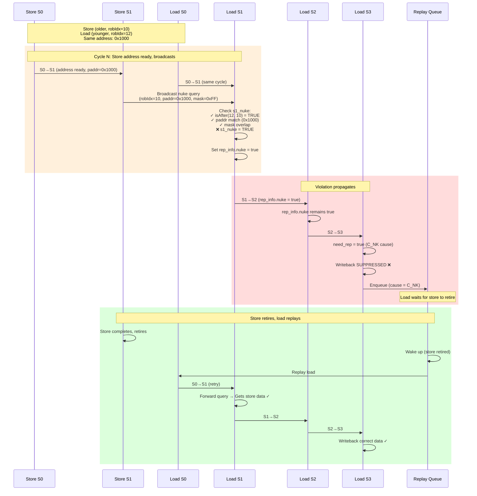
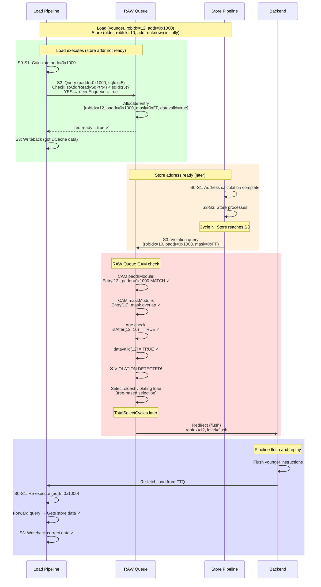
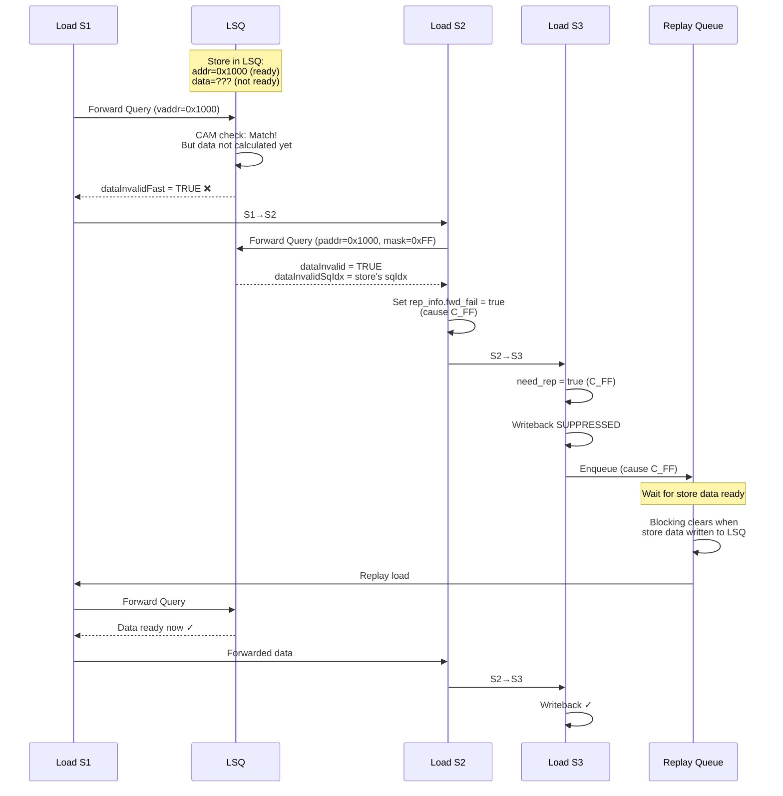

# Store-Load Violation Detection in XiangShan

## Table of Contents
- [Overview](#overview)
- [Architecture](#architecture)
- [Prevention: Store-to-Load Forwarding](#prevention-store-to-load-forwarding)
- [Early Detection: s1_nuke](#early-detection-s1_nuke)
- [Late Detection: RAW Queue](#late-detection-raw-queue)
- [Data Structures](#data-structures)
- [Detection Mechanisms Detailed](#detection-mechanisms-detailed)
- [Sequence Diagrams](#sequence-diagrams)
- [Code Analysis](#code-analysis)
- [Performance Impact](#performance-impact)
- [Related Mechanisms](#related-mechanisms)

---

## Overview

**Store-load violation** (st-ld violation) occurs when a **younger load executes before an older store**, potentially reading stale data instead of the store's new data. XiangShan employs a **three-layer defense** to handle this:

1. **Prevention (Forwarding)**: Proactively forward store data to loads (normal case, 4 sources)
2. **Early Detection (s1_nuke)**: Store pipeline broadcasts address in S1 to detect violations immediately
3. **Late Detection (RAW Queue)**: Store queries RAW Queue when completing to catch missed violations

### Key Characteristics

| Property | Value |
|----------|-------|
| **Prevention Mechanism** | Store-to-load forwarding (4 sources) |
| **Early Detection** | s1_nuke (store pipeline broadcast) |
| **Late Detection** | RAW Queue (Read-After-Write queue) |
| **Forward Sources** | LSQ, Sbuffer, D-channel, MSHR |
| **Early Detection Stage** | S1 (immediate) |
| **Late Detection Delay** | TotalSelectCycles (~log₂(LoadQueueRAWSize) cycles) |
| **RAW Queue Size** | LoadQueueRAWSize (configurable) |
| **Number of Store Pipelines** | StorePipelineWidth = 2 (default) |
| **Number of Load Pipelines** | LoadPipelineWidth = 2 (default) |

### What is Store-Load Violation?

In an out-of-order processor, loads can execute **before** older stores when:
- Store's address is not yet calculated
- Load's address is ready first
- Load and store access the **same memory location**

**Problem**: Load reads **stale data** from cache/memory instead of the store's **new data**.

**Solutions**:
1. **Forwarding**: If store data is available, bypass it directly to the load ✓ Best case
2. **s1_nuke**: If store detects violation when address ready → Nuke load, replay via Replay Queue
3. **RAW Queue**: If violation detected later when store completes → Redirect (flush pipeline)

---

## Architecture

### System Overview



### Three-Layer Defense



---

## Prevention: Store-to-Load Forwarding

### Overview

**Forwarding** is the **normal case** that prevents store-load violations proactively. When a load needs data that an older store will provide, the system **bypasses** (forwards) the store data directly to the load instead of reading from cache.

### Four Forwarding Sources (Priority Order)

From LoadUnit.scala S1/S2 stages:

1. **LSQ (Load/Store Queue)** - Highest priority
   - Contains **uncommitted stores** (still in flight)
   - Most recent store data
   - Queried in **S1 (fast)** and **S2**

2. **Sbuffer (Store Buffer)**
   - Contains **committed stores** waiting to retire to DCache
   - Stores that passed ROB commit but not yet written to cache
   - Queried in **S1 (fast)** and **S2**

3. **D-channel (TileLink D-channel)**
   - Stores currently being written to DCache via TileLink
   - In-flight cache write operations
   - Queried in **S2**

4. **MSHR (Miss Status Holding Register)**
   - Outstanding cache miss requests
   - May contain store data for missed cache lines
   - Queried in **S2**

### Forwarding Protocol



### LoadForwardQueryIO Structure

From MemCommon.scala:226-255:

```scala
class LoadForwardQueryIO(implicit p: Parameters) extends XSBundleWithMicroOp {
  val vaddr = Output(UInt(VAddrBits.W))
  val paddr = Output(UInt(PAddrBits.W))
  val mask = Output(UInt((VLEN/8).W))
  override val uop = Output(new MicroOp)
  val pc = Output(UInt(VAddrBits.W))
  val valid = Output(Bool())

  // Response signals
  val forwardMaskFast = Input(Vec((VLEN/8), Bool()))      // S1 response
  val forwardMask = Input(Vec((VLEN/8), Bool()))          // S2 response
  val forwardData = Input(Vec((VLEN/8), UInt(8.W)))       // S2 response

  // Error conditions
  val dataInvalid = Input(Bool())      // Data not ready yet
  val matchInvalid = Input(Bool())     // vaddr/paddr CAM mismatch
  val addrInvalid = Input(Bool())      // Address not available
}
```

**Field descriptions**:

| Field | Size | Direction | Description |
|-------|------|-----------|-------------|
| **vaddr** | VAddrBits (39-48) | Output | Virtual address for S1 CAM query |
| **paddr** | PAddrBits (36-48) | Output | Physical address for S2 CAM query |
| **mask** | VLEN/8 (8 bits for 64-bit) | Output | Byte enable mask |
| **forwardMaskFast** | Vec(VLEN/8, Bool) | Input | S1 fast response: which bytes can forward |
| **forwardMask** | Vec(VLEN/8, Bool) | Input | S2 response: which bytes can forward |
| **forwardData** | Vec(VLEN/8, UInt(8)) | Input | S2 response: actual forwarded data (byte granularity) |
| **dataInvalid** | Bool | Input | Address match but data not ready → Replay |
| **matchInvalid** | Bool | Input | vaddr ≠ paddr CAM mismatch → Redirect |
| **addrInvalid** | Bool | Input | Store address not calculated yet → Replay |

### Forwarding Failure Conditions

Forwarding can **fail** for several reasons:

1. **dataInvalid**: Store address matches, but **data not ready yet**
   - Store address known, but data still being calculated
   - Action: **Slow replay** (cause C_FF - forward fail)

2. **matchInvalid**: Virtual address and physical address CAM results **mismatch**
   - vaddr CAM says "match", paddr CAM says "no match" (or vice versa)
   - Indicates TLB/address translation inconsistency
   - Action: **Redirect** (flush pipeline, refetch)

3. **addrInvalid**: Store address **not calculated yet**
   - Store still computing its address
   - Action: **Slow replay** (cause C_MA - memory ambiguity)

---

## Early Detection: s1_nuke

### Overview

**s1_nuke** is an **early violation detection** mechanism where store pipelines **broadcast** their address in S1 stage, allowing loads in S1 to immediately detect if they conflict with an older store.

For complete s1_nuke analysis, see [z_detail_s1_nuke.md](./z_detail_s1_nuke.md).

### Broadcast Mechanism

**Store Pipeline** (StoreUnit.scala:178-181):

```scala
// st-ld violation dectect request.
io.stld_nuke_query.valid       := s1_valid && !s1_tlb_miss && !s1_in.isHWPrefetch
io.stld_nuke_query.bits.robIdx := s1_in.uop.robIdx
io.stld_nuke_query.bits.paddr  := s1_paddr
io.stld_nuke_query.bits.mask   := s1_in.mask
```

**Load Pipeline** (LoadUnit.scala:635-641):

```scala
val s1_nuke = VecInit((0 until StorePipelineWidth).map(w => {
  io.stld_nuke_query(w).valid &&                                    // Store query active
  isAfter(s1_in.uop.robIdx, io.stld_nuke_query(w).bits.robIdx) &&  // Load is younger
  (s1_paddr_dup_lsu(PAddrBits-1, 3) ===
   io.stld_nuke_query(w).bits.paddr(PAddrBits-1, 3)) &&            // Cache line match
  (s1_in.mask & io.stld_nuke_query(w).bits.mask).orR               // Byte overlap
})).asUInt.orR && !s1_tlb_miss
```

### s1_nuke Action

**If violation detected**:
- Load marked: `rep_info.nuke = true`
- Propagated to S2, S3
- **Writeback suppressed** in S3
- **Enters Replay Queue** with cause **C_NK** (index 9, lowest priority)
- Waits until store retires, then replays

**Latency**: ~30-50 cycles (3 fail + 3-30 wait + 3-4 retry)

---

## Late Detection: RAW Queue

### Overview

**RAW Queue** (Read-After-Write) is a **late violation detection** mechanism that catches store-load violations missed by forwarding and s1_nuke. When a store **completes** (S3 stage), it queries the RAW Queue to find younger loads that may have executed with stale data.

### RAW Queue Purpose

**Why is RAW Queue needed if we have s1_nuke?**

1. **Timing windows**: Store may enter S1 **after** load has left S1 (missed broadcast)
2. **Forwarding failures**: Load may have bypassed forwarding but got wrong data
3. **Speculative execution**: Load may have executed before store address was calculated
4. **Final safety net**: Catches all violations that slipped through earlier defenses

### RAW Queue vs. s1_nuke

| Property | s1_nuke | RAW Queue |
|----------|---------|-----------|
| **Detection Point** | Store S1 (early) | Store S3 (late) |
| **Detection Method** | Broadcast query (1-cycle pulse) | CAM query against queue |
| **Latency** | Immediate (same cycle) | TotalSelectCycles (~log₂ queue size) |
| **Action** | Replay via Replay Queue (C_NK) | Redirect (flush pipeline) |
| **Scope** | Loads currently in S1 | All loads in RAW Queue |
| **Granularity** | 8-byte (bits [PAddrBits-1:3]) | Word-level (bits [PAddrBits-1:DCacheVWordOffset]) |

---

## Data Structures

### RAW Queue Entry Structure

From LoadQueueRAW.scala:56-90:

```
+-------+--------+-------+-------+-----------+
| Valid |  uop   |PAddr  | Mask  | Datavalid |
+-------+--------+-------+-------+-----------+
```

```scala
val allocated = RegInit(VecInit(List.fill(LoadQueueRAWSize)(false.B)))
val uop = Reg(Vec(LoadQueueRAWSize, new MicroOp))
val paddrModule = Module(new LqPAddrModule(...))  // Physical address CAM
val maskModule = Module(new LqMaskModule(...))    // Byte mask CAM
val datavalid = RegInit(VecInit(List.fill(LoadQueueRAWSize)(false.B)))
```

**Entry Structure Diagram**:



### Field Descriptions

| Field | Type | Size | Description |
|-------|------|------|-------------|
| **allocated** | Bool | 1 bit | Entry is valid and in use |
| **uop** | MicroOp | ~100+ bits | Micro-operation (robIdx, sqIdx, lqIdx, instruction info) |
| **paddr** | UInt | PAddrBits (36-48) | Physical address of the load (CAM port) |
| **mask** | UInt | VLEN/8 (8 bits) | Byte enable mask (which bytes accessed) |
| **datavalid** | Bool | 1 bit | Load has obtained valid data |

### FreeList Management

```scala
val freeList = Module(new FreeList(
  size = LoadQueueRAWSize,
  allocWidth = LoadPipelineWidth,      // 2 entries per cycle
  freeWidth = 4,                        // 4 entries per cycle
  enablePreAlloc = true,
  moduleName = "LoadQueueRAW freelist"
))
```

---

## Detection Mechanisms Detailed

### Enqueue Conditions (RAW Queue)

From LoadQueueRAW.scala:106-112:

```scala
val canEnqueue = io.query.map(_.req.valid)
val cancelEnqueue = io.query.map(_.req.bits.uop.robIdx.needFlush(io.redirect))
val allAddrCheck = io.stIssuePtr === io.stAddrReadySqPtr
val hasAddrInvalidStore = io.query.map(_.req.bits.uop.sqIdx).map(sqIdx => {
  Mux(!allAddrCheck, isBefore(io.stAddrReadySqPtr, sqIdx), false.B)
})
val needEnqueue = canEnqueue.zip(hasAddrInvalidStore).zip(cancelEnqueue).map {
  case ((v, r), c) => v && r && !c
}
```

**Enqueue conditions**:
1. **Query valid**: Load pipeline sending query
2. **Has addr-invalid stores**: There exist stores whose addresses are not yet calculated (`stAddrReadySqPtr < sqIdx`)
3. **Not flushed**: Load hasn't been redirected

**Key insight**: RAW Queue only tracks loads that have **older stores with unknown addresses**. If all older stores have known addresses, forwarding/s1_nuke already handled it.

### Dequeue Conditions (RAW Queue)

From LoadQueueRAW.scala:178-186:

```scala
for (i <- 0 until LoadQueueRAWSize) {
  val deqNotBlock = Mux(!allAddrCheck, !isBefore(io.stAddrReadySqPtr, uop(i).sqIdx), true.B)
  val needCancel = uop(i).robIdx.needFlush(io.redirect)

  when (allocated(i) && (deqNotBlock || needCancel)) {
    allocated(i) := false.B
    freeMaskVec(i) := true.B
  }
}
```

**Dequeue conditions**:
1. **Stores ready**: All older stores have calculated their addresses (`stAddrReadySqPtr >= sqIdx`)
2. **Flushed**: Load has been redirected/flushed

### Violation Check (RAW Queue)

From LoadQueueRAW.scala:307-344:

When a **store completes** (reaches S3), it queries the RAW Queue:

```scala
// Address and mask CAM
paddrModule.io.violationMdata(i) := io.storeIn(i).bits.paddr
maskModule.io.violationMdata(i) := io.storeIn(i).bits.mask

val addrMaskMatch = paddrModule.io.violationMmask(i).asUInt &
                    maskModule.io.violationMmask(i).asUInt

// Age and validity check
val entryNeedCheck = VecInit((0 until LoadQueueRAWSize).map(j => {
  allocated(j) &&                                              // Entry valid
  isAfter(uop(j).robIdx, io.storeIn(i).bits.uop.robIdx) &&   // Load younger than store
  datavalid(j) &&                                              // Load has data
  !uop(j).robIdx.needFlush(io.redirect)                       // Not flushed
}))

val lqViolationSelVec = VecInit((0 until LoadQueueRAWSize).map(j => {
  addrMaskMatch(j) && entryNeedCheck(j)
}))
```

**Violation conditions**:
1. **Address match**: Load paddr matches store paddr (CAM)
2. **Mask overlap**: Byte masks overlap (CAM)
3. **Load younger**: Load is younger than store (robIdx check)
4. **Data obtained**: Load already got its data (`datavalid = true`)
5. **Not flushed**: Load not redirected yet

**If match found** → **Redirect** (flush pipeline, replay from load instruction)

### Oldest Load Selection

RAW Queue uses a **tree-based selection** to find the **oldest violating load**:

From LoadQueueRAW.scala:236-305:

```scala
val SelectGroupSize = RollbackGroupSize
val TotalSelectCycles = ceil(log2(LoadQueueRAWSize) / log2(SelectGroupSize)) + 1

def selectOldest[T](valid: Seq[Bool], bits: Seq[T]): (Seq[Bool], Seq[T])
```

**Selection stages**:
- Divide RAW Queue into groups of `SelectGroupSize`
- Each stage selects oldest from each group
- Pipeline across stages
- Final stage produces **oldest violating load**

**Latency**: `TotalSelectCycles` ≈ log₂(LoadQueueRAWSize) cycles

---

## Sequence Diagrams

### Scenario 1: Forwarding Success (Normal Case)

Load correctly receives store data via forwarding.



### Scenario 2: s1_nuke Detection (Early)

Store broadcasts address in S1, load in S1 detects violation.



### Scenario 3: RAW Queue Detection (Late)

Store completes, queries RAW Queue, finds violating load.



### Scenario 4: Forwarding Failure → Replay

Store address ready but data not ready → dataInvalid.



---

## Code Analysis

### Forwarding Query (Load S1)

From LoadUnit.scala:624-632:

```scala
// load forward query datapath
io.lsq.forward.valid         := s1_valid
io.lsq.forward.vaddr         := s1_vaddr
io.lsq.forward.paddr         := s1_paddr_dup_lsu  // Use duplicated paddr
io.lsq.forward.uop           := s1_in.uop
io.lsq.forward.sqIdxMask     := 0.U
io.lsq.forward.mask          := s1_in.mask
io.lsq.forward.pc            := s1_in.uop.cf.pc
```

**S1 Query**: Virtual address for fast CAM (vaddr available early)

### Forwarding Response (Load S2)

Forward data selection in S2 (priority order):

```scala
// Priority: LSQ > Sbuffer > D-channel > MSHR > DCache
val s2_fwd_data =
  Mux(s2_lsq_fwd_valid, s2_lsq_fwd_data,
  Mux(s2_sbuffer_fwd_valid, s2_sbuffer_fwd_data,
  Mux(s2_dchannel_fwd_valid, s2_dchannel_fwd_data,
  Mux(s2_mshr_fwd_valid, s2_mshr_fwd_data,
      s2_dcache_data))))
```

### s1_nuke Assignment

From LoadUnit.scala:650:

```scala
s1_out.rep_info.nuke := s1_nuke && !s1_sw_prf
```

**Software prefetch exception**: Nuke suppressed for software prefetch (doesn't affect architectural state)

### RAW Query (Load S2)

From LoadUnit.scala:880-885:

```scala
// st-ld violation require
io.lsq.stld_nuke_query.req.valid           := s2_valid && s2_can_query
io.lsq.stld_nuke_query.req.bits.uop        := s2_in.uop
io.lsq.stld_nuke_query.req.bits.mask       := s2_in.mask
io.lsq.stld_nuke_query.req.bits.paddr      := s2_in.paddr
io.lsq.stld_nuke_query.req.bits.data_valid := Mux(s2_full_fwd || s2_fwd_data_valid, true.B, !s2_dcache_miss)
```

**Note**: RAW query uses same interface as RAR query (`LoadNukeQueryIO`), but queried at different queue.

### RAW Queue Violation Detection

From LoadQueueRAW.scala:318-323:

```scala
val entryNeedCheck = RegNext(VecInit((0 until LoadQueueRAWSize).map(j => {
  allocated(j) &&                                              // Entry valid
  isAfter(uop(j).robIdx, io.storeIn(i).bits.uop.robIdx) &&   // Load younger
  datavalid(j) &&                                              // Has data
  !uop(j).robIdx.needFlush(io.redirect)                       // Not flushed
})))

val lqViolationSelVec = VecInit((0 until LoadQueueRAWSize).map(j => {
  addrMaskMatch(j) && entryNeedCheck(j)
}))
```

### Redirect Generation (RAW Queue)

From LoadQueueRAW.scala:375-392:

```scala
val allRedirect = (0 until StorePipelineWidth).map(i => {
  val redirect = Wire(Valid(new Redirect))
  redirect.valid := rollbackLqWb(i).valid
  redirect.bits.robIdx      := rollbackLqWb(i).bits.robIdx
  redirect.bits.ftqIdx      := rollbackLqWb(i).bits.cf.ftqPtr
  redirect.bits.ftqOffset   := rollbackLqWb(i).bits.cf.ftqOffset
  redirect.bits.level       := RedirectLevel.flush    // Flush level!
  redirect.bits.cfiUpdate.target := rollbackLqWb(i).bits.cf.pc
  redirect
})
val oldestOneHot = selectOldestRedirect(allRedirect)
val oldestRedirect = Mux1H(oldestOneHot, allRedirect)
io.rollback := oldestRedirect
```

**Redirect level**: `RedirectLevel.flush` (complete flush, vs. `flushAfter` for load-load violations)

---

## Performance Impact

### Latency Summary

| Scenario | Total Latency | Breakdown |
|----------|---------------|-----------|
| **Forwarding success (LSQ)** | 3-4 cycles | Normal L1 hit with forwarding |
| **Forwarding success (Sbuffer)** | 3-4 cycles | Normal L1 hit with Sbuffer forward |
| **Forwarding success (D-channel)** | 3-4 cycles | Same-cycle D-channel forward |
| **Forwarding failure (dataInvalid)** | ~10-30 cycles | 3 fail + 3-10 wait + 3-4 retry |
| **s1_nuke detected** | ~30-50 cycles | 3 fail + 3-30 Replay Queue + 3-4 retry |
| **RAW Queue violation** | ~25-40 cycles | 3-10 violation detection + ~20-30 redirect/flush/refetch |

### Forwarding Hit Rate

**Best case**: ~95-99% forwarding hit rate (most store-load dependencies resolved)
- LSQ forwards: ~60-70%
- Sbuffer forwards: ~20-30%
- D-channel/MSHR forwards: ~5-10%

**Forwarding failures**: ~1-5%
- dataInvalid: Most common failure (~60% of failures)
- matchInvalid: Rare (~5% of failures)
- addrInvalid: ~35% of failures

### s1_nuke Hit Rate

**Detection rate**: ~0.1-1% of loads (most violations caught by forwarding)

**Why so low?**
- Forwarding handles most cases proactively
- s1_nuke only catches narrow timing window (store in S1 same cycle as load in S1)
- RAW Queue catches remaining violations

### RAW Queue Hit Rate

**Violation rate**: ~0.01-0.1% of loads (very rare, last resort)

**Why so rare?**
- Forwarding prevents most violations
- s1_nuke catches early violations
- RAW Queue is **final safety net**

### Performance Optimization

**Why three layers?**
1. **Forwarding** (best case): 0 penalty, proactive prevention
2. **s1_nuke** (early detection): ~30-50 cycle penalty, but catches violations early
3. **RAW Queue** (late detection): ~25-40 cycle penalty, but guarantees correctness

**Trade-off**: Hardware complexity (3 mechanisms) for performance (minimize average latency)

---

## Related Mechanisms

### 1. Load-Load Violation (RAR Queue)

**Comparison**:

| Property | Store-Load (RAW) | Load-Load (RAR) |
|----------|------------------|-----------------|
| **Violation Type** | Younger load before older store | Younger load before older load |
| **Prevention** | Forwarding (4 sources) | None (no forwarding between loads) |
| **Early Detection** | s1_nuke (store broadcasts) | None |
| **Late Detection** | RAW Queue (store queries) | RAR Queue (load queries) |
| **Action** | s1_nuke: Replay (C_NK)<br/>RAW: Redirect (flush) | RAR: Redirect (flushAfter) |
| **Frequency** | Common (~1-5% forwarding, ~0.1% violations) | Rare (~0.01-0.1%) |

### 2. CAM Mismatch (matchInvalid)

**matchInvalid** in forwarding response indicates:
- Virtual address CAM says "match"
- Physical address CAM says "no match" (or vice versa)

**Causes**:
- TLB synonym/homonym issues
- TLB updates during load execution
- Address translation inconsistency

**Action**: **Redirect** (flush pipeline, refetch) - handled in loadpipe_redirect.md

### 3. Memory Ordering Summary

XiangShan enforces **RISC-V TSO** memory model:

| Ordering | Mechanism | Prevention/Detection |
|----------|-----------|----------------------|
| **Store → Load** | Forwarding, s1_nuke, RAW Queue | Proactive + dual detection |
| **Load → Load** | RAR Queue | Detection only |
| **Store → Store** | Store Queue in-order retirement | Prevention |
| **Load → Store** | ROB commit order | Prevention |

---

## Summary

### Key Takeaways

1. **Store-load violations** occur when a younger load executes before an older store to the same address, potentially reading stale data.

2. **Three-layer defense**:
   - **Forwarding** (4 sources): Proactive prevention, ~95-99% hit rate
   - **s1_nuke**: Early detection (S1 broadcast), ~0.1-1% of loads
   - **RAW Queue**: Late detection (store completion), ~0.01-0.1% of loads

3. **Forwarding sources** (priority order):
   - LSQ (uncommitted stores): ~60-70% of forwards
   - Sbuffer (committed stores): ~20-30%
   - D-channel (in-flight writes): ~5-10%
   - MSHR (outstanding misses): ~5-10%

4. **s1_nuke mechanism**:
   - Store broadcasts address in S1
   - Loads in S1 check for conflicts
   - Violation → Replay via Replay Queue (C_NK cause)
   - Latency: ~30-50 cycles

5. **RAW Queue mechanism**:
   - Loads enqueued if older stores have unknown addresses
   - Stores query RAW Queue when completing
   - Violation → Redirect (flush pipeline)
   - Latency: ~25-40 cycles

6. **Performance**:
   - Best case (forwarding): 3-4 cycles (no penalty)
   - s1_nuke: ~30-50 cycles (rare)
   - RAW Queue: ~25-40 cycles (very rare)

7. **Design philosophy**: **Layered defense** minimizes average latency while guaranteeing correctness.

---

## Code References

| File | Lines | Description |
|------|-------|-------------|
| **LoadUnit.scala** | 624-632 | S1 forwarding query |
| **LoadUnit.scala** | 635-641 | s1_nuke detection logic |
| **LoadUnit.scala** | 650 | s1_nuke assignment to rep_info |
| **LoadUnit.scala** | 827-833 | S2 s1_nuke propagation |
| **LoadUnit.scala** | 880-885 | S2 RAW query submission |
| **StoreUnit.scala** | 178-181 | Store s1_nuke broadcast |
| **LoadQueueRAW.scala** | 30-408 | RAW Queue implementation |
| **LoadQueueRAW.scala** | 106-112 | RAW Queue enqueue conditions |
| **LoadQueueRAW.scala** | 307-344 | RAW Queue violation detection |
| **LoadQueueRAW.scala** | 375-392 | Redirect generation (flush) |
| **MemCommon.scala** | 226-255 | LoadForwardQueryIO definition |
| **MemCommon.scala** | 301-310 | StoreNukeQueryIO definition |

---

## Related Documentation

- **[z_detail_s1_nuke.md](./z_detail_s1_nuke.md)**: Detailed s1_nuke mechanism analysis
- **[z_detail_ldld_violation.md](./z_detail_ldld_violation.md)**: Load-load violation (RAR Queue) analysis
- **[loadpipe_top.md](./loadpipe_top.md)**: Comprehensive LoadPipe analysis
- **[loadpipe_redirect.md](./loadpipe_redirect.md)**: Redirect mechanisms (CAM mismatch, violations)
- **[loadpipe_top_highlevel.md](./loadpipe_top_highlevel.md)**: High-level LoadPipe overview
