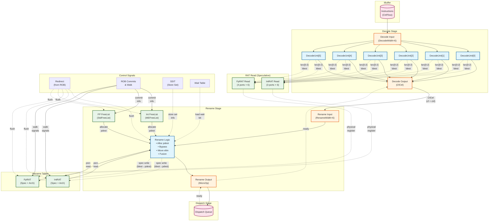
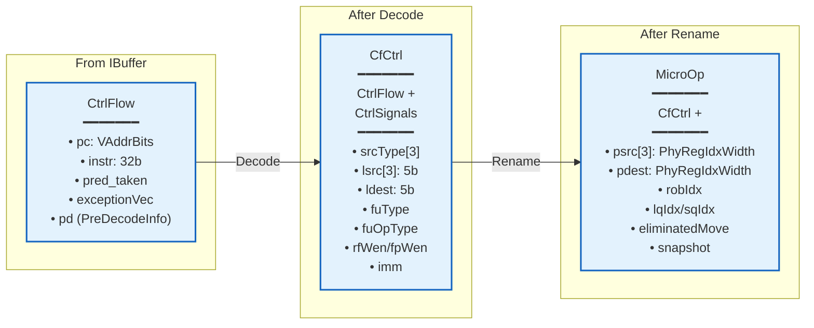
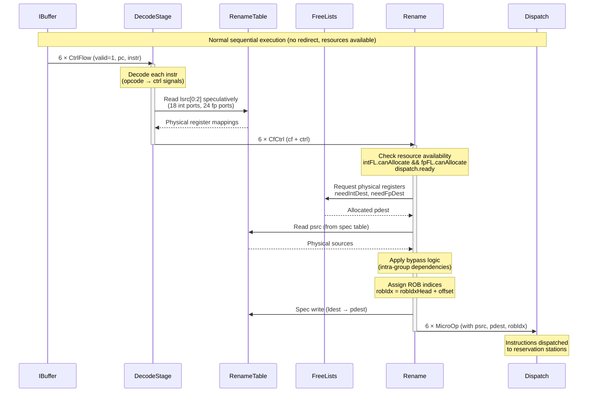
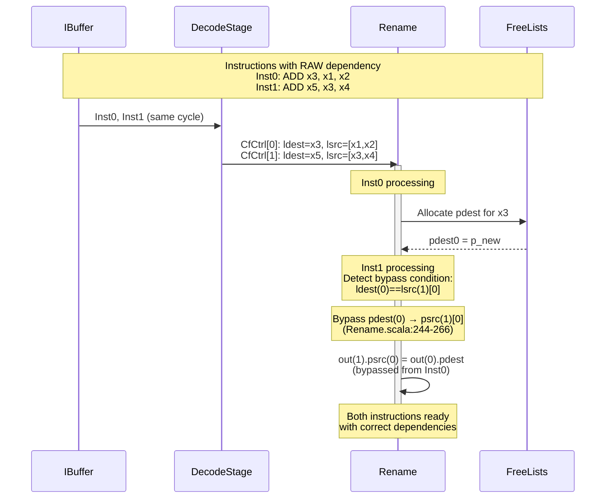
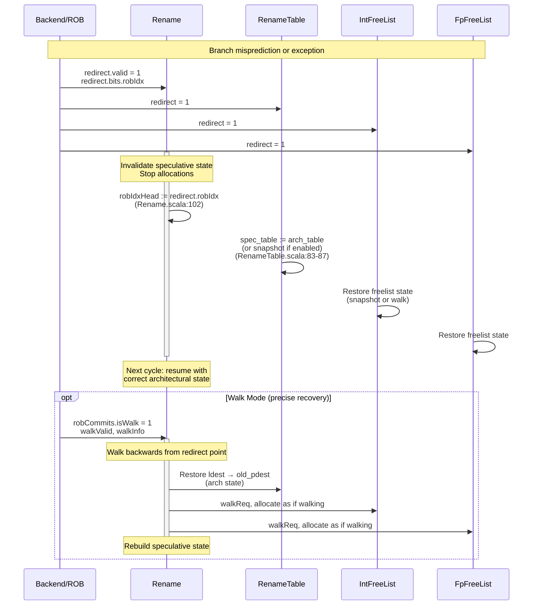

# XiangShan Decode and Rename Stages — Phase 1 Analysis

## Document Overview

This document provides a Phase 1 analysis of the XiangShan processor's Decode and Rename pipeline stages, focusing on top-level connectivity, data flow, and representative behaviors.

**Analysis Scope:**
- Target modules: `backend/decode/`, `backend/rename/`
- Version: master branch (Kunminghu)
- Key files analyzed:
  - `src/main/scala/xiangshan/backend/decode/DecodeStage.scala`
  - `src/main/scala/xiangshan/backend/decode/DecodeUnit.scala`
  - `src/main/scala/xiangshan/backend/rename/Rename.scala`
  - `src/main/scala/xiangshan/backend/rename/RenameTable.scala`
  - `src/main/scala/xiangshan/Bundle.scala` (data structures)

---

## 1. Top-Level Connectivity Diagram



**Key Observations:**
1. **Early RAT Read**: Decode stage reads RAT speculatively for better timing (DecodeStage.scala:62-72)
2. **Parallel Units**: 6 decode units process instructions in parallel (DecodeStage.scala:46)
3. **Dual Free Lists**: Separate integer and FP free lists (Rename.scala:65-66)
4. **Dual RAT**: Speculative and architectural rename tables (RenameTable.scala:52-58)
5. **Backpressure**: Ready/valid handshaking propagates from dispatch back to IBuffer

---

## 2. Data Structure Flow



### 2.1 Data Structure Flow Table

| Stage | Data Structure | Producer → Consumer | Key Fields (examples) | Purpose in Flow |
|---|---|---|---|---|
| IBuffer → Decode | `CtrlFlow` | IBuffer → DecodeStage | `pc`, `instr`, `pred_taken`, `exceptionVec`, `pd` | Raw fetch bundle; carries instruction bits and predecode for decode stage control generation. |
| Decode → Rename | `CfCtrl` | DecodeStage → Rename | `srcType[3]`, `lsrc[3]`, `ldest`, `fuType`, `fuOpType`, `rfWen/fpWen`, `imm` | Adds decoded control signals to the original `CtrlFlow` to drive rename allocation and dependency logic. |
| Rename → Dispatch | `MicroOp` | Rename → Dispatch | `psrc[3]`, `pdest`, `robIdx`, `lqIdx/sqIdx`, `eliminatedMove`, `snapshot` | Physicalized instruction: logical regs resolved to physical regs, indices assigned for backend queues. |

### 2.2 How the Flow Is Used (algorithm view)

1. **CtrlFlow (from IBuffer)** carries the instruction and predecode metadata into Decode, where control signals are derived (opcode → functional unit, operand types, destination write enables).
2. **CfCtrl** merges control with original fetch context so Rename can (a) allocate physical destinations, (b) read RAT mappings, and (c) resolve intra-group hazards.
3. **MicroOp** is the fully renamed packet that Dispatch can enqueue to backend structures (ROB, issue queues, load/store queues).

**Data Structure Sizes** (from Bundle.scala:125-247):
- **CtrlFlow**: ~170 bits (pc=39b, instr=32b, exceptions, predecode)
- **CtrlSignals**: ~100 bits (control fields, immediates)
- **CfCtrl**: CtrlFlow + CtrlSignals ≈ 270 bits
- **MicroOp**: CfCtrl + physical info ≈ 320 bits

---

## 3. Representative Behavior Scenarios

### Scenario 1: Normal Sequential Execution



**Key Timing:**
- Decode: 1 cycle (DecodeStage.scala:46-59)
- Rename: 1 cycle when resources available (Rename.scala:169)
- RAT read: Pipelined T0→T1 (RenameTable.scala:64-69)

**Code References:**
- Decode ready: DecodeStage.scala:59 `io.in(i).ready := io.out(i).ready`
- Rename canOut: Rename.scala:95 `canOut = io.out(0).ready && fpFreeList.io.canAllocate && intFreeList.io.canAllocate && !io.robCommits.isWalk`
- ROB index allocation: Rename.scala:100-106

---

### Scenario 2: Register Dependency with Bypass



**Bypass Logic** (Rename.scala:244-266):
```scala
val bypassCond = Wire(Vec(4, MixedVec(...)))
// For each instruction i (1 to RenameWidth-1)
val destToSrc = io.in.take(i).zipWithIndex.map { case (in, j) =>
  val indexMatch = in.bits.ctrl.ldest === t
  val writeMatch = cond2 && needIntDest(j) || cond1 && needFpDest(j)
  indexMatch && writeMatch
}
io.out(i).bits.psrc(0) := io.out.take(i).map(_.bits.pdest)
  .zip(bypassCond(0)(i-1).asBools).foldLeft(uops(i).psrc(0)) {
    (z, next) => Mux(next._2, next._1, z)
  }
```

---

### Scenario 3: Redirect/Flush Recovery



**Redirect Handling** (Rename.scala:100-106, 211-212):
```scala
val lastCycleMisprediction = RegNext(io.redirect.valid && !io.redirect.bits.flushItself())
val robIdxHeadNext = Mux(io.redirect.valid, io.redirect.bits.robIdx,
                     Mux(lastCycleMisprediction, robIdxHead + 1.U,
                     Mux(canOut, robIdxHead + validCount, robIdxHead)))

// Prevent spec writes during redirect
intSpecWen(i) := needIntDest(i) && intFreeList.io.canAllocate &&
                 intFreeList.io.doAllocate && !io.robCommits.isWalk && !io.redirect.valid
```

**RAT Recovery** (RenameTable.scala:83-87):
```scala
next := Mux(
  t1_redirect,
  Mux(t1_snpt.useSnpt, snapshots(t1_snpt.snptSelect)(i), arch_table(i)),
  Mux(VecInit(matchVec).asUInt.orR, wMatch, spec_table(i))
)
```

---

## 4. Stage-by-Stage Responsibilities

### 4.1 Decode Stage (DecodeStage.scala)

**Purpose**: Convert RISC-V instructions to internal control signals

**Inputs**:
- `io.in`: Vec(DecodeWidth=6, Flipped(DecoupledIO(CtrlFlow))) from IBuffer
- `io.csrCtrl`: CSR control signals

**Outputs**:
- `io.out`: Vec(DecodeWidth=6, DecoupledIO(CfCtrl)) to Rename
- `io.intRat`/`io.fpRat`: RAT read requests (speculative)

**Operations** (1 cycle):
1. **Instruction Decode** (DecodeUnit.scala): Lookup opcode in decode tables (X64Decode, XDecode, FDecode, etc.)
   - Extract: srcType, lsrc, ldest, fuType, fuOpType, rfWen, fpWen, selImm
   - Decode immediates based on instruction format

2. **RAT Read Request** (DecodeStage.scala:62-72): Issue speculative reads for next stage
   - Int RAT: 3 ports/instruction (lsrc[0], lsrc[1], ldest)
   - FP RAT: 4 ports/instruction (lsrc[0], lsrc[1], lsrc[2], ldest)
   - Read happens even if instruction may not proceed (for timing)

3. **Debug ID Assignment** (DecodeStage.scala:58):
   ```scala
   io.out(i).bits.ctrl.debug_globalID := debug_globalCounter + PopCount((0 until i+1).map(io.out(_).fire))
   ```

**Critical Path**: Decode table lookup → control signal generation

**Backpressure**: Stalls when rename stage not ready (`io.out(i).ready === false`)

---

### 4.2 Rename Stage (Rename.scala)

**Purpose**: Allocate physical registers, resolve architectural to physical register mapping

**Inputs**:
- `io.in`: Vec(RenameWidth=6, Flipped(DecoupledIO(CfCtrl))) from Decode
- `io.intReadPorts`/`io.fpReadPorts`: Physical register numbers from RAT
- `io.ssit`: Store-set ID table results
- `io.waittable`: Load-wait table results
- `io.redirect`: Branch misprediction/flush signals
- `io.robCommits`: Commit and walk-back signals

**Outputs**:
- `io.out`: Vec(RenameWidth=6, DecoupledIO(MicroOp)) to Dispatch
- `io.intRenamePorts`/`io.fpRenamePorts`: Speculative RAT write ports

**Operations** (1 cycle):

1. **Resource Check** (Rename.scala:89-95):
   ```scala
   intFreeList.io.doAllocate := fpFreeList.io.canAllocate && io.out(0).ready || io.robCommits.isWalk
   fpFreeList.io.doAllocate := intFreeList.io.canAllocate && io.out(0).ready || io.robCommits.isWalk
   canOut = io.out(0).ready && fpFreeList.io.canAllocate && intFreeList.io.canAllocate && !io.robCommits.isWalk
   ```

2. **ROB Index Allocation** (Rename.scala:100-106):
   - Speculative head pointer: `robIdxHead`
   - Each instruction gets: `robIdx = robIdxHead + PopCount(io.in.take(i).map(_.valid))`
   - Handle redirects by restoring head

3. **Physical Register Allocation** (Rename.scala:155-167):
   ```scala
   needFpDest(i) := io.in(i).valid && needDestReg(fp = true, io.in(i).bits)
   needIntDest(i) := io.in(i).valid && needDestReg(fp = false, io.in(i).bits)
   fpFreeList.io.allocateReq(i) := needFpDest(i)
   intFreeList.io.allocateReq(i) := needIntDest(i) && !isMove(i)
   ```
   - **Move Elimination**: Moves don't allocate new register (isMove predicate)

4. **Source Mapping** (Rename.scala:173-183):
   - Read RAT for psrc[0], psrc[1], psrc[2]
   - Handle fusion: `rs2FromRs2`, `rs2FromRs1` (macro-op fusion)

5. **Intra-Group Bypass** (Rename.scala:244-266):
   - Detect WAR/WAW dependencies within same rename group
   - Bypass newer pdest to dependent psrc

6. **Destination Mapping** (Rename.scala:187-190, 243, 266):
   ```scala
   uops(i).pdest := Mux(needIntDest(i), intFreeList.io.allocatePhyReg(i),
                    Mux(needFpDest(i), fpFreeList.io.allocatePhyReg(i), 0.U))
   // After bypass:
   io.out(i).bits.pdest := Mux(isMove(i), io.out(i).bits.psrc(0), uops(i).pdest)
   ```

7. **Fusion Handling** (Rename.scala:269-285):
   - **LUI+LOAD fusion**: Combine LUI immediate with LOAD offset
   - Store combined immediate in MicroOp

8. **Speculative RAT Update** (Rename.scala:209-220):
   ```scala
   intSpecWen(i) := needIntDest(i) && ... && !io.redirect.valid
   rat(i).wen := intSpecWen(i)
   rat(i).addr := uops(i).ctrl.ldest
   rat(i).data := io.out(i).bits.pdest
   ```

**Critical Path**:
- Freelist allocation → bypass calculation → pdest mux
- Typically ~1.5ns in 28nm (based on comments)

**Backpressure**: Stalls when:
- Dispatch not ready (`!io.out(0).ready`)
- Int or FP freelist full (`!intFreeList.io.canAllocate || !fpFreeList.io.canAllocate`)
- Walk mode active (`io.robCommits.isWalk`)

---

### 4.3 Rename Table (RenameTable.scala)

**Purpose**: Maintain architectural and speculative register mappings

**Structure**:
- **Speculative Table** (`spec_table`): 32 entries, updated on rename
- **Architectural Table** (`arch_table`): 32 entries, updated on commit
- **Snapshots**: Optional checkpoints for fast recovery

**Key Features**:

1. **Pipelined Read** (RenameTable.scala:64-69):
   - T0: Address provided
   - T0: Table lookup + bypass check
   - T1: Data available with bypass applied
   ```scala
   val t1_rdata = io.readPorts.map(p => RegNext(Mux(p.hold, p.data, spec_table_next(p.addr))))
   ```

2. **Bypass Logic** (RenameTable.scala:92-98):
   - T0 bypass: Compare write addresses with read addresses
   - T1 bypass: Use bypassed data if match
   ```scala
   val t0_bypass = io.specWritePorts.map(w => w.wen && Mux(r.hold, w.addr === t1_raddr(i), w.addr === r.addr))
   r.data := Mux(t1_bypass.asUInt.orR, bypass_data, t1_rdata(i))
   ```

3. **Redirect Handling** (RenameTable.scala:83-87):
   - Flush: Restore spec_table from arch_table (or snapshot)
   - Walk: Incrementally rebuild spec_table

4. **Old Physical Dest Tracking** (RenameTable.scala:100-118):
   - Track which physical register is being replaced
   - Determine if old pdest can be freed (not aliased)
   ```scala
   free := VecInit(arch_table.map(_ =/= old)).asUInt.andR && !blockedByDup
   ```

---

### 4.4 Free Lists

**Integer FreeList** (MEFreeList - Multi-Enqueue):
- Size: NRPhyRegs (typically 192)
- Supports both allocation and walk enqueue in same cycle

**FP FreeList** (StdFreeList):
- Size: NRPhyRegs - 32 (typically 160)
- Standard freelist implementation

**Operations**:
1. **Allocation** (rename): Pop physical registers for new instructions
2. **Deallocation** (commit): Push old physical registers back to free list
3. **Walk** (redirect recovery): Rebuild freelist state during walk-back
4. **Snapshot** (optional): Checkpoint for fast recovery

---

## 5. Key Algorithms

### 5.1 Intra-Group Bypass Network

**Problem**: Instructions in same rename group may have dependencies. Later instructions must use the newly allocated pdest from earlier instructions in the group.

**Solution** (Rename.scala:244-266):

```scala
// For instruction i, check all previous instructions [0..i-1]
for (i <- 1 until RenameWidth) {
  val bypassCond = Wire(Vec(4, MixedVec(...))) // For 3 sources + 1 dest

  // For each source/dest j
  for (j <- 0 to 3) {
    // Check which earlier instructions write to same register
    val destToSrc = io.in.take(i).zipWithIndex.map { case (in, k) =>
      val indexMatch = in.bits.ctrl.ldest === target(j)
      val writeMatch = (cond2 && needIntDest(k)) || (cond1 && needFpDest(k))
      indexMatch && writeMatch
    }
    bypassCond(j)(i-1) := VecInit(destToSrc).asUInt
  }

  // Apply bypass with priority mux (earlier instruction has priority)
  io.out(i).bits.psrc(0) := io.out.take(i).map(_.bits.pdest)
    .zip(bypassCond(0)(i-1).asBools)
    .foldLeft(uops(i).psrc(0)) { (z, next) =>
      Mux(next._2, next._1, z)
    }
}
```

**Complexity**: O(RenameWidth²) = O(36) comparisons for 6-wide rename

---

### 5.2 ROB Index Management

**Problem**: Assign monotonically increasing ROB indices even with variable instruction counts and redirects.

**Solution** (Rename.scala:99-106):

```scala
val robIdxHead = RegInit(0.U.asTypeOf(new RobPtr))
val validCount = PopCount(io.in.map(_.valid))
val lastCycleMisprediction = RegNext(io.redirect.valid && !io.redirect.bits.flushItself())

val robIdxHeadNext =
  Mux(io.redirect.valid,
      io.redirect.bits.robIdx,                    // Redirect: jump to redirect point
  Mux(lastCycleMisprediction,
      robIdxHead + 1.U,                           // Last cycle mispredict: +1
  Mux(canOut,
      robIdxHead + validCount,                    // Normal: advance by # valid
      robIdxHead)))                               // Stalled: keep same

robIdxHead := robIdxHeadNext

// Each instruction gets:
uops(i).robIdx := robIdxHead + PopCount(io.in.take(i).map(_.valid))
```

---

### 5.3 Move Elimination

**Optimization**: Register-to-register moves don't need new physical registers. Reuse source physical register as destination.

**Implementation** (Rename.scala:184, 243, 266):

```scala
val isMove = io.in.map(_.bits.ctrl.isMove)

// Don't allocate for moves:
intFreeList.io.allocateReq(i) := needIntDest(i) && !isMove(i)

// Use psrc as pdest for moves:
io.out(0).bits.pdest := Mux(isMove(0), uops(0).psrc.head, uops(0).pdest)
io.out(i).bits.pdest := Mux(isMove(i), io.out(i).bits.psrc(0), uops(i).pdest)
```

**Benefit**: Reduces physical register pressure, saves freelist entries

---

## 6. Performance Characteristics

### 6.1 Throughput

**Peak**: 6 instructions/cycle (when all conditions met)
- Sufficient freelist entries
- Dispatch ready
- No walk/redirect

**Typical**: 4-5 instructions/cycle average (empirical)

### 6.2 Latency

**Decode**: 1 cycle (combinational + reg)
**Rename**: 1 cycle (combinational + reg)
**RAT Read**: Pipelined 2-cycle (T0 address, T1 data)

**Total Decode→Rename→Dispatch**: ~3 cycles best case

### 6.3 Bottlenecks

1. **Freelist exhaustion**: Stalls when <6 free physical registers
   - Mitigated by: Large physical register file (192 int, 160 FP)

2. **Dispatch queue full**: Backpressure from reservation stations
   - Mitigated by: Distributed issue queues

3. **Redirect recovery**: 3-4 cycle bubble on misprediction
   - Mitigated by: Snapshots (if enabled)

---

## 7. Corner Cases and Special Handling

### 7.1 Instruction Fusion

**Problem**: Two consecutive instructions can be fused into single macro-op (e.g., compare + branch).

**Handling** (Rename.scala:177-181):
```scala
when (io.fusionInfo(i).rs2FromRs2 || io.fusionInfo(i).rs2FromRs1) {
  // Second instruction uses source from first instruction
  uops(i).psrc(1) := Mux(io.fusionInfo(i).rs2FromRs2,
                         io.intReadPorts(i + 1)(1),  // rs2 from next
                         io.intReadPorts(i + 1)(0))  // rs1 from next
}
```

### 7.2 LUI-LOAD Fusion

**Optimization**: Fuse `LUI` (load upper immediate) with following `LOAD` to form large offset.

**Implementation** (Rename.scala:269-285):
```scala
val last_is_lui = io.in(i - 1).bits.ctrl.selImm === SelImm.IMM_U &&
                  io.in(i - 1).bits.ctrl.srcType(0) =/= SrcType.pc
val this_is_load = io.in(i).bits.ctrl.fuType === FuType.ldu
val lui_to_load = io.in(i - 1).bits.ctrl.ldest === io.in(i).bits.ctrl.lsrc(0)

when (last_is_lui && this_is_load && lui_to_load) {
  // Combine immediates
  io.out(i).bits.ctrl.imm := Imm_LUI_LOAD().immFromLuiLoad(lui_imm, ld_imm)
  // Store upper bits in psrc
  io.out(i).bits.psrc(0) := lui_imm(...)
  io.out(i).bits.psrc(1) := lui_imm(...)
}
```

### 7.3 Walk Mode (Precise Recovery)

**Problem**: After redirect, speculative state is corrupted. Need to restore architectural state.

**Walk Process** (Rename.scala:131-166, 214-219):
1. ROB provides `walkValid` and `walkInfo` for each committed instruction (in reverse)
2. Rename "replays" these instructions:
   - Allocate physical registers as if renaming
   - Update speculative RAT
   - Rebuild freelist state
3. Continue until caught up to redirect point

**Walk vs Snapshot**:
- **Walk**: Slower (multiple cycles) but no hardware cost
- **Snapshot** (if enabled): Faster (1 cycle) but requires storage

---

## 8. Interaction with Other Stages

### 8.1 Frontend (IBuffer → Decode)

**Interface**: DecoupledIO(CtrlFlow)
- **Signals**: `pc`, `instr`, `pred_taken`, `exceptionVec`, `pd` (PreDecodeInfo)
- **Handshake**: IBuffer provides instructions when available, Decode stalls when rename full

**Predecode Info** (PreDecodeInfo from Frontend):
- `isRVC`: Compressed instruction flag
- `brType`: Branch type (for branch prediction)
- `ftqPtr`, `ftqOffset`: Fetch target queue pointers

### 8.2 Backend (Rename → Dispatch)

**Interface**: DecoupledIO(MicroOp)
- **Signals**: Full MicroOp with physical registers, ROB index, queue pointers
- **Handshake**: Dispatch provides ready when issue queues have space

**Load-Store Dependencies**:
- `ssit`: Store-Set ID table (predicts load-store dependencies)
- `waittable`: Load wait table (conservative disambiguation)

### 8.3 ROB (Commit/Redirect)

**Commit Interface**:
```scala
class RobCommitIO {
  val isCommit: Bool           // Normal commit
  val commitValid: Vec[CommitWidth, Bool]
  val info: Vec[CommitWidth, RobCommitInfo]  // ldest, pdest, rfWen, fpWen

  val isWalk: Bool             // Walk-back mode
  val walkValid: Vec[CommitWidth, Bool]
}
```

**Redirect Interface**:
```scala
class Redirect {
  val robIdx: RobPtr           // Redirect to this ROB entry
  val level: RedirectLevel     // Flush level
  val debugIsCtrl: Bool        // Control flow redirect
  val debugIsMemVio: Bool      // Memory ordering violation
}
```

---

## 9. Configuration Parameters

From `Parameters.scala` and defaults:

| Parameter | Default | Description |
|-----------|---------|-------------|
| `DecodeWidth` | 6 | Instructions decoded per cycle |
| `RenameWidth` | 6 | Instructions renamed per cycle |
| `CommitWidth` | 6 | Instructions committed per cycle |
| `NRPhyRegs` | 192 | Integer physical registers |
| `NRPhyRegs-32` | 160 | FP physical registers |
| `PhyRegIdxWidth` | 8 | Physical register index bits (log2(192)≈8) |
| `RobSize` | 256 | ROB entries |
| `EnableRenameSnapshot` | true (optional) | Fast recovery via snapshots |

---

## 10. Open Questions and Assumptions

### Verified
- ✓ Decode width = Rename width = 6 (DecodeStage.scala:30, Rename.scala:35)
- ✓ RAT read happens in decode stage (DecodeStage.scala:62-72)
- ✓ Separate int/FP freelists (Rename.scala:65-66)
- ✓ Bypass network handles intra-group dependencies (Rename.scala:244-266)

### Assumptions
- Decode stage is purely combinational within 1 cycle (no internal pipeline stages)
- RAT bypass always succeeds (no structural hazards for bypass muxes)
- Freelist allocation uses simple FIFO (implementation not fully analyzed)

### To Investigate (Phase 2)
1. **FreeList Implementation**: Exact mechanism for MEFreeList vs StdFreeList
2. **Snapshot Details**: How snapshots are stored and indexed
3. **Move Elimination**: When/how isMove flag is set (in decode?)
4. **Fusion Detection**: Full fusion decoder logic
5. **Store-Set Table**: SSIT prediction algorithm and training

---

## 11. Performance Counters

**Decode Stage** (DecodeStage.scala:86-91):
- `utilization`: Number of valid decode slots used
- `waitInstr`: Instructions stalled waiting for rename
- `stall_cycle`: Cycles where decode has valid but rename not ready

**Rename Stage** (Rename.scala:400-412):
- `utilization`: Number of valid rename slots
- `stall_cycle_dispatch`: Stalled on dispatch full
- `stall_cycle_fp`: Stalled on FP freelist full
- `stall_cycle_int`: Stalled on integer freelist full
- `stall_cycle_walk`: Stalled during walk recovery
- `move_instr_count`: Move-eliminated instructions
- `fused_lui_load_instr_count`: LUI-LOAD fusions

---

## 12. Summary

The Decode and Rename stages form the front-end of XiangShan's out-of-order backend:

**Decode** converts RISC-V instructions to internal control signals, issuing speculative RAT reads for the next stage.

**Rename** allocates physical registers from dual freelists (int/FP), applies intra-group bypass logic to resolve dependencies, and updates the speculative rename table.

Both stages operate at 6-wide throughput when resources permit, achieving ~1-cycle latency each. The design emphasizes high bandwidth through parallel processing while maintaining correct dependency tracking and efficient recovery from mispredictions.

**Critical Design Points**:
1. **Early RAT read** (in decode) improves timing
2. **Intra-group bypass** enables back-to-back dependent instructions
3. **Move elimination** reduces register pressure
4. **Dual RAT** (spec/arch) enables fast commit and walk-back recovery

**Next Steps (Phase 2)**:
- Deep-dive into FreeList algorithms
- Analyze fusion decoder implementation
- Understand snapshot mechanism
- Study Store-Set table operation

---

**Document Status**: Phase 1 Complete
**Last Updated**: 2026-01-19
**Validated Against**: XiangShan master branch (Kunminghu)
