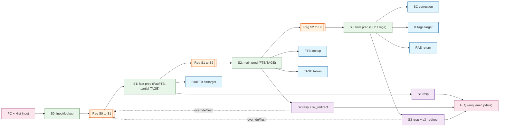

# XiangShan Frontend - Phase 2: BPU Deep Dive

## 1. BPU Component Overview

The Branch Prediction Unit (BPU) in XiangShan consists of multiple predictors orchestrated by the `Composer` module. The predictors are instantiated in `Parameters.scala`:

```scala
val preds = Seq(ubtb, tage, ftb, ittage, ras)
// ubtb = FauFTB (Fast/Micro FTB)
// tage = Tage_SC (TAGE + Statistical Corrector)
// ftb = FTB (Fetch Target Buffer)
// ittage = ITTage (Indirect Target TAGE)
// ras = RAS (Return Address Stack)
```

### 1.1 BPU Pipeline (S0 input + S1/S2/S3 registered)
The BPU pipeline starts from **S0 input** (no stage register) and then advances through three registered stages **S1 → S2 → S3**. The diagram below marks the pipeline registers explicitly so stage boundaries are clear:



---

## 2. FauFTB (Fast/Micro FTB) - `FauFTB.scala`

### 2.1 Purpose
FauFTB provides **S1 fast prediction** (`is_fast_pred = true`). It acts as a small, fully-associative cache that delivers predictions in the first pipeline stage.

### 2.2 Structure
```
+------------------+
|   FauFTB (32-way)|
+------------------+
| Way 0: tag + entry |
| Way 1: tag + entry |
| ...                |
| Way 31: tag + entry|
+------------------+
| 2-bit ctrs per br  |
+------------------+
| PLRU Replacer      |
+------------------+
```

Each **way** is a small register file entry (`FauFTBWay`) that stores:
- **tag**: `tagSize = 16` bits (`getTag(pc)` uses bits `[tagSize+instOffsetBits-1 : instOffsetBits]`).
- **entry**: `FauFTBEntry`, which is the same structure as `FTBEntry`:
  - `valid` bit
  - `brSlots`: `numBrSlot` slots, each with `{offset, lower, tarStat, sharing, valid}`
  - `tailSlot`: one slot with a wider `lower` field and optional sub-offset sharing
  - `pftAddr` (log2Up(PredictWidth) bits) and `carry`
  - flags: `isCall`, `isRet`, `isJalr`, `last_may_be_rvi_call`
  - `always_taken` mask (`numBr` bits)
- **per-branch counters**: `numBr` saturating counters, 2 bits each (`ctrs(w)(br)`).

**Size note:** FauFTB is fully associative, so total storage is roughly:
```
numWays * (tagSize + FTBEntryWidth + valid + 2*numBr)
```
where `FTBEntryWidth` is determined by `PredictWidth`, `numBr`, and the slot offset sizes in `FTB.scala`. This is why the FauFTB “way” is described as **tag + entry**, with the exact bitwidth derived from config parameters.

### 2.3 Key Parameters
| Parameter | Value | Description |
|-----------|-------|-------------|
| `numWays` | 32 | Fully-associative ways |
| `tagSize` | 16 | Tag bits |
| `numBr` | 2 | Branches per entry |

### 2.4 Operation
- **S1 Read**: Compare `s1_pc` tag against all 32 ways in parallel
- **Hit Detection**: `s1_hit_oh = VecInit(ways.map(_.io.resp_hit)).asUInt`
- **Prediction**: Uses 2-bit saturating counters for taken/not-taken
- **Update**: 2-cycle update pipeline (s0: tag compare, s1: write)
- **Replacement**: PLRU (Pseudo Least Recently Used)

### 2.5 Timing
```
S0: PC input
S1: Hit detection + prediction output  <-- FAST PREDICTION
S2: (unused by FauFTB)
S3: Meta output
```

---

## 3. FTB (Fetch Target Buffer) - `FTB.scala`

### 3.1 Purpose
FTB is the **main branch target predictor**. It stores control flow information for basic blocks, including branch offsets and targets.

### 3.2 FTB Entry Structure (Detailed Data Types)

```scala
class FTBEntry {
  val valid: Bool                                    // 1 bit

  // Branch slots (numBr-1 = 1 slot for numBr=2)
  val brSlots: Vec[numBrSlot, FtbSlot(BR_OFFSET_LEN)]
  // Each brSlot contains:
  //   offset: UInt(log2Ceil(PredictWidth).W)        // 4 bits (for PredictWidth=16)
  //   lower: UInt(BR_OFFSET_LEN.W)                  // 12 bits
  //   tarStat: UInt(TAR_STAT_SZ.W)                  // 2 bits (FIT/OVF/UDF)
  //   sharing: Bool                                 // 1 bit
  //   valid: Bool                                   // 1 bit
  // Total per brSlot: 4+12+2+1+1 = 20 bits

  // Tail slot (can be branch or jump)
  val tailSlot: FtbSlot(JMP_OFFSET_LEN, Some(BR_OFFSET_LEN))
  // tailSlot contains:
  //   offset: UInt(log2Ceil(PredictWidth).W)        // 4 bits
  //   lower: UInt(JMP_OFFSET_LEN.W)                 // 20 bits
  //   tarStat: UInt(TAR_STAT_SZ.W)                  // 2 bits
  //   sharing: Bool                                 // 1 bit (can share with brSlot)
  //   valid: Bool                                   // 1 bit
  // Total: 4+20+2+1+1 = 28 bits

  // Fall-through address
  val pftAddr: UInt(log2Up(PredictWidth).W)          // 4 bits
  val carry: Bool                                    // 1 bit

  // Control flow type flags
  val isCall: Bool                                   // 1 bit
  val isRet: Bool                                    // 1 bit
  val isJalr: Bool                                   // 1 bit
  val last_may_be_rvi_call: Bool                     // 1 bit

  // Always taken flags
  val always_taken: Vec[numBr, Bool]                 // 2 bits (for numBr=2)
}

// Total FTBEntry size (for numBr=2, PredictWidth=16):
//   valid: 1
//   brSlots[1]: 20
//   tailSlot: 28
//   pftAddr: 4
//   carry: 1
//   flags: 4
//   always_taken: 2
// Total: ~60 bits per entry
```

### 3.3 FTB Slot Target Encoding

Target encoding uses **differential compression** to save bits:

```
Given: PC and target address
Split into: pc_higher | lower | offset_bits
            [high bits] [offset] [inst align]

tarStat encoding:
  TAR_FIT (00): target_higher == pc_higher     → target = pc_higher | lower | 0
  TAR_OVF (01): target_higher == pc_higher + 1 → target = (pc_higher+1) | lower | 0
  TAR_UDF (10): target_higher == pc_higher - 1 → target = (pc_higher-1) | lower | 0
```

**Pseudo code for target reconstruction:**
```scala
def getTarget(pc: UInt, lower: UInt, tarStat: UInt, offsetLen: Int): UInt = {
  val pc_higher = pc(VAddrBits-1, offsetLen+1)
  val target_higher = MuxLookup(tarStat, pc_higher)(Seq(
    TAR_FIT -> pc_higher,
    TAR_OVF -> (pc_higher + 1.U),
    TAR_UDF -> (pc_higher - 1.U)
  ))
  Cat(target_higher, lower(offsetLen-1, 0), 0.U(1.W))
}
```

### 3.4 Key Parameters
| Parameter | Value | Description |
|-----------|-------|-------------|
| `FtbSize` | Configurable | Total entries |
| `FtbWays` | Configurable | Associativity |
| `numSets` | FtbSize/FtbWays | Sets (typically 512) |
| `tagSize` | 20 | Tag bits |
| `BR_OFFSET_LEN` | 12 | Branch target offset bits |
| `JMP_OFFSET_LEN` | 20 | Jump target offset bits |

### 3.5 Operation
- **S0**: Index calculation from PC
- **S1**: SRAM read, tag comparison
- **S2**: Entry output, fall-through calculation
- **Update**: New entries created on misprediction

---

## 4. TAGE + SC (Tagged Geometric History Length Predictor) - `Tage.scala`, `SC.scala`

### 4.1 TAGE Overview
TAGE uses multiple tables with **geometrically increasing history lengths** to capture patterns at different correlation depths.

### 4.2 TAGE Table Structure
```
          +---------+     +---------+     +---------+
PC+hist -> | Table 0 | --> | Table 1 | --> | Table N |
          | (short) |     | (medium)|     | (long)  |
          +---------+     +---------+     +---------+
               ↓               ↓               ↓
           Provider Selection (longest matching)
```

### 4.3 TAGE Entry (Detailed Data Types)

```scala
class TageEntry {
  val valid: Bool                    // 1 bit (stored in separate valid array)
  val tag: UInt(tagLen.W)            // Variable, e.g., 8-12 bits depending on table
  val ctr: UInt(TageCtrBits.W)       // 3 bits (signed saturation counter)
  // Total per entry: ~11-15 bits
}

// Example table configurations (from default XSCoreParams):
// Table 0: (nRows=256,  histLen=0,   tagLen=8)   → 11 bits/entry, 2.8 Kbits total
// Table 1: (nRows=256,  histLen=5,   tagLen=9)   → 12 bits/entry, 3.1 Kbits total
// Table 2: (nRows=512,  histLen=12,  tagLen=10)  → 13 bits/entry, 6.7 Kbits total
// Table 3: (nRows=512,  histLen=26,  tagLen=10)  → 13 bits/entry, 6.7 Kbits total
// Table 4: (nRows=1024, histLen=44,  tagLen=11)  → 14 bits/entry, 14.3 Kbits total
// Table 5: (nRows=1024, histLen=67,  tagLen=11)  → 14 bits/entry, 14.3 Kbits total
// ...
```

### 4.4 TAGE Prediction Pseudo Code

```scala
// Query all tables in parallel
val responses: Seq[Valid[TageResp]] = tables.map { table =>
  val idx = hash(pc, folded_hist, table.histLen)
  val tag = hash_tag(pc, folded_hist, table.histLen)
  table.read(idx, tag)  // Returns (valid=hit, ctr, u)
}

// Provider selection (longest matching table)
val provider_idx = PriorityMux(
  responses.reverse.map(_.valid),  // Start from longest history
  (TageNTables-1 to 0 by -1).map(_.U)
)
val provider = responses(provider_idx)

// Alternate provider (second longest matching)
val alt_provider_idx = PriorityMux(
  responses.reverse.zipWithIndex.map { case (resp, i) =>
    resp.valid && i.U =/= provider_idx
  },
  (TageNTables-1 to 0 by -1).map(_.U)
)
val alt_provider = responses(alt_provider_idx)

// Prediction logic
val provider_pred = provider.bits.ctr(TageCtrBits-1)  // MSB = taken
val alt_pred = Mux(alt_provider.valid,
  alt_provider.bits.ctr(TageCtrBits-1),
  base_pred  // From BIM
)

val use_alt = provider.bits.ctr === 0.U || provider.bits.ctr === ((1<<TageCtrBits)-1).U
val final_pred = Mux(use_alt && useAltOnNa(pc)(USE_ALT_ON_NA_WIDTH-1),
  alt_pred,
  provider_pred
)
```

### 4.6 Statistical Corrector (SC)
SC corrects TAGE predictions when confidence is low:

```scala
class SCTable(nRows, ctrBits, histLen) {
  // Signed counters
  val table = SInt(ctrBits.W)  // 6-bit signed
}

class SCThreshold {
  val ctr: UInt     // Confidence counter
  val thres: UInt   // Dynamic threshold (6-31)
}
```

**SC Decision Logic:**
- Sum all SC table counters
- If |sum| > threshold AND sum disagrees with TAGE → override TAGE prediction

### 4.7 Key Parameters
| Parameter | Value | Description |
|-----------|-------|-------------|
| `TageCtrBits` | 3 | Counter bits |
| `SCCtrBits` | 6 | SC counter bits |
| `USE_ALT_ON_NA_WIDTH` | 4 | useAltOnNa counter width |
| `NUM_USE_ALT_ON_NA` | 128 | Number of useAltOnNa counters |

---

## 5. ITTage (Indirect Target TAGE) - `ITTAGE.scala`

### 5.1 Purpose
ITTage predicts **indirect jump/call targets** (JALR instructions). Unlike TAGE which predicts direction, ITTage predicts full target addresses.

### 5.2 ITTage Entry
```scala
class ITTageEntry {
  val tag: UInt(tagLen.W)
  val ctr: UInt(ITTageCtrBits.W)
  val target: UInt(VAddrBits.W)  // Full target address
}
```

### 5.3 ITTage vs TAGE
| Aspect | TAGE | ITTage |
|--------|------|--------|
| Prediction | Direction (taken/not-taken) | Target address |
| Counter | Confidence | Confidence |
| Storage | Small entry | Large entry (includes target) |
| Use case | Conditional branches | Indirect jumps |

### 5.4 Provider Selection
Similar to TAGE:
1. Query all ITTage tables
2. Select longest matching table as provider
3. Use `useAltOnNa` when provider is weak

---

## 6. RAS (Return Address Stack) - `RAS.scala`

### 6.1 Purpose
RAS predicts **return addresses** for RET instructions by maintaining a stack of call sites.

### 6.2 RAS Entry
```scala
class RASEntry {
  val retAddr: UInt(VAddrBits.W)  // Return address
  val ctr: UInt(8.W)              // Nested call counter
}
```

### 6.3 Key Features
- **Counter for Recursion**: Instead of pushing duplicate addresses, increments counter
- **Speculative Updates**: Stack updated speculatively on calls/returns
- **Recovery**: Restores stack state on misprediction

### 6.4 Operations
```
CALL: if (new_addr == top.retAddr && !ctr.full)
        top.ctr++
      else
        push(new_addr, ctr=0)

RET:  if (top.ctr == 0)
        pop()
      else
        top.ctr--
```

### 6.5 Key Parameters
| Parameter | Description |
|-----------|-------------|
| `RasSize` | Stack depth |
| `ctr` width | 8 bits (supports 256 recursive calls) |

---

## 7. Composer - Prediction Flow Integration

### 7.1 Composer Role
`Composer.scala` orchestrates all predictors:

```scala
class Composer extends BasePredictor {
  val (components, resp) = getBPDComponents(io.in.bits.resp_in(0), p)
  // components = [FauFTB, Tage_SC, FTB, ITTage, RAS]

  // Chain predictor responses
  for (c <- components) {
    c.io.in.bits.resp_in(0) := previous_resp
    // ... connect control signals
  }
}
```

### 7.2 Prediction Priority
```
S1: FauFTB provides fast prediction (is_fast_pred = true)
     ↓ (bypass to io.out.s1)
S2: FTB, TAGE refine prediction
     ↓ (may override S1)
S3: SC correction, ITTage, RAS
     ↓ (may override S2)
Final: Merged prediction output
```

### 7.3 Meta Packing
```scala
var metas = 0.U(1.W)
for (c <- components) {
  metas = (metas << c.meta_size) | c.io.out.last_stage_meta
}
io.out.last_stage_meta := metas
```

---

## 8. Global History Management

### 8.1 Circular Global History (CGH)
```scala
val ghv = RegInit(0.U.asTypeOf(Vec(HistoryLength, Bool())))
val ghv_wire = WireInit(ghv)
```

### 8.2 Folded History
Multiple predictors need different history lengths. XiangShan uses **folded histories** to compress long history into shorter indices:

```scala
def compute_folded_hist(hist: UInt, l: Int)(histLen: Int) = {
  val nChunks = (histLen + l - 1) / l
  val hist_chunks = (0 until nChunks) map { i =>
    hist(min((i+1)*l, histLen)-1, i*l)
  }
  ParallelXOR(hist_chunks)
}
```

### 8.3 History Update
On prediction:
```scala
ghv(ptr.value) := taken  // Update history bit
ptr := ptr - shift       // Move pointer
```

On redirect:
```scala
// Restore history from redirect info
updated_ptr := oldPtr - shift
updated_fh := oldFh.update(afhob, lastBrNumOH, shift, taken)
```

---

## 9. Update Flow

### 9.1 Update Trigger
Updates occur when FTQ entries commit:
```scala
predictors.io.update := RegNext(io.ftq_to_bpu.update)
```

### 9.2 Per-Component Update
Each predictor receives:
- `update.pc`: PC of committed block
- `update.meta`: Prediction metadata (for knowing which tables to update)
- `update.br_taken_mask`: Actual branch outcomes
- `update.mispred_mask`: Which branches mispredicted

### 9.3 Allocation on Miss
When prediction misses:
1. FTB: Create new entry
2. TAGE: Allocate in tables with longer history
3. ITTage: Allocate entry for indirect target
4. RAS: No explicit allocation (stack-based)

---

## 10. Performance Counters

Key performance events tracked:
```scala
// FauFTB
XSPerfAccumulate("uftb_read_hits", ...)
XSPerfAccumulate("uftb_read_misses", ...)
XSPerfAccumulate("uftb_commit_hits", ...)

// TAGE
XSPerfAccumulate("s2_redirect_because_target_diff", ...)
XSPerfAccumulate("s2_redirect_because_direction_diff", ...)

// SC
XSPerfAccumulate("sc_disagree_and_correct", ...)
XSPerfAccumulate("sc_disagree_and_wrong", ...)
```

---

## 11. Summary Table

| Component | Function | Storage | Timing |
|-----------|----------|---------|--------|
| FauFTB | Fast block prediction | 32 entries, fully-associative | S1 |
| FTB | Main block prediction | Set-associative SRAM | S1-S2 |
| TAGE | Direction prediction | Multiple tables with geo. history | S2-S3 |
| SC | Direction correction | Multiple tables | S3 |
| ITTage | Indirect target prediction | Multiple tables with geo. history | S3 |
| RAS | Return address prediction | Stack with counters | S2-S3 |

---

## 12. Files Analyzed

| File | Description |
|------|-------------|
| `FauFTB.scala` | Fast/Micro FTB implementation |
| `FTB.scala` | Fetch Target Buffer implementation |
| `Tage.scala` | TAGE predictor and base table |
| `SC.scala` | Statistical Corrector tables |
| `ITTAGE.scala` | Indirect Target TAGE |
| `RAS.scala` | Return Address Stack |
| `Composer.scala` | Predictor orchestration |
| `BPU.scala` | Top-level predictor wrapper |
