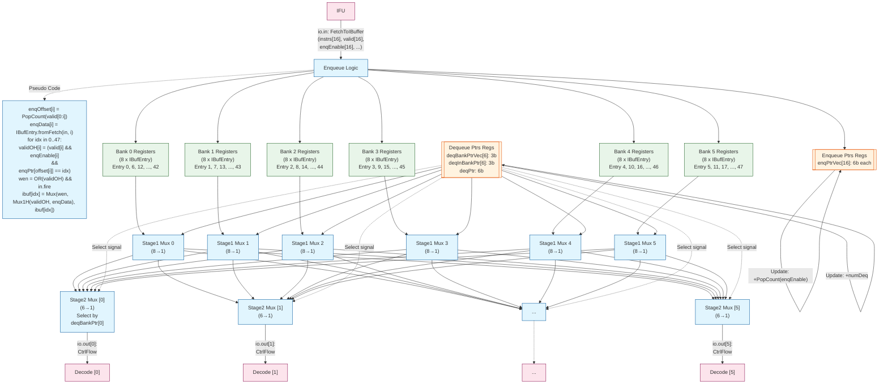

# XiangShan Frontend - Phase 2: IBuffer Analysis

## 1. IBuffer Overview

The Instruction Buffer (IBuffer) decouples the frontend (IFU) from the backend (Decode). It is a **banked FIFO queue** that stores predecoded instructions with their metadata.

### 1.1 Key Parameters

| Parameter | Description | Typical Value |
|-----------|-------------|---------------|
| `IBufSize` | Total buffer entries | 48 |
| `IBufNBank` | Number of banks | 6 |
| `PredictWidth` | Instructions from IFU per cycle | 16 |
| `DecodeWidth` | Instructions to decode per cycle | 6 |

### 1.2 Design Rationale

```
IFU Output (PredictWidth=16)    IBuffer (48 entries)    Decode Input (DecodeWidth=6)
        ↓                              ↓                          ↓
   [16 instr/cycle] ─────→ [Banked FIFO] ─────→ [6 instr/cycle]
```

- **Banked design** reduces read port complexity
- **Decoupling** allows IFU and Decode to run independently
- **Bank size** = IBufSize / IBufNBank = 48/6 = 8 entries per bank

---

## 2. IBuffer Entry Structure (Detailed Data Types)

```scala
class IBufEntry extends XSBundle {
  val inst: UInt(32.W)                           // 32 bits: Instruction
  val pc: UInt(VAddrBits.W)                      // ~39 bits: Program counter
  val foldpc: UInt(MemPredPCWidth.W)             // ~20 bits: Folded PC for mem dep

  // PreDecodeInfo structure (~10 bits):
  val pd = new PreDecodeInfo {
    val valid: Bool                              // 1 bit
    val isRVC: Bool                              // 1 bit: Compressed instruction
    val brType: UInt(2.W)                        // 2 bits: 00=notCFI, 01=branch, 10=jal, 11=jalr
    val isCall: Bool                             // 1 bit
    val isRet: Bool                              // 1 bit
    // Additional predecode bits: ~4 bits
  }

  val pred_taken: Bool                           // 1 bit: Branch prediction taken
  val ftqPtr: FtqPtr                             // 6 bits: FTQ entry pointer (log2(64))
  val ftqOffset: UInt(log2Ceil(PredictWidth).W)  // 4 bits: Offset within FTQ (log2(16))
  val ipf: Bool                                  // 1 bit: Instruction page fault
  val acf: Bool                                  // 1 bit: Access fault
  val crossPageIPFFix: Bool                      // 1 bit: Cross-page IPF fix

  val triggered = new TriggerCf {                // ~8 bits: Debug trigger
    val frontendHit: Vec[10, Bool]               // 10 bits
    val frontendTiming: Vec[10, Bool]            // (not all included in CtrlFlow)
  }
}

// Total IBufEntry size: ~32 + 39 + 20 + 10 + 1 + 6 + 4 + 1 + 1 + 1 + 8 = ~123 bits
// With alignment: ~128 bits (16 bytes) per entry
// Total IBuffer storage: 48 entries x 16 bytes = 768 bytes
```

---

## 3. Banked Organization

### 3.1 Bank Layout

```
Bank 0: [Entry 0] [Entry 6] [Entry 12] ... [Entry 42]
Bank 1: [Entry 1] [Entry 7] [Entry 13] ... [Entry 43]
Bank 2: [Entry 2] [Entry 8] [Entry 14] ... [Entry 44]
Bank 3: [Entry 3] [Entry 9] [Entry 15] ... [Entry 45]
Bank 4: [Entry 4] [Entry 10][Entry 16] ... [Entry 46]
Bank 5: [Entry 5] [Entry 11][Entry 17] ... [Entry 47]

Physical Index = BankID + InBankOffset * IBufNBank
```

### 3.2 Pointer Structure

```scala
class IBufPtr          // Global pointer (0 to IBufSize-1): 6 bits
class IBufInBankPtr    // Per-bank pointer (0 to bankSize-1): 3 bits
class IBufBankPtr      // Bank selector (0 to IBufNBank-1): 3 bits (log2(6)~3)

// Enqueue pointers
val enqPtrVec: Vec[PredictWidth, IBufPtr]  // 16 x 6 bits

// Dequeue pointers
val deqBankPtrVec: Vec[DecodeWidth, IBufBankPtr]  // 6 x 3 bits
val deqInBankPtr: Vec[IBufNBank, IBufInBankPtr]   // 6 x 3 bits
val deqPtr: IBufPtr                                // 6 bits
```

### 3.3 IBuffer Banked Datapath Diagram



---

## 4. Enqueue Logic

### 4.1 Input Interface

```scala
val io = IO(new IBufferIO)
io.in = Flipped(DecoupledIO(new FetchToIBuffer))
// Contains: instrs, valid, enqEnable, pd, pc, ftqPtr, ftqOffset, exceptions
```

### 4.2 Enqueue Flow

```scala
// Calculate offset for each instruction
val enqOffset = VecInit.tabulate(PredictWidth)(i =>
  PopCount(io.in.bits.valid.asBools.take(i)))

// Create entry data
val enqData = VecInit.tabulate(PredictWidth)(i =>
  Wire(new IBufEntry).fromFetch(io.in.bits, i))

// Write to buffer
ibuf.zipWithIndex.foreach {
  case (entry, idx) =>
    val validOH = Range(0, PredictWidth).map { i =>
      io.in.bits.valid(i) &&
      io.in.bits.enqEnable(i) &&
      enqPtrVec(enqOffset(i)).value === idx.asUInt
    }
    val wen = validOH.reduce(_ || _) && io.in.fire && !io.flush
    val writeEntry = Mux1H(validOH, enqData)
    entry := Mux(wen, writeEntry, entry)
}
```

### 4.3 Flow Control

```scala
val numEnq = Mux(io.in.fire, PopCount(io.in.bits.valid), 0.U)
val numAfterEnq = validEntries +& numEnq
val nextValidEntries = Mux(io.out(0).ready, numAfterEnq - numTryDeq, numAfterEnq)
allowEnq := (IBufSize - PredictWidth).U >= nextValidEntries
io.in.ready := allowEnq
```

---

## 5. Dequeue Logic

### 5.1 Two-Stage Read

The dequeue uses a **two-stage multiplexer** for area efficiency:

```
Stage 1: Per-bank selection (bankSize → 1 mux per bank)
Stage 2: Bank selection (IBufNBank → 1 mux)
```

```scala
// Stage 1: Select from within each bank
val readStage1: Vec[IBufEntry] = VecInit.tabulate(IBufNBank)(
  bankID => Mux1H(UIntToOH(deqInBankPtr(bankID).value), bankedIBufView(bankID))
)

// Stage 2: Select bank for each decode slot
for (i <- 0 until DecodeWidth) {
  io.out(i).valid := validVec(i)
  io.out(i).bits := Mux1H(UIntToOH(deqBankPtrVec(i).value), readStage1).toCtrlFlow
}
```

### 5.2 Output Interface

```scala
io.out = Vec(DecodeWidth, DecoupledIO(new CtrlFlow))

def toCtrlFlow: CtrlFlow = {
  val cf = Wire(new CtrlFlow)
  cf.instr := inst
  cf.pc := pc
  cf.foldpc := foldpc
  cf.exceptionVec(instrPageFault) := ipf
  cf.exceptionVec(instrAccessFault) := acf
  cf.pd := pd
  cf.pred_taken := pred_taken
  cf.ftqPtr := ftqPtr
  cf.ftqOffset := ftqOffset
  // ... other fields
  cf
}
```

### 5.3 Dequeue Pointer Update

```scala
// Bank pointers advance by decode width
deqBankPtrVec := Mux(io.out.head.ready,
  VecInit(deqBankPtrVec.map(_ + numTryDeq)), deqBankPtrVec)

// Global pointer advances
deqPtr := Mux(io.out.head.ready, deqPtr + numTryDeq, deqPtr)

// Per-bank pointers advance if their bank was read
deqInBankPtr.zipWithIndex.foreach {
  case (ptr, idx) =>
    val bankAdvance = Mux(validIdx >= DecodeWidth.U, false.B,
      validVec(validIdx(log2Ceil(DecodeWidth)-1, 0))) && io.out.head.ready
    ptr := Mux(bankAdvance, ptr + 1.U, ptr)
}
```

---

## 6. Flush Handling

```scala
when (io.flush) {
  allowEnq := true.B
  enqPtrVec := enqPtrVec.indices.map(_.U.asTypeOf(new IBufPtr))
  deqBankPtrVec := deqBankPtrVec.indices.map(_.U.asTypeOf(new IBufBankPtr))
  deqInBankPtr := VecInit.fill(IBufNBank)(0.U.asTypeOf(new IBufInBankPtr))
  deqPtr := 0.U.asTypeOf(new IBufPtr())
}
```

---

## 7. TopDown Analysis Integration

IBuffer tracks stall reasons for performance analysis:

```scala
class FrontendTopDownBundle {
  val reasons = Vec(TopDownCounters.NumStallReasons.id, Bool())
  val stallWidth = UInt(log2Ceil(PredictWidth).W)
}

// Stall reason tracking
when(io.flush) {
  when(io.ControlRedirect) {
    when(io.ControlBTBMissBubble) {
      topdown_stage.reasons(TopDownCounters.BTBMissBubble.id) := true.B
    }.elsewhen(io.TAGEMissBubble) {
      topdown_stage.reasons(TopDownCounters.TAGEMissBubble.id) := true.B
    }.elsewhen(io.SCMissBubble) {
      topdown_stage.reasons(TopDownCounters.SCMissBubble.id) := true.B
    }.elsewhen(io.ITTAGEMissBubble) {
      topdown_stage.reasons(TopDownCounters.ITTAGEMissBubble.id) := true.B
    }.elsewhen(io.RASMissBubble) {
      topdown_stage.reasons(TopDownCounters.RASMissBubble.id) := true.B
    }
  }.elsewhen(io.MemVioRedirect) {
    topdown_stage.reasons(TopDownCounters.MemVioRedirectBubble.id) := true.B
  }.otherwise {
    topdown_stage.reasons(TopDownCounters.OtherRedirectBubble.id) := true.B
  }
}
```

### 7.1 Stall Reason Categories

| Reason | Description |
|--------|-------------|
| `BTBMissBubble` | BTB miss caused bubble |
| `TAGEMissBubble` | TAGE misprediction bubble |
| `SCMissBubble` | SC correction bubble |
| `ITTAGEMissBubble` | ITTage misprediction bubble |
| `RASMissBubble` | RAS misprediction bubble |
| `MemVioRedirectBubble` | Memory violation redirect |
| `OtherRedirectBubble` | Other redirect sources |
| `FetchFragBubble` | Fetch fragmentation |

---

## 8. Performance Counters

```scala
val perfEvents = Seq(
  ("IBuffer_Flushed  ", io.flush),
  ("IBuffer_hungry   ", instrHungry),  // Empty buffer
  ("IBuffer_1_4_valid", validEntries in [0, IBufSize/4)),
  ("IBuffer_2_4_valid", validEntries in [IBufSize/4, IBufSize/2)),
  ("IBuffer_3_4_valid", validEntries in [IBufSize/2, 3*IBufSize/4)),
  ("IBuffer_4_4_valid", validEntries in [3*IBufSize/4, IBufSize)),
  ("IBuffer_full     ", validEntries.andR),
  ("Front_Bubble     ", PopCount(ready && !valid))
)
```

---

## 9. Data Flow Diagram

```
                         IBuffer
                    ┌─────────────────┐
                    │   FetchToIBuffer│
    IFU ──────────> │   (16 entries)  │
                    │   valid, instrs │
                    │   pd, pc, etc.  │
                    └────────┬────────┘
                             │
                    ┌────────v────────┐
                    │  Enqueue Logic  │
                    │  (PredictWidth  │
                    │   entry writes) │
                    └────────┬────────┘
                             │
            ┌────────────────┴────────────────┐
            │         Banked Storage          │
            │  ┌─────┐ ┌─────┐     ┌─────┐   │
            │  │Bank0│ │Bank1│ ... │Bank5│   │
            │  │ 8   │ │ 8   │     │ 8   │   │
            │  │entry│ │entry│     │entry│   │
            │  └─────┘ └─────┘     └─────┘   │
            └────────────────┬────────────────┘
                             │
                    ┌────────v────────┐
                    │  Dequeue Logic  │
                    │ (2-stage mux)   │
                    │ (DecodeWidth=6) │
                    └────────┬────────┘
                             │
                    ┌────────v────────┐
                    │    CtrlFlow     │
    Backend <────── │  (6 outputs)    │
    (Decode)        │ instr, pc, pd   │
                    │ excp, ftqPtr    │
                    └─────────────────┘
```

---

## 10. Key Design Decisions

### 10.1 Banked vs Unified Buffer

**Banked approach benefits:**
- Reduced read port complexity (IBufNBank muxes instead of IBufSize mux)
- Better area scaling
- Natural alignment with decode width

**Trade-off:**
- Slightly more complex pointer management
- Bank imbalance possible (mitigated by round-robin access)

### 10.2 Enqueue Arbitration

Each entry has a `PredictWidth → 1` mux for write selection:
```scala
val validOH = Range(0, PredictWidth).map { i =>
  io.in.bits.valid(i) && io.in.bits.enqEnable(i) &&
  enqPtrVec(enqOffset(i)).value === idx.asUInt
}
```

This allows any subset of the incoming 16 instructions to be written to any buffer location.

### 10.3 Instruction Validity

`enqEnable` vs `valid`:
- `valid`: Instruction slot contains valid data
- `enqEnable`: Instruction should be enqueued (not suppressed by branch)

---

## 11. Files Analyzed

| File | Description |
|------|-------------|
| `IBuffer.scala` | Main IBuffer implementation |
| `FrontendBundle.scala` | FetchToIBuffer and related bundles |

---

## 12. Summary

The IBuffer provides:
1. **Decoupling**: Frontend and backend run at different rates
2. **Buffering**: 48 entries absorb frontend stalls
3. **Area efficiency**: Banked design with 2-stage read mux
4. **Debug support**: TopDown analysis integration
5. **Flush handling**: Fast recovery on redirects
