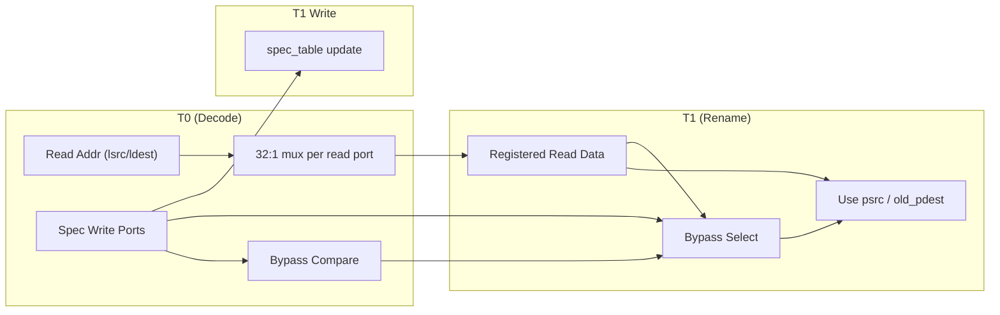

# RAT (Int/FP) Algorithm Perspective - XiangShan

This note explains what the integer RAT and floating-point RAT do and how they behave in the rename pipeline, from an algorithm perspective. It is meant to complement `analysis/frontend/phase1_decode_rename_analysis.md`.

## 1. What is a RAT?

RAT = Register Alias Table. It maps architectural (logical) registers to physical registers.

XiangShan keeps two separate RATs:
- **Int RAT**: maps integer architectural registers (x0..x31) to physical integer registers.
- **FP RAT**: maps floating-point architectural registers (f0..f31) to physical FP registers.

Each RAT has **two copies** of the mapping:
- **Speculative table**: updated at rename for in-flight instructions.
- **Architectural table**: updated at commit to reflect the retired state.

## 2. Why two RATs?

Integer and FP pipelines have separate physical register files and free lists. Keeping separate RATs avoids mixing register classes and lets each pipeline allocate from its own free list.

## 3. High-level algorithm (per cycle, rename group)

Inputs:
- A rename group of up to `RenameWidth` instructions.
- For each instruction, logical sources (lsrc) and logical destination (ldest).

Outputs:
- Physical sources (psrc) for each instruction.
- Physical destination (pdest) for each instruction that writes a register.

### Step A: Early RAT read (decode stage)
- Decode requests speculative RAT reads so rename has the mappings ready.
- Int RAT: reads lsrc[0], lsrc[1], ldest (3 read ports / inst).
- FP RAT: reads lsrc[0], lsrc[1], lsrc[2], ldest (4 read ports / inst).

### Step B: Allocate new pdest (rename stage)
- For any instruction with a destination register, allocate a new physical register from the appropriate free list:
  - Integer instructions allocate from the int free list.
  - FP instructions allocate from the FP free list.

### Step C: Intra-group bypass (handle dependencies within the same rename group)
- If instruction i writes ldest that instruction j (j > i) reads, then j should use i’s newly allocated pdest.
- This is resolved by bypassing the freshly allocated pdest within the group.

### Step D: Speculative RAT update
- For each instruction with a destination register:
  - `spec_table[ldest] = pdest`
- This makes later instructions (next cycle) see the new mapping.

### Step E: Commit update (architectural RAT)
- When instructions retire in-order:
  - `arch_table[ldest] = pdest`
- The architectural table always reflects the committed state.

## 4. Recovery on redirect / mispredict

On redirect, the speculative table must be repaired. Two common options:
1) **Reset to arch**: `spec_table := arch_table` (simple, fast).
2) **Restore from snapshots** (if snapshot support is enabled).

XiangShan’s rename table supports a fast reset to architectural state on redirect.

## 5. Algorithm summary in pseudocode

```text
for each cycle:
  # Early read in decode
  psrc_pre = RAT_spec.read(lsrcs)

  # Rename stage
  for inst in rename_group:
    if inst.writes_int:
      pdest = int_free_list.pop()
    if inst.writes_fp:
      pdest = fp_free_list.pop()

  # Intra-group bypass (WAW/WAR inside group)
  resolve_deps_within_group(psrc_pre, pdest_allocs)

  # Speculative update
  for inst with ldest:
    RAT_spec[ldest] = pdest

  # Commit stage
  for committed inst with ldest:
    RAT_arch[ldest] = pdest

  # Redirect recovery
  if redirect:
    RAT_spec := RAT_arch
```

## 6. Why the RAT is useful

- **Eliminates false dependencies**: multiple architectural registers can map to different physical registers over time.
- **Enables out-of-order execution**: instructions can proceed using their physical operands without waiting for older writes to the same architectural register.
- **Fast recovery**: separating speculative and architectural mappings enables quick rollback after mispredicts.

## 7. How “3 ports × 6” (Int) and “4 ports × 6” (FP) are supported

XiangShan’s RATs are small (32 architectural registers), and the implementation uses
**register arrays with replicated read muxes**, not a single SRAM with many read ports.

Key points from `RenameTable.scala`:
- The RAT is a **Vec of 32 registers** (`spec_table` / `arch_table`).
- Each read port is just a **mux over those 32 entries**, so adding ports means
  replicating the mux logic (area OK for such a small table).
- Reads are **pipelined** for timing: address at T0, data registered at T1.
- **Bypass logic** forwards same-cycle speculative writes to read ports so rename can
  see newly allocated mappings without waiting another cycle.
- Writes are applied in T1, which simplifies the read path timing.

So the “18 read ports” (Int) and “24 read ports” (FP) are achieved by **mux replication
over a small register file**, not by a huge multi-ported SRAM.

### Read/Write Timing and Bypass (conceptual)



Notes:
- Each read port is a dedicated mux tree over 32 entries.
- Bypass selects same-cycle writes over registered read data.
- Writes are applied in T1, keeping the T0 read path short.

## 7. Mapping to XiangShan code (for reference)

- Rename table logic: `src/main/scala/xiangshan/backend/rename/RenameTable.scala`
- Rename flow: `src/main/scala/xiangshan/backend/rename/Rename.scala`
- Decode early RAT read: `src/main/scala/xiangshan/backend/decode/DecodeStage.scala`
