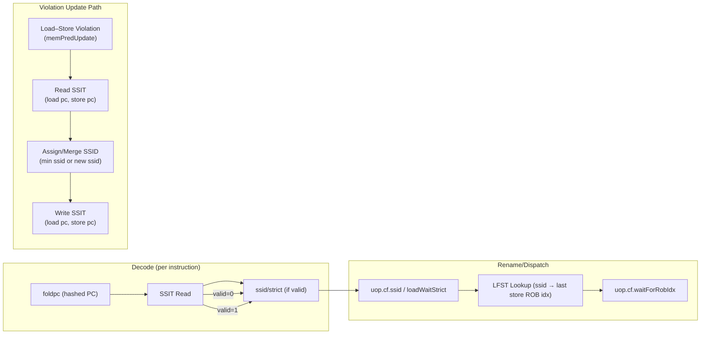
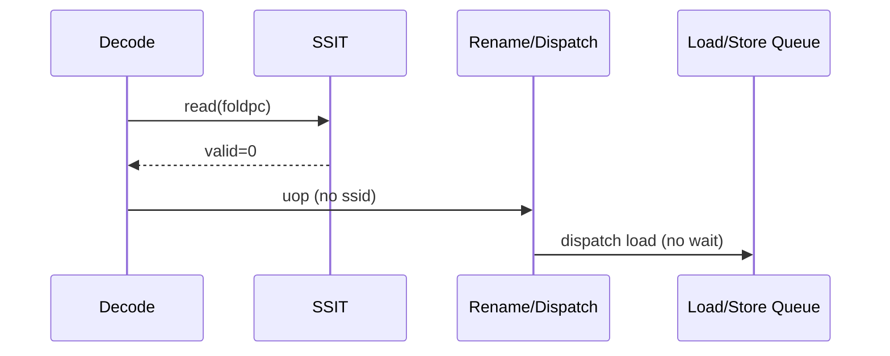
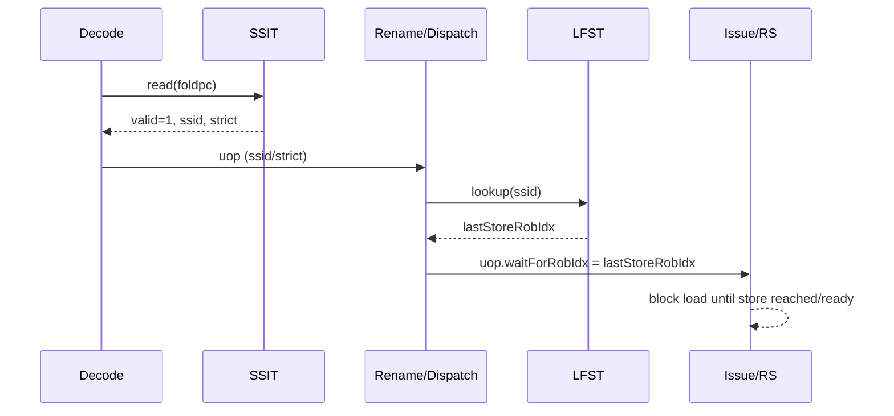
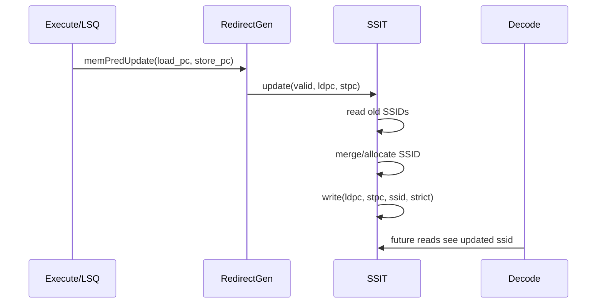

# SSIT (Store Set Identifier Table) Algorithm Report

This note explains XiangShan’s SSIT (Store Set Identifier Table) from an algorithm perspective and ties it to the pipeline usage in decode/rename/dispatch.

## 1. Purpose

SSIT is a **memory dependence predictor**. It learns which loads are likely to depend on which stores and assigns them to a **store set** (SSID). Loads in a store set will wait for the predicted older store(s) to avoid load–store ordering violations and replays.

## 2. Data Structures

- **SSIT (Store Set Identifier Table)**
  - Indexed by a hashed PC (`foldpc`).
  - Stores `(valid, ssid, strict)` for each PC.
  - `ssid` = store set ID.
  - `strict` = if true, the load must strictly wait (stronger ordering).

- **LFST (Last Fetched Store Table)**
  - Tracks the most recent store’s ROB index per `ssid` (used downstream to generate `waitForRobIdx`).
  - Not part of SSIT itself, but part of the **store‑set algorithm** used in dispatch/issue.

## 3. High-Level Algorithm

### 3.1 Lookup (Decode → Rename)

1. For each instruction in decode, compute `foldpc` (hashed PC).
2. Read SSIT entry:
   - If `valid = 0`: no store‑set prediction.
   - If `valid = 1`: use `ssid` and `strict`.

This prediction is carried forward into rename/dispatch and used to decide whether the load should wait for a store set’s latest store.

### 3.2 Violation Update (On Memory Replay)

On a load–store ordering violation (detected by backend replay/redirect), the predictor updates SSIT **using the violating load PC and store PC**:

Algorithmically:
1. Read SSIT for both PCs:
   - If **neither has an SSID**, allocate a new SSID and assign both to it.
   - If **only one has an SSID**, assign the other to the same SSID.
   - If **both have SSIDs and they differ**, choose one SSID as the winner and assign both to it.

In XiangShan, the winner is the **smaller SSID**, and SSID allocation uses a hash of the load/store PC (low‑cost heuristic).

### 3.3 Strict Load Wait

If a violating load is repeatedly problematic, its SSIT entry can be marked `strict`, which requires a stronger wait policy in dispatch/issue. This reduces repeated replays for pathological patterns.

## 4. How SSIT Affects the Pipeline

1. **Decode**
   - Reads SSIT entry by `foldpc`.

2. **Rename/Dispatch**
   - Attaches `ssid` (if valid) to the uop.
   - If SSIT says the load should wait, the uop carries a **wait‑for‑store ROB index** from LFST.

3. **Issue**
   - Loads with `waitForRobIdx` are blocked until the corresponding store is committed or its address/data is ready (depending on `strict`).

## 5. Pseudocode

```text
# Decode stage: SSIT read
entry = SSIT[foldpc]
if entry.valid:
  uop.ssid = entry.ssid
  uop.strict = entry.strict
else:
  uop.ssid = NONE

# On violation update (load_pc, store_pc)
ld = SSIT[load_pc]
st = SSIT[store_pc]

if !ld.valid and !st.valid:
  ssid = alloc_ssid(load_pc, store_pc)
  SSIT[load_pc]  = (valid=1, ssid=ssid, strict=ld.strict)
  SSIT[store_pc] = (valid=1, ssid=ssid, strict=st.strict)
elif ld.valid and !st.valid:
  SSIT[store_pc] = (valid=1, ssid=ld.ssid, strict=st.strict)
elif !ld.valid and st.valid:
  SSIT[load_pc] = (valid=1, ssid=st.ssid, strict=ld.strict)
else if ld.ssid != st.ssid:
  winner = min(ld.ssid, st.ssid)
  SSIT[load_pc]  = (valid=1, ssid=winner, strict=ld.strict)
  SSIT[store_pc] = (valid=1, ssid=winner, strict=st.strict)
```

## 6. Practical Notes in XiangShan

- SSIT is read in decode and forwarded to rename.
- Updates happen when `memPredUpdate` is asserted (typically on a load replay/violation).
- The SSIT table is periodically flushed (timeout‑based) to avoid stale associations.

## 7. SSIT Flow Diagram (Mermaid)



Notes:
- SSIT read happens in decode; SSID follows the uop into dispatch.
- LFST maps SSID to the most recent store’s ROB index.
- On a violation, SSIT updates/merges the SSIDs for the offending load/store PCs.

## 8. SSIT Sequence Diagrams (Major Scenarios)

### 8.1 No Prediction (SSIT Miss)



### 8.2 Prediction Hit (Load Waits on Store Set)



### 8.3 Violation Update (Load–Store Ordering Replay)



**What scenario is this?**  
This happens when a **speculative load executes before an older store** it should have waited for, and the backend detects a **memory ordering violation** (e.g., store–load conflict). The pipeline triggers a redirect/replay and sends `memPredUpdate` with the offending **load PC** and **store PC**. SSIT then assigns or merges their store‑set IDs so that the next time the load appears, it will **wait for the predicted store set**, reducing future replays.

## 9. Relevant Files

- `src/main/scala/xiangshan/mem/mdp/StoreSet.scala` (SSIT implementation)
- `src/main/scala/xiangshan/backend/CtrlBlock.scala` (wiring SSIT into decode/rename)
- `src/main/scala/xiangshan/backend/dispatch/Dispatch.scala` (using wait signals)
