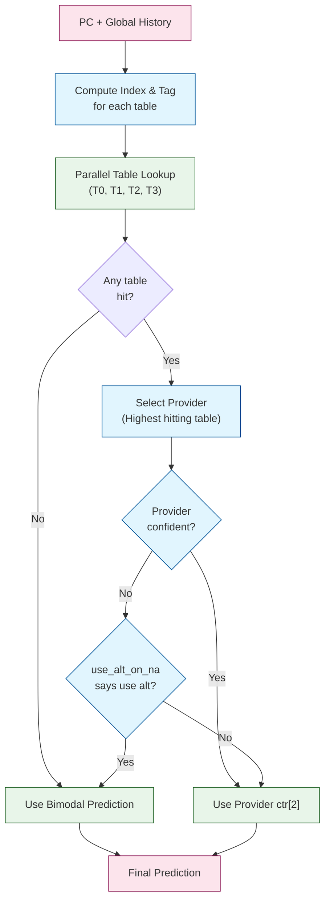
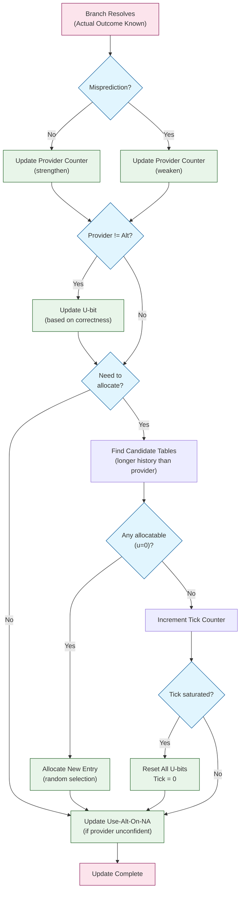

# TAGE Algorithm Analysis - XiangShan BPU

## 1. Algorithm Overview

TAGE (TAgged GEometric history length) is a state-of-the-art branch prediction algorithm that uses multiple prediction tables with different history lengths arranged in geometric progression. Each table provides predictions based on different amounts of branch history, allowing the predictor to capture both short-term and long-term correlation patterns.

### 1.1 Key Principles

1. **Multiple History Lengths**: TAGE uses several tables (T0, T1, T2, T3) indexed by progressively longer branch history
2. **Provider Selection**: When multiple tables hit, the table with the longest history (strongest correlation) is chosen
3. **Tagged Entries**: Each entry includes a partial tag to reduce aliasing
4. **Usefulness Tracking**: U-bits track whether each entry provides better predictions than shorter-history tables
5. **Bimodal Base**: A base predictor (no history) serves as the fallback when no TAGE table hits

### 1.2 XiangShan TAGE Configuration

```
Table 0 (T0): 4096 entries, 8-bit history,   8-bit tag
Table 1 (T1): 4096 entries, 13-bit history,  8-bit tag
Table 2 (T2): 4096 entries, 32-bit history,  8-bit tag
Table 3 (T3): 4096 entries, 119-bit history, 8-bit tag
Bimodal:      2048 entries, no history,      2-bit counter
```

**Geometric Progression**: History lengths grow geometrically (8 → 13 → 32 → 119), capturing patterns at different time scales.

---

## 2. Core Data Structures

### 2.1 TAGE Table Entry

Each TAGE table entry contains:
```
┌─────────────────────────────────────┐
│ valid (1 bit)                       │  Entry is valid
│ tag (8 bits)                        │  Partial tag for hit detection
│ ctr (3 bits)                        │  Prediction counter [0-7]
└─────────────────────────────────────┘
Total: 12 bits per entry
```

**Prediction Counter Encoding** (3-bit saturating counter):
- `000` (0): Strong not-taken
- `001` (1): Medium not-taken
- `010` (2): Weak not-taken
- `011` (3): **Weak not-taken (unconfident)**
- `100` (4): **Weak taken (unconfident)**
- `101` (5): Weak taken
- `110` (6): Medium taken
- `111` (7): Strong taken

**Prediction**: MSB of counter (ctr[2]) determines taken/not-taken.

**Confidence**: Counter values 3 and 4 are considered "unconfident" (weak predictions).

### 2.2 Usefulness Bits (U-bits)

Separate from the main TAGE entries, each entry has an associated usefulness bit stored in a parallel structure:
```
u-bit (1 bit): Tracks if this entry is useful
```

**Purpose**: U-bits indicate whether an entry provides better predictions than the alternative (shorter-history or bimodal) predictor.

### 2.3 Global History Register

A circular buffer storing recent branch outcomes:
```
┌───┬───┬───┬───┬───────┬───┬───┐
│ b0│ b1│ b2│ b3│  ...  │bn-2│bn-1│  (HistoryLength bits)
└───┴───┴───┴───┴───────┴───┴───┘
  ↑                           ↑
newest                     oldest
```

**Properties**:
- Each bit represents one branch outcome (1=taken, 0=not-taken)
- Updated on every branch resolution
- Different tables use different prefix lengths (8, 13, 32, 119 bits)

### 2.4 Folded History

To efficiently index tables with limited bit-width, long history is "folded" using XOR compression:

```
Original History (119 bits):
┌────────┬────────┬────────┬─────┐
│ chunk0 │ chunk1 │ chunk2 │ ... │
└────────┴────────┴────────┴─────┘
         ↓ XOR all chunks ↓
Folded History (12 bits):
┌────────────┐
│  folded_h  │
└────────────┘
```

**Algorithm**:
```
folded_hist = chunk[0] XOR chunk[1] XOR chunk[2] XOR ... XOR chunk[n-1]
```

Each table maintains multiple folded history versions:
- `idx_fh`: Folded history for index computation
- `tag_fh`: Folded history for tag computation
- `alt_tag_fh`: Alternative folded history for tag

---

## 3. Prediction Algorithm

### 3.1 Index and Tag Computation

For each table Ti with history length Hi:

**Step 1: Extract unhashed index from PC**
```
unhashed_idx = PC >> instOffsetBits  // instOffsetBits = 1 with C-ext, else 2
```

**Step 2: Compute table index**
```
idx_fh = fold(global_history[0:Hi-1], index_width)
index = (unhashed_idx XOR idx_fh) % table_size
```

**Step 3: Compute tag**
```
tag_fh = fold(global_history[0:Hi-1], tag_width)
alt_tag_fh = fold(global_history[0:Hi-1], tag_width - 1)
tag = (unhashed_idx XOR tag_fh XOR (alt_tag_fh << 1)) & tag_mask
```

**Explanation**:
- XOR mixing provides better distribution than simple hashing
- Different folded histories for index and tag reduce correlation
- Left shift on alt_tag_fh adds additional decorrelation

### 3.2 Table Lookup and Hit Detection

**Parallel Lookup Process**:

1. **Read all tables in parallel** using computed indices
2. **Tag comparison**: For each table Ti, check if:
   ```
   hit[i] = entry[i].valid AND (entry[i].tag == computed_tag[i])
   ```
3. **Provider selection**: Among all hitting tables, select the one with the **longest history** (highest table index)
   ```
   provider = max({i | hit[i] == true})
   ```

**Priority Encoding**: Implementation uses reverse priority mux to select highest hitting table.

### 3.3 Prediction Decision

```python
# Algorithmic pseudocode
if any_table_hit:
    provider_table = highest_hitting_table
    provider_ctr = provider_table.entry.ctr
    provider_confident = (provider_ctr != 3) AND (provider_ctr != 4)

    # Check use-alt-on-unconfident condition
    if NOT provider_confident AND use_alt_on_na[hash(PC)]:
        prediction = bimodal_prediction
        alt_used = True
    else:
        prediction = provider_ctr[2]  # MSB of counter
        alt_used = False
else:
    prediction = bimodal_prediction
    alt_used = True
    provider = None

return (prediction, provider, alt_used)
```

**Use-Alt-On-NA (Unconfident) Logic**:
- Separate 4-bit counters (128 entries) indexed by PC
- The MSB of the counter is used as the decision bit
- When provider is weak (ctr=3 or ctr=4), check this meta-predictor
- Learns whether to trust weak TAGE predictions or fall back to bimodal

### 3.4 Prediction Flow Diagram



---

## 4. Update (Training) Algorithm

### 4.1 Update Trigger Conditions

TAGE tables are updated when a branch **resolves** (actual outcome known):

```python
update_condition = branch_resolved AND
                   NOT always_taken AND
                   is_first_taken_in_group
```

### 4.2 Provider Counter Update

When the provider table exists (table hit during prediction):

```python
# Update provider's prediction counter
if provider_prediction == actual_outcome:
    # Correct prediction: strengthen
    if provider.ctr < 7:  # Not saturated
        provider.ctr += 1
    # else: already at max, no change
else:
    # Wrong prediction: weaken
    if provider.ctr > 0:  # Not saturated
        provider.ctr -= 1
    # else: already at min, no change
```

**Saturation**: Counters saturate at 0 (strong not-taken) and 7 (strong taken).

**Silent Update Elimination Optimization**:
```python
if (provider.ctr == 7 AND actual_outcome == taken) OR
   (provider.ctr == 0 AND actual_outcome == not_taken):
    # Skip write - counter already saturated in correct direction
    skip_update = True
```

### 4.3 Usefulness (U-bit) Update

U-bits track whether the provider was more useful than the alternative:

```python
# Only update u-bit if provider and alternative differ
if provider_prediction != alternative_prediction:
    if provider_prediction == actual_outcome:
        # Provider was correct, alternative wrong: Useful
        provider.u_bit = 1
    else:
        # Provider was wrong, alternative correct: Not useful
        provider.u_bit = 0
    # else: both same, don't update u-bit
```

**Explanation**: U-bits are only meaningful when provider differs from alt, showing which was better.

### 4.4 Use-Alt-On-Unconfident Update

```python
# Update only when provider was unconfident (ctr = 3 or 4)
if provider_unconfident AND provider_differs_from_alt:
    if provider_prediction == actual_outcome:
        # Weak provider was right: decrease use_alt
        if use_alt_on_na[hash(PC)] > 0:
            use_alt_on_na[hash(PC)] -= 1
    else:
        # Weak provider was wrong: increase use_alt
        if use_alt_on_na[hash(PC)] < 15:  # 4-bit saturating
            use_alt_on_na[hash(PC)] += 1
```

### 4.5 Entry Allocation Algorithm

**Allocation Goal**: When a misprediction occurs, allocate a new entry in a table with longer history than the provider (or any table if no provider).

**Allocation Conditions**:
```python
allocate = misprediction AND
           NOT (alt_used AND provider_correct)
```

**Allocation Process**:

**Step 1: Identify candidate tables**
```python
if provider_exists:
    # Allocate only to tables with longer history than provider
    candidates = tables[provider_idx + 1 : num_tables]
else:
    # No provider: can allocate to any table
    candidates = tables[0 : num_tables]
```

**Step 2: Check allocatability**
```python
for table in candidates:
    if table.u_bit == 0:  # Entry is not useful
        allocatable[table] = True
    else:
        allocatable[table] = False
```

**Step 3: Select allocation targets**
```python
allocatable_mask = allocatable & candidate_mask

if any(allocatable_mask):
    # Randomly select one allocatable table (LFSR-based)
    alloc_target = random_select(allocatable_mask)
    allocate_entry(alloc_target, PC, history, outcome)
```

**Step 4: Allocation failure handling**

When no allocatable tables available (all u-bits = 1), increment tick counter:

```python
alloc_failed_mask = NOT allocatable & candidate_mask
alloc_success_mask = allocatable & candidate_mask

tick_increment = popcount(alloc_failed_mask) - popcount(alloc_success_mask)

if tick_increment > 0:
    tick_ctr += tick_increment
    if tick_ctr >= MAX_TICK:  # Saturated
        # Periodic reset: clear all u-bits
        for all_entries:
            entry.u_bit = 0
        tick_ctr = 0
```

**Explanation**:
- Tick counter tracks allocation pressure
- When saturated, reset all u-bits to allow recycling old entries
- This prevents predictor from getting stuck with stale entries

### 4.6 New Entry Initialization

When allocating a new entry:
```python
new_entry.valid = True
new_entry.tag = computed_tag
new_entry.u_bit = 0  # Start as not useful

if actual_outcome == taken:
    new_entry.ctr = 4  # Weak taken (100)
else:
    new_entry.ctr = 3  # Weak not-taken (011)
```

**Rationale**: Initialize to weak state (unconfident) rather than strong, allowing quick correction if initial allocation was wrong.

### 4.7 Update Flow Diagram



---

## 5. Statistical Corrector (SC)

The Statistical Corrector works **alongside TAGE** to improve prediction accuracy by learning from TAGE's mistakes.

### 5.1 SC Table Structure

SC uses **4 additional tables** with different history lengths:
```
SC Table 0: 512 entries, 0-bit history,  6-bit signed counter
SC Table 1: 512 entries, 4-bit history,  6-bit signed counter
SC Table 2: 512 entries, 10-bit history, 6-bit signed counter
SC Table 3: 512 entries, 16-bit history, 6-bit signed counter
```

**Key Difference from TAGE**:
- SC tables are **tagless** (no tag matching, direct-mapped)
- Counters are **signed** [-32, +31] instead of unsigned
- Each entry has **2 counters** selected by the TAGE predicted direction (not "taken vs not-taken")

### 5.2 SC Prediction Algorithm

SC computes a **sum of signed values** to adjust TAGE prediction:

```python
# Step 1: Lookup all SC tables
for i in range(num_sc_tables):
    idx = hash(PC, history[0:sc_hist_len[i]])

    if tage_prediction == taken:
        sc_value[i] = sc_table[i][idx].ctr1  # selected by TAGE=1
    else:
        sc_value[i] = sc_table[i][idx].ctr0  # selected by TAGE=0

# Step 2: Sum all SC values + TAGE provider counter bias
tage_bias = (provider.ctr - 4) * 2  # Convert [0-7] to signed [-8, +6]
sc_sum = sum(sc_value[0:3]) + tage_bias

# Step 3: Compare against threshold
# XiangShan uses a centered SC sum plus a centered TAGE provider bias and a
# signed threshold window. This is not a plain abs(sc_sum) compare.
if sc_above_threshold:
    final_prediction = (sc_sum_with_bias >= 0)
else:
    final_prediction = tage_prediction
```

**Threshold Adaptation**:
```python
# When SC and TAGE disagree near threshold margin
if sc_pred != tage_pred AND threshold-4 <= abs(sc_sum) <= threshold-2:
    # XiangShan updates a small saturating counter and changes threshold
    # by steps of 2 when that counter saturates.
    threshold = update_threshold(sc_pred != actual_outcome)
```

### 5.3 SC Update Algorithm

```python
# Update condition
# XiangShan updates when SC is wrong OR when SC is not confident
update_sc = (sc_prediction != actual_outcome) OR (not sc_above_threshold)

if update_sc:
    for i in range(num_sc_tables):
        # Only the counter selected by TAGE prediction is updated
        if actual_outcome == taken:
            sc_table[i][idx].selected_ctr = sat_increment(selected_ctr)
        else:
            sc_table[i][idx].selected_ctr = sat_decrement(selected_ctr)
```

**Rationale**: SC learns when it makes mistakes OR when it's unconfident, allowing it to refine predictions over time.

---

## 6. History Management

### 6.1 Global History Update

**Speculative Update** (on prediction):
```python
# Shift history left, insert predicted outcome at LSB
global_history = (global_history << 1) | predicted_taken
history_ptr += 1  # Circular buffer
```

**Repair on Misprediction**:
```python
# Restore history to state at mispredicted branch
global_history = saved_history[mispred_ftq_idx]

# Re-apply correct outcome
global_history = (global_history << 1) | actual_taken
history_ptr = saved_ptr[mispred_ftq_idx] + 1
```

### 6.2 Folded History Update

Folded history must be updated efficiently without recomputing full XOR:

**Incremental Update Algorithm**:
```python
# Parameters:
# - len: original history length (e.g., 119)
# - compLen: folded/compressed length (e.g., 12)

# Oldest bit position in folded history
oldest_pos = len % compLen

# New bit enters at position (compLen - 1)
# Oldest bit exits from position oldest_pos

folded_hist_new = folded_hist
folded_hist_new[compLen-1] ^= new_bit  # XOR new bit in
folded_hist_new[oldest_pos] ^= oldest_bit  # XOR old bit out

# Circular shift left by 1
folded_hist_new = circular_shift_left(folded_hist_new, 1)
```

**Circular Shift**:
```python
def circular_shift_left(value, amount, width):
    # Rotate bits left by amount positions
    return ((value << amount) | (value >> (width - amount))) & mask(width)
```

### 6.3 Ahead Folded History Optimization

To support **multi-branch prediction** in a single cycle, folded histories are pre-computed ahead:

```python
# Pre-fetch oldest bits that will exit during next N branches
ahead_oldest_bits = global_history[len-1, len-2, ..., len-N]

# Compute ahead folded histories for each possible number of branches
for num_br in range(1, max_branches+1):
    folded_hist_ahead[num_br] = update_folded_hist(
        current_folded_hist,
        oldest_bits = ahead_oldest_bits[0:num_br],
        new_bits = predicted_takens[0:num_br]
    )
```

This allows the predictor to **pipeline** multiple predictions without stalling for history updates.

---

## 7. Multi-Branch Support (Physical/Logical Indexing)

XiangShan's TAGE supports **2 branches per prediction** using XOR-based index shuffling.

### 7.1 Index Shuffling Algorithm

**Problem**: Multiple branches with same PC hash to same SRAM index, causing conflicts.

**Solution**: XOR-shuffle based on branch logical index:

```python
# Get unshuffle bits from PC (lower bits)
unshuffle_bits = PC[log2(numBr)-1 : 0]

# Convert logical branch index to physical SRAM index
def logical_to_physical(pc, logical_br_idx):
    return unshuffle_bits(pc) ^ logical_br_idx

# Convert physical SRAM index back to logical
def physical_to_logical(pc, physical_idx):
    return unshuffle_bits(pc) ^ physical_idx
```

**Example** (numBr=2):
```
PC ends in 0:  Branch 0 → way 0, Branch 1 → way 1
PC ends in 1:  Branch 0 → way 1, Branch 1 → way 0
```

This ensures branches access different SRAM ways, avoiding read/write conflicts.

### 7.2 Banking Structure

Each TAGE table is split into **4 banks**:
```
Table (4096 entries total)
├── Bank 0: entries [0, 4, 8, ..., 4092]
├── Bank 1: entries [1, 5, 9, ..., 4093]
├── Bank 2: entries [2, 6, 10, ..., 4094]
└── Bank 3: entries [3, 7, 11, ..., 4095]
```

**Bank Selection**: `bank = index[1:0]` (lower 2 bits of index)

**Within-Bank Index**: `set = index >> 2`

This allows parallel access to different entries in the same cycle.

---

## 8. Key Algorithmic Insights

### 8.1 Why Geometric History Lengths?

Different correlation lengths capture different patterns:
- **Short history (8 bits)**: Local patterns, tight loops
- **Medium history (13-32 bits)**: Function-level correlations
- **Long history (119 bits)**: Cross-function, deep correlations

Geometric progression provides good coverage of time scales without excessive storage.

### 8.2 Why Partial Tags?

Full tags would be too large (39-bit PC). Partial tags (8 bits) provide:
- Sufficient disambiguation for most cases
- Compact storage (12 bits per entry total)
- Trade-off: some aliasing, mitigated by multiple tables

### 8.3 Why Usefulness Bits?

U-bits implement **entry aging** without time counters:
- Newly allocated entries have u=0 (replaceable)
- Useful entries have u=1 (protected)
- Periodic reset prevents permanent occupancy
- Adaptive to program phase changes

### 8.4 Why Use-Alt-On-Unconfident?

Weak predictions (ctr=3,4) are near the decision boundary. Sometimes the bimodal predictor has better information than weak TAGE entries. The use_alt_on_na meta-predictor learns when to trust weak TAGE vs. falling back to bimodal, improving accuracy on marginal cases.

### 8.5 Why Statistical Corrector?

TAGE can make systematic errors on certain patterns. SC acts as a **second-order predictor** that:
- Learns from TAGE's mistakes
- Provides correction signal based on different feature combinations
- Uses tagless (direct-mapped) tables to capture different information than TAGE
- Adaptive threshold prevents over-correction

---

## 9. Complexity Analysis

### 9.1 Prediction Latency

**Critical Path**:
1. Index/tag computation: ~2-3 XOR gates
2. SRAM access: ~1 cycle (pipelined S0→S1)
3. Tag comparison: ~1 comparator per table
4. Provider selection: log(N) priority mux (N=4 tables)
5. Counter MSB extraction: 1 wire

**Total**: 2-cycle latency (S0 index, S1 response)

### 9.2 Update Latency

**Critical Path**:
1. Allocatable mask computation: ~2 AND gates
2. Random selection: LFSR + mux
3. Counter increment/decrement: ~1 adder
4. SRAM write: ~1 cycle

**Total**: 1-2 cycles for most updates

### 9.3 Storage Requirements

**Per Branch**:
- TAGE Tables: 4 × 4096 × 12 bits = 196,608 bits ≈ 24 KB
- U-bits: 4 × 4096 × 1 bit = 16,384 bits ≈ 2 KB
- Bimodal: 2048 × 2 bits = 4,096 bits ≈ 0.5 KB
- Use-Alt-On-NA: 128 × 4 bits = 512 bits ≈ 64 B
- SC Tables: 4 × 512 × 2 × 6 bits = 24,576 bits ≈ 3 KB
- **Total**: ~30 KB per branch × 2 branches = **~60 KB**

**Additional Structures**:
- Global History: 256 bits × 2 = 512 bits
- Folded Histories: ~20 × 16 bits = 320 bits
- **Total Overhead**: ~1 KB

**Grand Total**: ~61 KB for full TAGE+SC predictor with 2-branch support

### 9.4 Throughput

With banking and multi-way SRAMs:
- **2 branches per cycle** (typical)
- **4-way parallel table lookup** (all tables simultaneously)
- **Banking** allows multiple outstanding requests

**Effective Throughput**: Up to 2 predictions per cycle sustained

---

## 10. Algorithm Pseudocode Summary

### 10.1 Complete Prediction Algorithm

```python
def tage_predict(pc, global_history):
    # === Phase 1: Index and Tag Computation ===
    unhashed_idx = pc >> instOffsetBits

    for table_idx in range(num_tables):
        hist_len = table_hist_lengths[table_idx]

        # Fold history to table's required lengths
        idx_fh = fold_history(global_history, hist_len, index_width)
        tag_fh = fold_history(global_history, hist_len, tag_width)
        alt_tag_fh = fold_history(global_history, hist_len, tag_width - 1)

        # Compute index and tag
        index[table_idx] = (unhashed_idx ^ idx_fh) & index_mask
        tag[table_idx] = (unhashed_idx ^ tag_fh ^ (alt_tag_fh << 1)) & tag_mask

    # === Phase 2: Table Lookup (Parallel) ===
    for table_idx in range(num_tables):
        entry = tage_table[table_idx][index[table_idx]]
        hit[table_idx] = entry.valid AND (entry.tag == tag[table_idx])
        ctr[table_idx] = entry.ctr
        u_bit[table_idx] = entry.u_bit

    # === Phase 3: Provider Selection ===
    if any(hit):
        # Select highest hitting table (longest history)
        provider_idx = max([i for i in range(num_tables) if hit[i]])
        provider_ctr = ctr[provider_idx]
        provider_confident = (provider_ctr != 3) AND (provider_ctr != 4)
    else:
        provider_idx = None
        provider_confident = False

    # === Phase 4: Use-Alt-On-Unconfident Check ===
    alt_used = False
    if provider_idx is not None:
        if not provider_confident:
            use_alt = use_alt_on_na[hash(pc) % 128][3]  # MSB decision bit
            if use_alt:
                alt_used = True

    # === Phase 5: Final Prediction ===
    if provider_idx is not None and not alt_used:
        tage_pred = provider_ctr[2]  # MSB
    else:
        tage_pred = bimodal_table[pc % 2048][1]  # Bimodal MSB

    # === Phase 6: Statistical Corrector (Optional) ===
    if enable_sc:
        sc_sum = compute_sc_sum(pc, global_history, tage_pred, provider_ctr)
        if sc_above_threshold:
            final_pred = (sc_sum_with_bias >= 0)
        else:
            final_pred = tage_pred
    else:
        final_pred = tage_pred

    return final_pred, provider_idx, alt_used, provider_ctr

def fold_history(history, hist_len, fold_width):
    # XOR-fold long history into narrow width
    if hist_len <= fold_width:
        return history[0:hist_len]

    num_chunks = (hist_len + fold_width - 1) // fold_width
    result = 0
    for i in range(num_chunks):
        start = i * fold_width
        end = min(start + fold_width, hist_len)
        chunk = history[start:end]
        result ^= chunk
    return result & ((1 << fold_width) - 1)
```

### 10.2 Complete Update Algorithm

```python
def tage_update(pc, global_history, prediction_info, actual_outcome):
    provider_idx = prediction_info.provider_idx
    alt_used = prediction_info.alt_used
    provider_ctr = prediction_info.provider_ctr

    misprediction = (prediction_info.final_pred != actual_outcome)

    # === Step 1: Update Provider Counter ===
    if provider_idx is not None:
        if actual_outcome == TAKEN:
            new_ctr = saturating_increment(provider_ctr, max=7)
        else:
            new_ctr = saturating_decrement(provider_ctr, min=0)

        # Silent update elimination
        if not ((new_ctr == 7 and actual_outcome == TAKEN) or
                (new_ctr == 0 and actual_outcome == NOT_TAKEN)):
            write_tage_table(provider_idx, index, new_ctr)

    # === Step 2: Update U-bit ===
    if provider_idx is not None:
        alt_pred = bimodal_table[pc % 2048][1]
        provider_pred = provider_ctr[2]

        if provider_pred != alt_pred:
            if provider_pred == actual_outcome:
                u_bit = 1  # Useful
            else:
                u_bit = 0  # Not useful
            write_u_bit(provider_idx, index, u_bit)

    # === Step 3: Update Use-Alt-On-Unconfident ===
    if provider_idx is not None:
        provider_unconf = (provider_ctr == 3) or (provider_ctr == 4)
        if provider_unconf and (provider_pred != alt_pred):
            idx = hash(pc) % 128
            if provider_pred == actual_outcome:
                use_alt_on_na[idx] = saturating_decrement(use_alt_on_na[idx], min=0)
            else:
                use_alt_on_na[idx] = saturating_increment(use_alt_on_na[idx], max=15)

    # === Step 4: Allocate New Entry (if needed) ===
    allocate = misprediction and not (alt_used and provider_pred == actual_outcome)

    if allocate:
        # Determine candidate tables
        if provider_idx is not None:
            candidates = range(provider_idx + 1, num_tables)
        else:
            candidates = range(num_tables)

        # Find allocatable tables
        allocatable = []
        for table_idx in candidates:
            if u_bit_table[table_idx][index] == 0:
                allocatable.append(table_idx)

        if allocatable:
            # Randomly select one allocatable table
            alloc_target = random.choice(allocatable)  # LFSR-based

            # Initialize new entry
            new_entry.valid = True
            new_entry.tag = computed_tag[alloc_target]
            new_entry.ctr = 4 if actual_outcome == TAKEN else 3
            new_entry.u_bit = 0

            write_tage_table(alloc_target, index, new_entry)
        else:
            # Allocation failed: increment tick
            tick_ctr += (count(candidates) - count(allocatable))
            if tick_ctr >= (1 << 7):  # Saturated
                # Reset all u-bits
                for table_idx in range(num_tables):
                    for i in range(table_size):
                        u_bit_table[table_idx][i] = 0
                tick_ctr = 0

    # === Step 5: Update Bimodal ===
    bimodal_idx = pc % 2048
    if actual_outcome == TAKEN:
        bimodal_table[bimodal_idx] = saturating_increment(bimodal_table[bimodal_idx], max=3)
    else:
        bimodal_table[bimodal_idx] = saturating_decrement(bimodal_table[bimodal_idx], min=0)

    # === Step 6: Update Statistical Corrector ===
    if enable_sc:
        sc_pred = compute_sc_prediction(...)
        update_sc = (sc_pred != actual_outcome) or (not sc_above_threshold)

        if update_sc:
            for sc_table_idx in range(num_sc_tables):
                idx = hash(pc, global_history[0:sc_hist_len[sc_table_idx]])
                # Only the counter selected by TAGE prediction is updated
                if actual_outcome == TAKEN:
                    sc_table[sc_table_idx][idx].selected_ctr += 1
                else:
                    sc_table[sc_table_idx][idx].selected_ctr -= 1

        # Adapt threshold
        if sc_pred != tage_pred and (sc_threshold-4 <= abs(sc_sum) <= sc_threshold-2):
            sc_threshold = update_threshold(sc_pred != actual_outcome)

    # === Step 7: Update Global History ===
    global_history = (global_history << 1) | actual_outcome

    # Update folded histories incrementally
    update_folded_histories(global_history)
```

---

## 11. References and Source Files

### 11.1 Implementation Files

- **Tage.scala** (`src/main/scala/xiangshan/frontend/Tage.scala`): Main TAGE predictor
- **SC.scala** (`src/main/scala/xiangshan/frontend/SC.scala`): Statistical Corrector
- **FrontendBundle.scala** (`src/main/scala/xiangshan/frontend/FrontendBundle.scala`): History structures
- **Parameters.scala** (`src/main/scala/xiangshan/Parameters.scala`): Configuration

### 11.2 Key Algorithms

- **Index Hashing**: Tage.scala:286-294
- **Provider Selection**: Tage.scala:644-656
- **Counter Update**: Tage.scala:211-217
- **Allocation Control**: Tage.scala:771-822
- **Folded History Update**: FrontendBundle.scala:236-306
- **SC Sum Computation**: SC.scala:236-241

### 11.3 Related Analysis Documents

- `phase2_bpu_analysis.md`: Detailed BPU implementation analysis
- `phase1_frontend_analysis.md`: Frontend architecture overview

---

**Document prepared following guidelines in `/commands/analysis_common.md`**
